[English](README.md) | [中文](README.zh.md)

# 本体驱动的运维根因分析智能体 —— 附一套可复现的故障注入评测台

面向**容器化集群**（3 个应用副本 + 网关负载均衡，MySQL 主库 + 2 只读副本）的
**本体驱动根因分析智能体**，并**随仓库提供可复现的故障注入评测台**：
21 个故障场景、告警覆盖检查、端到端诊断评分，以及一套版本化的本体演化协议。

> ⚠️ **仅限隔离环境。** 本项目会向容器注入故障、修改数据库配置。注入接口等价于
> **容器操作权限**。不要指向任何你在意的环境。详见 [SECURITY.md](SECURITY.md)。

## 它是什么

- **双引擎**诊断：本体驱动的确定性快路径 + 面向开放式提问的 LLM Agent。
  走哪条路由**由输入决定，不由结论决定**。
- **故障注入目录**：21 个场景（应用层 / 数据库层 / 集群资源层），每个都声明了
  信号、影响面与期望根因。
- **验证工具链**：专门测那些通常没人测的东西 —— 故障真的复现了它的信号吗？
  声明的告警真的响了吗？诊断判对了吗？处置动作真的让判据消失了吗？
- **版本化本体**（`.evoontology/`）：通过 [EvoOntology](https://github.com/ruc-datalab/EvoOntology)
  协议演化（候选版本 → 成对评估 → 闸门 → 接受）。当前 `ontology_v6`
  （56 术语 / 87 关系 / 30 约束 / 22 证据）。

## 它不是什么

- 不是生产监控系统，**不可用于生产环境**。
- 不是"零接入"：应用需要暴露一组很小的 SLI（请求量、错误率、延迟、实例健康），
  经 `/metrics` 或 exporter 提供。
- 尚未完成泛化：注入层目前**仅 Docker**，数据库方言目前**仅 MySQL**。可移植性工作见 `docs/`。

## 关键功能与实效

> 下面每张图都来自**真实运行**，每个功能后面都写了**它凭什么可信** —— 这是本项目的取向：
> 功能清单谁都能写，难的是让结论可以被验证。

### 1. 故障注入控制台 —— 21 个场景，按层级分组、按风险分级

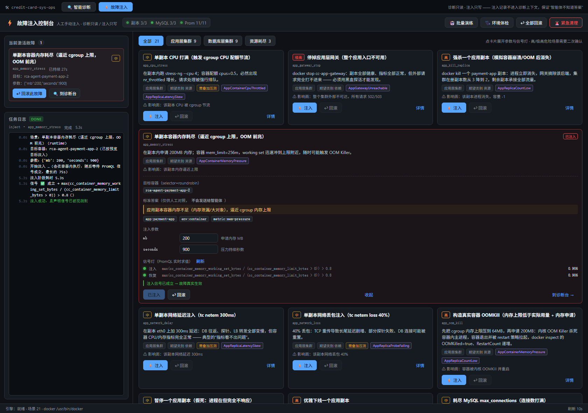

每张卡片给出层级（应用 / 数据库 / 集群资源）、类别、**影响面**与期望根因；高危场景需显式
确认，同一时刻只允许一个注入。**凭什么可信**：每个场景都声明了"注入期应成立的信号"，
`fault_injector verify` 会逐条核对 —— 当前 **21/21 复现、20/21 信号全部成立**
（[报告](reports/fault_verify_report.json)）。

### 2. 一键停止并回滚 —— 恢复要过判据，不是"看起来好了"

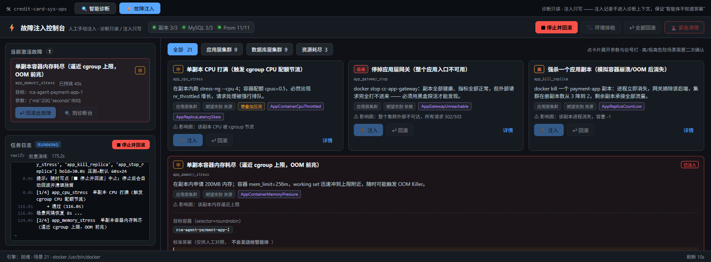

回滚后逐条核对**恢复判据必须由真变假**。**凭什么可信**：这就是被修过三次的那类缺陷
（见 [`docs/lessons/05`](docs/lessons/05-criteria-that-cannot-pass.md)）——
判据写反时，恢复会**永远判失败**，而不是悄悄放过。

### 3. 运行中的任务不因切页丢失

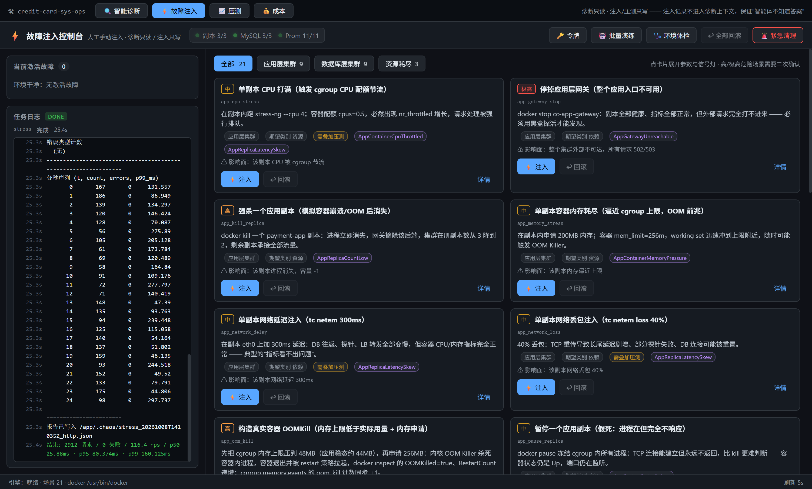
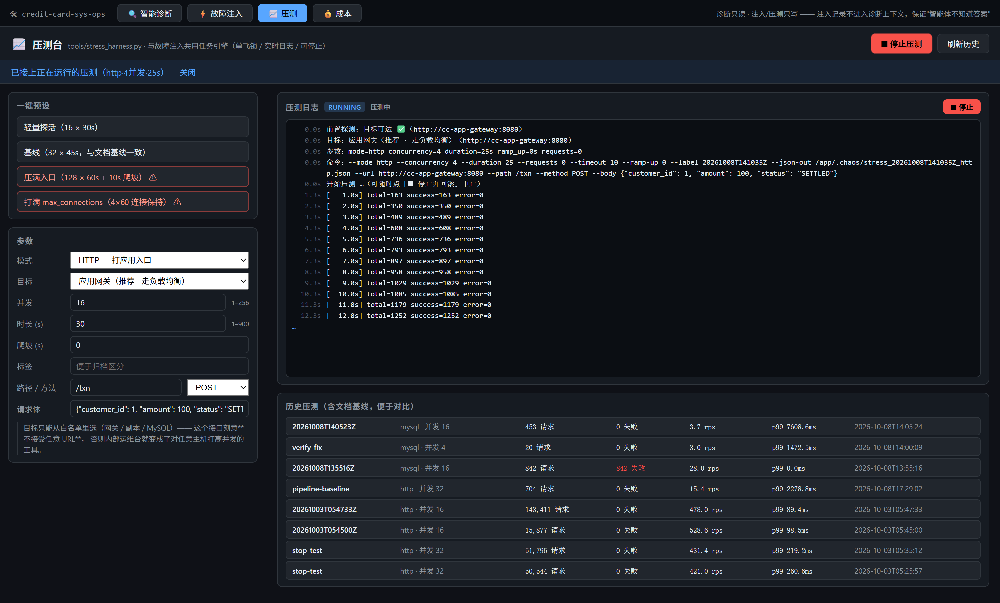

前端切页会**卸载**组件，所以"正在跑"这件事被持久化并全局提示；回到页面会**接管**在跑的任务。
**凭什么可信**：用 CDP 实测四步 —— ①状态落盘 ②切页出现"运行中" ③切回显示"已接上"
④跑完成功率 100%。

### 4. 压力测试台 —— HTTP 与 MySQL 双模式

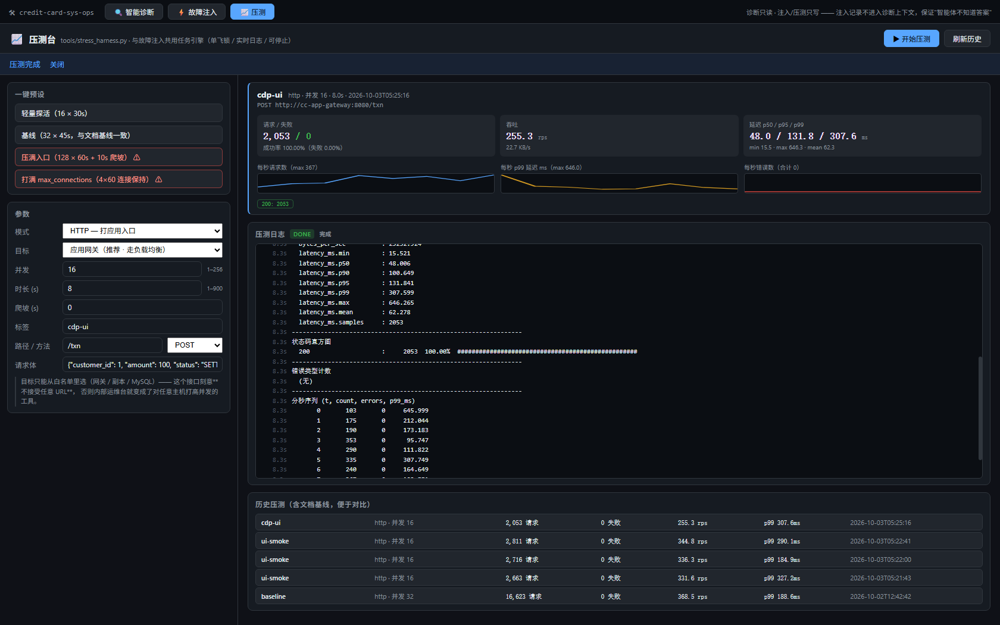

开跑前**探测目标可达性**（MySQL 做 TCP 连接、HTTP 打 `/health`），不可达就当场拒绝并说明原因。
**凭什么可信**：这是 [`docs/lessons/02`](docs/lessons/02-stress-harness-connected-to-itself.md)
的修复 —— 一个配置错误不该长得像一次性能结论（当时 842/842 全"失败"）。

### 5. 根因结论 —— 确定性引擎与 LLM 走不同的路

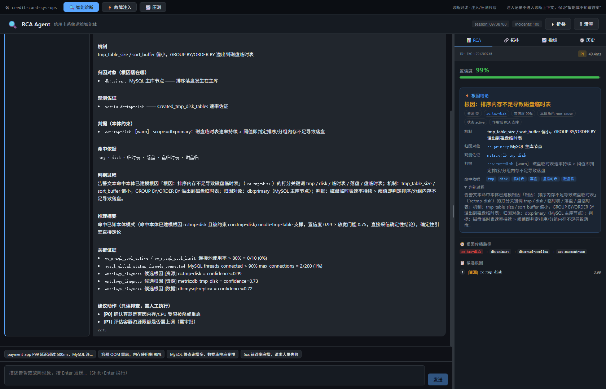

路由由**输入**决定，不由结论决定：结构化告警走本体快路径（**0 token，约 15 秒**）；
开放式的自然语言提问会**强制**走 LLM Agent 探索。**凭什么可信**：每次回答都返回
`mode` 与 `route_reason`，可以直接核对它为什么走了这条路。

### 6. 自然语言提问与推理过程可见


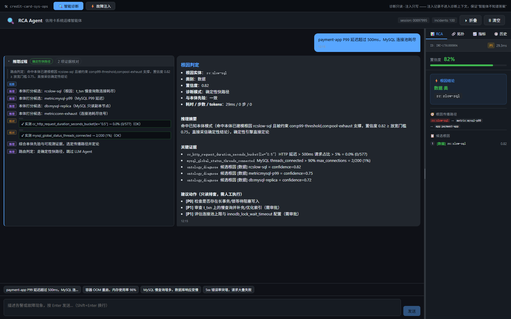

### 7. 诊断的指标视角与拓扑视角

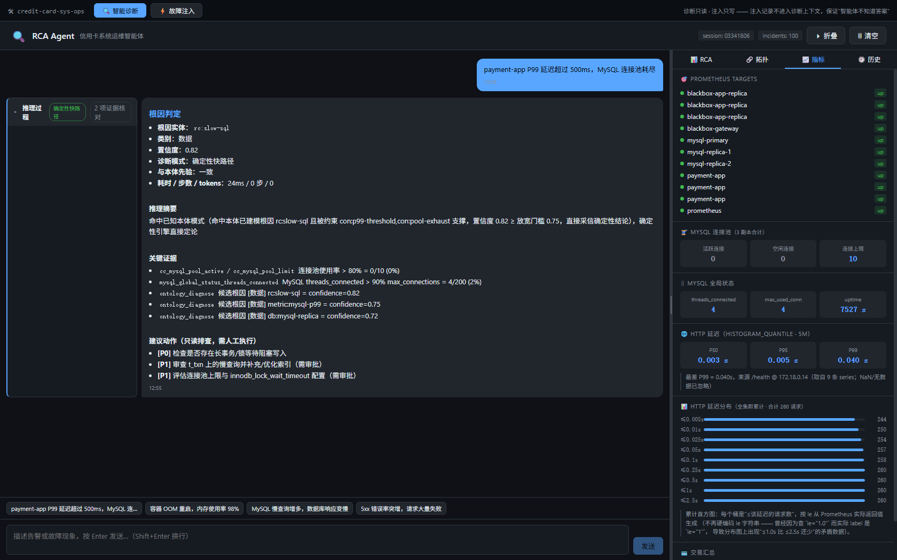
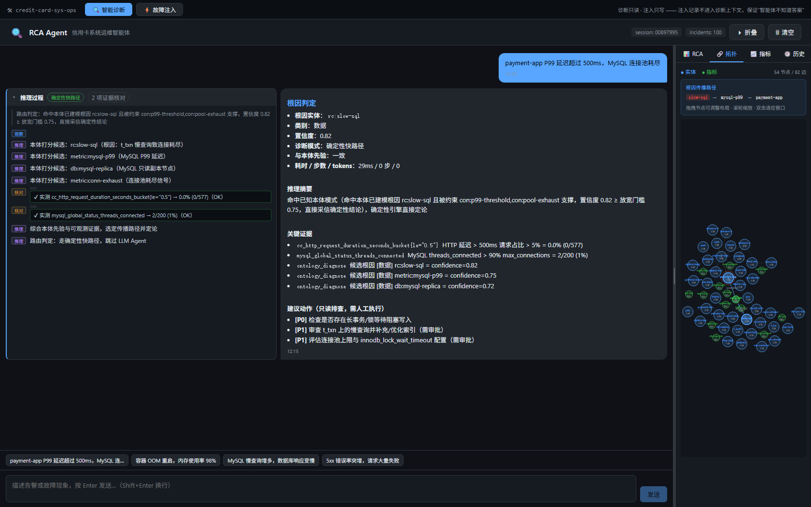

同一次诊断既能下钻到**具体指标曲线**，也能看到**受影响的服务拓扑**。

### 8. 处置动作 —— P0 只读、写操作需批准、失败自动回滚

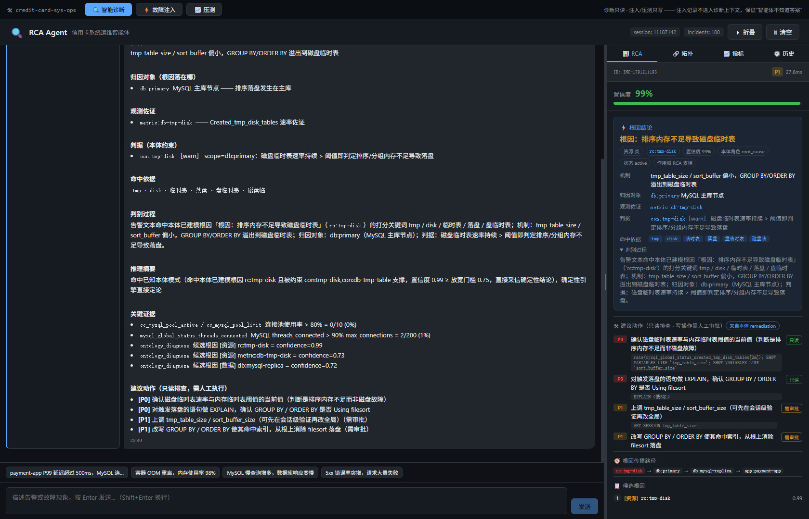

**不变量：最紧急（P0）的处置动作一律只读**，并且由**本体发布的闸门**强制 ——
不是写在注释里的约定。写操作默认 dry-run，带逆操作与执行后校验，校验不过自动回滚。

### 9. 模型设置与成本看板 —— 把"快路径省了多少"量化出来

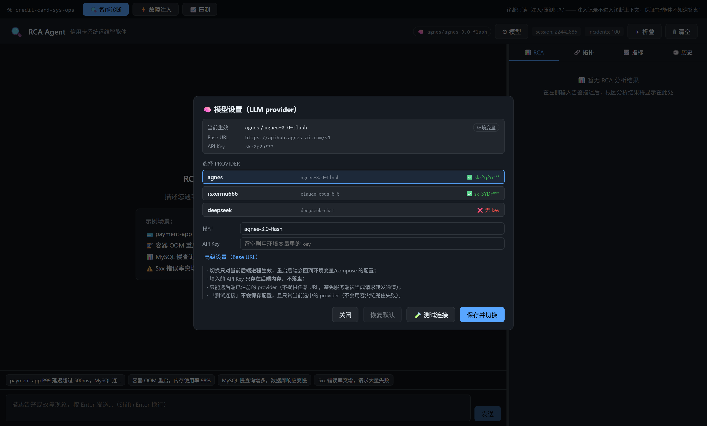
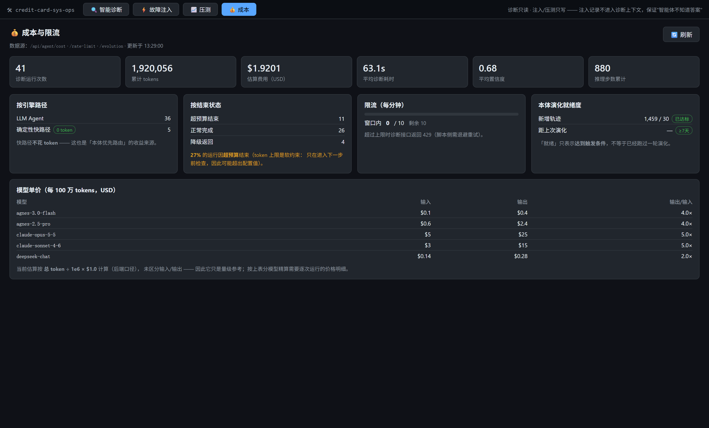

### 10. 集群监控 —— Prometheus + 23 条告警规则 + Grafana

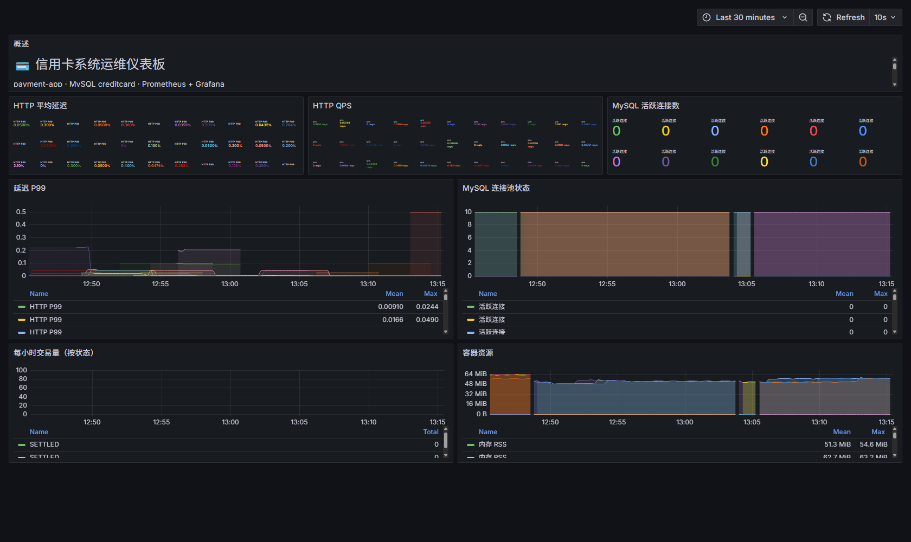

告警覆盖是**实测**的：注入故障 → 等够（规则最大 `for` + 60s）→ 看声明的告警是否真的 firing，
当前 **20/21 = 95%**。

## 架构

```
                 ┌──────────── Nginx 网关 :8080 ───────────────┐
                 │              （负载均衡）                    │
        ┌────────┴────────┬─────────────────┬──────────────────┴───┐
        │   应用副本 1     │   应用副本 2     │   应用副本 3          │  ← cc_* 指标
        └────────┬────────┴────────┬────────┴──────────────────────┘
                 └──────────┬──────┘
                    MySQL 主库 ── GTID ── 只读副本 1 / 只读副本 2
                            │
      Prometheus + 23 条告警规则 + Alertmanager + blackbox     Grafana :3000
                            │
                  FastAPI 诊断后端 :8088 ── React 控制台 :3001
                     │            │
              确定性规则引擎    LLM Agent（工具 + 本体）
                     │
              .evoontology/  ← 经版本化轮次 + 发布闸门演化
```

## 快速开始

> **一条命令即可**（推荐）：
>
> ```bash
> python tools/dev_up.py        # 起栈 → 引导(schema+复制) → seed → 体检；也可用 make up
> ```
>
> 下面 5 步是它**内部做的事**，保留下来便于出问题时逐段排查。
> 这些步骤原先散落在**文档 / CI / compose** 三处，结果"漏跑引导"被踩了三次
> （症状是副本成了空实例：读路径 Access denied、复制为空，而**所有容器都 healthy**），
> 现在收敛到一个入口。


```bash
# 1) 起集群（应用 ×3 + 网关，MySQL 主库 + 2 副本，
#    Prometheus/Grafana/Alertmanager，诊断后端 + 控制台）
docker compose -f rca-agent/docker-compose.yml up -d

# 2) 引导集群：建 schema + 配主从复制（**这一步不在 compose 里**）
#    副本默认是空实例（没有 appuser、没有表、复制为空）——
#    漏掉它，体检的「读路径」会报 Access denied、两条「replication」会 FAIL
python tools/cluster_bootstrap.py

# 3) 建合成数据集（约 480 万行）—— 场景依赖它
python tools/fault_injector.py seed

# 4) 环境体检（18 项）—— 期望全部 PASS
python tools/fault_injector.py doctor

# 5) 打开控制台
#    http://localhost:3001   （故障注入 / 压测 / 成本 / 智能诊断）
```

依赖：Docker（**compose v2**）、Python 3.11+、Node 20+（仅在需要重建前端时）。

## 可以做什么

```bash
python tools/fault_injector.py verify                 # 21 个场景：注入 → 信号 → 回滚
python tools/fault_injector.py verify --fast          # 代表性子集（7 个）—— 适合快速反馈
python tools/alert_coverage_check.py                  # 注入 → 等够久 → 声明的告警是否真的 firing
python tools/cluster_rca_verify.py                    # 端到端：注入 → 压测 → 告警 → 诊断 → 评分
python tools/evolve_ontology_cluster.py --round memory  # 走一轮本体演化（成对评估 + 闸门）
python tools/run_all_verification.py --full            # 全流水线（数小时；14 步）
```

## 实测结果

下列每个数字都由 `tools/` 下的脚本产出，原始报告在 `.chaos/` 与 `reports/`。
数字**刻意标注测量口径** —— 本项目的规矩是：**一个绿了的检查，必须有能力变红**。

| 指标 | 结果 | 口径 / 依据 |
|---|---|---|
| 故障场景复现 | **21/21** | `fault_verify` 全量，[`reports/fault_verify_report.json`](reports/fault_verify_report.json) |
| 注入期信号**全部**成立 | **20/21** | 同上（唯一未全部成立的是 `res_db_memory`，见"已知问题"） |
| 声明的告警真的触发 | **20/21 = 95%** | `alert_coverage_check`（hold = 规则最大 `for` + 60s） |
| 严格根因 top-1 | **16/18 场景**（报告自身口径 `diagnosed_ok` 为 17/18） | 端到端，[`reports/rca_diagnosis_report.json`](reports/rca_diagnosis_report.json) |
| 恢复核对 | **18/18** | 端到端（改用"配置态"作为延迟恢复判据之后） |
| 组件级→根因级升级（A/B） | 严格 **17→18/21**，top-5 **20→21/21**，**0 回退** | [`reports/promotion_ab.json`](reports/promotion_ab.json) |
| 跨集群归属（该找谁） | **16/18 = 89%** | `crosscluster_verify` |
| 确定性快路径 | **0 token，约 15 秒/例** | 路由停留在快路径时 |
| **对比纯阈值基线** | 本体 **16/18 = 88.9%** vs 基线 **11/18 = 61.1%**（其中 4 例被注入前就存在的噪声告警带偏）；**没有任何一例基线赢过本体** | 归档运行的离线重放，[`reports/baseline_compare.json`](reports/baseline_compare.json) |
| **held-out 措辞（未参与调参）** | **4/10 = 40%**（调参集为 81–86%） | `heldout_verify` |

**最后一行是最重要的一行**：这是一个我们**主动公开的负面结果** —— 打分关键词明显过拟合于
那 21 个场景的措辞。修正它是已立项的工作，但**不得**在同一份 held-out 集上调参。

## 安全模型

- 所有宿主端口默认只绑 `127.0.0.1`（需要放开时显式设 `CC_BIND`）。
- 可选注入令牌 `CHAOS_API_TOKEN`；控制台有令牌输入框。
- `CHAOS_UI_ENABLED=0` 可一键关掉整个注入控制台。
- 高危/极高危场景需要显式确认；`/jobs/current/abort` 任何时候可用。
- 处置动作：**只读取证自动执行**；写操作需要 `--approve`，且带逆操作与执行后校验，
  校验不过**自动回滚**；默认 dry-run。
- **不变量：最紧急（P0）的处置动作一律只读** —— 作为本体发布的**闸门**强制，而不是写在注释里。

## 仓库结构

```
rca-agent/            compose 栈、FastAPI 后端、React 控制台、Prometheus/MySQL 配置
tools/                故障目录、验证工具链、本体工具
.evoontology/         版本化本体（active.json + versions/*）← 知识库
ontology_turtle/      OWL/TTL 单一事实源
vendor/EvoOntology/   MIT 许可的本体演化引擎
docs/                 手册与迁移文档（以中文为主）
reports/              验证报告原始产物（README 里的数字都能在这里点开核对）
```

## 文档

| 文档 | 语言 | 内容 |
|---|---|---|
| `docs/集群化_故障注入_验证手册.md` | 中文 | 主手册：设计、40+ 条实测结论、自我纠错记录 |
| `docs/EvoOntology_接入手册.md` | 中文 | 本体协议接入与轮次 |
| `docs/Linux迁移适配.md` | 中文 | 从 Windows Docker 迁到 Linux Docker |
| `docs/RCA_Agent_智能化改造方案.md` | 中文 | Agent 设计与路线图 |
| [`docs/lessons/`](docs/lessons/README.md) | 中/英 | **六个真实事故**：让坏系统看起来正常的那些陷阱（502 上游缓存 / 连通自己 / 僵尸 / BOM / 判据不可能通过 / 证据放在被观测对象身上） |
| [CONTRIBUTING.md](CONTRIBUTING.md) | 英 | 含 **10 条不可协商的纪律**（判据设计是重点） |

## 许可证

MIT —— 见 [LICENSE](LICENSE)。第三方组件与许可证见
[THIRD_PARTY_LICENSES.md](THIRD_PARTY_LICENSES.md)。
