# 基于本体方法论的运维智能体落地实践

> **副标题**：以 EvoOntology 为语义底座，构建可信、可演进、可复制的数据中心故障根因分析体系
>
> **版本**：v1.0
> **定位**：面向客户与实施团队的方法论 + 工程设计说明书
> **配套代码仓库**：`credit-card-sys-ops`（信用卡系统运维智能体，含本体工作区 `.evoontology/` 与 13 个本体版本目录）

---

## 阅读约定

本文在事实层面严格区分两类内容，请读者务必注意标记：

| 标记 | 含义 | 可信度 |
|---|---|---|
| **【本项已实证】** | 当前仓库中已实现、已部署、已通过端到端验证的内容。所有数字、公式、版本号、记录数均可在代码或数据文件中核对 | 可直接作为立项依据 |
| **【生产扩展设计】** | 面向银行生产环境规模（大量应用/中间件/数据库/服务器/交换机/存储）的**扩展设计**，方法论一致，但尚未在本仓库落地 | 需在目标环境重新评审与验证 |

本文所有架构图、时序图均使用 Mermaid 语法，可在支持 Mermaid 的 Markdown 阅读器（GitHub、Typora、VS Code、语雀、Confluence）中直接渲染。

---

## 目录

**第一篇 为什么需要本体方法论**

- [第 1 章 问题的本质：运维智能体的"语义缺口"](#第-1-章-问题的本质运维智能体的语义缺口)
- [第 2 章 本体在运维智能体中的定位：运行态语义模型](#第-2-章-本体在运维智能体中的定位运行态语义模型)
- [第 3 章 方法论总览：一个闭环、四个部件、六条原则](#第-3-章-方法论总览一个闭环四个部件六条原则)

**第二篇 本体建模（How to Model）**

- [第 4 章 本体的数据模型：三库五族](#第-4-章-本体的数据模型三库五族)
- [第 5 章 建模方法：从【故障场景】倒推【要建什么】](#第-5-章-建模方法从故障场景倒推要建什么)
- [第 6 章 基于 EvoOntology 的建模实操](#第-6-章-基于-evoontology-的建模实操)
- [第 7 章 建模度量：本体可诊断性得分](#第-7-章-建模度量本体可诊断性得分)

**第三篇 本体版本迭代（How to Evolve）**

- [第 8 章 演化协议：假设 → 候选 → 成对评估 → 门控发布](#第-8-章-演化协议假设--候选--成对评估--门控发布)
- [第 9 章 本项目的五轮迭代实证](#第-9-章-本项目的五轮迭代实证)
- [第 10 章 可信度评审机制](#第-10-章-可信度评审机制)

**第四篇 基于本体的故障根因分析（How to Diagnose）**

- [第 11 章 根因分析算法全流程](#第-11-章-根因分析算法全流程)
- [第 12 章 候选根因打分：从代码内置词表到本体派生](#第-12-章-候选根因打分从代码内置词表到本体派生)
- [第 13 章 组件级结论升级为根因级结论](#第-13-章-组件级结论升级为根因级结论)
- [第 14 章 双引擎协同与路由决策](#第-14-章-双引擎协同与路由决策)
- [第 15 章 LLM Agent 循环与工具矩阵](#第-15-章-llm-agent-循环与工具矩阵)
- [第 16 章 可解释性与证据链](#第-16-章-可解释性与证据链)

**第五篇 银行生产环境：大规模可信本体](#第五篇-银行生产环境大规模可信本体)

- [第 17 章 规模带来的四个真实挑战](#第-17-章-规模带来的四个真实挑战)
- [第 18 章 分层建模框架：六层资源域与语义契约](#第-18-章-分层建模框架六层资源域与语义契约)
- [第 19 章 可信性工程：让每条语义都"可被证明"](#第-19-章-可信性工程让每条语义都可被证明)
- [第 20 章 效率工程：垂直切片与规模治理](#第-20-章-效率工程垂直切片与规模治理)
- [第 21 章 拓扑与配置变更下的本体迭代](#第-21-章-拓扑与配置变更下的本体迭代)

**第六篇 系统设计说明**

- [第 22 章 逻辑架构](#第-22-章-逻辑架构)
- [第 23 章 部署架构](#第-23-章-部署架构)
- [第 24 章 关键流程时序图](#第-24-章-关键流程时序图)
- [第 25 章 关键模块设计：本体模型](#第-25-章-关键模块设计本体模型)
- [第 26 章 关键模块设计：数据采集层](#第-26-章-关键模块设计数据采集层)
- [第 27 章 关键模块设计：本体语义服务](#第-27-章-关键模块设计本体语义服务)
- [第 28 章 关键模块设计：推理引擎](#第-28-章-关键模块设计推理引擎)
- [第 29 章 关键模块设计：LLM Agent 与安全边界](#第-29-章-关键模块设计llm-agent-与安全边界)
- [第 30 章 关键模块设计：本体演化引擎](#第-30-章-关键模块设计本体演化引擎)

**第七篇 项目复制方法论**

- [第 31 章 复制路径：五阶段实施法](#第-31-章-复制路径五阶段实施法)
- [第 32 章 角色、任务包与工时估算](#第-32-章-角色任务包与工时估算)
- [第 33 章 度量体系与验收标准](#第-33-章-度量体系与验收标准)
- [第 34 章 踩坑清单：36 条实战教训](#第-34-章-踩坑清单36-条实战教训)
- [附录 A 术语表](#附录-a-术语表)
- [附录 B 本体记录字段速查表](#附录-b-本体记录字段速查表)
- [附录 C 演化门控规则速查](#附录-c-演化门控规则速查)
- [附录 D 参考与索引](#附录-d-参考与索引)
- [附录 E 快速开始清单](#附录-e-快速开始清单可直接照做)

---
---

# 第一篇 为什么需要本体方法论

## 第 1 章 问题的本质：运维智能体的"语义缺口"

### 1.1 一个真实的故障现场

【本项已实证】以下告警文本取自本项目的 Prometheus 告警规则（`rca-agent/monitoring/prometheus/alerts.yml`），是在集群化信用卡支付模拟环境中真实触发的告警：

```
MySQL 实例 cc-mysql-replica-1 不可用（mysql_up=0，db_role=replica）
—— 判据：mysql_up=0。若 db_role=primary：主库不可用，写路径与复制源全部受影响；
若 db_role=replica：写路径正常，这是只读副本 cc-mysql-replica-1 不可用/副本丢失，
后果是读容量下降与复制滞后
```

这条告警包含了一个完整的推理起点。但是，要把它变成一个可执行的根因结论，人和智能体都必须回答下面这些问题：

| 问题 | 需要的语义 |
|---|---|
| `cc-mysql-replica-1` 在我的世界里是什么？ | 实体识别：它是「MySQL 只读副本节点」这个类型的一个实例 |
| 它和我看到的症状（支付超时）有什么关系？ | 关系路径：应用 → 数据源 → 数据库集群 → 只读副本 |
| 为什么只读副本挂了会让支付变慢，而不是让支付直接失败？ | 机制语义：读路径依赖副本，写路径依赖主库 |
| 凭什么确认它"挂了"，而不是"慢"？ | 观测映射：`mysql_up=0` 这条指标到该实体的绑定 |
| 这个结论按什么阈值判定？ | 约束语义：`con:replica-down`，severity=block |
| 下一步该怎么做？ | 处置语义：具体命令 + 是否需要人工审批 |

**这六个问题的答案，构成了"运维本体"的全部内容。** 如果这些语义不在一个显式的、结构化的、版本化的地方，那么每一类智能体——无论是规则引擎还是大模型 Agent——都必须在每一次故障中重新推断它们。

### 1.2 语义缺口的三种表现

在多轮实践中我们观察到一个稳定的失败模式，把它称为 **agent-data gap（智能体—数据语义缺口）**。它有三种典型表现：

**表现一：原始数据没有显式语义，Agent 反复猜。**

一个监控系统的指标叫 `cc_container_cpu_throttled_seconds_total`。这个名字对熟悉 cgroup 的工程师不构成障碍，但对智能体来说，「throttled」这个词是否可以与「资源不足」归为一类故障、「seconds_total」是否是累加计数器（因此必须用 `rate()` 而不是比较绝对值）——这些都需要知识。缺了这层知识，Agent 会写出 `rate(cc_container_cpu_cfs_throttled_periods_total[5m])` 这样的查询，而这个指标在你的 Prometheus 里**根本不存在**，返回 0 条 series。

> 【本项已实证】这不是假想。本项目 `ontology_v4` 版本的处置动作里就有这条不存在的指标名，`tools/ontology_v5_patch.py` 的文件头记录了实测发现过程：「照着这条"建议"排查，操作人只会得到空结果：**看起来查过了，其实什么都没查到。**」这类错误只有真的跑起来才会暴露。

**表现二：静态语义层会过时。**

人工维护的拓扑图、CMDB、设计文档，在环境变更后必然漂移。本项目的一个具体例证：环境从「单容器 + 单库」演进为「3 副本应用 + Nginx 网关 + 1 主 2 只读副本 MySQL 集群」时，本体的 18 个术语里**没有任何一个**副本、集群、网关、复制、配额的概念。

> 【本项已实证】这次漂移的后果是可量化的：21 个集群故障场景中，只有 1 个能被本体诊断，本体可诊断性得分 **0.048**（1/21）。修复后达到 **1.000**（21/21）。详见第 9 章。

**表现三：把整份语义塞进 prompt 不可持续。**

这是最容易被忽视、也最先撞墙的一条。假设一个中等规模的银行数据中心有 300 个应用、200 个中间件实例、150 个数据库实例、3000 台服务器、800 台交换机、50 套存储。按本项目实测的建模密度（一个应用子系统 ≈ **54 个术语 + 82 条关系 + 29 条约束**，即约 **165 个语义对象**），全量建模会产生 **万级到十万级的语义对象**。把它们注入 System Prompt 是不可能的：上下文窗口装不下，token 成本无法承受，而且每次都注入 99% 用不到的信息，反而稀释了注意力。

**结论：智能体需要的不是"更多语义"，而是"在当前这一步按需取到恰好够用的语义"。**

### 1.3 传统方案的局限

| 方案 | 能解决 | 不能解决 |
|---|---|---|
| 人工运维知识库 / Wiki | 沉淀经验文本 | 机器不可读，无法参与推理；更新靠人，必然过时 |
| CMDB | 配置项清单 | 只有"有什么"，没有"为什么/凭什么/怎么办"；关系粒度粗 |
| APM / 链路追踪 | 调用链 | 只有运行时观测到的路径，没有未观测到的依赖；无故障机理 |
| 规则引擎 / 专家系统 | 确定性判定 | 规则与知识耦合在代码里，改知识要改代码、要发版 |
| 纯 LLM Agent | 自然语言理解与探索 | 幻觉；没有事实依据；成本高；结论不可复现 |
| RAG 向量检索 | 非结构化知识召回 | 检索的是文本片段，不是结构化语义；无法做图遍历与约束校验 |

**这些方案各自有效，但都缺少同一样东西：一个显式的、结构化的、可版本化、可被机器按需查询、且被真实数据验证过的语义层。**

这正是 EvoOntology 的定位。

---

## 第 2 章 本体在运维智能体中的定位：运行态语义模型

### 2.1 一句关键的话：本体不是文档，是智能体的运行态状态

EvoOntology 的核心设计思想非常值得强调：

> **EvoOntology 把 Ontology Layer 视为可训练的 Agent 状态，而不是模型权重。**
> —— EvoOntology 官方 README（`vendor/EvoOntology/README.zh-CN.md`）

这句话改变了我们对本体的理解方式。传统做法把本体当作「设计交付物」——一次性建好、评审通过、归档，然后开始写代码。而这里的定位是：

| 维度 | 文档式本体 | 运行态语义模型 |
|---|---|---|
| 消费者 | 人 | 智能体（MCP 工具调用） |
| 交付方式 | 全量评审、全量入库 | 会话初始化仅注入 manifest，按需检索 |
| 更新方式 | 年度版本、大版本重构 | 局部补丁 + 成对评估 + 门控发布 |
| 正确性判据 | 专家评审通过 | 在真实故障场景上可复现地优于父版本 |
| 失败处理 | 打回重写 | 拒绝候选，保留父版本，结果用于下一轮 |
| 版本语义 | 文档编号 | `ontology_vN`，可比较、可回滚、可激活 |

**因此本项目的核心工程产出不是一份本体文档，而是一个持续演进的 `.evoontology/` 工作区。** 【本项已实证】当前该工作区包含 **13 个版本目录**，激活版本为 `ontology_v5`。

### 2.2 本体在系统中的四个作用点

在本项目里，本体不是一个旁挂的知识库，而是嵌入在推理主链路的四个关键位置：


**作用点①：语义接线（Semantic Wiring）。**

告警是自然语言文本。本体里的 `Constraint.trigger_keywords` 是人工精修的关键词集合。两者一对齐，就建立了「告警文本 → 本体约束 → 约束 target → 根因类别」的确定通路。

> 【本项已实证】这一层的实现是 `rca-agent/backend/services/ontology_scoring.py` 的 `match_constraints()` 与 `favoured_categories()`。当告警命中某条约束时，`constraint_type` 直接映射到根因类别：`capacity→资源`、`threshold→数据`、`business_rule→依赖`、`data_quality→数据`、`enum_semantics/unit/scope→配置`。

**作用点②：拓扑展开（Topology Expansion）。**

从用户可见的入口实体（本项目是 `app:payment-app`）出发，沿本体的关系边做有界 BFS，得到候选实体集合。这决定了「智能体在多大的范围内找根因」。

> 【本项已实证】实现于 `rca-agent/backend/services/evo_ontology.py` 的 `get_topology_graph()`，**当前默认参数为最大深度 6 层、最大节点数 160 个**，结果带 600 秒进程内缓存（`_TOPOLOGY_TTL_S = 600.0`）。
>
> ⚠️ **这两个参数是迭代上调的结果，不是初始值。** 早期为 4 层 / 40 节点；在这个上限下，`rc:row-lock` 与 `rc:tmp-disk` 这两个根因会被 BFS 截断在候选集之外——线上表现为 21 个场景只有 15 个能被诊断。**这是一个非常典型的"参数卡死了本体能力"的案例**：本体建对了，但引擎取不到。上调到 160 / 6 后，`ontology_scoring` 的 top1 命中从 11/21 提升到 20/21。

**作用点③：结论解释（Self-Explaining Conclusion）。**

这一层常被忽略，但对客户价值最大。根因结论不能只给一个 `rc:replica-loss`。它必须能自解释：这是什么、机制是什么、影响了哪些实体、凭什么判定、怎么办。这些**全部来自本体中本来就有的字段**——`definition`、`attributedTo` 关系的 `description`、`evidencedBy` 指向的指标、以该术语为 `target` 的约束、以及 `remediation` 处置动作。

> 【本项已实证】实现于 `OntologyScoring.explain()` 与 `rca_engine.py` 的 `_reason_sentence()`。返回字段包括 `definition` / `rationale` / `role` / `lifecycle` / `affected` / `evidenced_by` / `constraints` / `remediation`。

**作用点④：行为驱动（Behavior-Driven Engine）。**

这是本项目最有价值的架构经验，也是从"本体是个摆设"走向"本体真正驱动系统"的分水岭。

最初版本里，确定性引擎的打分词典是**硬编码在 Python 代码里**的 `LEGACY_CATEGORY_KEYWORDS`。结果是：本体迭代补进了 `rc:row-lock`、`rc:replica-loss` 等新术语，但引擎的打分表里没有这些词 → **新术语永远不会被打分命中** → 本体迭代只让知识躺在库里，改不动引擎行为。

> 【本项已实证】这个缺陷有量化证据：本体知识完备性从 0.048 提升到 1.000（21/21 场景），但确定性引擎的候选命中只从 top5 的 1/21 提升到 4/21。修复方式是把打分词典**从激活本体派生**——`Term.aliases`、`Constraint.trigger_keywords`、`Term.scoring_keywords` 全部参与构建词典，引擎每次读取激活版本，本体一换版本，引擎行为立刻改变。

**这条经验可以总结为一条判据：如果一个本体迭代之后，系统的行为没有任何改变，那这个迭代就是无效的。**

### 2.3 与 OWL/RDF 的关系

本项目同时存在两套本体表达：

| 表达 | 位置 | 用途 | 状态 |
|---|---|---|---|
| OWL/Turtle | `ontology_turtle/ontology.ttl`、`instances.ttl`、`topology.ttl` | 形式化本体、SPARQL 查询、学术交付 | 【本项已实证】由 `generate_ontology_ttl.py` 生成，含类层次与 SPARQL 样例 |
| EvoOntology JSON 记录族 | `.evoontology/versions/ontology_vN/*.json` | 智能体运行态语义层、版本演化、MCP 服务 | 【本项已实证】当前激活 `ontology_v5` |

**两者的分工建议（【生产扩展设计】）**：

- OWL/TTL 作为**对外交付与长期归档**格式，便于与行内架构资产库（如企业级数据架构、EA 工具）对接；
- EvoOntology JSON 记录族作为**智能体运行态**格式，因为它原生支持版本演化、成对评估、门控发布；
- 两者之间建立**转换脚本与一致性校验**（本项目已具备从 TTL 到记录族的映射脚本 `tools/init_evo_ontology.py`，映射规则见第 6 章）。

---

## 第 3 章 方法论总览：一个闭环、四个部件、六条原则

### 3.1 一个闭环

整个方法论可以压缩成一张图：

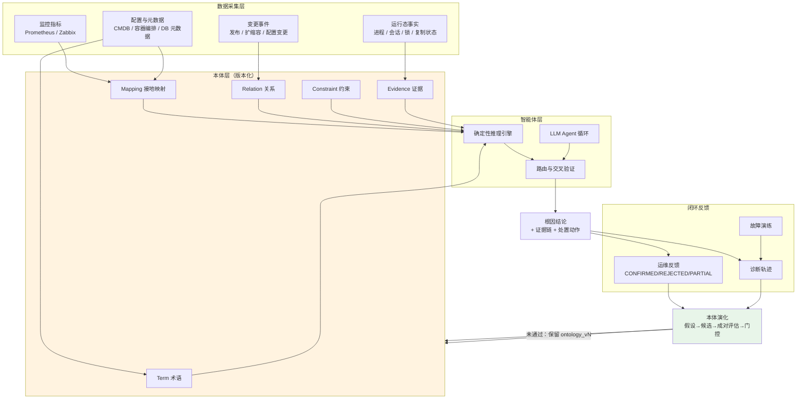

**闭环的四个环节（对应 EvoOntology 的官方生命周期）**：

1. **Build（构建）**：从工作负载提取候选概念，在原始数据源中验证，发布 `ontology_v0`；
2. **Use（使用）**：智能体按需查询本体，同时记录工具交互与任务结果；
3. **Evolve（演化）**：诊断重复出现的行为缺陷，归因到 Content / Tool / Schema 层，生成局部候选补丁；
4. **Evaluate & Publish（评估与发布）**：在相同数据、Agent、解码配置与交互预算下比较父版本与候选版本，通过门控的候选发布为 `ontology_vN+1`；否则保留父版本。

### 3.2 四个部件

落地一套本体驱动的运维智能体，需要四个部件。它们可以分阶段建设，但**缺少任何一个，闭环都不成立**：

| 部件 | 职责 | 缺失后果 |
|---|---|---|
| **建模工作流** | 把运维专家的隐性知识转成结构化的五族记录，并绑定证据 | 本体靠猜，不可信 |
| **数据采集层** | 提供可复现的观测事实（指标/配置/运行态/变更） | 证据无法验证，术语无接地 |
| **推理引擎 + Agent** | 消费本体，产出带证据链的根因结论 | 本体只是文档，没有使用价值 |
| **演化引擎** | 从轨迹与反馈中发现本体缺陷，走门控发布新版本 | 本体快速腐化，二次投资归零 |

### 3.3 六条原则

以下六条原则贯穿全文，是本方法论的"宪法"：

**原则一：一切语义必须有证据（Evidence-backed）。**

每一个 Term、Mapping、Relation、Constraint 都应携带 `evidence_refs`，指向一条可复现的 Evidence 记录。Evidence 记录结构固定为五元组：`source`（来源系统）、`query`（可重放的原话/命令/查询）、`result`（真实返回结果）、`validation_method`（验证手段）、`timestamp`（采集时刻）。

> 【本项已实证】本项目 `Evidence` 记录的字段定义见 `vendor/EvoOntology/evoontology/ontology/models.py`。例如 `ev-mysql-vars` 的 `query` 是 `SELECT @@version, @@max_connections, @@wait_timeout`，`validation_method` 是 `MySQL @@ variables`。

**原则二：一切变更必须成对评估（Paired Evaluation）。**

任何候选版本都必须与父版本在**同一批 case、同样的数据、同样的 Agent 配置**下成对比较。不允许"只测候选版本"。

**原则三：一切发布必须过门控（Gated Publication）。**

候选版本只有在可复现地优于父版本、且显式声明"无不接受回归"时，才允许发布。未通过则保留父版本，并把评估结果作为下一轮的输入。

**原则四：语义必须按需检索，不许全量注入（Progressive Disclosure）。**

会话初始化只注入 manifest（版本号、记录族统计、工具清单），具体语义对象在需要时通过 MCP 工具检索。

> 【本项已实证】EvoOntology 的 Tool Layer 设计即为此：`browse_semantics`、`resolve_semantics` 按需查询，`session manifest` 保持简洁。

**原则五：知识不得硬编码在代码里（No Knowledge in Code）。**

代码里可以有的：算法、权重结构、图遍历逻辑、安全边界。代码里不可以有的：具体的关键词表、已知根因白名单、设备型号清单、阈值数值。**后者的唯一来源必须是本体的激活版本。**

> 【本项已实证】这条原则在本项目中被违反了两次并被纠正：第一次是打分词典（`LEGACY_CATEGORY_KEYWORDS`），第二次是路由的已知根因白名单（`FALLBACK_KNOWN_ROOT_CAUSES`）。两次纠正后，本体版本切换会立刻改变引擎行为。

**原则六：每一个故障场景都必须有本体表达（Scenario Completeness）。**

反向验证本体完备性的方法不是"看代码覆盖率"，而是问：**给我一个已知的故障场景，本体里能否表达它的根因、它的传播路径、它的观测判据？** 这就是第 7 章的可诊断性得分。

---
---

# 第二篇 本体建模（How to Model）

## 第 4 章 本体的数据模型：三库五族

### 4.1 Ontology Layer 的三层结构

EvoOntology 把 Ontology Layer 拆成三个相互关联的层。这个拆分是理解整个建模方法的关键：

| 层 | 作用 | 本项目对应 |
|---|---|---|
| **Content Layer** | 类型化语义图。四类节点（Term、Mapping、Constraint、Evidence）+ 关系（Relation） | `.evoontology/versions/ontology_vN/{terms,mappings,constraints,evidence,relations}.json` |
| **Schema Layer** | 定义四类节点的字段、允许使用的 Semantic Relation 类型、合法的 Structural Reference 模式。**确定 Ontology Layer 的表达边界** | 由 `vendor/EvoOntology/evoontology/ontology/models.py` 的 dataclass 定义约束；项目级 schema 扩展通过 `lifecycle`、`role`、`scoring_keywords` 等渐进式字段实现 |
| **Tool Layer** | 通过 `browse_semantics`、`resolve_semantics` 和简洁的 session manifest 向 Agent 暴露 Ontology Layer | `.evoontology/visualizations/preview-server.json` + `evoontology/runtime/tools.py` 的 20 个 MCP 工具 |

**Schema Layer 的价值在于"表达边界"**：它明确了什么能说、什么不能说。这避免了本体无限膨胀成一个什么都往里塞的图数据库。

### 4.2 五族记录（Five Record Families）

这是本体的原子数据结构。**每一个字段都有明确职责，新增字段必须说明它服务于哪个推理环节。**

#### 4.2.1 Term（术语）—— "世界里有什么概念"

| 字段 | 类型 | 必填 | 说明 |
|---|---|---|---|
| `id` | string | ✅ | 唯一标识，带语义前缀（见 4.4 节命名约定） |
| `name` | string | ✅ | 人类可读名称 |
| `type` | string | ✅ | 类型：`entity` / `metric` / `concept` 等 |
| `definition` | string | ✅ | **机制定义**。这是根因结论能自解释的核心素材 |
| `scope` | string | ✅ | 所属层（本项目用「应用层/运行环境层/数据库层/RCA 支撑」） |
| `aliases` | string[] | | 别名，用于文本匹配（同义词归一） |
| `evidence_refs` | string[] | | 指向 Evidence 的 id 数组 |
| `lifecycle.state` | string | | 生命周期状态，默认 `active`。用于声明"已废弃但保留"的术语 |
| `role` | string | 【项目扩展】 | 术语在 RCA 中的角色：`root_cause` / `component` / `observation` / `rule` |
| `scoring_keywords` | string[] | 【项目扩展】 | 判别性关键词，比 name/alias 更贴近真实告警措辞 |
| `negative_keywords` | string[] | 【项目扩展】 | **本体对"什么情况下不是我"的显式声明**，命中即扣分 |
| `scoring_rationale` | string | 【项目扩展】 | 判别理由，直接进入结论文本 |
| `remediation` | object[] | 【项目扩展】 | 处置动作数组（见 4.2.6） |

> 【本项已实证】本项目激活版本 `ontology_v5` 共 **54 个 Term**。

**关于 `negative_keywords` 的设计价值**：这是解决"同实体多故障模式"消歧的优雅方案。例如「应用副本丢失」「应用副本假死」「应用副本 OOM」三个根因都涉及"应用副本"这个词。如果只做正向匹配，三者会被同时命中、无法区分。有了 `negative_keywords`，每个根因可以显式声明"出现『OOM』『OOMKill』字样时不是我（那是 `rc:oom-kill`）"。**这不需要在代码里写任何特例。**

#### 4.2.2 Mapping（接地映射）—— "概念落到哪张表/哪条指标上"

| 字段 | 类型 | 说明 |
|---|---|---|
| `id` | string | 唯一标识（本项目用 `map:` 前缀） |
| `term_id` | string | 指向 Term |
| `database_source` | string | 数据源（数据库/指标系统/文件） |
| `table` | string | 表名或指标名 |
| `column` | string | 字段或标签 |
| `semantic_filter` | string | 语义过滤条件（口径） |
| `aggregation_semantics` | string | 聚合语义（sum / avg / P99 / max over time…） |
| `grain` | string | 粒度 |
| `validation` | string | 验证说明 |
| `confidence` | string | 置信等级（high / medium / low） |
| `evidence_refs` | string[] | 证据引用 |

> ⚠️ **`aggregation_semantics` 是极易被忽略但事故高发的字段。**
> 【本项已实证】本项目踩过一个具体的坑：Prometheus histogram 的桶 `{le="X"}` 是**累加计数**（≤X 的请求数）。因此"超过阈值的比例"必须算 `(total − bucket{le=阈值}) / total`，而不能直接用 `bucket{le=阈值} / total`。这个口径如果不写进 Mapping，每个消费方都会各写一遍、各错一遍。

#### 4.2.3 Relation（关系）—— "概念之间怎么连"

| 字段 | 类型 | 说明 |
|---|---|---|
| `id` | string | 唯一标识（本项目用 `rel:` 前缀） |
| `source` | string | 起点 Term id |
| `relation_type` | enum | 受控关系类型（见下） |
| `target` | string | 终点 Term id |
| `connection_condition` | string | **连接条件**，带语义前缀，是解释与分类回溯的关键 |
| `description` | string | 可读描述（进入结论文本） |
| `evidence_refs` | string[] | 证据引用 |

**受控的 `relation_type` 取值**——Schema Layer 规定**只允许五种**，禁止 `affects` / `belongs_to` / `related_to` 这类自由文本类型：

| relation_type | 语义 | 方向性 | 例 |
|---|---|---|---|
| `hierarchy` | 更宽/更窄（父/子）结构 | 有向：`parent_broader` → `child_narrower` | 领域分类上下位 |
| `composition` | 整体—部分 | 有向：`whole_parent` → `part_child` | `app:payment-app` --runsOn--> `env:container` |
| `equivalence` | 同义 | 对称 | `env:host-wsl` ⟷ `env:host-phys` |
| `derivation` | 一个由另一个计算得出 | 有向：`input_base` → `derived_result` | 应用 → 宿主机 的传递路径 |
| `association` | 概念级相关（兜底类型） | 无向 | `app:payment-app` --accesses--> `db:mysql-core` |

**判定优先级（官方约定）**：`hierarchy` → `composition` → `equivalence` → `derivation` → `association`。即能用更强的语义表达时，不允许退化成 `association`。

> ⚠️ **一个重要的实测事实**：本项目 `ontology_v5` 的 82 条关系中，实际只用到 **4 种** `relation_type`——`composition` 20 条 / `association` 55 条 / `derivation` 5 条 / `equivalence` 2 条，**`hierarchy` 一次也没用**。
>
> 原因是本项目的建模范围是"实体拓扑"（运行环境、数据库、应用之间的依赖），而 `hierarchy` 表达的是"概念上下位"（分类学关系），在运维拓扑场景中较少出现。
>
> **生产环境的运维本体应当会大量使用 `hierarchy`**——例如"存储设备 → SAN 阵列 → 分布式存储"这类产品分类，以及网络分区层级。**这一点在设计银行本体时要特别注意：不要因为样例项目没用就忘记这个关系类型。**

> ⚠️ **一个重要的实现事实**：EvoOntology 核心的 `validate.py` / `store.py` / `models.py` **并不校验** `relation_type` 是否属于这五个受控值。这五个值只出现在可视化 Schema 视图与设计文档中。**也就是说，写出一个非法 `relation_type` 也能通过校验、发布、激活。**
>
> **这对生产环境是一个明确的风险点，也给出了一条明确的加固要求**：在银行生产落地时，必须在本体准入流程中**自建 relation_type 白名单校验**（见第 19 章「可信性工程」），不能依赖框架自带的校验。

**`connection_condition` 的语义前缀约定（本项目实证）**：

| 前缀 | 含义 | 在推理中的作用 |
|---|---|---|
| `attributedTo:` | 归因对象——**这个根因落在哪个组件上** | 驱动「组件级结论升级为根因级结论」（第 13 章） |
| `evidencedBy:` | 观测佐证——哪条指标在印证它 | 证据强度排序 |
| `runsOn:` / `deployedOn:` / `hosts:` / `containsTable:` / `accesses:` / `hasDataSource:` / `dataSourceOf:` / `exposes:` / `hasComponent:` | 具体拓扑语义 | 拓扑遍历与路径追踪 |

> 【本项已实证】`ontology_v5` 中共有 **82 条 Relation**（`ontology_v1-cluster` 时为 74 条），其中 **15 条**是 `rc:X --attributedTo--> 组件` 的归因声明、**15 条**是 `evidencedBy:` 观测佐证。

**`ontology_v5` 的 `connection_condition` 语义前缀分布（实测）**：

| 前缀族 | 数量 | 用途 |
|---|---|---|
| `evidencedBy:` | 15 | 观测佐证 |
| `attributedTo:` | 13 | 归因对象 |
| `produces:` | 9 | 组件产生指标 |
| `containsTable:` | 4 | 库包含表 |
| `hasInstance:` | 4 | 集群包含实例 |
| `memberOf:` | 2 | 成员关系 |
| `hasNode:` | 2 | 含节点 |
| `runsOn:` | 2 | 运行于 |
| `deployedOn:` / `hosts:` / `accesses:` / `hasDataSource:` / `dataSourceOf:` / `replicatesTo:` / `readsFrom:` / `loadBalancedBy:` / `routesTo:` / `exposes:` / `hasComponent:` / `hasRootCause:` / `triggers:` | 各 1 | 各类拓扑语义 |
| 组合路径（`A o B:`） | 2 | 传递路径的显式声明 |

**⚠️ 一个设计上的观察**：`relation_type` 只有 4~5 个粗粒度值，而**真正承载业务语义的是 `connection_condition` 的前缀约定**。这意味着：

- 优势：`relation_type` 保持稳定，语义表达可以灵活扩展（新增一个前缀即可，不需要改 Schema）；
- 风险：**前缀约定没有机器校验**（框架不校验 `connection_condition` 格式）。一旦前缀拼错，依赖它的功能（`affected` / `evidenced_by` 提取、结论升级）会**静默失效**。

**这是第 19 章"必须自建的 12 项校验"中的第 7 项**（`connection_condition` 前缀格式校验）的由来。

#### 4.2.4 Constraint（约束）—— "什么算故障"

| 字段 | 类型 | 说明 |
|---|---|---|
| `id` | string | 唯一标识（`con:` 前缀） |
| `target` | string | 被约束的 Term 或 Mapping id |
| `constraint_type` | enum | `threshold` / `capacity` / `business_rule` / `data_quality` / `enum_semantics` / `unit` / `scope` |
| `trigger_keywords` | string[] | **告警文本匹配词典**（人工精修，权重最高） |
| `severity` | enum | `block` / `warn` / `info` |
| `scope` | string | 约束作用域（哪个实体的约束） |
| `confidence` | string | 置信等级 |
| `description` | string | 判据说明（进入结论文本） |
| `evidence_refs` | string[] | 证据引用 |

> 【本项已实证】`ontology_v5` 中共有 **29 条 Constraint**（`ontology_v1-cluster` 时为 16 条，`ontology_v2` 时为 27 条）。`constraint_type` 到根因类别的映射是确定性的：`capacity→资源`、`threshold→数据`、`business_rule→依赖`、`data_quality→数据`、`enum_semantics/unit/scope→配置`。当多条约束指向同一术语时，按 `severity(block > warn > info)` 取最强的一条决定类别。
>
> **一个值得注意的实测事实**：`constraint_type` 在数据里实际只用到 **3 个值**（`capacity` / `threshold` / `business_rule`）；`data_quality` / `enum_semantics` / `unit` / `scope` 虽在映射表中定义，但**没有任何记录使用**。这提示我们：映射表的设计应当"够用即可"，预留过多类型反而增加理解成本。

**Constraint 是本体中最"贵"的一类记录，也是最值得投入的。** 原因：它是唯一一类同时服务于三个环节的记录——告警语义接线、根因类别判定、阈值判据解释。

#### 4.2.5 Evidence（证据）—— "凭什么这么说"

| 字段 | 类型 | 说明 |
|---|---|---|
| `id` | string | 唯一标识（`ev-` 前缀） |
| `source` | string | 来源系统（`docker-compose` / `mysql:creditcard` / `windows-host` / `http://...`） |
| `query` | string | **可重放的原话**：命令、SQL、HTTP 请求、PromQL |
| `result` | string | 真实返回结果 |
| `validation_method` | string | 验证手段（`read-only docker CLI` / `MySQL @@ variables` / `information_schema` / `WMI` / `http probe`） |
| `timestamp` | string | 采集时刻（ISO8601 UTC） |

**【生产扩展设计】证据分级制度**：生产环境应把 Evidence 按"可重放性"分为三级，并在 UI 上显式标注：

| 等级 | 定义 | 示例 | 可信度处理 |
|---|---|---|---|
| **A 级：自动可重放** | 有确定的重放命令，任何人可一键重放并得到等价结果 | PromQL 查询、只读 SQL、`docker inspect` | 可直接作为结论依据 |
| **B 级：半自动可重放** | 需要在特定权限/上下文中执行 | 需要 DBA 权限的 `SHOW ENGINE INNODB STATUS`、需要登录网络设备 | 可用，但需标注执行条件 |
| **C 级：人工记录** | 截图、聊天记录、值班日志 | 变更窗口的运维记录 | 仅作为辅助线索，不可单独支撑根因 |

#### 4.2.6 【项目扩展】Remediation（处置动作）

`ontology_v4` 引入了一个重要扩展：**把"怎么办"也纳入本体管理**，而不是留在代码里按类别硬编码。

`Term.remediation` 是一个对象数组，每个动作的结构：

| 字段 | 说明 |
|---|---|
| `urgency` | `P0` / `P1` / `P2` |
| `action` | 具体操作描述 |
| `command` | **可执行命令**（必须真实可执行） |
| `needs_approval` | 是否需要人工审批 |

> 【本项已实证】`ontology_v4` 的处置动作契约只检查三件事：动作是否具体、`urgency` 是否合法、是否声明 `needs_approval`。**这三条都能在纸面上通过**，而实测（`tools/remediation_efficacy.py`：注入真实故障 → 真跑诊断 → 执行 P0 命令）暴露了两类只有跑起来才会发现的问题：
>
> ① **命令指向不存在的指标**：`rc:cpu-throttle` 的 P0 写的是 `rate(cc_container_cpu_cfs_throttled_periods_total[5m])`，而 Prometheus 里根本没有这个指标（0 条 series）。正确名称是 `cc_container_cpu_throttled_seconds_total`。
>
> ② **12 条把"散文"写进了 `command` 字段**：例如「按 app_instance 对比 P99」「逐个副本 /health 探活」「应用日志 / 错误码 1290」。界面按等宽命令渲染，既误导操作人，也无法被自动验证。
>
> 因此在 `ontology_v5` 中，处置动作契约被**加固**为五条：
> 1. 动作是否具体；
> 2. `urgency` 是否合法；
> 3. 是否声明 `needs_approval`；
> 4. **`command` 中引用的指标名必须真实存在于监控系统**（`valid_metric_names()` 校验）；
> 5. **`command` 不得包含 CJK 字符**（强制 ASCII 真命令，杜绝散文混入）。
>
> 这是"契约固化"的直接收益：同类错误会在 `accept` 之前被拦住，而不是上线后被操作人发现。

### 4.3 记录族之间的引用关系

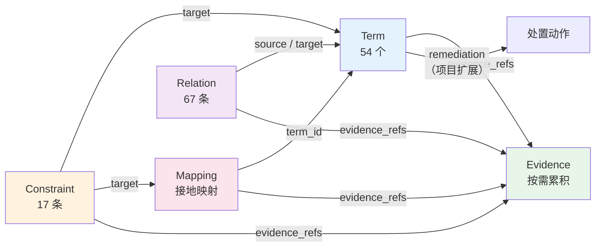

**所有引用必须是可解析的，这是版本生效的硬性前提。** 校验规则（【本项已实证】，实现于 `vendor/EvoOntology/evoontology/validate.py`）：

| 校验项 | 规则 |
|---|---|
| 版本目录存在 | `versions/<version>/` 必须是目录 |
| 五个文件齐全 | `terms.json` / `mappings.json` / `relations.json` / `constraints.json` / `evidence.json` 必须存在且为合法 JSON 数组 |
| 每项必须有 id | 记录必须是对象且有非空 `id` |
| id 不得重复 | 同一文件内 id 唯一 |
| Relation 端点可解析 | `source` 与 `target` 必须在 `terms.json` 中 |
| Mapping 术语可解析 | `term_id` 必须在 `terms.json` 中 |
| Constraint 目标可解析 | `target` 必须在 `terms.json` 或 `mappings.json` 中 |
| Evidence 引用可解析 | 所有 `evidence` / `evidence_refs` 必须在 `evidence.json` 中 |
| 运行时必须能加载 | `SemanticStore.load_version()` 必须成功 |

**校验失败即候选版本不合法，`accept()` 会直接抛出 `EvolutionError`。**

### 4.4 id 命名约定（本项目实证）

命名约定不是洁癖，它是**在没有显式类型系统的情况下，让智能体和代码能快速判断一个 id 是什么**的低成本手段。本项目实际使用的 14 个前缀：

| 前缀 | 含义 | 数量（ontology_v5） | 在推理中的角色 |
|---|---|---|---|
| `app:` | 应用 / 应用集群 / 副本 | 5 | component |
| `fn:` | 业务功能 | 1 | component |
| `api:` | 接口 | 1 | component |
| `env:` | 运行环境（容器/宿主机/集群/网关） | 5 | component |
| `db:` | 数据库 / 主库 / 副本 / 集群 | 4 | component |
| `ds:` | 数据源（连接池） | 1 | component |
| `table:` | 数据表 | 3 | component |
| `idx:` | 索引 | 2 | component |
| `metric:` | 指标 | 11 | observation |
| `alert:` | 告警 | 1 | observation |
| `incident:` | 故障事件 | 1 | observation |
| `evt:` | 运维事件（发布/扩缩容） | 1 | observation |
| `rc:` | **根因** | 15 | root_cause |
| `con:` | 约束 | 17 | rule |
| `rel:` | 关系 | 67 | — |

**角色（role）的推导规则（【本项已实证】）**：本体显式声明优先；未声明时按 id 前缀推导：

```
rc:      → root_cause    （权重 1.15）
metric:  → observation   （权重 0.85）
alert:   → observation   （权重 0.85）
incident:→ observation   （权重 0.85）
evt:     → observation   （权重 0.85）
con:     → rule          （权重 0.80）
其他      → component     （权重 1.00）
```

**为什么需要角色权重？** 因为它解决了一个真实的排序错误。

> 【本项已实证】没有角色权重时，`metric:db-tmp-disk`（观测指标）会压过 `rc:tmp-disk`（根因），`db:mysql-replica`（组件）会压过 `rc:replica-lag`（根因）。这类错误在演示中看起来"差不多"，但对运维人员是致命的——他拿到的是"磁盘临时表速率高"，而不是"根因是排序内存不足，处置方式是调大 tmp_table_size"。

**关于生命周期的可见性规则（重要）**：`lifecycle.state` 只有在 `validated` 或 `active` 两种取值下，记录才对 `browse_semantics` / `resolve_semantics` **可见**。任何其他取值都会让该记录从智能体视野中消失。这提供了一种"软删除"机制：废弃一个术语时不必物理删除（否则会破坏历史版本的引用完整性），只需把状态改为 `deprecated`，它就不再参与推理，但历史审计仍然可查。

---

## 第 5 章 建模方法：从【故障场景】倒推【要建什么】

### 5.1 建模的起点不是"清点资产"，而是"列举故障"

这是本方法论与很多本体项目最重要的分歧点。

**传统做法**：先盘点环境里有什么（应用清单、数据库清单、服务器清单），把它们逐个建成实体，然后再想"这些实体之间有什么关系"。结果是：模型很大、很全、但不可用——因为**它不知道自己要回答什么问题**。

**本方法论的做法**：先列出**必须能诊断的故障场景**，然后对每个场景问"要诊断它，我需要哪些语义？"，再把这些语义去重、归纳成术语与关系。

> 【本项已实证】本项目的做法：`tools/chaos/catalog.py` 定义了 **21 个故障场景**，每个场景是一个 `(inject, recover)` 成对实现。这 21 个场景就是**建模需求的来源**。场景编号约定：
> - `app_*` —— 应用层（副本、网关、容器资源、网络）
> - `db_*` —— 数据库层（锁、慢查询、连接、复制、主从角色、磁盘临时表）
> - `res_*` —— 跨层资源耗尽（需叠加压测才成灾）

### 5.2 场景驱动建模的四步法

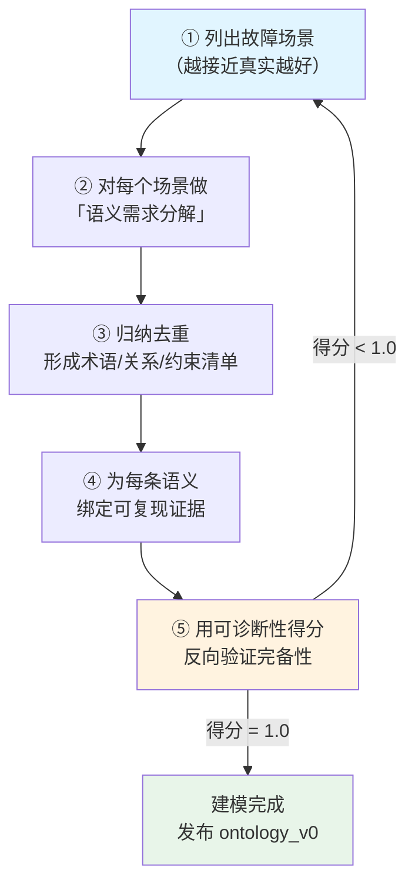

#### 步骤 ①：列出故障场景

场景的来源有三个，优先级从高到低：

1. **历史故障**（最有价值）：近 12 个月的生产事件工单、故障复盘报告、值班记录；
2. **演练目录**：行内已有的混沌工程/灾备演练场景；
3. **经验推演**：运维专家基于架构图推断的"应该会发生什么"。

**每个场景必须写成可注入、可回滚、可验证的形式**，而不是一句描述。

> 【本项已实证】本项目的场景定义结构：
> ```
> Fault(
>   id="db_replica_lag", layer="database", category="依赖",
>   ... inject(...) -> {"ok": bool, "recover_hint": {...}, "detail": {...}}
>       recover(...) -> 必须幂等，只依赖 (targets, params, recover_hint)
> )
> ```
> 关键设计：`recover` 必须**幂等**且**只依赖持久化状态**（`.chaos/fault_state.json`），这样即使注入进程被杀，也能靠状态文件复原。**这一条在生产演练中是硬要求**——没有人愿意因为演练脚本挂了而留下一堆未回滚的故障。

【本项已实证】本项目 21 个场景清单：

| 编号 | 场景 | 层 | 类别 |
|---|---|---|---|
| `app_kill_replica` | 强杀应用副本 | application | 资源 |
| `app_pause_replica` | 挂起应用副本（假死） | application | 资源 |
| `app_stop_replica` | 停止应用副本 | application | 资源 |
| `app_cpu_stress` | 应用 CPU 压力 | runtime | 资源 |
| `app_memory_stress` | 应用内存压力 | runtime | 资源 |
| `app_oom_kill` | 容器内存超限被 OOM Kill | runtime | 资源 |
| `app_network_delay` | 网络延迟注入 | application | 依赖 |
| `app_network_loss` | 网络丢包注入 | application | 依赖 |
| `app_gateway_stop` | 网关停止 | application | 依赖 |
| `db_row_lock_hold` | InnoDB 行锁长事务持有 | database | 数据 |
| `db_slow_query_flood` | 慢查询洪泛 | database | 数据 |
| `db_conn_saturation` | 连接数饱和 | database | 配置 |
| `db_cpu_stress` | 数据库 CPU 压力 | database | 资源 |
| `db_disk_temp_tables` | 磁盘临时表激增 | database | 配置 |
| `db_primary_readonly` | 主库被置为只读（配置漂移） | database | 配置 |
| `db_replica_lag` | 主从复制延迟 | database | 依赖 |
| `db_replica_io_stop` | 复制 IO 线程停止 | database | 依赖 |
| `db_replica_kill` | 只读副本被强杀 | database | 资源 |
| `res_cluster_cpu` | 集群整体 CPU 不足 | resource | 资源 |
| `res_cluster_memory` | 集群整体内存不足 | resource | 资源 |
| `res_db_memory` | 数据库内存不足 | resource | 资源 |

#### 步骤 ②：语义需求分解——对每个场景问五个问题

这是建模的核心工序。对每一个故障场景，逐一回答：

| # | 问题 | 产出的记录族 |
|---|---|---|
| **Q1** | **根因是什么？** 用一个概念命名它 | `Term`（role=root_cause，`rc:` 前缀） |
| **Q2** | **它落在哪个组件上？** | `Relation`（`connection_condition` = `attributedTo:`） |
| **Q3** | **它怎么传播到用户可见的症状？** 逐跳列出路径 | `Relation`（拓扑语义，如 `accesses` / `dependsOn`） |
| **Q4** | **凭什么观测到它？** 哪条指标/日志/命令输出能证明 | `Term`（metric）+ `Relation`（`evidencedBy:`）+ `Evidence` |
| **Q5** | **判定阈值/判据是什么？告警文本大概长什么样？** | `Constraint`（含 `trigger_keywords`）+ `remediation` |

**以 `db_replica_lag`（主从复制延迟）为例，走一遍分解：**

| 问题 | 答案 | 落成记录 |
|---|---|---|
| Q1 根因 | 主从复制延迟：副本回放落后主库 | `Term` `rc:replica-lag`："副本回放落后（SOURCE_DELAY 或回放能力不足），IO/SQL 线程都 Running，但读到的数据是旧的" |
| Q2 归因组件 | MySQL 只读副本节点 | `Relation` `rc:replica-lag` --attributedTo--> `db:mysql-replica` |
| Q3 传播路径 | 副本滞后 → 读路径返回陈旧数据 → 应用读到过期余额 → 业务投诉/对账差异 | `Relation` `db:mysql-cluster` --contains--> `db:mysql-replica`；`app:payment-app` --accesses--> `db:mysql-cluster` |
| Q4 观测 | `mysql_slave_status_seconds_behind_master`（阈值 5s） | `Term` `metric:replica-lag`；`Relation` `rc:replica-lag` --evidencedBy--> `metric:replica-lag` |
| Q5 判据 | `Seconds_Behind_Master > 5s` 判定复制延迟 | `Constraint` `con:replica-lag`（severity=block，`trigger_keywords` = 复制延迟/replica lag/replication lag/lag/主从/陈旧） |

**这个分解过程必须留痕**，因为它既是本体设计的依据，也是未来评审的凭证。本项目把分解结果写进 `Term.definition` / `Term.scoring_rationale` / `Relation.description`，使得**推理结论本身就是分解过程的复述**。

#### 步骤 ③：归纳去重

不同场景会提出重复的语义需求。需要做三件事：

1. **同实体归一**：例如 `db_replica_lag` 与 `db_replica_io_stop` 都涉及"副本"，应归到同一个 `db:mysql-replica` 术语，而不是各建一个。
2. **同义关系归一**：如果两个场景都需要"应用访问数据库"这条边，只建一条 `association`。
3. **抽象层次选择**：这是最容易做错的一步。

**关于抽象层次的判据**：一个概念应该建到"能被独立观测或独立判定"的粒度上。

| 反例（过度抽象） | 反例（过度具体） | 正解 |
|---|---|---|
| 只建「MySQL 集群」一个术语 | 为每一个副本实例都建一个术语并写死 container_id | 建「MySQL 只读副本节点」**类型** + 用 `Mapping` 把实例标识接地到监控标签 |

本项目遵循的正是后者：`db:mysql-replica` 是一个**类型级**术语（`cc-mysql-replica-1/2` 是它的实例），实例区分通过监控标签 `db_node` / `instance` 完成。**这使得本体不会随副本数扩缩容而膨胀。**

#### 步骤 ④：为每条语义绑定可复现证据

证据是"可信"的唯一来源。绑定的具体要求：

- 每条 `Term`、`Relation`、`Constraint` 都要有 `evidence_refs`；
- 每条 `Evidence` 的 `query` 必须是**可以照抄执行**的原文（不是"查了一下数据库"，而是 `SELECT @@version, @@max_connections, @@wait_timeout`）；
- `validation_method` 明确说明用了什么手段（只读 CLI、只读 SQL、HTTP 探针、WMI）。

> 【本项已实证】本项目 `ontology_v0` 构建时绑定了 7 条 Evidence，覆盖：容器状态（`docker ps`）、应用拓扑端点（`GET /topology/raw`）、MySQL 变量（`SELECT @@...`）、表清单（`information_schema.tables`）、索引清单（`information_schema.statistics`）、宿主机事实（WMI）、数据库探针（应用侧 JDBC）。

#### 步骤 ⑤：反向验证完备性

用第 7 章的可诊断性得分对每个场景打分。**得分低于 1.0 的场景，必须回到步骤 ② 重新分解。**

### 5.3 建模的三个常见陷阱

**陷阱一：把本体建成"资产清单"。**

资产清单回答"有什么"，本体回答"为什么/凭什么/怎么办"。如果一个术语的 `definition` 字段只有"这是 XXX 服务器"，而没有任何机制性描述，那它就是一个资产清单条目，对推理没有价值。

**自检问题**：把这个术语的 `definition` 删掉，智能体还能解释根因吗？如果答案是"能"，说明这个 `definition` 没写机制；如果答案是"不能"，说明它写对了。

**陷阱二：为每一个实例建术语。**

如前所述，这会导致本体规模爆炸。**原则：类型建术语，实例靠标签接地。**

**陷阱三：约束（Constraint）写得太多或太少。**

| 情况 | 后果 |
|---|---|
| Constraint 太少 | 告警文本无法接线到根因类别，只能走 LLM 兜底，成本高、不稳定 |
| Constraint 太多且互相矛盾 | 多个约束同时命中，`favoured_categories` 变成全集，类别对齐信号失效 |

**经验判据**：一个约束对应一类**可被单一 PromQL/SQL 表达式判定**的故障条件。本项目 21 个故障场景对应 29 条约束（`ontology_v5`），比例约 1 : 1.4——**约束数略多于场景数**，因为同一类故障在不同层/不同角色上需要不同的判据。

---

## 第 6 章 基于 EvoOntology 的建模实操

### 6.1 工作区初始化

EvoOntology 的工作区是项目根目录下的 `.evoontology/`。初始化极其简单：

```bash
# 在项目根目录创建 .evoontology/
python -m evoontology.workspace   # 或由任何 MCP 操作首次调用 ensure_workspace()
```

**必须知道的一个事实**：`ensure_workspace()` **只**创建三个目录——`versions/`、`trajectories/`、`evolution/`。其余目录全部按需惰性创建：

| 目录/文件 | 何时被创建 |
|---|---|
| `versions/` | 初始化时 **立即** |
| `trajectories/` | 初始化时 **立即** |
| `evolution/` | 初始化时 **立即** |
| `project.json` | Build 第 0 步（`configure_ontology_project`） |
| `active.json` | 首次 `set_active_version` |
| `state.json` | 首次演化检查点初始化（`EvolutionTrigger.initialize()`） |
| `workload/questions.json` | 首次 `prepare_ontology_workload` |
| `tasks/` | 首次 `start_ontology_task` |
| `reports/` | 首次 `annotate_ontology_version` |
| `visualizations/` | 首次 `visualize_ontology` |

**推论**：如果你的工作区里没有 `project.json`，说明还没走过 Build 第 0 步，此时**不应该**开始写术语——因为你还没声明"这个本体要服务于什么工作负载、边界在哪里"。

### 6.2 第 0 步：声明项目上下文（`project.json`）

这是最容易被跳过、但影响最大的一步。`project.json` 的完整结构：

```json
{
  "schema_version": 1,
  "mode": "rolling_trajectory",
  "data_source": {
    "type": "docker-compose-cluster",
    "endpoint": "http://localhost:8080 (cc-app-gateway, least_conn → payment-app ×3) ...",
    "description": "信用卡系统运维模拟环境（集群版）：应用层 3 副本 + Nginx 网关负载均衡；..."
  },
  "workload_source": {
    "type": "rca-scenarios",
    "description": "集群化信用卡运维根因分析场景：副本故障、网关故障、资源耗尽、连接耗尽、锁与慢查询、复制延迟/中断、配置漂移",
    "seed_questions": [
      "支付交易超时，沿拓扑上溯定位根因",
      "MySQL P99 突增，是慢 SQL 还是连接耗尽？",
      "某容器 OOM 重启，哪些业务受影响？",
      "应用集群里只有一台副本变慢，是 CPU 节流还是网络问题？",
      "副本全健康但外部请求打不进来，问题在网关还是应用？",
      "只读副本数据陈旧，是复制延迟还是复制中断？",
      "健康检查全绿但交易全部失败，主库是不是被置为只读了？",
      "数据库排序落盘、磁盘临时表激增，是内存配置不足吗？"
    ]
  },
  "evaluation": {
    "type": "paired_ground_truth",
    "description": "Rolling 模式累积任务轨迹作为演化证据；演化闸门用同一批故障场景在父版本/候选版本上成对计算本体可诊断性得分（术语存在 + 传播路径建模 + 可观测性），由 EvaluationGate.decide_gt 判定是否接受"
  },
  "boundary": {
    "type": "rolling",
    "construction_scope": "rca-agent/docker-compose.yml（集群拓扑）+ demo/app（多副本应用与 cgroup 指标）+ ...",
    "notes": "RCA 场景不划分 held-out，轨迹持续累积"
  },
  "evolution": {
    "max_rounds": 3,
    "min_rejects_before_incomplete": 2
  }
}
```

【本项已实证】以上为本项目 `.evoontology/project.json` 的真实内容。

**四个关键决策点：**

#### 决策 1：选择评估模式（`mode`）

| 模式 | 适用 | 本项目选择 |
|---|---|---|
| `fixed_split` | 有固定问题集与 Ground Truth 的 benchmark。**自动历史发现与问题生成被禁用**；导入的问题必须在 `boundary.construction_question_ids` 中显式登记，否则报错 `"Question is outside the registered construction boundary"` | — |
| `rolling_trajectory` | **没有固定测试集的生产 workload 或冷启动项目**。持续累积新轨迹，再用独立抽样任务或 LLM Judge 门控 | ✅ |

> **【生产扩展设计】银行生产环境应当选 `rolling_trajectory`。** 理由：银行故障无法预先设计成固定测试集；生产环境的真实价值恰恰在于"每天都在产生新的故障样本"。固定测试集模式适用于一次性 POC 验证。

#### 决策 2：定义 `data_source`（数据源边界）

`data_source` 是**本体接地的事实来源**。它的精度决定了本体的可信度。

```json
"data_source": {
  "type": "docker-compose-cluster",
  "endpoint": "http://localhost:8080 (...) + mysql:3306 (...) + http://localhost:9090 (Prometheus)",
  "description": "..."
}
```

【生产扩展设计】银行环境的 `data_source` 应当是一个结构化的**信号源清单**：

```json
"data_source": {
  "type": "hybrid-enterprise",
  "sources": [
    {"kind": "metrics",     "system": "Prometheus/VictoriaMetrics", "endpoint": "...", "scope": "全部容器与中间件"},
    {"kind": "metrics",     "system": "Zabbix",                     "endpoint": "...", "scope": "物理服务器/交换机/存储"},
    {"kind": "cmdb",        "system": "行内 CMDB",                   "endpoint": "...", "scope": "配置项与关系"},
    {"kind": "apm",         "system": "APM/链路追踪",                "endpoint": "...", "scope": "服务调用链"},
    {"kind": "logs",        "system": "ELK",                        "endpoint": "...", "scope": "应用与系统日志"},
    {"kind": "orchestration","system": "Kubernetes API",            "endpoint": "...", "scope": "工作负载与副本"},
    {"kind": "change",      "system": "变更管理平台",                "endpoint": "...", "scope": "发布/扩缩容/配置变更事件"}
  ]
}
```

#### 决策 3：定义 `workload_source`（工作负载 = 必须能回答的问题）

`seed_questions` 不是装饰性的说明文字，它是**建模工作的验收清单**。本项目列了 8 个种子问题，每个都对应一类必须在生产上能被诊断的故障形态。

**自检**：如果把你列的种子问题拿去问本体，本体答不出来，说明建模不完备。

#### 决策 4：定义 `boundary`（边界）

`boundary` 声明"这次建模的范围到哪里为止"。它的两个作用：

1. **防止范围蔓延**：明确什么不在范围内，避免本体变成一个"什么都想建"的无底洞；
2. **保证评估隔离**：在 `fixed_split` 模式下，`boundary.construction_question_ids` 是强制校验项，防止把验证集的问题混进构建集。

> 【本项已实证】EvoOntology 的数据边界规范要求：Validation Reserve **不得**用于诊断、归因、候选设计或候选修订。本项目在 `rolling` 模式下不划分 held-out（轨迹持续累积），并在 `boundary.notes` 中显式声明了这一选择——**这是有意为之的取舍，必须留痕**。

> **【生产扩展设计】银行环境必须划分验证保留集。** 建议：按时间顺序取 70% 作为演化池（Evolution Pool），最近 30% 作为验证保留（Validation Reserve）。**验证集一旦划定，任何人不得用于候选设计。** 这是让"演化"这件事可信的最后一道防线。

### 6.3 五族记录的实际编写

#### 6.3.1 编写 Term

**模板：**

```json
{
  "id": "<前缀>:<短横线命名>",
  "name": "<人类可读名称>",
  "type": "entity | metric | concept | dimension | category",
  "definition": "<机制定义 —— 必须回答「它的故障机理是什么」>",
  "scope": "<应用层 | 运行环境层 | 数据库层 | 中间件层 | 网络层 | 存储层 | RCA 支撑>",
  "aliases": ["<别名1>", "<别名2>"],
  "evidence_refs": ["<evidence-id>"],
  "role": "root_cause | component | observation | rule",
  "lifecycle": { "state": "active" },
  "scoring_keywords": ["<判别性关键词>"],
  "negative_keywords": ["<什么情况下不是我>"],
  "scoring_rationale": "<判别理由>",
  "remediation": [
    { "urgency": "P0", "action": "<具体操作>", "command": "<ASCII 可执行命令>", "needs_approval": true }
  ]
}
```

**逐字段的编写要求（这些要求来自实测踩坑）：**

| 字段 | 编写要求 | 反面例子 |
|---|---|---|
| `definition` | 必须写**机制**：什么条件下发生、通过什么链条影响业务。禁止只写"这是 XXX" | ❌「这是 MySQL 只读副本」 ✅「副本回放落后主库，IO/SQL 线程都 Running，但读到的数据是旧的」 |
| `aliases` | 只放**同义**名称，不放近似概念 | ❌ 给 `rc:replica-lag` 加别名「复制中断」（那是另一个根因） |
| `role` | 根因必须是 `root_cause`，指标/告警/事件是 `observation`，约束是 `rule`，其余 `component` | ❌ 把 `metric:` 术语标成 `root_cause` |
| `scoring_keywords` | 放**真实告警文本里会出现的措辞**，不是学名 | ✅「复制延迟」「主从」「陈旧」「lag」 |
| `negative_keywords` | 放**容易混淆的兄弟根因的关键词** | `rc:replica-lag` 的 negative 可含「中断」「io thread」 |
| `remediation.command` | 必须是**真实可执行**的 ASCII 命令；引用的指标名必须真实存在 | ❌「按 app_instance 对比 P99」 ❌ `rate(cc_container_cpu_cfs_throttled_periods_total[5m])`（指标不存在） |

> 【本项已实证】`negative_keywords` 的引入解决了一个真实的消歧难题。原文档说明：「`negative_keywords` 是本体对'什么情况下**不是**我'的显式声明（ontology_v2 引入），命中即扣分 —— 这样'副本丢失 vs 副本假死 vs 副本 OOM'这种同实体多故障模式才能被关键词打分区分开，而**不需要在代码里写特例**。」

#### 6.3.2 编写 Relation

**模板：**

```json
{
  "id": "rel:<语义描述>",
  "source": "<term-id>",
  "relation_type": "composition | association | equivalence | derivation | hierarchy",
  "target": "<term-id>",
  "connection_condition": "<语义前缀>: <人类可读的连接条件>",
  "description": "<可读描述 —— 会进入结论文本>",
  "evidence_refs": ["<evidence-id>"]
}
```

**必须遵守的两条约定：**

1. **`relation_type` 只能用五个受控值之一**（尽管框架不校验，但生产环境必须自建校验）；
2. **`connection_condition` 必须带语义前缀**，因为代码依赖前缀做语义分类：

| 前缀 | 何时使用 | 代码依赖 |
|---|---|---|
| `attributedTo:` | 表达"这个根因落在哪个组件上" | `OntologyScoring.explain()` 据此填充 `affected` 字段；`_promote_component_to_root_cause()` 据此做结论升级 |
| `evidencedBy:` | 表达"哪条指标/证据印证它" | `explain()` 据此填充 `evidenced_by` 字段；升级时用于证据强度排序 |
| 其他语义前缀 | 拓扑关系 | 用于拓扑遍历与路径追踪 |

**反向关系要不要建？** 【本项已实证】本项目的做法是**建**。例如既建了 `rel:container-deployed-on-host`（`env:container` → `env:host-wsl`），也建了 `rel:host-wsl-hosts-container`（`env:host-wsl` → `env:container`）。

理由：拓扑 BFS 遍历时，如果只依赖正向边，就必须在遍历逻辑里做"反向探索"；而显式建反向边让遍历逻辑保持简单、且**每条边都能被独立解释**。代价是关系数量增加（本项目 82 条关系中包含这类成对边，例如 `rel:container-deployed-on-host` 与 `rel:host-wsl-hosts-container`），但这在语义清晰度上是值得的——**尤其是当反向关系有独立的业务含义时**（"宿主机承载容器"与"容器部署于宿主机"在故障传播方向上是不同的）。

#### 6.3.3 编写 Constraint

**模板：**

```json
{
  "id": "con:<短横线命名>",
  "target": "<被约束的 term-id 或 mapping-id>",
  "constraint_type": "threshold | capacity | business_rule | data_quality | enum_semantics | unit | scope",
  "trigger_keywords": ["<告警文本中会出现的词>"],
  "severity": "block | warn | info",
  "scope": "<约束作用域的 term-id>",
  "confidence": "high | medium | low",
  "description": "<判据说明 —— 会进入结论文本>",
  "evidence_refs": ["<evidence-id>"]
}
```

**编写要点：**

| 要点 | 说明 |
|---|---|
| `trigger_keywords` 是**告警词，不是监控词** | 写运维人员在告警里会看到的话（「连接池」「耗尽」「max_connections」），不是指标名 |
| `constraint_type` 决定根因类别 | `capacity→资源`、`threshold→数据`、`business_rule→依赖`、`data_quality→数据`、`enum_semantics/unit/scope→配置`。**选错类型 = 根因分错类** |
| `severity` 影响类别仲裁 | 多条约束指向同一术语时，按 `block > warn > info` 取最强决定类别 |
| `description` 要写清**判据数值与角色差异** | 见下方"角色相关判据"的实例 |

> **【本项已实证】一个真实的约束编写教训：「判据必须写清是哪个角色」。**
>
> `con:db-availability` 最初的 `description` 是一句与角色无关的「MySQL 数据库不可用 down」。后果是：在"只读副本挂了"这类故障里，告警文本中最扎眼的词是"不可用/down"，确定性引擎因此把根因判成了 `rc:gateway-down`（实测 `db_replica_kill` 场景判成了 gateway-down）。
>
> 修复方式是把节点名与角色**带进文本**：
> ```
> "mysql_up=0（instance={{ $labels.instance }}, db_role={{ $labels.db_role }}）。
>  主库不可用 → 写路径全部失败、复制中断；
>  只读副本不可用 → 写路径正常，仅读容量下降"
> ```
> 这条经验可以推广为一条约束编写规范：**告警注解中的判据必须包含区分不同故障路径的关键标签（角色、层、节点类型），否则智能体会被"通用词"误导。**

#### 6.3.4 编写 Evidence

**模板：**

```json
{
  "id": "ev-<短横线命名>",
  "source": "<来源系统标识>",
  "query": "<可照抄执行的原话：命令 / SQL / HTTP 请求 / PromQL>",
  "result": "<真实返回结果>",
  "validation_method": "<验证手段>",
  "timestamp": "<ISO8601 UTC>"
}
```

**编写要点**：`query` 字段是证据可信度的全部来源。它必须是**别的工程师能照着跑一遍并得到等价结果**的原文。

> 【本项已实证】本项目的 Evidence 示例：
> ```json
> {
>   "id": "ev-mysql-indexes",
>   "source": "mysql:information_schema.statistics",
>   "query": "SELECT INDEX_NAME, SEQ_IN_INDEX, COLUMN_NAME, NON_UNIQUE, CARDINALITY FROM information_schema.statistics WHERE TABLE_SCHEMA='creditcard' AND TABLE_NAME='t_txn'",
>   "result": "idx_txn_created(created_at), idx_txn_customer(customer_id), PRIMARY(txn_id) —— 用于判断慢查询是否命中索引（配合 EXPLAIN type=ALL / Using filesort）",
>   "validation_method": "MySQL information_schema.statistics 只读查询",
>   "timestamp": "2026-10-02T..."
> }
> ```
> 注意 `result` 不仅记录了"有什么索引"，还记录了"这条证据用来判断什么"——这让证据在脱离上下文后仍然可理解。

### 6.4 从既有资产导入本体

大多数情况下，你不是从零开始——你已经有了 OWL/TTL 本体、CMDB 导出、架构图。本项目提供了一条完整的导入路径。

**【本项已实证】TTL 概念 → EvoOntology 记录族的映射规则**（实现于 `tools/init_evo_ontology.py`）：

| TTL 侧 | EvoOntology 记录族 | 映射说明 |
|---|---|---|
| TTL 类/个体（`Application` / `Container` / `HostMachine` / `Database` / …） | `Term` | 每个类/个体成为一个术语 |
| TTL 数据属性落地到具体数据源（`docker inspect` / MySQL 元数据） | `Mapping` | "属性怎么取到"即接地映射 |
| TTL 对象属性（`runsOn` / `deployedOn` / `accesses` / `containsTable` / …） | `Relation` | 映射为 5 种受控 `relation_type`：<br>`runsOn` / `deployedOn` → **composition**<br>`accesses` / `hasDataSource` → **association**<br>同义实体（`HostWsl` / `HostPhys` 同指）→ **equivalence**<br>可推导实体（应用→宿主机 传递路径）→ **derivation** |
| RCA 业务规则（连接池耗尽 / 慢 SQL 判定） | `Constraint` | 业务规则即约束 |
| 可复现观测（`docker inspect` 输出 / MySQL 变量查询结果） | `Evidence` | 观测即证据 |

**完整流程**：

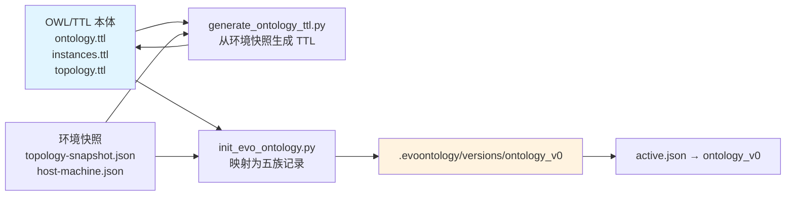

**⚠️ 一个必须注意的安全设计**：`init_evo_ontology.py` 是"**首次构建**"工具——它会把 `ontology_v0` 重新写一遍并把 `active.json` 指回 `ontology_v0`。如果本体已经演化过（例如当前激活 `ontology_v5`），直接运行会**回退激活版本**。

因此脚本内置了防护——检测到已演化的情况时要求显式 `--force`。

**这条经验值得推广为一条工程规范：任何"重建初始版本"的脚本都必须有防回退保护。** 在生产环境，一次误操作把激活版本回退到 v0，会让智能体一夜之间失去全部新知识。

### 6.5 本体工作区全景

【本项已实证】本项目 `.evoontology/` 工作区的完整结构：

```
.evoontology/
├── active.json                        # {"active_version": "ontology_v5"}
├── project.json                       # 项目上下文（模式/数据源/工作负载/评估/边界）
├── state.json                         # 演化检查点（checkpoint_trajectory / checkpoint_time / thresholds）
│
├── versions/                          # 所有版本（已发布 + 候选）
│   ├── ontology_v0/                   # 首次构建（单容器单库视角）
│   ├── ontology_v0-rca/               # 候选
│   ├── ontology_v0-rca-agent/         # RCA Agent 注入证据后的版本
│   ├── ontology_v1-cluster/           # 候选：集群化知识补齐
│   ├── ontology_v1/                   # 已发布
│   ├── ontology_v2-scoring/           # 候选：打分消歧字段扩展
│   ├── ontology_v2/                   # 已发布
│   ├── ontology_v3-hygiene/           # 候选：卫生清理
│   ├── ontology_v3/                   # 已发布
│   ├── ontology_v4-remediation/       # 候选：处置动作入库
│   ├── ontology_v4/                   # 已发布
│   ├── ontology_v5-command-targets/   # 候选：命令可执行性修正
│   └── ontology_v5/                   # ✅ 当前激活
│       ├── terms.json                 # 54 个 Term
│       ├── mappings.json              # 接地映射
│       ├── relations.json             # 82 条 Relation
│       ├── constraints.json           # 29 条 Constraint
│       └── evidence.json              # 证据
│
├── evolution/                         # 演化运行记录
│   ├── run_1/
│   │   ├── run.json                   # 运行元数据（含 gate 结果）
│   │   ├── trajectory-sources.json    # 用户确认的轨迹来源
│   │   ├── rounds.jsonl               # 每轮被拒记录
│   │   └── evaluations/               # 成对评估摘要
│   │       ├── round1_parent_ontology_v0-rca-agent.json
│   │       └── round1_candidate_ontology_v1-cluster.json
│   └── run_2/
│       ├── run.json
│       ├── trajectory-sources.json
│       └── evaluations/
│           ├── round1_parent_ontology_v1.json
│           └── round1_candidate_ontology_v1-cluster.json
│
├── trajectories/                      # 任务轨迹（智能体执行记录）
│   └── task_<32位hex>.json            # 每个已完成任务一个文件
├── tasks/                             # 任务记录
│   └── task_<32位hex>.json
├── reports/                           # 版本注解报告
│   ├── ontology_v1-cluster.json
│   └── ontology_v1.json
└── visualizations/
    ├── ontology-layer-explorer.html    # 离线可视化（含全部版本 + Schema 视图 + Tool 视图 + 经验报告）
    └── preview-server.json            # 本地预览服务状态（如启用）
```

**三个容易误解的点：**

1. **没有 `checkpoints/` 目录**。"检查点"是 `state.json` 里的两个字段 `checkpoint_trajectory` 与 `checkpoint_time`。
2. **候选版本也是正式目录**。`ontology_v1-cluster` 与 `ontology_v1` 并存，目录名不同，互不覆盖。这是"候选不污染已发布版本"的物理保证。
3. **`tasks/` 与 `trajectories/` 内容基本相同**。任务完成后，同一个对象会被写入 `trajectories/`。区别在于 `tasks/` 是任务生命周期的工作副本（含 `running` 状态的任务），`trajectories/` 是已完成任务的轨迹存档。

---

## 第 7 章 建模度量：本体可诊断性得分

### 7.1 为什么需要一个"本体的分数"

建模最大的风险不是"建错了"，而是**建完了不知道够不够用**。团队本能的反应是看"建了多少条记录"——但记录数量与诊断能力毫无关系。一个 1000 条术语、但没有任何观测连接的本体，对故障诊断的价值是零。

**我们需要一个能直接回答"这个本体能不能诊断这个故障"的分数。**

### 7.2 可诊断性得分的定义

【本项已实证】实现于 `tools/evolve_ontology_cluster.py` 的 `diagnosability()` 函数。对**每一个故障场景**，计算三项条件的满足比例：

```
可诊断性得分(场景) = ( ① term_defined + ② path_modelled + ③ observable ) / 3
```

三项条件**等权**，每项取值 0 或 1，全部可在给定版本的 5 族记录上**确定性复算**：

| 条件 | 名称 | 判据 | 它回答了什么问题 |
|---|---|---|---|
| **①** | `term_defined` | 期望的根因 Term 在该版本中存在 | **知识有没有？** 本体是否知道这个故障模式 |
| **②** | `path_modelled` | 该 Term 与**用户可见入口**在关系图中连通（≤4 跳） | **传播路径建模了没有？** 故障怎么走到症状 |
| **③** | `observable` | 该 Term 满足以下任一：本身是 `metric` / 直连一个 `metric` / 是某条 `Constraint` 的 `target` | **凭什么确认它？** 有没有观测判据 |

**用户可见入口（ENTRY_TERMS）** 的定义是本项目的一个关键设计决策：

```python
ENTRY_TERMS = {"app:payment-app", "app:payment-app-cluster"}
```

即"用户能直接感知到症状的那个实体"。**②的定义是"根因能否在 4 跳内到达入口"，这直接编码了"故障如何传播到症状被建模了"这一要求。**

**多术语场景的取值规则**：如果一个场景期望多个根因术语（`expected_terms` 是数组），场景得分取**各项的最高分**（`best = max(best, score)`）——即"只要有一条路径能解释它，这个场景就算可诊断"。

### 7.3 得分的解释

得分区间为 `{0, 1/3, 2/3, 1}`。每一档的含义非常明确：

| 得分 | 含义 | 后果 |
|---|---|---|
| **0** | 本体完全不知道这个故障 | 智能体只能靠 LLM 从零猜，幻觉风险最高 |
| **1/3** | 知道这个根因概念，但**不知道它怎么传播**，或**不知道凭什么观测** | 智能体能说出根因名字，但无法给出证据链 |
| **2/3** | 三项中满足两项 | 通常是有概念、有路径，但缺少观测连接 → 结论不可验证 |
| **1** | 三项全满足 | 智能体可给出：根因 + 传播路径 + 观测证据 |

> **【本项已实证】这就是本项目最有力的一个数字。**
>
> 在集群化改造之前，本体停留在"单容器 + 单库"视角。用 21 个集群故障场景评估：
>
> | 指标 | 改造前（`ontology_v0-rca-agent`） | 改造后（`ontology_v1-cluster`） |
> |---|---|---|
> | **可诊断性均分** | **0.0476**（= 1/21） | **1.0000**（= 21/21） |
> | 满分场景数 | 1 | 21 |
> | 零分场景数 | 20 | 0 |
> | 门控 delta | — | **+0.9524** |
>
> 门控判定：`accept = true`（候选均分 1.0 > 父版本均分 0.0476），评估协议 `ground_truth`。

### 7.4 【生产扩展设计】生产环境的可诊断性度量体系

`0/1` 二值的三项判据适合作为**建模完备性的门控**，但生产环境需要更细的度量。建议扩展为一个**四层度量体系**：

| 层 | 度量 | 定义 | 目标 |
|---|---|---|---|
| **L1 完备性** | 场景可诊断率 | 可诊断性得分为 1 的场景比例 | ≥ 95% |
| **L2 准确性** | 根因 Top-1 命中率 | 确定性引擎 top1 精确命中期望根因的比例 | ≥ 70%（快路径） |
| | 根因 Top-5 命中率 | 期望根因出现在前 5 候选中的比例 | ≥ 95% |
| **L3 可信性** | 证据覆盖率 | 结论中有 A 级证据支撑的比例 | 100% |
| | 路径可解释率 | 结论能给出完整传播路径的比例 | ≥ 90% |
| **L4 时效性** | 本体新鲜度 | 语义对象最后验证时间距今天数 | ≤ 30 天（核心路径） |
| | 漂移检出率 | 拓扑/配置变更被本体捕获的比例 | ≥ 98% |

> 【本项已实证】L2 的实现已经存在：`tools/evolve_ontology_cluster.py` 的 `evaluate_engine()` 就是"确定性快路径的 top1 是否精确命中场景期望根因 Term"的度量，指标名 `engine_top1_precision`。**关键实现细节**：它刻意在**离线**复算（本地构建拓扑 + 内存打分索引），不依赖运行中的后端；用 `OntologyScoring.from_records()` 直接吃候选记录，因此**候选版本尚未落盘也能评分**——不需要为了评分把候选临时写进工作区再删掉。

### 7.5 一个重要的经验：度量口径本身也要迭代

> 【本项已实证】本项目演化过程中出现过一个"度量失效"的问题：
>
> 第 1 轮用 `structural`（可诊断性）作为门控指标，得分从 0.048 提升到 1.000，**效果显著**。
>
> 但到第 2 轮时，可诊断性指标已经**恒为 1.000，无法再作为闸门**——新的候选版本在这个指标上不可能更好，也就无法被门控区分。
>
> 解决方案是把第 2 轮的评估口径换成 `engine_top1`（引擎实际 top1 命中率）。`ROUNDS` 配置表显式记录了每一轮使用的评估口径：
>
> | 轮次 | 假设主题 | 评估口径（metric） |
> |---|---|---|
> | 第 1 轮 | 集群化知识补齐 | `structural`（结构性可诊断性） |
> | 第 2 轮 | 打分消歧字段扩展（**反向迭代**） | `engine_top1`（引擎 top1 精度） |
> | 第 3 轮 | 游离术语清理 + 缺失概念补齐 + lifecycle 声明 | `hygiene_contract`（卫生契约） |
> | 第 4 轮 | 根因处置动作入库 | `remediation_contract`（可执行性契约） |
> | 第 5 轮 | 处置命令可执行性修正 | `remediation_contract`（可执行性契约，**加固后**） |
>
> **结论：门控指标必须是"当前版本还没做满、且与业务价值直接相关"的指标。** 指标一旦饱和就要换，否则演化机制会空转。

---
---

# 第三篇 本体版本迭代（How to Evolve）

## 第 8 章 演化协议：假设 → 候选 → 成对评估 → 门控发布

### 8.1 状态机

EvoOntology 的演化是一个显式的状态机，**只有两条终态**：

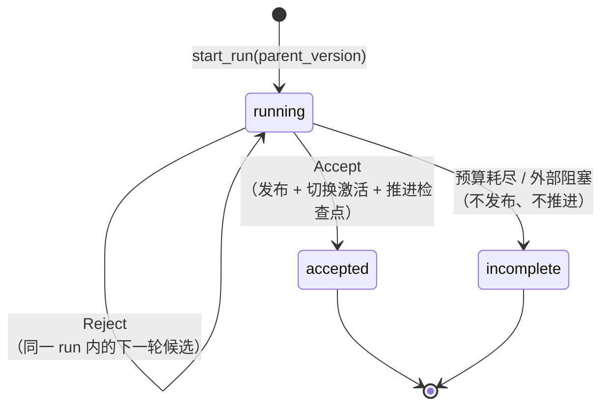

官方约定：**只有 Accept 或合法的 Incomplete 是终态**。Reject 不是终态——它是下一轮的输入。

| 状态 | 含义 | 对 `active.json` 的影响 | 对检查点的影响 |
|---|---|---|---|
| `running` | 演化进行中 | 不变 | 不变 |
| `accepted` | 候选通过门控并发布 | **切换**到新版本 | **推进** |
| `incomplete` | 因预算耗尽/数据缺失/权限不足等原因终止 | 不变 | **不推进** |

### 8.2 完整演化流程（9 步）

【本项已实证】本项目 `tools/evolve_ontology_cluster.py` 的流程严格走 EvoOntology 的 `EvolutionSession` 协议，**不直接修改激活版本**：

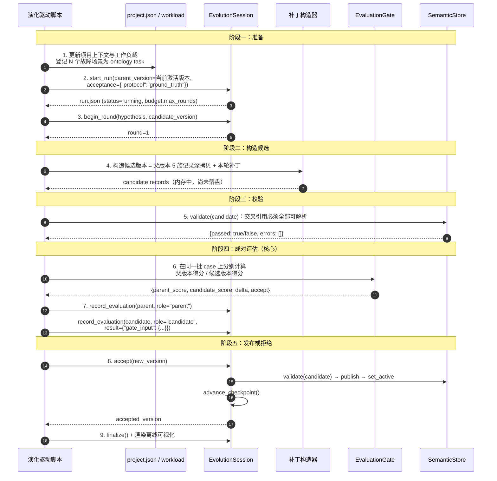

**关键实现细节（来自源码阅读）：**

| # | 细节 | 说明 |
|---|---|---|
| 1 | **`start_run` 不接受并发的运行** | 若最新 run 仍是 `running`，会抛 `EvolutionError("Run run_N is still running; resume it instead")` |
| 2 | **`acceptance` 被原样冻结** | `acceptance={"protocol":"ground_truth"}` 被 verbatim 写入 `run.json`，后续门控校验协议必须与之一致（防止"中途换评估协议"） |
| 3 | **预算优先级** | 显式 `max_rounds` > `project.json["evolution"]["max_rounds"]` > 默认 `8` |
| 4 | **`record_round` 只记录 reject** | `decision` 必须恰好是 `"reject"`，否则抛错。接受与终止走 `accept()` / `mark_incomplete()` |
| 5 | **候选可以只在内存中** | 评分用 `OntologyScoring.from_records()` 直接吃内存记录，**候选版本尚未落盘也能评分** |
| 6 | **`accept()` 内部会重新校验、重新计算门控** | 调用方给的结论**不被信任**。顺序：`validate` → `_publication_gate`（重算） → `load_version` 可加载性检查 → `publish`（不覆盖已有版本） → `advance_checkpoint` |
| 7 | **`publish` 永不覆盖** | 若目标版本目录已存在：五文件字节完全相同 → 视为安全重试；内容不同 → 抛 `FileExistsError("Official version already exists")` |
| 8 | **检查点只在这里推进** | `advance_checkpoint()` **只有 `accept()` 会调用**。一次成功的演化会让 `state.json` 的 `checkpoint_time` 刷新 |
| 9 | **Incomplete 有准入门槛** | `missing_data` / `unreliable_evaluation` / `external_block` 三种原因要求**已经拒绝过至少 `min_rejects_before_incomplete`（默认 2）轮候选**，否则会提示"Design and evaluate the next Candidate in this run instead"——**防止一遇到困难就宣布放弃** |

### 8.3 门控判据（Gate）的完整规则

这是整个演化机制中最需要精确理解的部分，因为它决定了"什么算做得好"。

**门控支持两种协议：**

| 协议 | 适用 | 判据 |
|---|---|---|
| `ground_truth` | **有 Ground Truth 的基准**（本项目使用） | `accept = candidate_avg > parent_avg`（**严格改进**） |
| `llm_judge` | 无 Ground Truth 的生产 workload | `accept = (候选零致命错误) AND (候选胜出数 > 父版本胜出数)`<br>平局不计分 |

**`ground_truth` 协议的输入契约（缺一不可）：**

| 字段 | 校验规则 | 违反时的错误 |
|---|---|---|
| `gate_input` | 必须存在且为对象 | `"Record candidate evaluation gate_input before publication"` |
| `unacceptable_regressions` | 必须**恰好等于 `False`**（身份校验 `is not False`） | `"Evaluation must explicitly rule out unacceptable regressions"` |
| `protocol` | 若 `run.acceptance.protocol` 已冻结，必须一致 | `"Gate protocol differs from the frozen acceptance protocol"` |
| `parent_scores` / `candidate_scores` | 非空、长度相等 | `"Gate needs paired scores with unique matching case_ids"` |
| `case_ids` | 长度等于分数个数、**且 case id 唯一** | 同上 |
| 分值 | 必须是**有限数值**，且**不能是 bool** | `"Gate scores must be finite numbers"` |

> **两条极其重要的设计解读：**
>
> **① `unacceptable_regressions` 必须显式声明为 `false`。** 这不是形式主义。它的作用是**强制候选版本的作者主动回答"这次改动会不会让别的地方变差"**。缺失这个字段直接拒绝发布——因为"没提"不等于"没有"。这是把"回归意识"固化为流程约束的一个非常漂亮的实现。
>
> **② `case_ids` 必须唯一且与分数一一对应。** 这保证了**成对比较的严格性**：父版本与候选版本必须在**完全相同的 case 集**上比较。做不到这点，"候选更好"就无从谈起。

**⚠️ 门控阈值的一个重要限制（生产环境必须补强）：**

核心实现只做**严格不等式比较**（`candidate_avg > parent_avg`），**没有最小改进幅度、没有显著性检验、没有多次采样**。官方评估协议文档也明确说明："第一个版本不加入顺序交换判题、维度级判决、多次采样或置信字段。"

**这意味着：候选版本只要比父版本高 0.0001 就能通过门控。**

> **【生产扩展设计】银行生产环境必须在核心门控之上再加一层"业务门控"：**
>
> | 补充条件 | 建议阈值 | 理由 |
> |---|---|---|
> | 最小改进幅度 | `delta ≥ 0.02` | 避免噪声级的"改进"触发版本发布 |
> | 无回归硬门槛 | 关键场景（P0/P1 路径）得分不得下降 | 核心交易路径不容许任何退化 |
> | 多次采样一致性 | 至少 3 次独立评估方向一致 | 抗评估噪声 |
> | 人工评审签署 | 涉及 schema 变更或新增关系类型时必须 | 见第 10 章 |
> | 金丝雀期 | 新版本上线后观察 N 天，与旧版本并行评分 | 见第 21 章 |

### 8.4 检查点机制与演化触发

演化不应该每时每刻都在跑，那会消耗大量算力且产生噪音。EvoOntology 用**检查点（checkpoint）** 来控制触发节奏。

【本项已实证】检查点存放在 `.evoontology/state.json`：

```json
{
  "checkpoint_trajectory": "task_xxxx",
  "checkpoint_time": "2026-10-02T03:32:13Z",
  "evolution_due": false,
  "thresholds": {
    "min_new_trajectories": 30,
    "min_days": 7
  }
}
```

**触发判据（默认阈值）**：

```
due_by_count = 自检查点以来的新轨迹数 ≥ min_new_trajectories (30)
due_by_time  = 距检查点天数 ≥ min_days (7)
evolution_due = due_by_count OR due_by_time
```

**`check()` 的返回值**包含人类可读的原因，例如 `"12 new trajectories >= 30"` 或 `"not due"`，多个原因用 `" OR "` 连接。

**三个设计要点：**

1. **首次初始化刻意不记录轨迹检查点**（`checkpoint_trajectory = null`）。这样**历史轨迹也会被计入第一次演化的触发条件**——对于"接手一个已有系统"的场景，这是正确行为。
2. **检查点只在 `accept()` 中推进**，且推进时自动取"当前最后一条轨迹的 id"作为新检查点。这样下一轮演化只分析**更新的任务**。
3. **未通过门控（Reject）不推进检查点**。这是有意为之：Reject 说明"还没有把事情做完"，检查点应该停在原处，等待更好的候选。

**⚠️ 一个必须注意的实现细节（潜在陷阱）：**

轨迹的排序依据是 `recorded_at` **字符串**比较（不是解析后的时间戳）。`list_since()` 取检查点记录的 `recorded_at` 作为**排他边界**。

**如果检查点记录的 id 找不到（例如轨迹文件被清理或归档），`list_since()` 会返回全部记录。** 在生产环境这意味着"一旦轨迹归档策略不当，演化会被全量历史淹没"。第 21 章会给出对应的治理要求。

**【生产扩展设计】银行环境的演化触发策略建议：**

| 触发源 | 条件 | 优先级 |
|---|---|---|
| **定时** | 每周一次（与变更窗口错开） | 常规 |
| **事件驱动：诊断失败** | 同一类告警连续 N 次诊断置信度低于阈值，或有 REJECTED 反馈 | 高 |
| **事件驱动：变更** | CMDB 增量同步后拓扑发生结构性变化 | 高 |
| **事件驱动：新故障模式** | 出现本体中不存在匹配根因的故障 | **最高**（应立刻建候选） |
| **人工** | 运维专家主动提交本体缺陷 | 高 |

---

## 第 9 章 本项目的五轮迭代实证

本节是全篇最有说服力的部分：**本体迭代不是理论，它在本项目中真实发生了 5 轮完整门控演化（外加首次构建），每一轮都有明确的假设、候选、成对评估与门控结论。**

【本项已实证】完整版本谱系（仓库中共 13 个版本目录，含 5 个候选版本）：

| 序号 | 父版本 | 候选版本 | 发布版本 | 评估口径 | 核心假设 |
|---|---|---|---|---|---|
| 0 | — | — | `ontology_v0` | — | 首次构建（单容器单库视角） |
| — | `ontology_v0` | `ontology_v0-rca` | — | — | RCA 场景视角补充 |
| — | `ontology_v0-rca` | `ontology_v0-rca-agent` | — | — | RCA Agent 注入证据 |
| **1** | `ontology_v0-rca-agent` | `ontology_v1-cluster` | **`ontology_v1`** | `structural` | 集群化知识补齐 |
| **2** | `ontology_v1` | `ontology_v2-scoring` | **`ontology_v2`** | `engine_top1` | 打分消歧字段扩展（反向迭代） |
| **3** | `ontology_v2` | `ontology_v3-hygiene` | **`ontology_v3`** | `hygiene_contract` | 游离术语清理 + 缺失概念补齐 + lifecycle 声明 |
| **4** | `ontology_v3` | `ontology_v4-remediation` | **`ontology_v4`** | `remediation_contract` | 根因处置动作入库 |
| **5** | `ontology_v4` | `ontology_v5-command-targets` | **`ontology_v5`**（当前激活） | `remediation_contract` | 处置命令可执行性修正（实测驱动） |

**五轮门控的完整实测数据（这是全篇最硬的一组数字）：**

| run | 轮次 | 评估口径 | 父版本得分 | 候选得分 | delta | 门控结论 |
|---|---|---|---|---|---|---|
| `run_1` | cluster | `structural`（本体可诊断性） | **0.0476** | **1.0000** | **+0.9524** | ✅ accepted |
| `run_3` | scoring | `engine_top1_precision`（引擎 top1 精度） | **0.5238** | **0.9524** | **+0.4286** | ✅ accepted |
| `run_4` | hygiene | `hygiene_contract`（卫生契约） | **0.6991** | **1.0000** | **+0.3009** | ✅ accepted |
| `run_5` | remediation | `remediation_contract`（可执行性契约，加固后） | **0.0000** | **1.0000** | **+1.0000** | ✅ accepted |

**五轮全部通过门控，零回退。**

**本体规模的演进（实测）：**

| 版本 | Term | Mapping | Relation | Constraint | Evidence |
|---|---|---|---|---|---|
| `ontology_v0` | 18 | 7 | 20 | 3 | 6 |
| `ontology_v1-cluster` → `ontology_v1` | **51** | **16** | **74** | **16** | **14** |
| `ontology_v2` | 51 | 16 | 74 | 27 | 17 |
| `ontology_v3` | 54 | 20 | 82 | 29 | 21 |
| `ontology_v5`（当前激活） | **54** | **20** | **82** | **29** | **21** |

**解读这组数字的三个要点：**

1. **第 1 轮是"从零到一"**：Term 从 18 增到 51（+33），Relation 从 20 增到 74（+54）——这一轮把整个集群拓扑建了起来，可诊断性从 0.048 直接到 1.000。
2. **第 2 轮"几乎不加记录，只加字段"**：Term 数与 Relation 数**完全没变**（51 / 74），但引擎 top1 精度从 0.5238 飙升到 0.9524。**这印证了第 2 轮的核心洞察：本体迭代不一定要"加内容"，也可能只是"把已有内容表达得更可用"。**
3. **第 3~5 轮是"精修"**：Term 只增 3 个（51 → 54），但 Constraint 从 16 增到 29（+13），Evidence 从 14 增到 21（+7）。**约束与证据的增长是"可用性"增长，不是"规模"增长。**

### 第 1 轮：集群化知识补齐（0.048 → 1.000）

**假设（原文摘录自 `evolution/run_1/run.json`）：**

> 环境已从单容器单库扩展为『3 副本应用 + Nginx 网关 + 1 主 2 只读副本 MySQL 集群』，而本体仍停留在单实例视图（18 个 Term 中没有任何副本/集群/网关/复制/配额概念），导致 21 个集群故障场景中有 20 个既没有根因术语、也没有传播路径与可观测连接。假设：按 5 族增量补齐集群概念（术语 + 接地映射 + 关系路径 + 约束 + 证据）后，本体对这批场景的可诊断性得分将由 0.05 提升到 1.00 以上，且不引入任何回归。

**候选构造**：父版本 5 族记录**深拷贝** + 集群补丁（`tools/ontology_cluster_patch.py`）。

**评估结果**：

| 项 | 值 |
|---|---|
| 父版本均分 | `0.047619047619047616` |
| 候选均分 | `1.0` |
| delta | `0.9523809523809523` |
| 门控判定 | `accept: true` |
| 协议 | `ground_truth` |
| run 状态 | `accepted` |
| 发布版本 | `ontology_v1` |

**这一轮新增了 33 个术语**（18 → 51），覆盖：

- 应用层：`app:payment-app-cluster`（集群视图）、`app:instance-1/2/3`（副本）
- 运行环境层：`env:gateway`（Nginx 负载均衡网关）
- 数据库层：`db:mysql-cluster`、`db:primary`、`db:mysql-replica`
- 指标类：`metric:replica-healthy-count`、`metric:gateway-probe`、`metric:http-error-rate`、`metric:cpu-throttle`、`metric:mem-pressure`、`metric:net-delay`、`metric:net-loss`、`metric:replica-lag`、`metric:replica-io-running`、`metric:db-cpu`、`metric:db-tmp-disk`
- 根因类：`rc:replica-loss`、`rc:replica-hang`、`rc:oom-kill`、`rc:cpu-throttle`、`rc:gateway-down`、`rc:net-fault`、`rc:cluster-capacity`、`rc:row-lock`、`rc:conn-exhaust`、`rc:db-cpu-starve`、`rc:tmp-disk`、`rc:primary-readonly`、`rc:replica-lag`、`rc:db-replica-loss`

**同时补充了 13 条约束**（3 → 16，实测数字）：`con:app-replica-quorum`（期望副本数 3）、`con:gateway-availability`（网关黑盒探活）、`con:app-mem-limit`（容器 mem_limit=256MB）、`con:app-cpu-throttle`（cpus=0.5）、`con:replica-lag`、`con:replica-down`、`con:db-availability`、`con:db-role`、`con:row-lock`、`con:pool-waiting`、`con:db-tmp-table`、`con:app-error-budget`、`con:cluster-cpu-capacity`。

> **注意**：这一轮的"门控得分"与"记录数量"是两个不同维度的度量。门控得分（可诊断性）从 0.0476 到 1.000，说的是"21 个场景中有多少能被诊断"；而记录数量从 18 个术语增到 51 个，说的是"为了做到这一点需要多少语义"。**后者是成本，前者是收益**——本轮的投入产出比是 33 个术语换来 20 个场景的可诊断性。

**这一轮的教学价值**：它证明了**本体迭代可以用工程化方式验证**——不是"专家说改好了"，而是"在 21 个固定 case 上，父版本 0.048、候选 1.000、门控通过"。

### 第 2 轮：反向迭代——让本体真正驱动引擎

**这一轮是全项目最有价值的一轮，因为它暴露了一个隐藏的架构缺陷。**

**问题**：第 1 轮让本体的知识完备性从 0.048 达到 1.000，但**确定性引擎的实际表现只从 top5 的 1/21 提升到 4/21**。

**根因诊断**（原文摘录自 `ontology_scoring.py` 文件头）：

> 原因很明确：`rca_engine.category_keywords` 是一张**代码内置**的关键词表，`rc:row-lock` / `rc:replica-loss` 这类新术语既不在表里、名字里也没有表中的关键词，因此永远不会被打分命中。于是"本体迭代"只能让知识躺在库里，改不动引擎行为。

**解决方案**：把打分词典**从激活本体派生**。派生规则：

```
打分词典(term) := {
    primary   : Constraint.trigger_keywords（人工精修，权重最高）
              + Term.aliases / Term.id 的 ASCII 词元
              + Term.scoring_keywords（ontology_v2 新增）
    secondary : Term.name 的 CJK n-gram（2~4 字）
    negative  : Term.negative_keywords（命中即扣分）
    category  : 由本体结构推导出的 5 类根因类别
    role      : Term.role（未声明时按 id 前缀推导）
}
```

**同时引入 `role` 与 `negative_keywords` 两个本体扩展字段**（这正是"反向迭代"的含义——**引擎的需求反过来要求本体扩展 schema**）：

| 扩展字段 | 解决的问题 |
|---|---|
| `Term.role` | 观测指标压过根因、组件压过根因的排序错误 |
| `Term.negative_keywords` | "副本丢失 vs 副本假死 vs 副本 OOM"这类同实体多故障模式无法区分 |
| `Term.scoring_keywords` | name/alias 不够贴近真实告警措辞 |

**评估口径的切换**：从 `structural` 换成 `engine_top1`（因为 structural 已饱和于 1.000）。

**这一轮的教学价值有三条：**

1. **本体迭代必须能改变系统行为。** 如果一轮迭代之后引擎行为不变，这轮迭代就是无效投资。**判据：本体版本切换是否立即改变引擎输出。**
2. **schema 扩展是被使用逼出来的，不是设计出来的。** `role` / `negative_keywords` / `scoring_keywords` 都不是第一版就想到的，它们是在"引擎效果上不去"的压力下推导出来的。
3. **门控指标会饱和，必须换。** 一个恒为 1.000 的指标不再有区分能力。

### 第 3 轮：本体卫生（Hygiene Contract）

**假设**：本体经过两轮快速扩张，积累了"游离术语"——即存在于 `terms.json` 中、但没有任何关系边连接的孤立节点。这类术语对推理毫无贡献，却会污染打分（它们仍然参与文本匹配）。

**本轮内容：**

1. 清理游离术语（无关系连接、无约束引用、无证据引用的术语）；
2. 补齐缺失概念；
3. 为术语声明 `lifecycle` 状态。

**评估口径**：`hygiene_contract`（卫生契约）——把"本体卫生"变成可计算、可门控的指标。

**这一轮的教学价值**：**本体需要定期做"卫生检查"，就像代码需要 lint。** 游离术语、孤立关系、无证据断言都是"本体技术债"。本项目把卫生检查工具化为 `tools/ontology_hygiene.py` 与 `hygiene_contract` 指标。

### 第 4 轮：处置动作入库（Remediation Contract）

**假设**：根因结论给出了"是什么"，但没有给出"怎么办"。而"怎么办"原先是以**按根因类别硬编码**的方式实现（在 `orchestrator._suggest_actions` 里）。这违反了"知识不进代码"的原则，且无法按根因精细化。

**本轮内容**：给根因术语加 `remediation` 字段，包含 `urgency` / `action` / `command` / `needs_approval`。

**评估口径**：`remediation_contract`（可执行性契约）——**最初只检查三件事**：

1. 动作是否具体；
2. `urgency` 是否合法；
3. 是否声明 `needs_approval`。

**这一轮的教学价值**：它证明了**契约设计得不够严，错误就会溜过去**。三条纸面检查**全部可以通过**，但实测发现了两类严重问题（见下轮）。

### 第 5 轮：实测驱动的命令可执行性修正

**这一轮是"只有跑起来才会发现"的典型。** 触发方式是 `tools/remediation_efficacy.py`：**注入真实故障 → 真跑诊断 → 执行 P0 命令**。

**实测暴露的两类问题：**

| # | 问题 | 具体表现 | 影响 |
|---|---|---|---|
| ① | **命令指向不存在的指标** | `rc:cpu-throttle` 的 P0 命令是 `rate(cc_container_cpu_cfs_throttled_periods_total[5m])`，而 Prometheus 里**没有这个指标**（0 条 series）。正确名是 `cc_container_cpu_throttled_seconds_total` | 操作人照着排查只会得到空结果——**看起来查过了，其实什么都没查到** |
| ② | **12 条把"散文"写进了 `command` 字段** | 例如「按 app_instance 对比 P99」「逐个副本 /health 探活」「应用日志 / 错误码 1290」（涉及 10 个术语） | 界面按等宽命令渲染，既误导操作人，也无法被自动验证 |

**为什么值得单独走一轮**（原文摘录自 `ontology_v5_patch.py`）：

> 本体是**版本化的事实来源**：内容改了就必须留下版本与成对评估，否则"v4 里那 12 条不是命令、还有一条指标名是错的"这件事在演化史里就消失了。更关键的是**把检查固化**：第 4 轮契约的漏洞（只验证纸面可用性）正是让这些错误溜过去的门。本轮给契约补上第 ④⑤ 条后，同类错误会在 `accept` 前被拦住。

**加固后的五条契约：**

| # | 契约 | 校验方式 |
|---|---|---|
| ① | 动作是否具体 | 结构检查 |
| ② | `urgency` 是否合法 | 枚举检查 |
| ③ | 是否声明 `needs_approval` | 存在性检查 |
| ④ | **`command` 引用的指标名必须真实存在** | `valid_metric_names()` 与实际监控指标名对齐 |
| ⑤ | **`command` 不得包含 CJK 字符** | 强制 ASCII 真命令，杜绝散文混入 |

**实现方式：程序化修正（按父版本匹配替换）**——补丁读取父版本，按"旧命令片段 → 新命令"的对照表**替换**，只替换命中项，未命中的原样保留，并在返回值里报告未命中（便于发现父版本漂移）。

**为什么用程序化替换而不是手抄**：命令里的说明文字有 12 处、涉及 10 个术语，手抄整份 remediation 极易出错。

**这一轮的教学价值（最重要的一条）：**

> **本体内容的质量，最终只能通过"真的执行它"来验证。** 纸面契约可以检查格式，但检查不出"这个指标在监控系统里根本不存在"。
>
> 因此**故障演练（fault drill）不是演示手段，而是本体质量的验证手段**。本项目把它做成了工具链：`tools/remediation_efficacy.py`（处置有效性）、`tools/fault_drill.py`（注入→告警→RCA→恢复）、`tools/alert_coverage_check.py`（告警覆盖）。

### 五轮迭代的经验总结

| 经验 | 说明 |
|---|---|
| **1. 迭代必须由"实测发现的问题"驱动** | 第 5 轮的触发是"真跑一遍发现命令不可执行"，不是"评审时觉得可能有问题" |
| **2. 每一轮只解决一类问题** | 混合多个假设会导致评估结果无法归因 |
| **3. 评估口径随饱和度演进** | `structural` → `engine_top1` → `hygiene_contract` → `remediation_contract` |
| **4. 契约要固化，不能只写在文档里** | 第 4 轮的漏洞直接导致第 5 轮；第 5 轮把检查写进契约，同类错误不会再犯 |
| **5. 反向迭代是常态** | 引擎的需求会要求本体扩展 schema（`role` / `negative_keywords`） |
| **6. 演化史本身就是资产** | `evolution/run_N/` 保留了每轮的假设、评估、门控结论——这是本体可信度的证据，也是新人理解系统的入口 |

---

## 第 10 章 可信度评审机制

### 10.1 为什么门控还不够

自动门控解决了"候选版本是否更好"的问题，但**没有解决"这个语义是否正确"的问题**。

一个具体的反例：如果某个术语的 `definition` 写错了（例如把"只读副本延迟"写成"主库延迟"），它可能**在可诊断性得分上依然满分**（术语存在、路径连通、可观测），甚至可能让 `engine_top1` 得分更高（因为关键词更"像"某些告警）。**自动评估无法发现语义错误。**

**因此必须有人的评审。** 但评审不能是"通读 54 个术语"，那不可持续。需要的是**分层、聚焦、可审计**的评审。

### 10.2 三层评审机制

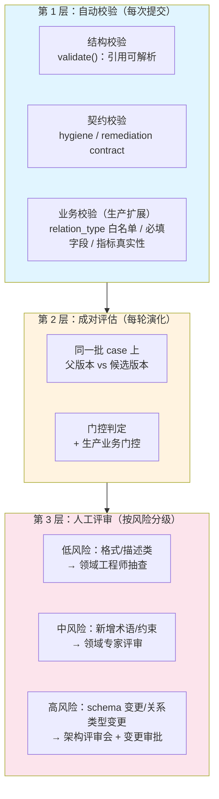

### 10.3 风险分级与评审要求

【生产扩展设计】建议的变更风险分级：

| 风险级 | 变更内容 | 评审要求 | 审批层级 |
|---|---|---|---|
| **低** | 修改 `description` / `definition` 措辞；补充 `aliases`；调整 `scoring_keywords` | 1 名领域工程师抽查 | 组长 |
| **中** | 新增 `Term` / `Relation` / `Constraint` / `Evidence`；修改 `remediation` | 领域专家评审 + 成对评估通过 | 技术负责人 |
| **高** | 新增/修改 `relation_type` 用法；新增 `constraint_type`；**schema 字段扩展**；删除或废弃术语 | 架构评审会 + 变更审批 + 完整成对评估 + 回归验证 | 架构委员会 |

### 10.4 评审清单（可直接用作评审表）

**术语评审清单：**

- [ ] `definition` 是否描述了**机制**（什么条件下发生、通过什么链条影响业务），而非仅描述"这是什么"？
- [ ] `role` 是否正确？（根因必须是 `root_cause`）
- [ ] `scope` 是否归属正确？
- [ ] `aliases` 是否只包含**同义**名称，未混入近似概念？
- [ ] `scoring_keywords` 是否来自**真实告警文本**，而非学名？
- [ ] `negative_keywords` 是否覆盖了容易混淆的兄弟根因？
- [ ] `evidence_refs` 是否指向可复现的证据？
- [ ] `remediation.command` 是否**真实可执行**（指标名存在、命令可跑）？
- [ ] `remediation.needs_approval` 是否为写操作正确标注？
- [ ] `lifecycle.state` 是否正确（废弃的术语是否已标记）？

**关系评审清单：**

- [ ] `relation_type` 是否使用了**五个受控值**之一，且是**优先级最高**的那个？
- [ ] `connection_condition` 是否带正确的语义前缀（`attributedTo:` / `evidencedBy:` / 拓扑语义）？
- [ ] 反向关系是否需要（当反向语义有独立业务含义时必须建）？
- [ ] `description` 是否会误导结论文本？

**约束评审清单：**

- [ ] `constraint_type` 是否与 `target` 的语义匹配？（选错 = 根因分错类）
- [ ] `trigger_keywords` 是否是**告警里会出现的词**？
- [ ] `description` 是否包含**区分不同故障路径的关键标签**（角色、层、节点类型）？
- [ ] 是否与已有约束重复或冲突？（多个约束同时命中会稀释类别对齐信号）

### 10.5 【生产扩展设计】必须自建的四类校验

**核心框架的校验是"结构性"的，不是"业务性"的。** 官方文档明确说明："Validation is structural only. Database-semantic checks—whether tables and columns exist, mappings execute, and evidence can be reproduced—belong to the Builder's exploration phase."

**源码核实结果——以下内容框架完全不校验：**

| 不校验项 | 后果 | 必须自建的校验 |
|---|---|---|
| `relation_type` 是否为五个受控值 | 写出 `affects` / `belongs_to` 也能发布 | **关系类型白名单校验** |
| `Term.type` 是否为受控值 | 任意字符串可通过 | 类型白名单校验 |
| `Constraint.constraint_type` | 任意字符串可通过，导致根因类别推导失败 | 约束类型白名单校验 |
| `Constraint.severity` | 无法识别的值会被静默规范为 `warn` | 严重级白名单校验 |
| 除 `id` 外的必填字段 | `definition` 为空的术语可以发布 | **必填字段非空校验** |
| `lifecycle.state` 合法性 | 非法状态会让记录静默消失（不可见但存在） | 状态白名单校验 |
| `connection_condition` 格式 | 语义前缀写错会导致 `affected` / `evidenced_by` 字段为空 | 前缀格式校验 |
| 指标名是否真实存在 | **本体引用一个不存在的指标**（本项目真实发生过） | **指标名对齐校验**（`valid_metric_names()`） |
| Evidence 是否可重放 | 证据写了但跑不通 | **证据重放校验**（周期任务） |
| `command` 是否是可执行命令 | 散文混入命令字段（本项目真实发生过） | **ASCII + 可执行性校验** |

> **这十类校验构成了"生产可信性工程"的核心。** 本项目已实现了其中四类（指标名对齐、ASCII 校验、必填字段、可诊断性），第 19 章会给出完整的生产扩展设计。

### 10.6 审计与追溯

本体是"事实来源"，因此它的每一次变更都必须可追溯。

【本项已实证】EvoOntology 天然提供的能力：

| 审计需求 | 机制 |
|---|---|
| 哪个版本激活？ | `active.json` |
| 每个版本有哪些内容？ | `versions/ontology_vN/` 五个文件 |
| 每轮演化为什么改？ | `evolution/run_N/run.json` 的 `current_hypothesis` |
| 评估结果是什么？ | `evolution/run_N/evaluations/*.json`（含 `gate_input` 与 `provenance`） |
| 谁拒绝的、拒绝了几次？ | `evolution/run_N/rounds.jsonl` |
| 门控判定的完整依据？ | `run.json` 中被注入的 `gate` 字段 |
| 评估数据从哪来？ | `trajectory-sources.json`（用户确认的轨迹来源）+ `provenance` 字段（`real` / `synthetic` / `mixed` / `external_benchmark`） |

**`provenance` 字段值得特别强调**：它声明了这次评估用的是真实数据还是合成数据。**在银行环境，这是一个合规必需字段**——你不能用合成数据宣称"诊断准确率 95%"。

**【生产扩展设计】建议补充的审计要求：**

1. **版本发布记录入行内变更管理系统**（与代码/配置变更同等级别）；
2. **本体基线快照归档**：每个已发布版本除 JSON 外，同步归档一份 TTL 形式与一份可读的审核表（本项目用 Excel：`本体模型设计_信用卡系统运维智能体.xlsx`）；
3. **评审签署留痕**：评审清单的签署人与时间入库；
4. **回滚预案**：明确"回滚 = 把 `active.json` 指回上一版本"。**注意：核心框架没有 `rollback()` 方法**（包文档字符串提到但代码中不存在），回滚只能通过 `set_active(path, <旧版本>)` 实现。

---
---

# 第四篇 基于本体的故障根因分析（How to Diagnose）

## 第 11 章 根因分析算法全流程

### 11.1 全景

整个根因分析是一条**七步流水线**。前六步是确定性的（可离线复算、零 token），第七步才可能引入 LLM。

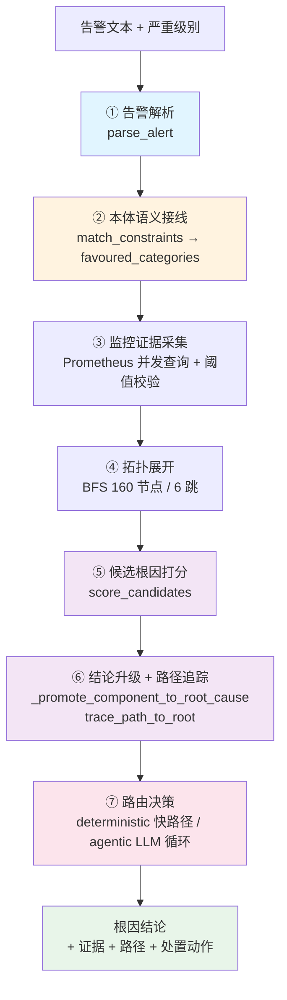

### 11.2 步骤 ①：告警解析

告警文本进来后，先做两件事：

**1. 关键词分组匹配**（产出 `keywords` 与 `matched_categories`，兼容字段与兜底用）

【本项已实证】8 个关键词组定义于 `rca_engine.KEYWORD_PATTERNS`：

| 组 | 关键词示例 |
|---|---|
| 延迟 | 延迟 / latency / p99 / P99 / 超时 / timeout / slow / 响应慢 |
| 连接 | 连接 / pool / conn / exhaust / max_connections / 连接池 / 耗尽 / connection |
| 数据库 | mysql / MySQL / 数据库 / db / sql / 慢查询 / 索引 / database |
| 容器 | 容器 / container / OOM / 重启 / restart / 内存 / cpu / crash |
| 部署 | 部署 / deploy / 发布 / 变更 / change / upgrade / 上线 |
| 可用性 | 不可用 / down / 5xx / 502 / 503 / 504 / unavailable |
| 网络 | 网络 / network / 超时 / timeout / 连接失败 |
| 存储 | 磁盘 / storage / disk / 空间不足 / disk full |

**2. 严重级别权重**

```
sev_boost = {P0: 1.0, P1: 0.7, P2: 0.4, P3: 0.2}.get(severity, 0.1)
```

**3. 本体约束匹配（关键步骤）**

调用 `OntologyScoring.match_constraints(message)`，用每条 `Constraint.trigger_keywords` 去匹配告警文本，返回命中的约束清单：

```json
{
  "constraint_id": "con:replica-lag",
  "target": "metric:replica-lag",
  "target_category": "数据",
  "constraint_type": "threshold",
  "severity": "block",
  "matched_keywords": ["复制延迟", "主从"],
  "hit_count": 2
}
```

排序键：`(-hit_count, -severity_rank, constraint_id)` —— **命中越多越优先，同级按严重度，再按 id 保证确定性**。

### 11.3 步骤 ②：语义接线（本体在这里第一次介入）

有了约束命中，就能确定"这次告警最可能属于哪几类根因"：

```
favoured_categories = { 约束的 constraint_type 映射的类别 }
                    ∪ { 约束 target 的类别（若可解析） }
```

**为什么取两个来源的并集？** 源码注释给出了理由：

> 两类来源并集（都来自本体，不依赖脆弱的派生节点类别）：
> - 约束自身的 `constraint_type` → 类别 —— 这是**人工写约束时就确定下来的语义**
> - 约束 `target` 的类别（若可解析）

**兜底机制**：如果没有任何约束命中（例如告警措辞与所有 `trigger_keywords` 都不匹配），则退化为"哪些术语的词典被文本命中"投票。

**本体完全不可用时的兜底**：退回硬编码的 `LEGACY_ALERT_CAT_TO_SCORE_CAT` 与 `LEGACY_CATEGORY_KEYWORDS`。**这是有意的降级设计**——本体文件损坏或版本未激活时，系统不崩溃，只是能力退化。

### 11.4 步骤 ③：监控证据采集与阈值校验

**并发查询** Prometheus 的关键指标（`gather_evidence()` → `prom.all_metrics()`），然后做阈值校验。

【本项已实证】三组阈值校验（`check_alert_thresholds()`）：

| 校验项 | 表达式/口径 | 阈值 | 严重级 |
|---|---|---|---|
| HTTP 延迟 > 500ms 的请求占比 | `(total − bucket{le="0.5"}) / total` | > 5% | P1 |
| 连接池使用率 | `cc_mysql_pool_active / cc_mysql_pool_limit` | > 80% | P1 |
| MySQL 连接数占用 | `threads_connected / max_connections` | > 90% | P2 |

**告警规则与本体约束的对齐（工程实现的核心）**

【本项已实证】本项目定义了 **23 条告警规则**，分布在 4 个 group（`cc-app-cluster` / `cc-app-alerts` / `cc-db-cluster` / `cc-db-alerts`），每组 `interval: 30s`，`for` 时长分布为 60s × 9 / 120s × 9 / 180s × 3。

**每条规则都带两个关键注解：**

| 注解 | 内容 | 作用 |
|---|---|---|
| `rca_hint` | **可直接投喂给 RCA Agent 的自然语言告警文本** | 保证评估时"智能体看到的信息"与"值班人员看到的"一致 |
| `onto_constraint` | **指向本体约束 id**（标签形式） | 把告警接线到本体语义 |

**这是一个非常实用的设计：告警规则同时服务"人"和"机器"。** `summary` / `description` 给人看，`rca_hint` 给智能体看，`onto_constraint` 给本体看。**三者在同一条规则里维护，天然保持一致。**

**⚠️ 一个必须如实说明的实测发现：告警规则与本体约束之间存在两处引用的不一致（源码核实）。**

| 问题 | 具体表现 | 影响 |
|---|---|---|
| **悬空引用** | `AppContainerOOMKilled` 的 `onto_constraint` 指向 `con:container-oom`，但**这条约束在 `ontology_v1-cluster` 与 `ontology_v5` 中都不存在**（v5 里语义等价的是 `con:oom-detection`，但标签值不同） | 该告警无法被本体的约束接线命中 |
| **反向孤立** | `con:cluster-cpu-capacity` 存在，但**没有任何告警规则指向它** | 该约束永远不会因告警文本匹配而被触发 |

**这个发现的教学价值很高，它揭示了一个容易被忽略的治理缺口：**

> **告警规则与本体约束是"多对多"关系，两侧都可能发生漂移，而框架不会校验跨系统的引用一致性。**
>
> 本项目的 `validate()` 能保证**本体内部**的引用可解析，但**不能保证**告警规则里的 `onto_constraint` 标签指向一个真实存在的约束 id。
>
> **【生产扩展设计】必须把"跨系统引用一致性"纳入校验范围**：告警规则的 `onto_constraint` / `rca_hint` 标签、CMDB 的配置项 id、监控的指标名——凡是本体引用了外部系统的标识，都需要一个周期性的"引用有效性校验"。这正是第 19.4 节"接地有效"要解决的问题，而告警规则也是"接地"的一部分。

**告警规则 → 本体约束的映射分布（16 个不同的约束 id）：**

| 约束 id | 被几条规则引用 |
|---|---|
| `con:app-replica-quorum` | 3 |
| `con:db-maxconn` | 3 |
| `con:p99-threshold` | 2 |
| `con:app-cpu-throttle` | 2 |
| `con:replica-down` | 2 |
| 其余 10 个（`con:gateway-availability` / `con:app-error-budget` / `con:pool-exhaust` / `con:pool-waiting` / `con:app-mem-limit` / `con:replica-lag` / `con:db-availability` / `con:row-lock` / `con:db-tmp-table` / `con:db-role`） | 各 1 |
| `con:container-oom`（**悬空引用**，本体中不存在） | 1 |

**"多条规则映射到同一约束"是合理的设计**：约束表达"什么算故障"，告警表达"从哪个角度观测到了这个故障"。例如副本数不足、整层不可用、单副本探活失败这三条不同角度的告警都指向 `con:app-replica-quorum`。

**规则注释里积累的"阈值贴边"教训（极有价值的运维知识）：**

| 规则 | 原阈值 | 问题 | 修正 |
|---|---|---|---|
| `MySQLTooManyConnections` | `> 0.9` | **恰好压在故障量级上**：注入 170 个长连接 + 应用自身 ≈180，`180/200 = 0.90` → `> 0.9` 不成立，**故障期反而不响** | 改为 `> 0.85`（空闲基线约 0.19，两侧余量充足） |
| `MySQLThreadsRunningHigh` | `> 20` | `db_cpu_stress` 实测恰好把线程数推到 **20** → 永不触发 | 改为 `> 12`（空闲基线 2~4） |
| `MySQLDiskTempTables` | `rate([5m]) > 0.5` | **不可达**：同一故障下 `[2m]` 速率实测只有 0.105 | 改为 `rate([2m]) > 0.05`（基线恒为 0） |
| `MySQLRowLockContention` | `Innodb_row_lock_current_waits > 0` | 该 gauge 在会话被 KILL 时漏减，**永久卡在 1**（`SET GLOBAL` 也重置不了） | 改用只增计数器的速率 `rate(innodb_row_lock_waits[2m]) > 0.02` |
| `MySQLReplicaDown` | `up{job=~"mysql-replica-.*"} == 0` | **过滤式表达式**：容器被删/停时目标从服务发现消失，序列过期，`== 0` 永远匹配不到 | 改为"在册且 up 的副本数不足 2"：`count(up{...} == 1) < 2` |
| `AppReplicaLatencySkew` | "任一副本 P99 > 500ms" | **根本不是偏斜检查**：所有副本一起慢时也会触发，而注解却断言"其余副本正常" | 改为真正的偏斜：`max/min > 2` 且有绝对下限 `max > 0.3` |

> **这六条教训可以归纳为一条通用规则：**
>
> **阈值必须与"空闲基线"和"故障量级"都保持足够间距。** 定阈值前必须先实测这两个值——本项目明确记录了"注入时长 ≥ 保持期 + 告警最大 `for`"这条经验规则，因为注入时长不够会导致"故障已结束、告警还没 firing"。

> **一个必须写对的口径细节**：Prometheus histogram 的桶 `{le="X"}` 是**累加计数**（≤X 的请求数），因此"超过阈值的比例"必须算 `(total − bucket{le=阈值}) / total`，**不能**直接用 `bucket{le=阈值} / total`。源码注释明确写了这一点。
>
> 这条口径应当写进 `Mapping.aggregation_semantics`，让它成为本体的一部分，而不是散落在代码里。

### 11.5 步骤 ④：拓扑展开

调用 `get_topology_graph(app_name)`，从入口实体出发做有界 BFS。

【本项已实证】BFS 策略（`_topology_bfs`）：

1. **种子节点**：id 匹配 `app_name` 的术语（如 `app:payment-app`），最多 5 个；
2. **队列初始化**：`[(seed, 0), ...]`；
3. **循环终止条件**：队列空 或 `len(seen) >= max_nodes(160)` 或 `depth > max_depth(6)`；
4. 对每个节点调用 `resolve_semantics` 展开关系边，对端节点入队（深度 +1），**同时做反向探索**；
5. **只保留两端都在 `seen` 中的边**（保证图是闭合的）。

**缓存**：结果带 600 秒进程内缓存。**这是重要的性能设计**——本体拓扑在一次诊断内会被多次读取（打分、路径追踪、前端渲染），没有缓存会造成大量重复的 MCP 调用。

### 11.6 步骤 ⑤：候选根因打分

详见第 12 章。

### 11.7 步骤 ⑥：结论升级与路径追踪

详见第 13 章。

### 11.8 步骤 ⑦：路由决策

详见第 14 章。

### 11.9 推理链的构造

最终结论不只是"根因是什么"，而是一条**可读的推理链**（`build_rca_chain()`）：

| 步骤 | 类型 | 内容 |
|---|---|---|
| 1 | `alert` | 告警信号：严重级 + 描述 + 关键词 + 匹配类别，来源 `user_input` |
| 2 | `monitoring` | Prometheus 阈值检查：N 项触发的具体值 + 完整 evidence，来源 `prometheus` |
| 3 | `topology` | 本体拓扑逆向遍历：发现 N 个节点（列出前 10），来源 `evo_ontology` |
| 4 | `path` | 根因传播路径：`根因 → ... → app:payment-app` 逐跳串接，来源 `evo_ontology` |
| 5+ | `candidate` | 候选根因（前 4 个）：类别 + 实体 + 置信度 + 理由 |

**这条推理链的价值**在于：它把"结论"变成了"论证过程"。运维人员可以逐条核查——如果第 4 步的路径不对，他立刻知道是本体关系建错了；如果第 2 步的指标不对，他知道是采集配置问题。**结论可核查，是运维人员愿意信任它的前提。**

---

## 第 12 章 候选根因打分：从代码内置词表到本体派生

### 12.1 打分公式（本体驱动版）

【本项已实证】这是**当前生效**的公式，实现于 `rca_engine.score_candidates()`：

```
对拓扑中的每个节点（术语）：

  ① 前置条件：该术语必须至少命中一个词典词（weighted > 0）
     —— 否则"类别对齐"项会把同类别术语全部灌进候选

  ② 文本贴合度  specificity = min(weighted_hits, 3) / 3.0
  ③ 类别基线    base = CATEGORY_BASE_SCORE[category]
  ④ 类别对齐    alignment = 1.0 if category ∈ favoured else 0.0

  score = 0.25 × base
        + 0.50 × specificity
        + 0.15 × alignment
        + 0.10 × sev_boost

  ⑤ 若节点是关系节点（type == "relation" 或 id 以 rel: 开头）：
        score -= 0.25

  ⑥ 角色权重（本体显式声明的 Term.role）：
        score *= ROLE_WEIGHT[role]

  ⑦ 截断：score = max(0.05, min(score, 0.99))
```

**类别基线与角色权重常量：**

| 类别 | 基线 | 典型证据字段 |
|---|---|---|
| 数据 | 0.65 | `mysql_pool_active` / `mysql_query_duration` / 慢查询 |
| 资源 | 0.55 | `container_cpu` / `container_memory` / OOM / restart |
| 配置 | 0.50 | `timeout` / `pool_limit` / `max_connections` |
| 依赖 | 0.40 | `mysql_up` / `threads_connected` |
| 代码 | 0.30 | `5xx` / `error_rate` |

| 角色 | 权重 | 含义 |
|---|---|---|
| `root_cause` | 1.15 | 根因——告警要定位的目标 |
| `component` | 1.00 | 组件/实体——受影响的载体 |
| `observation` | 0.85 | 观测（指标/告警/事件）——是证据，不是根因 |
| `rule` | 0.80 | 约束/规则——是判据，不是根因 |

**理论区间约 `[0.05, 0.99]`，不饱和，保证候选可排序。**

### 12.2 权重设计的解读

权重不是随便定的，每一项都对应一个明确的失败模式：

| 权重项 | 值 | 防的是什么 |
|---|---|---|
| 类别基线 | 0.25 | 防止"任何命中都得到同样的分"。数据类问题比代码类更常见，因此基线更高 |
| **文本贴合度** | **0.50** | **主信号**。命中越多、越具体的术语越可能是根因 |
| 类别对齐 | 0.15 | 防止"文本碰巧命中但与告警类别无关"的术语被选中 |
| 严重级别 | 0.10 | P0 告警应该更容易指向高危根因 |
| 关系降权 | −0.25 | 关系边不是根因，必须显著降权 |
| 角色权重 | ×0.8 ~ ×1.15 | **解决"观测压过根因、组件压过根因"的排序错误** |

### 12.3 文本贴合度的计算（`match_text`）

这是打分中最精细的部分。返回三元组 `(primary_hits, weighted, matched_keywords)`：

```
weighted = len(primary_hits)
         + 0.5 × min(最长命中 CJK n-gram 长度, 4)
         − len(negative_hits)

if weighted < 0: weighted = 0.0
```

**三个关键设计（都来自实测踩坑）：**

#### 设计一：中文 n-gram 按"最长命中"计权，不按命中个数计权

> 【本项已实证】源码注释记录了原因：
>
> 否则"应用副本"会同时命中 2/3/4-gram（应用、用副、副本、应用副、用副本、应用副本…），被算成 6 次命中 —— **同一段文字重复计分**，把不相关的根因顶到第一。
>
> 改成"最长命中 n-gram 长度 × 0.5"后，4 字连续命中 = 2.0 分，2 字 = 1.0 分，既保留"越长越可信"，又不会被切窗数量放大。

#### 设计二：primary 全权、secondary 半权且封顶

| 词典来源 | 权重 | 理由 |
|---|---|---|
| `Constraint.trigger_keywords` | **primary（全权）** | 人工精修，是最可信的信号 |
| `Term.aliases` / `Term.id` 的 ASCII 词元 | primary（全权） | 显式声明 |
| `Term.scoring_keywords` | primary（全权） | ontology_v2 起新增，比 name/alias 更贴近告警措辞 |
| `Term.name` 的 CJK n-gram | secondary（半权，封顶 4 字） | 只是名称切窗，只能当弱证据 |

#### 设计三：`negative_keywords` 命中即扣分

> 【本项已实证】这是本体对"什么情况下**不是**我"的显式声明。它让"副本丢失 vs 副本假死 vs 副本 OOM"这种同实体多故障模式**被关键词打分区分开，而不需要在代码里写特例**。

### 12.4 从"代码内置词表"到"本体派生"的演进

这是本项目最有教育意义的一次架构改造。**两个版本的公式对比：**

| 项 | legacy 版（已废弃，仅作降级） | ontology 版（当前生效） |
|---|---|---|
| 类别基线 | × 0.35 | × **0.25** |
| 文本贴合度 | × 0.20 | × **0.50** |
| 类别对齐 | × 0.30 | × **0.15** |
| 严重级别 | × 0.15 | × **0.10** |
| 关系降权 | − 0.25 | − 0.25 |
| 角色权重 | **无** | **有（0.8~1.15）** |
| 词典来源 | 硬编码 `LEGACY_CATEGORY_KEYWORDS` | **激活本体的 5 族记录** |
| 命中计数 | 关键词个数 | **加权（primary 全权 + 最长 CJK n-gram × 0.5 − negative）** |
| 类别推导 | 硬编码映射 | **由本体结构推导（约束 target/scope > Term.scope > 邻居多数表决 > id 前缀）** |

**权重从"类别对齐主导（0.30）"改为"文本贴合度主导（0.50）"，背后的认识转变是：**

> 原先的设计隐含假设"类别比文本更可靠"。但在集群化环境中，同一类别下有十几个根因（例如"资源"类下有 `rc:replica-loss` / `rc:replica-hang` / `rc:oom-kill` / `rc:cpu-throttle` / `rc:cluster-capacity` / `rc:db-cpu-starve` / `rc:tmp-disk`），**类别对齐已经没有区分力**，真正有区分力的是"告警文本里到底提到了什么具体机制"。

### 12.5 类别推导链（本体结构 → 根因类别）

根因类别是**下游契约**（处置建议、路由判定、前端展示都依赖它），所以不能改词表（5 类固定为 数据/资源/配置/依赖/代码），只能改"怎么算出来"。按优先级链推导：

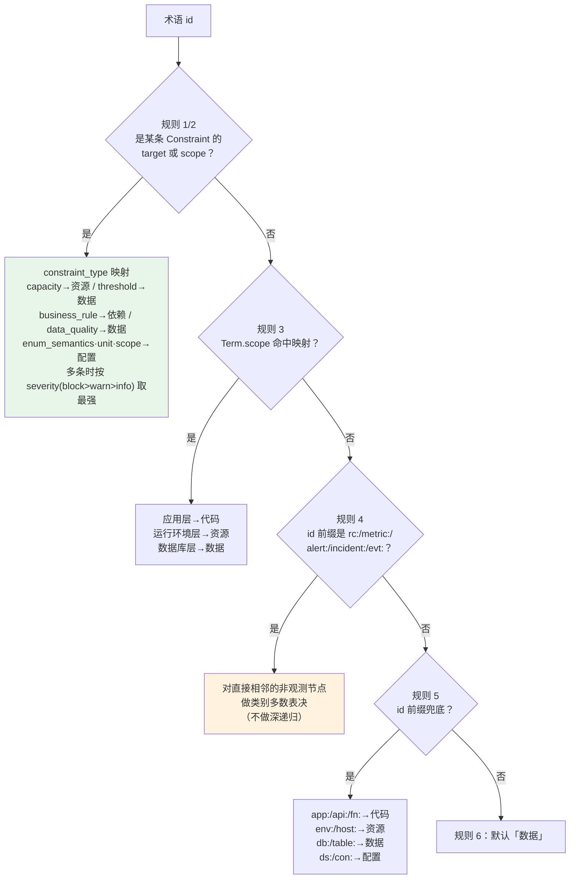

**规则 4 的一个关键设计约束（源码注释）：**

> `rc:` / `metric:` 等派生节点 → 对**直接相邻的非观测节点**的类别做多数表决（**不做深递归**：深递归会让类别随关系遍历顺序漂移，不可复算）。

**"可复算"是这里最重要的工程要求。** 如果一个术语的类别取决于图遍历的顺序，那么同一份本体在不同运行中可能给出不同的类别——这会摧毁可信度。因此规则被刻意设计成**确定性、无深递归、可复算**的。

另外，防环处理：进入递归前先把 `memo[tid]` 设为默认值 `"数据"`。

### 12.6 打分结果的输出结构

每个候选根因不只是"分数"，而是一个**自解释的结构**：

| 字段 | 来源 | 作用 |
|---|---|---|
| `category` | 本体结构推导 | 根因类别 |
| `entity_id` / `entity_name` | 拓扑节点 | 根因实体 |
| `confidence` | 打分公式 | 置信度 |
| `relation_type` | 拓扑边 | 关系类型 |
| `reason` | `_reason_sentence()` 生成 | **可读的结论句子** |
| `scoring_source` | `"ontology:<版本>"` 或 `"legacy:builtin"` | **打分词典来源，便于审计与 A/B** |
| `definition` | `Term.definition` | 机制 |
| `rationale` | `Term.scoring_rationale` | 判别理由 |
| `role` | `Term.role` | 角色 |
| `lifecycle` | `Term.lifecycle.state` | 生命周期 |
| `scope` | `Term.scope` | 归属层 |
| `matched_keywords` | 匹配结果 | 命中的词典词（含 `!xxx` 表示 negative 命中） |
| `affected` | `attributedTo` 关系 | 归因对象 |
| `evidenced_by` | `evidencedBy` 关系 | 观测佐证 |
| `constraints` | 以该术语为 target 的约束 | 判据 |
| `remediation` | `Term.remediation` | **处置动作** |
| `negative_matched` | 匹配结果 | 被扣分的词（值得展示，说明"为什么不是别的"） |

**排序规则**：按置信度降序；同分时**非关系节点优先**。

**输出上限：Top 6 候选。**

### 12.7 `_reason_sentence()`：把流水话写成可读结论

这是一个小而关键的改进。原先是"命中 N 类关键词"这类无信息量的流水话。现在它把本体里**本来就有**的素材组织成一句完整的话：

```
告警文本命中本体已建模根因「{name}」（`{id}`）的打分关键词 {kws}；
机制：{definition}；
归因对象：{entity_id}（{label}）、...；
判据：{constraint.description}。
```

源码注释说明了设计意图：

> 仍然保留"命中关键词"这个事实（它是判别依据），但补上三个最要紧的问题：**这是什么**（可读名称）、**机制是什么**（definition）、**落在哪个对象上**（attributedTo）。**全部素材来自本体，不在这里另编知识。**

---

## 第 13 章 组件级结论升级为根因级结论

### 13.1 一个真实且普遍的问题

> 【本项已实证】源码注释记录了这个问题（验证手册 §11.26）：
>
> 端到端严格口径的未命中里，有相当一部分不是"答错方向"，而是**答到了组件层就停了** —— 例如 `app_pause_replica` 给 `app:payment-app-cluster`、`db_replica_kill` 给 `db:mysql-replica`。
>
> 这些是本体里的**合法术语**（所以宽松命中会算对），但不是根因，用户拿不到"到底是什么坏了、该怎么办"。

**这类"正确的废话"是运维智能体最容易被忽视的失败模式。** 系统没有答错——`db:mysql-replica` 确实是相关的；但对值班工程师毫无帮助，因为他需要的是"副本丢失"还是"复制中断"还是"复制延迟"。

### 13.2 解决方案：用本体关系做锚定升级

**根因不是靠猜的**：本体里 `rc:X --attributedTo--> 组件` 这条关系**就是**"这个根因落在哪个组件上"的显式声明。

【本项已实证】`ontology_v5` 中有 **15 条** `rc:X --attributedTo--> 组件` 关系。

**升级判据（按优先级）：**

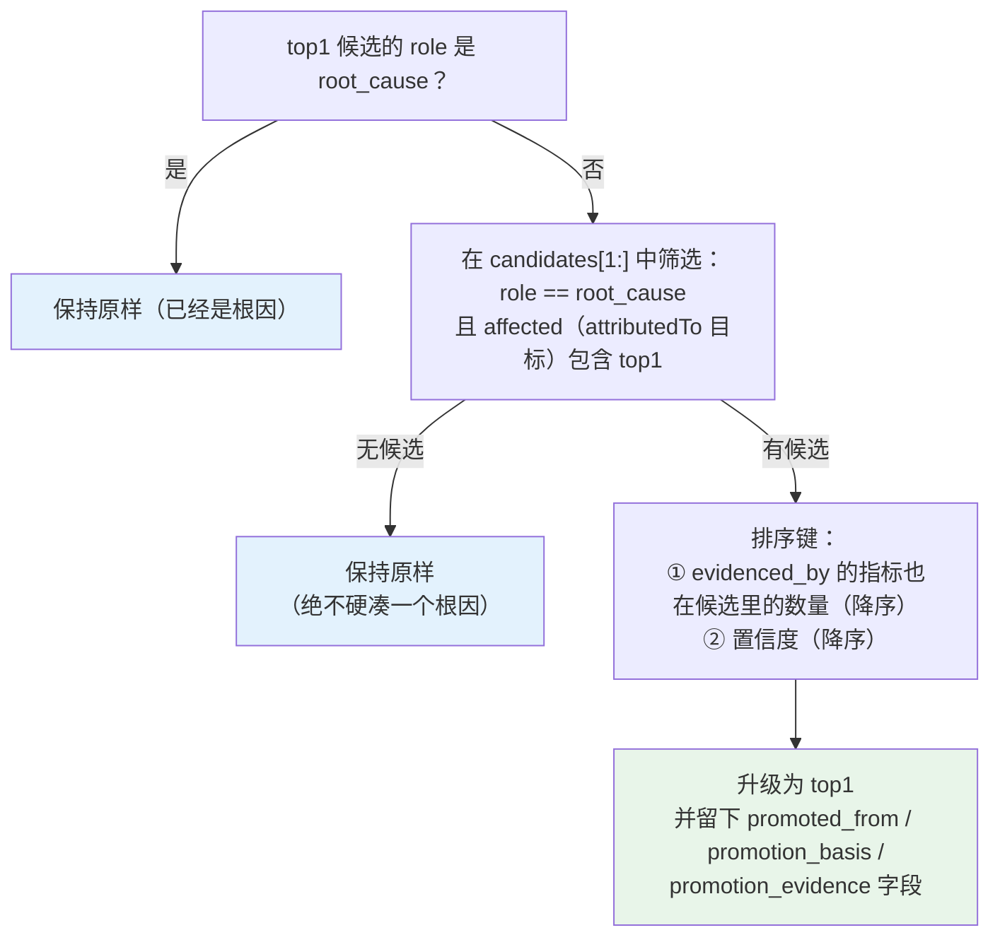

**判据解释：**

| 优先级 | 判据 | 理由 |
|---|---|---|
| 1 | 候选的 `role == root_cause` **且**其 `affected`（`attributedTo` 目标）**包含当前 top1** | 这是本体显式声明的"这个根因落在那个组件上" |
| 2 | 其中 `evidenced_by` 的指标**也在候选里**的优先 | 说明告警文本还提到了印证它的那条指标，**证据更强** |
| 3 | 仍并列时按置信度 | 常规排序 |

### 13.3 三条重要的安全设计

**① 找不到锚定的根因时保持原样，绝不硬凑。**

源码注释：`找不到锚定的根因时**保持原样**（绝不硬凑一个）`。

**这条设计极其重要。** "硬凑一个根因"会让结论看起来更"有用"，但会引入虚假确定性——运维人员按错误根因去处置，后果可能比"承认不确定"严重得多。

**② 升级动作必须可审计。**

只在真的升级时留下三个字段：

| 字段 | 内容 | 示例 |
|---|---|---|
| `promoted_from` | 被替换掉的原 top1 实体 id | `db:mysql-replica` |
| `promoted_from_name` | 原 top1 的可读名称 | `MySQL 只读副本节点` |
| `promotion_basis` | 升级依据 | `本体关系 attributedTo：`rc:db-replica-loss` 归因到组件 `db:mysql-replica`` |
| `promotion_evidence` | 证据强度说明 | `同时候选里命中了它的观测佐证：metric:replica-io-running` |

**③ 结论文本必须说明"这不是凭空换的"。**

源码在 `reason` 后追加：

```
；该结论由**组件级**候选 `db:mysql-replica` 升级而来（依据：本体关系 attributedTo：...，同时候选里命中了它的观测佐证：...）
```

源码注释：**结论句子要说明"这不是凭空换的"，否则看起来像引擎改口。**

### 13.4 一个运维友好的设计：可开关的度量

升级逻辑由一个环境变量控制：

```
RCA_DISABLE_COMPONENT_PROMOTION=1   # 关闭升级
```

**为什么需要这个开关？** 源码注释：`用于**成对评估**"升级到底有没有用"（tools/rootcause_promotion_verify.py）。生产默认开启。`

本项目为此专门写了验证脚本 `tools/rootcause_promotion_verify.py`：回放真实 alert_text，on/off 切换环境变量对比严格命中 / 结论落在组件上 / top5 命中 / 实际发生升级的场景，输出 `.chaos/promotion_ab.json`。

**这条经验值得推广为一条工程规范：任何"智能增强"逻辑都必须有开关，且必须有成对评估证明它有效。** 否则你无法区分"这个功能有用"和"这个功能只是让结论看起来更好"。

### 13.5 根因传播路径追踪

`trace_path_to_root()` 从根因实体反向追踪到应用入口。

【本项已实证】算法：

1. **目标**：`app:payment-app`（用户可见入口）；
2. **起点**：根因实体的 id。如果起点就是目标，返回空路径；
3. **构建无向邻接表**：对每条边建正反两个方向（反向边的 `source`/`target` 互换）；
4. **BFS 找最短路径**：从起点出发，记录 `prev[node] = {node, edge}`；
5. **回溯**：从目标沿 `prev` 回溯到起点，反转得到正序路径；
6. **输出**：`[{from, to, relation, relation_type, condition}, ...]` 序列。

**三个设计要点：**

| 要点 | 说明 |
|---|---|
| **用无向图** | 因为故障传播方向与拓扑声明方向不一定一致（例如"宿主机 CPU 高"会影响"运行于其上的容器"） |
| **BFS 而非 DFS** | 输出**最短**传播路径，避免绕圈子 |
| **带上 `relation_type` 与 `condition`** | 让路径上每一跳都能被解释（"这一跳是 composition 关系，条件是被调度到该宿主"） |

**路径的呈现形式**（`build_rca_chain()` 的 step 4）：

```
根因传播路径: rc:slow-sql → ds:pay → app:payment-app
```

这个箭头序列对运维人员的价值很大：**它把"为什么这个根因会导致我看到的症状"变成了一条可以逐步核查的链路。**

---

## 第 14 章 双引擎协同与路由决策

### 14.1 为什么要双引擎

单靠本体规则引擎，或单靠 LLM，都不够：

| 方案 | 优势 | 劣势 |
|---|---|---|
| **本体确定性引擎** | 毫秒级、零 token、零幻觉、完全可复现 | 只能回答**已建模**的故障模式；遇到未建模场景会给出"看似合理"的错误答案 |
| **LLM Agent** | 能探索未知场景、能理解口语化描述、能主动取证 | 慢（秒~分钟级）、有 token 成本、有幻觉风险、结果不完全可复现 |

**最优解不是二选一，而是让确定性引擎做"初判 + 先验"，让 LLM 做"复核 + 探索"，并按可信度动态路由。**

【本项已实证】这就是本项目 `router.py` 的设计，源码注释称之为 "Q2 决策 A：本体优先 + Agent 增强"。

### 14.2 路由判定逻辑

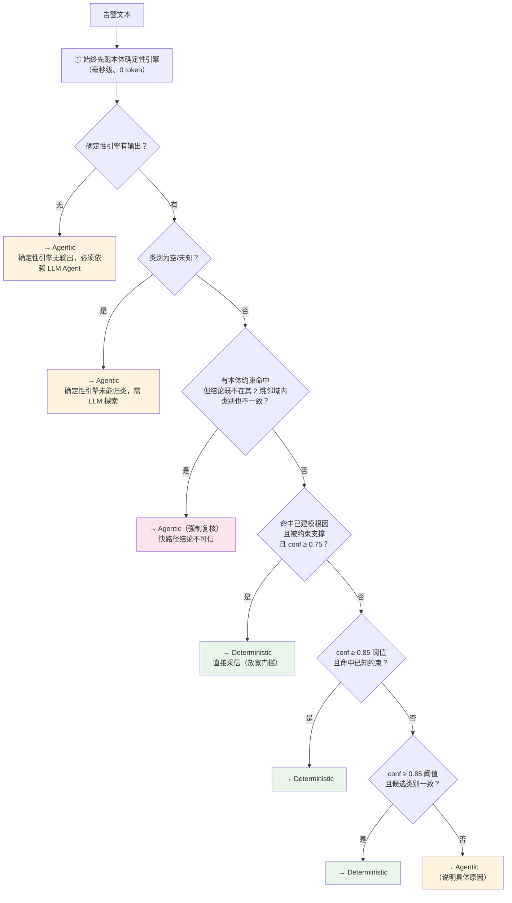

### 14.3 关键设计：约束支撑度信号

这是路由逻辑中最重要的一个信号，也是本项目修掉一个严重缺陷后的产物。

> 【本项已实证】源码记录了这个缺陷（`router.py` 文件头）：
>
> 第一次集群化本体迭代后暴露了一个缺陷：`KNOWN_ROOT_CAUSES` 是硬编码白名单（含 `rc:slow-sql`），只要规则引擎对某个已知根因打了 0.75 以上，`--mode auto` 就永远走快路径 —— **实测 4/4 集群故障全部返回同一个过期根因，LLM Agent 从未获得机会。**

**这是一个非常典型的"智能体被自己的白名单锁死"的故障。** 修复方式包含两部分：

**修复一：`KNOWN_ROOT_CAUSES` 从激活本体派生**（不再硬编码）。

```
known_root_causes = { 本体里 rc: 前缀且 type ∈ {entity, concept, ""} 的术语 }
```

**修复二：引入"约束支撑度"信号。**

```
match_constraints(告警文本) → 命中的约束集合 H

seed_supported = 确定性引擎给出的根因实体与 H 中某条约束的 target
                 在本体关系图上距离 ≤ 2 跳
category_aligned = 根因类别 ∈ H 中约束的 target_category 集合
```

**新增的强制复核分支：**

```
若 H 非空，但 (seed_supported == false) 且 (category_aligned == false)：
    → 强制走 Agentic，并在 reason 中写清
      "告警命中本体约束 XXX（指向 YYY），
       但规则引擎给出的根因 ZZZ[WWW] 既不在其 2 跳邻域内、类别也不一致
       → 快路径结论不可信，交 Agent 复核"
```

源码对这条分支的注释说明了设计理由：

> 这是修掉"快路径过度自信"的关键分支：**约束是人工确认过的语义接线，它的指向比规则引擎的自评分更可信。**

**这条经验可以提炼为一条通用原则：**

> **当系统里存在两种不同可信度的信号时，让可信度高的信号拥有"否决权"，而不只是"加权"。**
>
> 规则引擎的置信度是**自评分**（自己算出来的）；本体约束是**人工确认的语义**。加权平均会让自评分高的错误结论压过人工知识。赋予约束一票否决权，才真正把人工知识置于算法之上。

### 14.4 快路径的价值

快路径（Deterministic）不是"降级方案"，它有三个不可替代的价值（源码注释）：

| 价值 | 说明 |
|---|---|
| **省成本** | 已知故障模式无需 LLM，毫秒级、零幻觉 |
| **对照组** | 可作为 Agent 的交叉验证基线 |
| **降级路径** | LLM 不可用时是唯一的可用路径 |

### 14.5 路由决策的可审计性

`RouteDecision` 的返回结构包含完整的判定依据：

| 字段 | 内容 |
|---|---|
| `mode` | `deterministic` / `agentic` |
| `reason` | **人类可读的判定理由**（含具体的置信度数值、约束 id、跳数分析） |
| `threshold` | 实际使用的阈值（区分 0.85 与放宽的 0.75） |
| `seed_confidence` | 确定性引擎的置信度 |
| `matched_constraint` | 是否命中已知约束/根因/阈值触发 |
| `known_root_cause` | 是否命中本体已建模根因 |
| `signals` | 完整信号集，包括 `constraint_hits` / `seed_supported_by_constraint` / `category_aligned_with_constraint` / `ontology_available` / `ontology_version` / `known_root_causes_source` |

**`reason` 字段的写法值得学习**：它不是"置信度不足"，而是：

```
告警命中本体约束 con:replica-lag, con:replica-down（指向 metric:replica-lag, metric:replica-io-running），
但规则引擎给出的根因 db:mysql-replica[数据] 既不在其 2 跳邻域内、类别也不一致
→ 快路径结论不可信，交 Agent 复核
```

**这种"把判定依据写成一句话"的做法，让路由决策可被运维人员审计。** 当有人质疑"为什么这次走了 LLM 而不是快路径"，答案就在这条 reason 里。

### 14.6 交叉验证

Agent 走完之后，系统会把 Agent 的结论与本体确定性结论**自动比对**，给出三级一致性判定：

| 级别 | 含义 |
|---|---|
| `exact` | Agent 给出的根因实体与本体的根因实体完全一致 |
| `category` | 实体不同，但根因类别一致 |
| `divergent` | 类别都不一致（**最需要人工关注的信号**） |

**`divergent` 是一个极有价值的运维信号。** 它意味着"人工整理的语义"与"LLM 基于实时证据的推理"给出了方向性不同的判断。可能的原因有两类：

1. **本体过时**：环境变了，本体没跟上 → 应该走演化流程补本体；
2. **监控误导**：告警文本或指标配置有误，把 LLM 带偏了 → 应该修告警规则。

**因此建议把 `divergent` 案件纳入定期评审**，它是本体演化最好的输入源之一。

---

## 第 15 章 LLM Agent 循环与工具矩阵

### 15.1 Agent 循环设计

【本项已实证】循环实现于 `rca-agent/backend/services/agent.py`，源码注释说明其设计参照 Dify Agent 机制并做了两处关键改进。

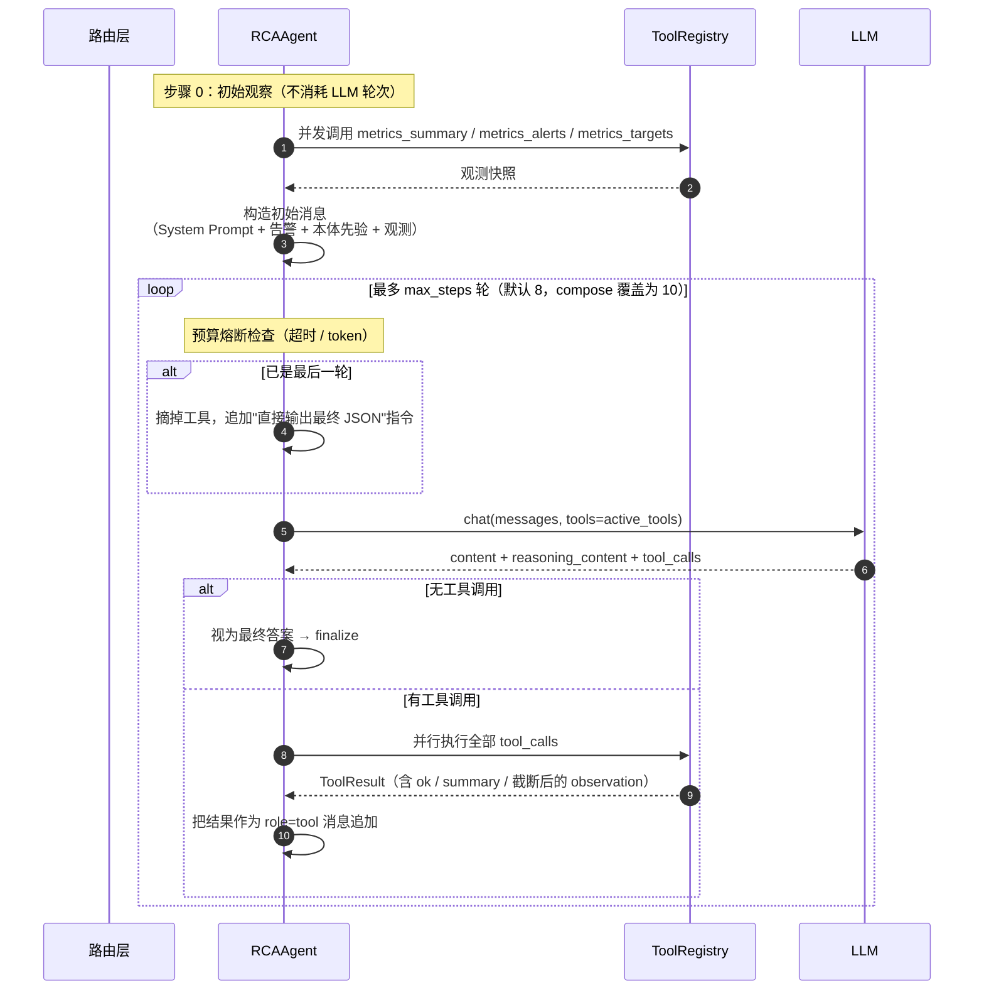

**七个关键机制：**

| 机制 | 实现 | 设计理由 |
|---|---|---|
| **循环结构** | 观察 → 推理 → 行动，最多 `max_steps` 轮 | 标准 Agent 范式 |
| **推理记录** | 捕获 `reasoning_content`（模型原生思维链），**非文本解析** | 可解释性更强，不受格式漂移影响 |
| **工具调用** | Function Calling 结构化 `tool_calls`（**支持并行多工具**） | 替代 ReAct 文本解析，消除格式漂移 |
| **收尾强制** | **最后一轮摘掉工具**，强制模型给结论 | 借鉴 Dify；防止模型无限取证不收敛 |
| **容错** | 工具不存在/失败 → 错误文本作为观察，**循环不中断** | 借鉴 Dify；让模型自我纠正 |
| **降级** | 主模型 → 同 provider fallback → 跨 provider → 确定性引擎 | 四级容灾 |
| **可回放** | 每步思考与观察落库 `rca_agent_thought` | 事后审计与轨迹演化 |

### 15.2 初始观察与先验注入

**初始观察**（`_initial_observation`）：**并行**调用三个监控工具，不消耗 LLM 轮次：

```
metrics_summary  /  metrics_alerts  /  metrics_targets
```

**先验注入**（`_build_initial_messages`）—— 这是双引擎协同的核心机制：

```
## 告警
级别：P1
描述：<告警文本>

## 本体确定性引擎的初步结论（先验参考）
- 根因：db:mysql-replica（类别 数据）
- 置信度：0.72
- 命中关键词：...
- 候选：...

这只是规则引擎的初判，**不要直接采信**。
请用工具验证它，若证据不符请给出你自己的结论并说明差异。

## 已自动采集的观测
### metrics_summary（成功）
<摘要 + 最多 900 字符的 JSON>

## 你的任务
请开始观察→推理→行动。需要更多证据时调用工具。
```

**这个先验注入的设计非常精妙，有三层作用：**

1. **把 LLM 放进正确的假设空间**——不用从零理解环境；
2. **仍然要求验证**——"不要直接采信"避免锚定偏差；
3. **要求说明差异**——如果 LLM 不同意，必须解释为什么，这就产生了有价值的 `divergent` 信号。

源码注释把这个设计概括为："本体确定性结论作为【首个观察值】注入，让 LLM 在正确假设空间里探索。"

### 15.3 System Prompt 的构成

【本项已实证】System Prompt 包含四块内容，**全部来自本体的语义**：

| 块 | 内容 | 作用 |
|---|---|---|
| **拓扑分层** | 应用层 / 运行环境层 / 数据库层各自的实体清单 | 让 LLM 知道有哪些层和实体 |
| **关键依赖路径** | `payment-app --runsOn--> container --deployedOn--> host-wsl` 等 | **提供传播路径，这是根因推理的核心** |
| **已知约束** | `con:p99-threshold` / `con:pool-exhaust` / `con:db-maxconn` 及判据 | 让 LLM 知道"什么算故障" |
| **硬性规则** | 只读、证据优先、主动取证、交叉验证、证据不足说不确定、效率 | 安全与行为边界 |

**"硬性规则"部分值得完整引用**，因为它体现了运维智能体应有的行为准则：

```
- **只读诊断**：绝不执行写操作。可以在建议中给出修复命令，但必须标注 needs_approval=true 表示需人工确认。
- **证据优先**：结论必须基于工具实际返回的数据，引用具体数值与来源工具名。禁止臆断。
- **主动取证**：怀疑慢查询/锁等待时，必须查 db_processlist 或 db_innodb_status 拿到直接证据，不要只凭指标猜测。
- **交叉验证**：可调用 ontology_diagnose 获取本体确定性结论作为参照；若你的证据与它不一致，必须说明差异原因并以证据为准。
- **证据不足就说不确定**：明确说明"当前无法确定，需要进一步检查 X"，并给出置信度。
- **效率**：工具按需调用，避免重复查同一信息。通常 3-6 步足够。
```

> **【生产扩展设计】⚠️ 一个必须在银行环境修正的问题：System Prompt 中的拓扑知识是硬编码的。**
>
> 当前 System Prompt 把拓扑分层与依赖路径**写死在 Prompt 字符串里**。这违反了"知识不进代码"的原则——环境变了要改 Prompt 才能生效。
>
> **正确做法**：从激活本体的 session manifest 动态生成这部分内容。EvoOntology 的 `SemanticLayer.manifest()` 正是为此设计的（输出"Ontology layer version / Objects: N terms, ... / Active constraints: ..."并列出可用语义工具）。
>
> **建议改造方案**：
> 1. System Prompt 只保留"行为规则"与"工作方式"（这些不是环境知识，不随环境变化）；
> 2. 拓扑分层、依赖路径、已知约束从**激活本体的 manifest + 按需 `resolve_semantics` 检索**获得；
> 3. 这样本体换版本后，LLM 看到的世界视图立刻改变。

### 15.4 工具矩阵（25 个，全部只读）

【本项已实证】工具实现于 `rca-agent/backend/services/tools/`，分四层注册：

| 层 | 数量 | 工具 |
|---|---|---|
| **本体** | 5 | `ontology_topology` `ontology_resolve` `ontology_constraints` `ontology_diagnose` `ontology_search` |
| **监控** | 5 | `metrics_query` `metrics_range` `metrics_alerts` `metrics_targets` `metrics_summary` |
| **环境** | 12 | Docker：`env_containers` `env_container_inspect` `env_container_logs` `env_container_stats` `env_host_info`<br>MySQL：`db_status` `db_processlist` `db_innodb_status` `db_slow_queries` `db_variables` `db_table_info` `db_explain` |
| **知识** | 3 | `history_search` `history_feedback` `ontology_evidence` |

**工具分类的设计逻辑：**

- **本体层工具**让 LLM 能主动咨询语义（`ontology_diagnose` 拿确定性结论做交叉验证，`ontology_resolve` 解析一个概念到底接在哪些表/指标上）；
- **监控层工具**提供量化证据；
- **环境层工具**提供"硬事实"（容器状态、进程列表、锁等待、慢查询、表结构、执行计划）——**这是 LLM 主动取证能力的来源**；
- **知识层工具**提供历史事件与运维反馈的检索（"这个问题以前发生过吗？当时怎么解决的？"）。

### 15.5 安全边界（银行环境的关键关切）

【本项已实证】安全策略的总体决策是 **Q3 决策：纯只读**。五条具体措施：

| # | 措施 | 实现位置 |
|---|---|---|
| 1 | **全部工具 `read_only=True`，无任何写操作** | `ToolSpec.read_only` |
| 2 | **参数拒绝 shell 元字符**，不使用 `shell=True` | `_SHELL_META = re.compile(r"[;&|`$><\n\r]|\$\(|\|\|")`，`check_injection()` |
| 3 | **SQL 白名单**（仅 SELECT/SHOW/EXPLAIN），拒绝写关键字与多语句 | `db_tools.py` |
| 4 | **输出脱敏**（password/token/key/`sk-*`） | `_REDACT_PATTERNS`，`redact()` |
| 5 | **修复建议以文本输出**，标注 `needs_approval`，由人工执行 | System Prompt 硬性规则 |

**脱敏规则明细：**

```
(password|passwd|pwd)\s*[=:]\s*\S+          → \1=***
(api[_-]?key|apikey|secret|token)\s*[=:]\s*\S+ → \1=***
authorization:\s*\S+                        → Authorization: ***
sk-[A-Za-z0-9_\-]{8,}                       → sk-***
(-p)\S{4,}                                  → \1***      # mysql -pXXXX
```

**工具执行的统一包装**（`ToolRegistry.invoke`）—— 这是容错设计的关键：

```
1. 安全校验（check_injection + validate_arguments）
   · 未知参数直接拒绝（"防止模型臆造参数"）
2. 执行（支持同步/异步 handler，异步带 timeout）
3. 异常统一转为 ToolResult.fail（"工具异常不应中断 Agent 循环"）
4. 计时、脱敏、统计
5. 工具不存在时：**不抛异常**，返回可读错误 + 可用工具清单，让模型自我纠正
```

**观察文本的截断**：`DEFAULT_OBSERVATION_LIMIT = 1600` 字符。

> 【本项已实证】源码注释说明了这个值的由来：「控制 Agent 上下文体量：单条工具观察不超过该长度，避免一次排查消耗过多 token（实测 **4000 会导致单轮 >15k tokens**）。」

### 15.6 预算与成本控制

【本项已实证】五道预算闸门：

| 项 | 源码默认值 | compose 覆盖值 | 环境变量 |
|---|---|---|---|
| 最大迭代轮数 | 8 | **10** | `RCA_AGENT_MAX_STEPS` |
| 单次总超时 | 180s | **240s** | `RCA_AGENT_TIMEOUT_S` |
| token 上限 | 60000 | 60000 | `RCA_AGENT_MAX_TOKENS` |
| LLM 单次超时 | 120s | 120s | `RCA_LLM_TIMEOUT_S` |
| 快路径置信度门槛 | 0.85 | 0.85 | `RCA_FAST_PATH_CONFIDENCE` |
| 温度 | 0.2 | 0.2 | — |

**熔断行为**：每轮循环开始检查 `elapsed > timeout_s` 或 `total_tokens > token_budget`，超限则进入 `_finish_best_effort()`——**基于已有证据给出尽力而为的结论，而不是直接失败**。

**这是运维场景的正确设计**：值班工程师宁可要一个"基于部分证据的初步结论 + 说明哪些还没查"，也不要一个"超时失败"。

### 15.7 LLM Provider 配置与四级容灾

【本项已实证】三个 provider，覆盖两种协议：

| provider | 协议 | base_url | Key 环境变量 | 默认模型 | fallback 模型 |
|---|---|---|---|---|---|
| `agnes` | OpenAI Completions | `https://apihub.agnes-ai.com/v1` | `AGNES_API_KEY` | `agnes-3.0-flash` | `agnes-3.0-flash` |
| `rsxermu666` | Anthropic Messages | `https://rsxermu666.cn` | `RSXERMU666_API_KEY` | `claude-opus-5-5` | `claude-sonnet-4-6` |
| `deepseek` | OpenAI Completions | `https://api.deepseek.com/v1` | `DEEPSEEK_API_KEY` | `deepseek-chat` | `deepseek-chat` |

**Key 解析优先级（实现顺序）：**

```
1. 显式传入参数
2. 运行中手动填入的 key（仅内存，不落盘）
3. 环境变量
4. rca-agent/.env 或 .env.local
5. ~/.dsh/.credentials.yaml 的 refs: 段
```

**降级链**：主模型 → 同 provider fallback → 跨 provider → 确定性引擎。

**运行中切换 provider 的设计要点（安全考虑）**：`set_runtime_config` **只放内存不落盘**，进程重启即回到环境变量；且 **provider 必须来自已注册表**，否则抛 `ValueError`——源码注释明确说明这是"为了不让接口变成 SSRF 通道"。

> **【生产扩展设计】⚠️ 三个必须在银行环境修正的安全问题：**
>
> | # | 问题 | 风险 | 修正要求 |
> |---|---|---|---|
> | 1 | **`.env` 中存在明文 API Key 且已提交到仓库** | 密钥泄露 | 立即改用密钥管理系统（Vault / KMS / 行内凭据中心），仓库中禁止出现任何真实密钥；启用提交前扫描（gitleaks / trufflehog） |
> | 2 | **EvoOntology MCP Server 无认证机制** | 任何人可读写本体工作区 | 在 MCP 前置一层受控代理（mTLS + 调用方身份校验）；本体工作区目录设为最小权限；生产环境禁止 MCP 监听网络端口 |
> | 3 | **`/api/chaos` 故障注入接口在生产同网段可达** | 可被用来注入故障 | 故障注入接口必须在生产环境**完全禁用**（`CHAOS_UI_ENABLED=0`），或仅在隔离的演练环境启用；启用时必须配置 `CHAOS_API_TOKEN` |
>
> 另需注意：核心框架的 `SemanticStore.promote()` 是**破坏性操作**（目标目录存在时先 `rmtree` 再复制）。虽然项目的生产路径走的是非破坏性的 `publish()`，但**建议在本体工作区上做写权限隔离与定期快照**，防止误用。

### 15.8 `mcp_server` 的传输方式与集成

【本项已实证】EvoOntology MCP Server 是一个**零依赖的换行分隔 JSON-RPC stdio 服务**：

| 项 | 实现 |
|---|---|
| 传输 | stdio（标准输入输出），**非网络端口** |
| 协议版本 | `"2025-06-18"`（客户端未指定时回显该值） |
| 支持方法 | `initialize` / `ping` / `tools/list` / `tools/call` / `resources/list` / `resources/templates/list` / `resources/read` / `shutdown` |
| 错误码 | `-32700` PARSE_ERROR / `-32601` METHOD_NOT_FOUND / `-32603` INTERNAL_ERROR |
| 返回值 | 单个 text content 项，内容为 JSON 字符串；`isError` 由 try/except 设置 |
| UTF-8 处理 | `force_utf8_stdio()` 强制 stdin/stdout/stderr 为 UTF-8（"在 Windows 上，控制台代码页例如 GBK 会被用于 stdin/stdout"） |
| CLI 参数 | `--store`（默认 `<cwd>/.evoontology`）、`--version`（默认 active） |

**会话初始化时注入的 manifest**（资源 URI `evo-semantic://session-manifest`）：

```
Ontology layer version: <version>
Objects: <t> terms, <m> mappings, <r> relations, <c> constraints, <e> evidence records.
Active constraints: <n> (block=.., info=.., warn=..)

## Semantic MCP Tools
Semantic Tools (<n> available)

These tools are bounded navigation aids. Use them to ground analytical concepts before querying the underlying data.

- **browse_semantics**(query, kind, limit) — find up to 6 catalog items relevant to a specific analytical need.
- **resolve_semantics**(mentions, context) — resolve up to 5 concepts to grounded mappings, relations, constraints, and evidence.

### When to use semantic tools
- Call resolve_semantics with the concepts you plan to use; it returns the corresponding tables, columns, constraints, and supporting evidence.
- Use browse_semantics only when you need to discover what concepts are available.
- Resolved mappings are guidance, not final answers — always validate against the actual data with your native query tools.
```

**这就是"按需检索"原则的落地形态**：会话开始时只注入**统计信息 + 工具说明**（几百 token），而不是把 54 个术语全部注入。Agent 在需要时通过 `browse_semantics` / `resolve_semantics` 主动查询。

**两个数据 Agent 导航工具的接口约束：**

| 工具 | 输入 | 约束 | 输出要点 |
|---|---|---|---|
| `browse_semantics` | `query`（必填）、`kind`、`limit` | `limit` 被夹取到 `[1, 6]`，**禁止全目录枚举**（空 query 返回 `note: "Provide a specific query. Full-catalog enumeration is disabled."`） | `{status, items[{id, name, type, scope, availability, match_rationale}], matched_total, catalog_total, version, note}` |
| `resolve_semantics` | `mentions`（数组，**最多 5 项**）、`context` | 超过 5 项会被截断并标记 `status: "partial"` | 每个 mention：`{query, query_type, status: resolved/unresolved/ambiguous, match_rationale, term, mappings?, relations?, constraints?, evidence?, coverage_status: unavailable/partial/supported}` |

**`resolve_semantics` 的匹配阶梯**：精确 term id → 精确 name → 精确 alias → name+aliases 的 token 子集；**平局时只用 context token 消歧，若仍平局则返回 `ambiguous`**。

**`coverage_status` 是一个很实用的输出设计**：

| 值 | 含义 | Agent 应该怎么做 |
|---|---|---|
| `supported` | 该概念有 mappings/relations/constraints 支撑 | 可以直接基于它推理 |
| `partial` | 有 concept 但连接不完整，或匹配有歧义 | 需要补充查询或明确不确定 |
| `unavailable` | 概念不存在 | **本体没有这个知识**——这是一个本体缺口信号 |

**⚠️ 一个重要的生产扩展要求**：BFS 上限 160 节点 / 6 跳对本项目的 54 个术语足够了，但**对银行的十万级本体远远不够**。第 20 章会给出分域子图 + 按需展开的扩展设计。

---

## 第 16 章 可解释性与证据链

### 16.1 为什么可解释性是硬需求

在银行运维场景，"给出根因"只是及格线。真正的验收标准是：

> **值班工程师看到结论后，能否在 30 秒内判断"我该信它、还是该复核它"？**

如果他无法判断，那么无论准确率多高，这个系统都不会被真正使用——因为**盲信一个有 20% 错误率的系统，代价比不用系统更高**。

因此可解释性不是"加分项"，而是**采纳的前提**。

### 16.2 六层可解释性

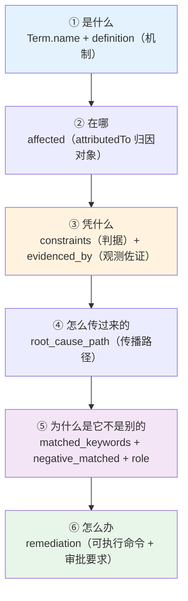

| 层 | 回答的问题 | 数据来源（全部来自本体） |
|---|---|---|
| **① 是什么** | 这个根因是什么机制 | `Term.name` + `Term.definition` |
| **② 在哪** | 它落在哪个组件上 | `Relation` 中 `connection_condition` 以 `attributedTo:` 开头的目标 → `affected` |
| **③ 凭什么** | 用什么判据、哪条指标印证 | 以该术语为 `target` 的 `Constraint.description` → `constraints`；`evidencedBy:` 关系的目标 → `evidenced_by` |
| **④ 怎么传过来的** | 从根因到症状的传播链路 | `trace_path_to_root()` 的 BFS 最短路径 |
| **⑤ 为什么是它不是别的** | 命中/排除了哪些关键词，它的角色是什么 | `matched_keywords` + `negative_matched`（前缀 `!`）+ `Term.role` + `Term.scoring_rationale` |
| **⑥ 怎么办** | 具体操作、命令、是否需要审批 | `Term.remediation[]` |

**关键点：这六层的信息全部来自本体的**既有字段**，代码没有另编任何知识。**

> 【本项已实证】源码注释明确表达了这个设计原则：
>
> 这些信息本体里**本来就有**，只是没被取出来用：
> - `definition` / `scoring_rationale` → 机制与判别理由
> - 关系里带 `attributedTo:` 前缀的 → **归因对象**（根因落在哪个实例上）
> - 关系里带 `evidencedBy:` 前缀的 → **观测佐证**（哪条指标在印证）
> - 以本术语为 target 的 constraint → **判据**（阈值/容量口径、严重度、作用域）
>
> 全部来自本体（版本化、可评审），**不在代码里另写一份知识**。

### 16.3 一个真实的结论文本示例

把上面六层组织起来，一条根因结论长这样（示意，字段取自实际代码路径）：

```
【根因】根因：InnoDB 行锁等待（rc:row-lock）        置信度 0.86 / 类别 数据

① 是什么
   机制：长事务持有 t_txn 的 next-key 锁（全表 FOR UPDATE），
        阻塞其他写入并逐级占满应用连接池

② 在哪
   归因对象：db:primary（MySQL 主库节点）

③ 凭什么
   判据：Innodb_row_lock_current_waits > 0 持续 1m 判定存在行锁等待（长事务持锁）
         [con:row-lock，severity=block，作用域 db:primary]
   观测佐证：metric:conn-exhaust（连接池耗尽信号）

④ 怎么传过来的
   rc:row-lock → ds:pay → app:payment-app
   （composition / association 逐跳，每跳带 relation_type 与条件）

⑤ 为什么是它不是别的
   命中关键词：行锁 / lock wait / 锁等待 / 长事务 / innodb_row_lock
   排除关键词：!复制 / !副本 / !oom

⑥ 怎么办
   [P0] 查询当前锁等待：SELECT * FROM information_schema.innodb_trx WHERE trx_state='LOCK WAIT'
        （needs_approval=true）
   [P1] 定位并终止长事务：SELECT trx_mysql_thread_id, trx_started, trx_query FROM information_schema.innodb_trx
        （needs_approval=true）
```

**这份结论与"根因是 rc:row-lock，置信度 0.86"的差别，就是"能被信任"与"不能被信任"的差别。**

### 16.4 【生产扩展设计】证据分级与置信度校准

**证据分级**（在第 4 章已定义 A/B/C 三级）。生产环境的结论文本应当显式标注证据等级：

```
③ 凭什么
   [A 级证据] 实测 PromQL：rate(mysql_global_status_innodb_row_lock_waits[2m]) = 0.190
              （空闲基线 0.000，阈值 0.02）← 可一键重放
   [A 级证据] mysql_global_status_threads_connected = 180 / max_connections = 200
```

**【生产扩展设计】置信度校准机制。**

当前的置信度是**打分公式的输出**（[0.05, 0.99] 的连续值），它**不是概率**。这意味着"置信度 0.86"不能解释为"86% 的概率是对的"。

**生产环境必须做置信度校准**，否则运维人员会误读这个数字：

| 校准步骤 | 做法 |
|---|---|
| 1. 收集标注样本 | 积累历史事件的运维反馈（CONFIRMED / REJECTED / PARTIAL） |
| 2. 分桶统计 | 按置信度区间分桶，统计每桶的实际正确率 |
| 3. 拟合映射 | 用等渗回归（isotonic regression）或 Platt scaling 拟合"分数 → 概率"的映射 |
| 4. 应用映射 | 输出的置信度改为校准后的概率，并标注"基于 N 个历史样本校准" |
| 5. 定期重校准 | 每次本体演化或告警规则变更后重新校准 |

**没有校准的置信度是有害的**：它给运维人员一种虚假的量化确定感。

**另一项生产建议：置信度的可视化分档。**

| 分档 | 建议行为 |
|---|---|
| **高**（校准后 ≥ 0.9） | 可直接采信，自动生成处置工单草稿 |
| **中**（0.6 ~ 0.9） | 展示根因 + 证据链，建议人工确认后执行 |
| **低**（< 0.6） | 展示候选列表 + 缺失的证据清单，**不给出唯一根因** |

---
---

# 第五篇 银行生产环境：大规模可信本体

> **本篇声明**：本篇为 **【生产扩展设计】**。方法论与推理机制与第二~四篇完全一致，但具体的分层方案、采集方式、治理流程需要结合目标环境的实际情况重新评审与验证。
>
> 本篇的推算基准来自【本项已实证】的本项目数据：一个应用子系统（3 副本应用 + 网关 + 1 主 2 只读副本数据库 + 监控栈）建模产出为 **54 Term / 67 Relation / 17 Constraint / 21 Evidence**。

## 第 17 章 规模带来的四个真实挑战

### 17.1 规模量化：从 54 到十万

先做一道必要的算术题。假设一个中等规模银行数据中心的现状：

| 资源类型 | 数量 | 建模产出的语义对象（估算） |
|---|---|---|
| 业务应用 / 微服务 | 300 个 | 每个应用 1 个 Term（类型级）+ 关键接口 5~10 个 → 约 2,000 |
| 中间件实例（Kafka / Redis / Nginx / MQ / ES 等） | 200 个实例 | 类型 30 个 + 实例接地 Mapping 200 个 → 约 600 |
| 数据库实例（Oracle / MySQL / 分布式库） | 150 个 | 类型 40 + 库/表/索引/关键视图 → 约 3,000（表级可选） |
| 服务器（物理 + 虚拟） | 3,000 台 | **类型级建模 + 实例靠标签接地** → 类型 40 + 分组/域 500 → 约 600 |
| 交换机 / 路由器 / 防火墙 / 负载均衡 | 800 台 | 类型 30 + 网络域/分区 200 → 约 400 |
| 存储（SAN / NAS / 分布式存储） | 50 套 | 类型 25 + 存储池/卷/LUN 500 → 约 600 |
| 通用根因类型 | — | 每层 20~40 个 → 约 200 |
| 通用约束 | — | 每层 30~50 条 → 约 300 |
| 通用观测指标 | — | 每层 50~150 条 → 约 700 |
| **合计** | | **约 8,400 个语义对象**（Term + Relation + Constraint + Mapping + Evidence 计入关系数后总量可达 3~10 万） |

**这个数量级下，本项目"人工逐条编写"的做法完全不可行。** 按本项目的建模速度（一个子系统 54 个术语，需要领域专家 + 工程师配合数天），线性外推需要数百人月。

**规模带来四个具体的、必须正面回答的挑战。**

### 17.2 挑战一：可信性——如何让"可信"可度量

**问题的本质**：本体规模越大，"有多少条语义是错的"就越难知道。在 54 条术语的规模，专家可以通读评审；在 8,400 条语义对象的规模，通读不可能。

**更深一层的问题**：错误分三类，危害程度差异极大：

| 错误类型 | 示例 | 危害 |
|---|---|---|
| **语义错误** | 把"只读副本延迟"的机制写成"主库延迟" | **最严重**——会导致根因判反方向 |
| **结构错误** | 关系方向建反；孤立的术语 | 中——会导致路径追踪断裂 |
| **接地错误** | Mapping 指向了错误的指标名 | 中——证据查不到（但不会误导方向） |
| **措辞错误** | description 不通顺 | 低——不影响推理 |

**传统方案无法区分这四类**，因此只能"全部严格评审"，成本高到不可持续。

**本方法论的回答**：把"可信"分解为**三个可自动计算 + 一个必须人工评审**的维度（详见第 19 章）：

| 维度 | 是否可自动计算 | 计算方式 |
|---|---|---|
| **有据可依** | ✅ | 每条语义是否有 A 级证据支撑 |
| **结构自洽** | ✅ | 交叉引用可解析 + 关系类型合法 + 无孤立节点 + 可诊断性得分 |
| **接地有效** | ✅ | 引用的指标名/表名/命令是否真实存在且可执行 |
| **语义正确** | ❌ **必须人工** | 只能靠领域专家评审——但**可以大幅缩小评审范围** |

### 17.3 挑战二：效率——如何避免线性人月

**问题的本质**：8,400 个语义对象如果全靠人工编，成本不可接受。

**关键洞察：这 8,400 个对象中，绝大多数的"形"是重复的，只有"值"不同。**

举例：300 个应用虽然业务不同，但它们与数据库、中间件的关系**形**是一样的：

```
应用 --hasDataSource--> 数据源 --dataSourceOf--> 数据库实例
应用 --dependsOn--> 中间件实例 --connectsTo--> 主机
应用 --runsOn--> 容器 --deployedOn--> 主机 --connectsTo--> 交换机端口
```

**这意味着一次建模的定义可以被"参数化复用"到几百个实例。**

**本方法论的回答**（详见第 20 章）：

1. **六层资源域 + 语义契约**：定义每层"必须有哪些字段、允许哪些关系类型"；
2. **元模型（Meta-Model）**：把关系模式抽象为可实例化的模板；
3. **垂直切片 + 反模式裁剪**：先做透一条业务路径，再横向复制；
4. **自动化生成 + 人工确认**：从 CMDB / 监控 / 编排平台自动生成草稿，人工只做确认与修正。

### 17.4 挑战三：变更——拓扑每天在变

**问题的本质**：银行的拓扑和配置**每天都在变**：上线新应用、扩缩容、更换交换机、迁移数据库、调整中间件参数。本体如果跟不上，就会迅速腐化。

本项目已经体验过这个问题的"缩小版"：

> 【本项已实证】环境从"单容器 + 单库"演进为"3 副本 + 网关 + 1 主 2 只读副本集群"时，本体的 18 个术语里没有任何副本/集群/网关/复制/配额概念，21 个故障场景中只有 1 个可诊断（得分 **0.048**）。

**在银行环境的变更频率下，这类漂移不是偶发事件，而是常态。**

**本方法论的回答**（详见第 21 章）：把变更分为四类，建立四条处理通道——**关键在于不是所有变更都需要走完整的演化流程**：

| 变更类型 | 频率 | 处理通道 | 是否走门控 |
|---|---|---|---|
| ① 配置属性变更（参数值、配额） | 极高（每天） | **自动增量接地** | ❌ 不走（只需保证 Mapping 有效） |
| ② 拓扑变更（新增/下线组件） | 高（每周） | **半自动增量 + 差异校验** | ❌ 不走（但需差异报告） |
| ③ 新故障模式发现 | 中（每月） | **人工主导 + 成对评估** | ✅ **走完整门控** |
| ④ 模型层变更（新增层/关系类型/schema） | 低（每季度） | **架构评审 + 全量回归** | ✅ 走门控 + 人工审批 |

### 17.5 挑战四：可信检索——BFS 上限失效

**问题的本质**：本项目用"从入口实体出发、BFS 160 节点 / 6 跳"来界定候选集。这在 54 个术语的规模下合理。

**但在 8,400 个语义对象、关系图上，从入口出发 6 跳会覆盖几万个节点。** 这会导致：

1. **性能崩溃**：每次诊断都要遍历整个图；
2. **候选集污染**：候选根因里混入大量无关实体，置信度失去区分力；
3. **LLM 上下文爆炸**：无法把这么大的子图放进 Prompt。

**本方法论的回答**（详见第 20 章）：

1. **分域子图（Domain Subgraph）**：按业务域/资源域切分图，检索时先定位域，再在域内展开；
2. **按需展开（Lazy Expansion）**：不预先展开全图，而是在推理过程中按需展开（类似数据库的 lazy loading）；
3. **相关性剪枝**：按关系类型、时间窗口、告警类别对候选集剪枝；
4. **分层检索**：先检索类型级术语，再按需接地到实例。

---

## 第 18 章 分层建模框架：六层资源域与语义契约

### 18.1 总体框架

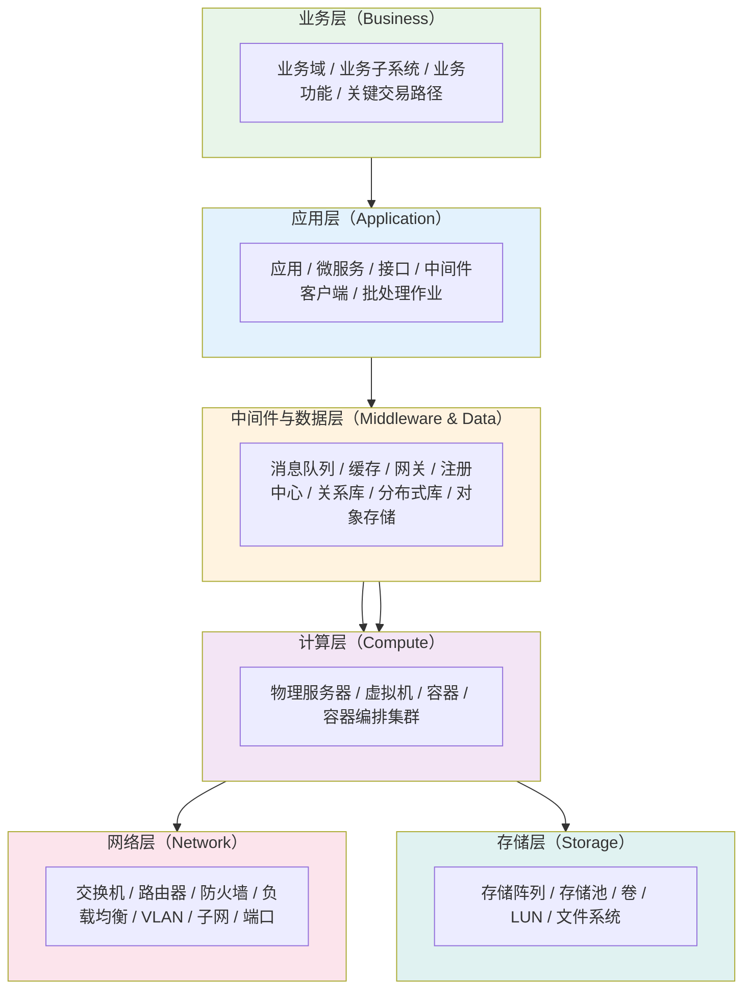

**六层的划分依据是"故障传播的物理边界"**：故障在层内传播的机理（同层组件互相影响）与跨层传播的机理（上层依赖下层）是不同的，因此需要不同的关系类型与不同的根因模式。

### 18.2 每层的语义契约

**语义契约（Semantic Contract）** 定义了每一层"必须建模什么、允许什么关系类型"。**它的作用与 Schema Layer 一致：确定表达边界，防止本体无限膨胀。**

#### 第 7 层：业务层

| 契约项 | 内容 |
|---|---|
| **实体类型** | `业务域` / `业务子系统` / `业务功能` / `关键交易路径` / `业务指标` |
| **允许的关系类型** | `composition`（域包含子系统）、`hierarchy`（业务分类上下位）、`derivation`（业务指标由应用指标聚合） |
| **必须字段** | `id` / `name` / `type` / `definition`（业务含义）/ `scope` / `owner`（业务负责人）/ `criticality`（P0~P3 关键度） |
| **证据来源** | 业务架构文档、交易量报表、业务影响分析（BIA） |
| **典型根因** | 通常不作为根因，而是作为**影响面**（"这个技术故障影响了哪些业务"） |
| **建模要点** | **必须建立"业务功能 → 技术组件"的映射**，否则无法回答"这个故障影响了哪些客户" |

> **为什么业务层必须建模？** 因为这是运维智能体从"技术根因"走向"业务影响"的桥梁。银行值班工程师最先被问到的问题通常不是"哪个组件坏了"，而是"**影响多少客户、影响哪些交易**"。没有业务层，"技术根因 → 业务影响"这一段只能靠人脑补。

#### 第 6 层：应用层

| 契约项 | 内容 |
|---|---|
| **实体类型** | `应用` / `应用集群` / `应用副本` / `服务接口` / `业务功能` / `中间件客户端` / `批处理作业` |
| **允许的关系类型** | `composition`（应用包含接口/功能）、`association`（应用调用接口/访问中间件）、`equivalence`（同一应用的集群视图与单实例视图）、`derivation`（应用可用性由副本健康度派生） |
| **必须字段** | `id` / `name` / `type` / `definition` / `scope` / `version` / `owner` / `criticality` / `sla` |
| **证据来源** | 编排平台 API、应用注册中心、配置中心、APM、代码仓库 |
| **典型根因** | 应用副本丢失 / 假死 / OOM / CPU 节流 / 网关不可用 / 依赖超时 / 代码缺陷 |
| **建模要点** | **类型级建模 + 实例靠标签接地**。应用副本数会变，不能为每个副本建术语 |

**本项目在这一层的实证经验直接适用**：`app:payment-app-cluster`（集群视图）与 `app:instance-1/2/3`（副本）的建模方式，以及 `metric:replica-healthy-count`（在册健康副本数）这个关键指标。

#### 第 5 层：中间件与数据层

| 契约项 | 内容 |
|---|---|
| **实体类型** | `消息队列集群/实例/Topic/消费组` / `缓存集群/实例/分片` / `API 网关/路由` / `注册中心` / `关系数据库集群/主库/只读副本/库/表/索引` / `分布式数据库/分片` / `对象存储/Bucket` |
| **允许的关系类型** | `composition`（集群含实例、库含表、Topic 属于集群）、`association`（应用连接中间件）、`hierarchy`（中间件产品分类）、`equivalence`（主备/同义视图） |
| **必须字段** | `id` / `name` / `type` / `definition` / `scope` / `role`（主/从/分片） / `capacity`（连接数/分区数/内存） / `version` |
| **证据来源** | 中间件自身的管理 API / 命令行、Exporter 指标、配置中心 |
| **典型根因** | 分区不均 / 消费堆积 / 缓存穿透/击穿/雪崩 / 主从延迟 / 复制中断 / 主库只读 / 连接池耗尽 / 行锁等待 / 慢查询 / 临时表落盘 / 大 Key / 热点分片 |
| **建模要点** | **必须显式建模"角色"（主/从/分片）**——本项目实测证明，角色信息不写进约束判据会导致根因判反（详见第 6.3.3 节的真实案例） |

**本项目这一层的实证经验**：`db:mysql-cluster` / `db:primary` / `db:mysql-replica` 三件套 + `metric:replica-lag` / `metric:replica-io-running`，完整覆盖了复制类故障的诊断。

#### 第 4 层：计算层

| 契约项 | 内容 |
|---|---|
| **实体类型** | `物理服务器` / `虚拟机` / `容器` / `容器编排集群` / `节点池` / `机架` / `机房/可用区` |
| **允许的关系类型** | `composition`（集群含节点、节点含容器、机架含服务器）、`association`（跨机房网络） |
| **必须字段** | `id` / `name` / `type` / `definition` / `scope` / `cpu` / `memory` / `disk` / `os` / `location`（机房/机架） |
| **证据来源** | CMDB、虚拟化平台 API、容器编排 API、节点 Exporter、IPMI/带外管理 |
| **典型根因** | CPU/内存/磁盘耗尽 / 磁盘 IO 饱和 / 网卡丢包 / 内核参数不当 / 宿主机故障 / 虚拟机漂移 |
| **建模要点** | **3,000 台服务器绝不能建 3,000 个术语**。采用"类型级术语 + 标签接地"：建 `host:physical-server` 一个类型术语，用 `Mapping` 把实例接地到 CMDB 的 `host_id` / 监控的 `instance` 标签 |

> **【本项已实证】这条要点在本项目已有验证的雏形**：`env:host-phys` 是"物理宿主机"**类型**，具体实例信息（CPU 型号、内存大小）写在 `definition` 里作为示例，而不是为每台机器建术语。`env:container` 同理——3 个应用副本共用一个 `env:container` 类型术语，实例区分靠监控标签 `app_instance`。

#### 第 3 层：网络层

| 契约项 | 内容 |
|---|---|
| **实体类型** | `交换机` / `路由器` / `防火墙` / `负载均衡` / `VLAN` / `子网` / `端口` / `链路` / `网络域/分区`（DMZ / 生产区 / 办公区） |
| **允许的关系类型** | `composition`（设备含端口、网络域含子网）、`association`（链路连接、路由可达、策略允许）、`hierarchy`（网络分区层级） |
| **必须字段** | `id` / `name` / `type` / `definition` / `scope` / `location` / `vendor` / `capacity`（带宽/端口数） |
| **证据来源** | 网络管理系统（NMS）、SNMP、NetFlow/sFlow、CMDB、网络自动化平台 |
| **典型根因** | 链路拥塞 / 端口 down / 丢包 / 环路 / 路由震荡 / 防火墙策略阻断 / 会话表满 / MTU 不匹配 / 光衰 |
| **建模要点** | ① **网络层的建模目的是回答"两个组件之间的路径上有没有问题"**，因此**链路与端口比设备本身更重要**；② 交换机数量多但**拓扑关系相对稳定**，适合一次性建成、低频维护；③ **必须建模网络分区边界**，因为跨分区故障的排查路径与同分区完全不同 |

> **【生产扩展设计】网络层的一个特殊难点**：网络故障的"根因"往往是**路径上的某一跳**，而不是某个具体设备。因此建议在关系层显式建模"路径"：
>
> ```
> 应用A --networkPath--> 应用B
>   networkPath 由若干 hop 组成：LB → FW → CoreSW → AggSW → AccessSW → Host
> 每一跳关联一个 `链路` 或 `端口` 实体
> ```
>
> 这样"应用间调用变慢"可以沿路径逐跳核查，而不是面对一张巨大的设备清单。

#### 第 2 层：存储层

| 契约项 | 内容 |
|---|---|
| **实体类型** | `存储阵列` / `存储池` / `卷` / `LUN` / `文件系统` / `分布式存储集群` / `对象存储` / `备份域` |
| **允许的关系类型** | `composition`（阵列含池、池含卷、卷挂载到主机）、`association`（复制/镜像关系） |
| **必须字段** | `id` / `name` / `type` / `definition` / `scope` / `capacity_total` / `capacity_used` / `iops_limit` / `raid_level` / `replication_role` |
| **证据来源** | 存储管理平台 API、SNMP、主机侧 `df` / `iostat` / `multipath`、备份系统 |
| **典型根因** | 容量耗尽 / IOPS 打满 / 时延升高 / 链路降级（多路径失效）/ RAID 降级 / 快照空间耗尽 / 复制中断 |
| **建模要点** | ① **"卷 → 主机"的挂载关系是跨层关键路径**，必须建模；② 存储故障常表现为"主机磁盘 IO 高"，需要能反向追溯到共享该存储的其他主机（**邻居影响**） |

### 18.3 层间关系设计

**层间关系是本体中最容易失控的部分。** 如果允许任意层之间建任意关系，关系数量会爆炸（N² 增长），而且图遍历会失去方向。

**【生产扩展设计】三条层间关系规则：**

**规则一：只允许"相邻层 + 依赖方向"的层间关系。**

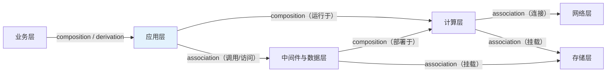

**明确禁止**：应用层直接连存储层（中间必须经过数据层或计算层）、业务层直接连计算层（中间必须经过应用层）。**禁则的意义在于保证故障传播路径的唯一性和可解释性。**

**规则二：层间关系必须"稀疏可枚举"。**

判据：任一实体跨层关系数不应超过 **50**。超过说明抽象层次选错了。

> **本项目实证**：`app:payment-app` 的跨层关系只有 4 条（→容器、→数据库、→数据源、→接口）。这个数量级让路径追踪保持清晰。

**规则三：每条层间关系必须能被独立观测。**

**自检问题**：这条跨层关系，我能用什么指标/命令验证它确实存在？

| 关系 | 可验证方式 |
|---|---|
| 应用 → 数据库 | 应用侧 JDBC/连接池指标、`performance_schema` 的客户端连接 |
| 容器 → 宿主机 | 编排平台 API、cgroup 归属 |
| 主机 → 交换机端口 | NMS 的 MAC 地址表 / LLDP 邻居 |
| 主机 → 存储卷 | 主机侧 `multipath -ll` / `lsblk` |

**无法验证的跨层关系不应建模**——因为它会成为不可信语义的温床。

### 18.4 用本项目的数据验证分层框架

把本项目的 54 个术语映射到六层框架，可以看到**规模虽小，但层次是完整的**：

| 层 | 本项目实际术语 | 数量 |
|---|---|---|
| 业务层 | （缺失——本项目未建模业务功能到客户的映射） | 0 |
| 应用层 | `app:payment-app` `app:payment-app-cluster` `app:instance-1/2/3` `fn:auth` `api:auth` | 6 |
| 中间件与数据层 | `db:mysql-core` `db:mysql-cluster` `db:primary` `db:mysql-replica` `ds:pay` `table:t_txn` `table:t_customer` `table:t_audit` `idx:txn-created` `idx:txn-customer` `env:gateway` | 11 |
| 计算层 | `env:container` `env:host-wsl` `env:host-phys` `env:cluster` | 4 |
| 网络层 | （缺失——项目用 blackbox 探针代替了显式网络建模） | 0 |
| 存储层 | （缺失——项目未建模存储） | 0 |
| 跨层支撑（指标/告警/事件/根因/约束） | `metric:*`（11）`alert:p99` `incident:payment-timeout` `evt:deploy` `rc:*`（15）`con:*`（17） | 54（含约束） |

**这张表本身就是最有价值的差距分析**：

| 缺口 | 影响 | 生产环境补齐方式 |
|---|---|---|
| **业务层缺失** | 无法回答"影响哪些客户/交易" | 从业务架构文档 + 交易监控系统导入 |
| **网络层缺失** | 无法诊断网络根因（本项目用 `rc:net-fault` 类型级覆盖） | 从 NMS + CMDB 导入设备与链路 |
| **存储层缺失** | 无法诊断存储根因 | 从存储管理平台导入 |

**这三项正是生产环境必须扩展的地方，而扩展的方式是在既有框架里"填空"，不是重构。** 这就是分层框架的价值——它让扩展变成可预期、可分工的工作。

---

## 第 19 章 可信性工程：让每条语义都"可被证明"

### 19.1 可信性的四层验证

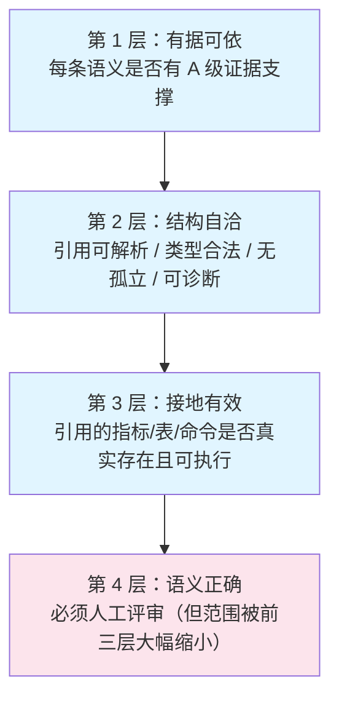

**这个分层的价值在于：前三层可以全自动、每次提交都跑，而它们能把需要人工评审的范围缩小一个数量级。**

举例：如果一条语义**没有 A 级证据**、或**引用了不存在的指标**，它根本进不了人工评审——直接被自动校验拦下。人工评审只需要面对"结构正确、接地有效、有据可依"的语义，此时只需判断"**语义对不对**"这一个问题。

### 19.2 第 1 层：有据可依（Evidence Completeness）

**校验规则：**

| 规则 | 判据 | 违规处理 |
|---|---|---|
| 每个 `Term` 必须有 `evidence_refs` | 非空数组 | 拒绝发布 |
| 每个 `Relation` 必须有 `evidence_refs` | 非空数组 | 拒绝发布（拓扑关系必须有观测支撑） |
| 每个 `Constraint` 必须有 `evidence_refs` | 非空数组 | 拒绝发布 |
| 每个 `Mapping` 必须有 `evidence_refs` 或 `validation` | 至少一个 | 拒绝发布 |
| 证据必须达到 A 级或 B 级 | `validation_method` 属于自动/半自动可重放 | 标记为"证据不足"，不得作为唯一依据 |

**⚠️ 一个必须知道的重要事实（源码核实）：**

> **核心框架的 `validate()` 只检查证据引用"能否解析"（即 `evidence_refs` 里的 id 是否存在于 `evidence.json` 中），不检查 Evidence 记录本身的完整性与质量。**
>
> 也就是说：一条 Evidence 记录即使 `query` 为空、`result` 为空，也能通过校验。

**因此生产环境必须自建"证据质量校验"：**

| 自建校验项 | 判据 |
|---|---|
| `query` 非空 | 必须是可以照抄执行的原文 |
| `query` 是可执行的 | 按 `validation_method` 分类校验：PromQL → 调 Prometheus API；SQL → 语法解析 + 只读校验；HTTP → 探活；命令 → 白名单校验 |
| `result` 非空 | 必须有实际返回内容 |
| `validation_method` 已登记 | 必须在允许的方法白名单内 |
| `timestamp` 未过期 | 核心语义的证据不超过 30 天（可配置） |
| **证据可重放** | 周期任务重放 A 级证据，比对结果是否等价。**这是唯一能发现"证据腐化"的手段** |

### 19.3 第 2 层：结构自洽（Structural Integrity）

#### 19.3.1 框架自带的校验（可用，但不够）

【本项已实证】`validate()` 提供的九项检查（源码核实）：

| # | 检查项 | 错误信息示例 |
|---|---|---|
| 1 | `active.json` 存在且合法 | `Missing <path>` / `Invalid active.json: ...` / `active.json has no 'active_version'` |
| 2 | 版本名是单一路径组件（防目录穿越） | `<label> must be a single path component` |
| 3 | 版本目录存在 | `Version directory missing: <path>` |
| 4 | 五个文件齐全 | `Missing file: <path>` |
| 5 | 每个文件是合法 JSON 数组 | `Invalid JSON in <filename>: ...` / `<filename> must be a JSON list` |
| 6 | 每条记录是有 id 的对象 | `<filename>[<index>] must be an object with an id` |
| 7 | id 在同一文件内唯一 | `<filename>: duplicate id '<id>'` |
| 8 | **交叉引用可解析** | `relation {id}: unresolved source 'xxx'` / `constraint {id}: unresolved target 'xxx'` / `term {id}: unresolved evidence ref 'xxx'` 等 |
| 9 | 运行时能加载 | `Store load failed: ...` |

#### 19.3.2 生产必须自建的校验（源码核实框架**不做**的部分）

| # | 自建校验项 | 为什么必须 |
|---|---|---|
| 1 | **`relation_type` 白名单** | 框架不校验。可以写出 `affects` / `belongs_to` 并通过发布 |
| 2 | **`Term.type` 白名单** | 框架不校验 |
| 3 | **`Constraint.constraint_type` 白名单** | 框架不校验。**选错会直接导致根因类别推导失败** |
| 4 | **`Constraint.severity` 白名单** | 框架不校验，且**无法识别的值会被静默规范为 `warn`**（不报错！） |
| 5 | **必填字段非空** | 框架只校验 `id`。`definition` 为空的术语可以发布 |
| 6 | **`lifecycle.state` 白名单** | 框架不校验。且非法状态会让记录**静默不可见**（智能体看不到，但在文件里存在）——这是最隐蔽的一类问题 |
| 7 | **`connection_condition` 前缀格式** | 框架不校验。前缀写错会导致 `affected` / `evidenced_by` 字段全空，**升级与证据链功能静默失效** |
| 8 | **无孤立节点** | 框架不校验。游离术语会污染打分（它们仍参与文本匹配） |
| 9 | **入口可达性** | 框架不校验。有术语但不可达 = 不可诊断 |
| 10 | **指标名真实性** | 框架不校验。**本项目真实发生过**（引用了不存在的指标） |
| 11 | **`command` 字段的 ASCII 与可执行性** | 框架不校验。**本项目真实发生过**（12 条散文混入） |
| 12 | **新增术语是否引入回归** | 框架不校验。需要成对评估（第 8 章） |

> **这 12 项构成了银行环境"生产可信性工程"的核心清单。** 本项目已实现其中 4 项（指标名真实性、ASCII 校验、必填字段、可诊断性得分），其余 8 项需要在生产实施中补齐。

### 19.4 第 3 层：接地有效（Grounding Validity）

**"接地"指的是语义对象与实际数据源的绑定。** 本体的可信度最终取决于接地是否有效。

#### 19.4.1 Mapping 的周期校验（【生产扩展设计】）

| 校验项 | 做法 | 频率 |
|---|---|---|
| **指标名存在** | 用 Prometheus 的 `/api/v1/label/__name__/values` 拉取全部指标名，与本体引用的指标名做差集 | 每日 |
| **指标有数据** | 对每个引用的指标执行 `count(<metric>)`，结果为 0 说明"指标存在但无数据" | 每日 |
| **SQL 可执行** | 在只读账户下执行 Mapping 的 `query`，校验语法与权限 | 每周 |
| **表/字段存在** | 查询 `information_schema` 校验 | 每日 |
| **聚合口径正确** | 人工抽检（这部分无法自动校验） | 每季度 |

> **【本项已实证】指标名校验在本项目已经落地**：`ontology_remediation_patch.py` 中的 `valid_metric_names()` 与 `term_command_problems()` 会校验处置命令引用的指标名是否真实存在于监控系统。这正是把"实测发现的错误"固化为"自动校验"的产物。

#### 19.4.2 漂移检测（【生产扩展设计】）

**漂移 = 本体描述的与现实不一致。** 三类漂移及其检测方式：

| 漂移类型 | 检测方式 | 处置 |
|---|---|---|
| **实体漂移**（本体里有、现实中已下线） | 周期校验所有 Entity 类术语的接地 Mapping 是否仍有数据；无数据即标记 `lifecycle.state = deprecated` | 半自动（人工确认后标记） |
| **关系漂移**（拓扑变了、本体没变） | 对比 CMDB / 编排平台的当前关系与本体关系，做差集 | 半自动（差异报告 + 人工确认） |
| **观测漂移**（指标改名/删除/口径变化） | 指标名与数据存在性校验 | **全自动**（自动更新 Mapping 或告警） |

**建议的漂移指标（本体新鲜度）：**

```
本体新鲜度 = 1 − (过期语义对象数 / 语义对象总数)

其中"过期" = 最后验证时间距今 > 阈值（核心路径 30 天，非核心 90 天）
```

**这个指标应当纳入运维大盘**——它和"服务可用性"一样是需要持续监控的健康指标。

### 19.5 第 4 层：语义正确（必须人工，但范围可缩小）

#### 19.5.1 评审范围压缩策略

**核心思路：不是所有语义都同等重要，因此评审深度应当分层。**

| 风险等级 | 判据 | 评审方式 |
|---|---|---|
| **关键** | 涉及 P0/P1 交易路径；是 `role=root_cause` 的术语；是 `severity=block` 的约束 | **双人评审 + 架构师签署** |
| **重要** | 涉及 P2 路径；是 `role=component` 的术语 | 单人专家评审 |
| **一般** | `role=observation` 的指标术语；非核心路径 | 抽样评审（如 20%） |
| **低** | 描述性字段的措辞调整 | 无需评审（走自动校验） |

**关键判据的量化定义**：

```
关键语义 = { 
  Term.role == "root_cause" 
  AND (Term 通过 attributedTo 关联的组件属于 P0/P1 业务路径)
} ∪ {
  Constraint.severity == "block"
}
```

#### 19.5.2 三类语义错误的专项检查

**错误类型一：机制描述错误（最危险）。**

| 检查方法 | 说明 |
|---|---|
| **反事实检验** | "如果这条定义写错了，会导致什么错误结论？" 如果答案是"根因判反方向"，则必须双人评审 |
| **路径检验** | 机制描述中的传播链条，是否与 `Relation` 里建的拓扑路径一致？不一致说明有一处错了 |
| **判据检验** | `definition` 中描述的现象，是否有一条 `Constraint` 能观测它？没有说明定义与判据脱节 |

**错误类型二：角色/类型标注错误。**

| 检查方法 | 说明 |
|---|---|
| **角色自检** | "这个术语是一个**根因**，还是一个**组件**，还是一个**观测**？" 三类混标会直接破坏打分排序（第 12 章） |
| **约束类型自检** | `constraint_type` 决定根因类别。问："这条约束如果被触发，最可能是什么类别的根因？" 答案与 `constraint_type` 映射的类别是否一致？ |

**错误类型三：关系方向/类型错误。**

| 检查方法 | 说明 |
|---|---|
| **关系类型优先级检验** | 能用 `composition` 表达时不允许退化成 `association` |
| **反向语义检验** | 如果要建反向边，反向语义是否有独立业务含义？有则建，无则靠遍历逻辑处理 |
| **传播方向检验** | 故障能否沿这条边传播？如果不能，它可能只是一条"关联"而非"依赖" |

### 19.6 可信性看板（【生产扩展设计】）

建议的日常运营看板：

| 指标 | 定义 | 目标 | 责任 |
|---|---|---|---|
| **证据覆盖率** | 有 A/B 级证据的语义对象比例 | 100% | 本体工程师 |
| **结构自洽率** | 通过全部结构校验的版本比例 | 100% | 自动 |
| **接地有效率** | Mapping 引用真实存在且有数据的比例 | ≥ 99% | 本体工程师 |
| **语义评审覆盖率** | 关键语义已完成双人评审的比例 | 100% | 架构师 |
| **本体新鲜度** | 未过期语义对象比例 | ≥ 95% | 本体工程师 |
| **诊断 Top-1 准确率** | 确定性引擎 top1 命中率 | ≥ 70% | 本体工程师 |
| **诊断 Top-5 覆盖率** | 期望根因在前 5 候选的比例 | ≥ 95% | 本体工程师 |
| **意图一致率** | Agent 结论与本体结论 `exact` + `category` 的比例 | ≥ 90% | 架构师 |
| **工具成功率** | 工具调用非失败的比例 | ≥ 98% | 平台工程师 |
| **平均诊断耗时** | 从告警到结论的 P50 / P95 | P50 < 5s，P95 < 60s | 平台工程师 |

> **【本项已实证】上述指标中已有多个在本项目落地**：`engine_top1_precision`（Top-1）、可诊断性得分（结构自洽）、`hygiene_contract`（证据覆盖/孤立节点）、`remediation_contract`（接地有效）。**生产环境要做的是把这些指标扩展为持续运行的看板，并补充人工评审维度。**

---

## 第 20 章 效率工程：垂直切片与规模治理

### 20.1 从"逐条建"到"模板化建"

**效率问题的本质是"重复劳动"。** 300 个应用如果逐个从零建模，成本是 300 份人力；如果识别出它们共享同一套语义模式，成本是"1 套模板 + 300 次参数填充 + 抽样确认"。

#### 20.1.1 元模型（Meta-Model）

**元模型 = 关系的模式化抽象。** 它把"某类实体之间**必然**存在某类关系"这件事表达出来，从而可以批量实例化。

【生产扩展设计】六类通用元模型：

| 元模型 | 模式 | 实例化方式 |
|---|---|---|
| **M1 应用部署模式** | `应用 --runsOn--> 容器 --deployedOn--> 主机 --inZone--> 网络域` | 从编排平台 API 批量生成 |
| **M2 应用依赖模式** | `应用 --dependsOn--> 中间件实例 --deployedOn--> 主机` | 从配置中心 + APM 调用链批量生成 |
| **M3 数据访问模式** | `应用 --hasDataSource--> 数据源 --dataSourceOf--> 数据库实例 --contains--> 库 --contains--> 表` | 从数据源配置 + 数据库元数据批量生成 |
| **M4 数据库集群模式** | `数据库集群 --contains--> 主库/只读副本`；`副本 --replicatesFrom--> 主库` | 从数据库自身状态 + 复制关系批量生成 |
| **M5 网络连接模式** | `主机 --connectsTo--> 交换机端口 --belongsTo--> 交换机` | 从 NMS MAC 表 / LLDP 邻居批量生成 |
| **M6 存储挂载模式** | `卷 --mountedOn--> 主机`；`卷 --belongsTo--> 存储池 --belongsTo--> 阵列` | 从存储管理平台 + 主机 `multipath` 批量生成 |

**元模型的价值**：它把"建关系"从**判断工作**降级为**填充工作**。判断工作（"这两个实体之间应该是什么关系"）只做一次，之后是机械的参数填充。

#### 20.1.2 约束模板库

**约束是本体中最"贵"的记录**（同时服务三个推理环节），但它的形态高度重复。按层建立模板库：

| 模板 | 适用层 | 模板内容 |
|---|---|---|
| `T-CAP-QUOTA` | 计算/中间件 | 资源使用率超过 `capacity_limit × ratio` 且持续 `duration` → 容量类根因 |
| `T-CAP-QUORUM` | 应用/数据库/中间件集群 | 在册健康副本数 < `expected_replicas` → 副本丢失 |
| `T-AVAIL-PROBE` | 全部 | 外部探针失败持续 `duration` → 不可用（**必须用外部探针，不能用自报指标**） |
| `T-THRESHOLD-LATENCY` | 全部 | 延迟 P99 > `threshold` 持续 `duration` → 性能退化 |
| `T-REPL-LAG` | 数据库/存储 | 复制延迟 > `threshold` → 复制延迟 |
| `T-REPL-BROKEN` | 数据库/存储 | 复制线程状态异常 → 复制中断 |
| `T-ROLE-DRIFT` | 数据库 | 角色配置偏离期望 → 配置漂移 |
| `T-LOCK-WAIT` | 数据库 | 锁等待速率 > `threshold` → 锁竞争 |
| `T-ERROR-BUDGET` | 应用 | 错误率 > `threshold` → 写路径/依赖故障 |
| `T-NET-QUALITY` | 网络 | 丢包率/时延 > `threshold` → 网络质量 |

**本项目已实证其中 7 类模板**（`T-CAP-QUORUM` → `con:app-replica-quorum`；`T-AVAIL-PROBE` → `con:gateway-availability`；`T-CAP-QUOTA` → `con:app-mem-limit` / `con:app-cpu-throttle`；`T-REPL-LAG` → `con:replica-lag`；`T-REPL-BROKEN` → `con:replica-down`；`T-ROLE-DRIFT` → `con:db-role`；`T-LOCK-WAIT` → `con:row-lock`）。

**模板化的收益**：新增一类中间件（例如 Kafka 集群）时，不需要从零设计约束，只需把 `T-CAP-QUORUM` 实例化为 `con:kafka-broker-quorum`。

### 20.2 垂直切片：先做透一条业务路径

**这是本方法论在实施策略上最重要的一条建议。**

#### 20.2.1 为什么不能"横向铺开"

横向铺开（先把 300 个应用都建成实体，再建关系，再建约束）的问题：

| 问题 | 后果 |
|---|---|
| 反馈周期长 | 建到一半才发现框架设计有问题，返工成本巨大 |
| 无法验证价值 | 没有一条路径是完整的，无法演示"故障能被诊断" |
| 无法度量 | 没有 ground truth，无法计算可诊断性得分 |
| 组织阻力大 | 半年看不到成果，项目容易被砍 |

#### 20.2.2 垂直切片的定义

**垂直切片 = 一条完整的、端到端可诊断的关键业务交易路径，覆盖它涉及的全部六层。**

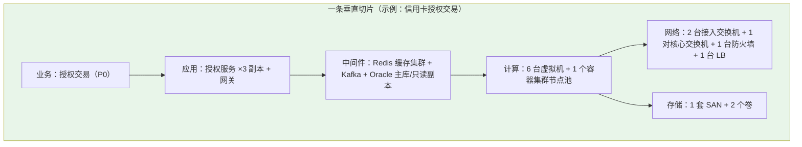

#### 20.2.3 切片的选择标准

| 标准 | 说明 |
|---|---|
| **P0 关键业务** | 必须选对业务影响最大的路径（授权、支付、清算） |
| **技术栈覆盖广** | 应覆盖尽可能多的技术栈（这样才能验证框架的通用性） |
| **故障历史丰富** | 有真实的历史故障与复盘报告（**这是 ground truth 的来源**） |
| **团队配合度高** | 对应的运维团队愿意深度参与（本体建模必须有领域专家） |
| **规模适中** | 太大做不完，太小验证不出问题。建议 **20~60 个组件** |

#### 20.2.4 最小可诊断单元（Minimum Diagnosable Unit）

**【生产扩展设计】这是切片范围的定量判据，建议明确写入实施方案。**

**定义**：一个最小可诊断单元 = 一组本体对象，满足以下三个条件：

| 条件 | 判据 | 对应可诊断性得分的三项 |
|---|---|---|
| **C1 有根因** | 至少覆盖该切片内 ≥ 90% 的历史故障模式，每个模式有一个 `rc:` 术语 | ① term_defined |
| **C2 有路径** | 每个 `rc:` 术语到用户可见入口实体在关系图中连通（≤ 6 跳） | ② path_modelled |
| **C3 有观测** | 每个 `rc:` 术语可观测（本身是 metric / 直连 metric / 是某约束 target） | ③ observable |

**验收判据**：**切片内 ≥ 95% 的历史故障场景的可诊断性得分 = 1.0。**

> **【本项已实证】本项目就是这个判据的实例**：21 个故障场景 / 54 个术语 / 82 条关系 / 29 条约束 / 23 条告警规则，可诊断性得分从 0.048 提升到 **1.000**，端到端严格口径诊断准确率 **17/21 = 81%**。

### 20.3 规模治理的四个技术手段

#### 20.3.1 手段一：类型级建模 + 实例接地

**这是控制术语数量的第一手段。**

| 做法 | 术语数量 | 说明 |
|---|---|---|
| ❌ 为每个实例建术语 | O(实例数) | 3000 台服务器 → 3000 个术语 |
| ✅ 类型级术语 + 标签接地 | O(类型数) | 3000 台服务器 → 1 个 `host:physical-server` 术语 + Mapping 接地到 `host_id` 标签 |

**接地的具体形式**（`Mapping` 记录）：

```json
{
  "id": "map:host-instance-identity",
  "term_id": "host:physical-server",
  "database_source": "prometheus+cmdb",
  "table": "node_uname_info | cmdb_ci_host",
  "column": "instance | host_id",
  "semantic_filter": "所有物理服务器；虚拟化宿主需排除",
  "aggregation_semantics": "identity join（标签 join，不聚合）",
  "grain": "每台服务器一行",
  "validation": "CMDB 记录数与 node_uname_info 的 instance 数一致（差异需人工核对）",
  "confidence": "high"
}
```

**收益**：本体规模从"随实例数线性增长"变成"随类型数增长"，且实例的增删改**完全不需要本体迭代**。

#### 20.3.2 手段二：分域子图（Domain Subgraph）

**解决 BFS 上限失效问题。**

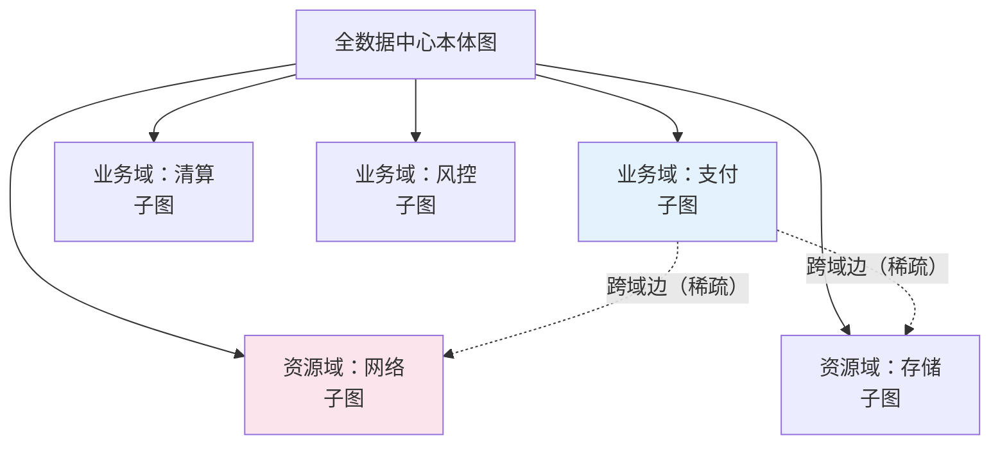

**设计要点：**

| 要点 | 说明 |
|---|---|
| **域的划分依据** | 业务域（按业务子系统）+ 资源域（按资源类型） |
| **域内关系稠密** | 域内允许任意合法关系；BFS 在域内展开 |
| **跨域关系稀疏且显式** | 跨域边必须显式标记（例如 `cross_domain: true` 或在 `connection_condition` 中带域标记） |
| **BFS 策略** | 优先域内展开；仅在需要时通过跨域边进入相邻域；跨域展开计入独立的跳数预算 |

**推荐的 BFS 参数（【生产扩展设计】）：**

```
域内：max_nodes = 200, max_depth = 4
跨域：max_hops = 2 个域（即最多进入 2 个相邻域）
全局上限：max_nodes_total = 500
```

**为什么这样设计**：故障通常沿依赖链在**少数几个域**内传播。"应用域 → 中间件域 → 计算域"是典型的三域路径。而"访问了全图的 8,400 个节点"从来不是诊断所需。

#### 20.3.3 手段三：按需展开（Lazy Expansion）

**不在诊断开始时展开全图，而是在推理过程中按需展开。**

| 阶段 | 展开范围 |
|---|---|
| **初始** | 只展开入口实体的 1 跳邻居（通常是 5~20 个） |
| **打分后** | 对 Top-10 候选，各展开 2 跳邻居 |
| **路径追踪时** | 只在 Top-1 根因与入口之间做 BFS |
| **LLM 主动查询时** | 通过 `resolve_semantics` 按需取（一次最多 5 个概念） |

**这与 EvoOntology 的"主动访问"设计原则一致**："Agent 通过 MCP 工具仅获取当前步骤所需的语义，无需注入完整 Ontology Layer。"

#### 20.3.4 手段四：相关性剪枝

在打分阶段就排除大量不相关实体，减小后续处理规模。

| 剪枝规则 | 说明 |
|---|---|
| **角色剪枝** | `role = observation` / `rule` 的术语降权（已有的角色权重机制） |
| **类别剪枝** | 与 `favoured_categories` 完全不重叠且未命中任何词典词的实体直接排除 |
| **时间窗剪枝** | 只在故障时间窗内活跃的实体参与（需要带时间维度的本体视图） |
| **域剪枝** | 与入口实体不在同一连通域且无跨域边的实体排除 |
| **拓扑距离剪枝** | 距离入口 > N 跳的实体降权 |

> **【本项已实证】本项目已实现其中的两项**：角色剪枝（`ROLE_WEIGHT`）与类别/词典剪枝（"必须至少命中一个词典词"这个前置条件）。源码注释说明了为什么需要后者：「否则'类别对齐'会把同类别术语全部灌进候选」。

### 20.4 自动化生成与人工确认的分工

**【生产扩展设计】建议的分工模型：**

| 工作 | 自动化程度 | 人工角色 |
|---|---|---|
| **实体清单生成** | 90% 自动（从 CMDB / 编排平台拉取） | 抽样确认（10%） |
| **类型归类** | 80% 自动（按命名规则 + 属性特征） | 确认例外 |
| **关系生成**（M1~M6 元模型） | 95% 自动 | 抽查 + 确认异常 |
| **指标接地**（Mapping） | 70% 自动（名称相似度 + 人工映射表） | **重点确认**（这是最容易错的部分） |
| **约束生成**（模板库） | 60% 自动（模板实例化 + 阈值填充） | **必须评审**（判据与阈值需要领域知识） |
| **根因术语** | **0% 自动** | **必须人工编写**（这是领域知识的核心） |
| **处置动作** | 40% 自动（从运维手册提取） | **必须实测验证**（本项目血的教训） |
| **证据采集** | 90% 自动（脚本采集） | 确认可重放性 |

**关键判据：凡是"知识"（根因、判据、处置）都必须人工；凡是"事实"（实体、关系、指标名）都可以自动化。**

### 20.5 分阶段推进路线（【生产扩展设计】）

| 阶段 | 范围 | 周期 | 关键交付 | 验收判据 |
|---|---|---|---|---|
| **P0 试点** | 1 条垂直切片（20~60 组件） | 6~10 周 | 切片本体 + 诊断智能体 + 故障演练报告 | 切片内历史故障可诊断率 ≥ 95%；Top-1 ≥ 70% |
| **P1 单域推广** | 1 个业务域全部关键子系统（3~5 条切片） | 3~6 个月 | 域级本体 + 元模型库 + 自动化生成工具链 | 域内可诊断率 ≥ 90%；本体新鲜度 ≥ 90% |
| **P2 多域扩展** | 3~5 个业务域 | 6~12 个月 | 跨域本体 + 分域子图检索 + 常设本体运维团队 | 全行 P0/P1 路径覆盖 100%；Top-1 ≥ 75% |
| **P3 全数据中心** | 全部六层 | 12~24 个月 | 完整本体 + 持续演化流水线 | 本体新鲜度 ≥ 95%；意图一致率 ≥ 90% |

**每个阶段的"卡口"（Gate）**：不满足验收判据不得进入下一阶段。**这是防止"铺得太快、质量失控"的唯一有效手段。**

---

## 第 21 章 拓扑与配置变更下的本体迭代

### 21.1 变更分类与处理通道

**这是本篇最实用的一章。** 核心洞察是：**不是所有变更都值得走完整的演化协议。** 如果每改一个参数就走一遍"假设 → 候选 → 成对评估 → 门控发布"，演化机制会被琐碎的变更淹没，真正的知识演进反而被拖延。

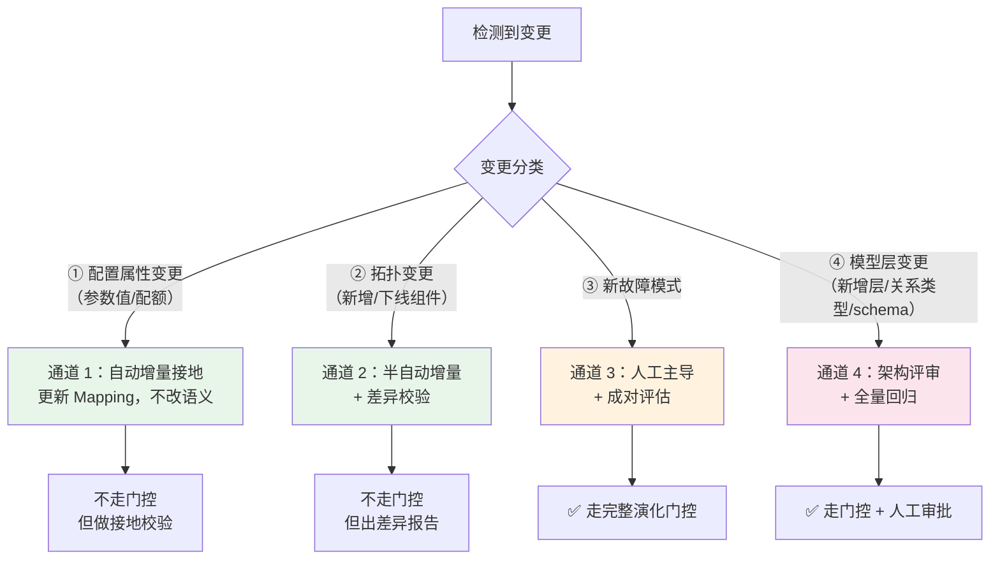

### 21.2 通道 1：配置属性变更（自动增量接地）

**变更内容**：参数值、配额、阈值、连接数上限、内存大小等。

**关键认识**：**这类变更通常不需要改本体的语义，只需要确认"接地仍然有效"。**

| 变更示例 | 对本体的影响 | 处置 |
|---|---|---|
| MySQL `max_connections` 从 200 改为 500 | 约束 `con:db-maxconn` 的判据数值需更新 | 更新 `Constraint.description` 中的数值 + 更新告警规则阈值 |
| 容器 `mem_limit` 从 256MB 改为 512MB | 约束 `con:app-mem-limit` 的判据数值需更新 | 同上 |
| 连接池上限从 10 改为 20 | `Mapping` 的语义过滤/配额需更新 | 更新 Mapping 的 `semantic_filter` |
| 新增一个监控指标 | 需要新增 Mapping 把某术语接地到它 | 新增 Mapping |

**自动化实现**：

```
周期任务（建议每日）：
  1. 从 CMDB / 配置中心 / 监控系统拉取当前配置快照
  2. 与本体中登记的配置值做差集
  3. 对差异项分类：
     a. 仅数值变化 → 自动更新 Constraint.description 中的数值 + 生成告警规则变更工单
     b. 接地失效（指标消失/表结构变化）→ 自动告警 + 标记 Mapping 为待审核
     c. 语义相关变化（角色变化、拓扑变化）→ 转通道 2 或 3
  4. 输出变更报告
```

**⚠️ 一条必须固化的规则：配置值的唯一来源必须是配置系统，本体只做"语义化引用"。**

不要在 `Constraint.description` 里硬写 `max_connections=200`。正确做法是在 `Mapping` 里声明这个值取自哪个配置项，`description` 只写"连接数占用率超过 85%（阈值取自配置系统）"。这样配置变更时本体不需要改。

**本项目当前的实践是硬写数值**（`con:app-mem-limit` 的 description 里写了 `mem_limit=256MB`），这在单一环境可接受，但在生产环境会导致大量无意义的变更。

### 21.3 通道 2：拓扑变更（半自动增量 + 差异校验）

**变更内容**：新增应用、扩缩容、更换设备、迁移数据库、新增中间件实例等。

#### 21.3.1 变更检测的三个来源

| 来源 | 检测方式 | 优缺点 |
|---|---|---|
| **CMDB 增量同步** | 对比 CMDB 快照的版本差异 | ✅ 权威、结构化；❌ 可能滞后于实际 |
| **监控目标变化** | Prometheus 的 `dns_sd_configs` / `targets` API；Zabbix 主机清单 | ✅ 实时、反映实际；❌ 只有"存在性"，缺少关系 |
| **编排平台变化** | Kubernetes API watch / 容器编排事件 | ✅ 事件驱动、实时；❌ 只覆盖容器化部分 |

**三源交叉验证**是提高准确率的手段：CMDB 说新增了应用、监控发现了新 target、编排平台有创建事件 → 三者一致，可信度高；只有一处变化 → 需要人工核查。

#### 21.3.2 差异校验（Diff Validation）

**这是通道 2 的核心动作。**

```
diff = 当前实际拓扑 − 本体已建模拓扑

逐项分类：
  · 新增实体（in 实际, not in 本体）
  · 消失实体（in 本体, not in 实际）
  · 新增关系（实际中存在、本体未建）
  · 关系消失
  · 属性变化（角色、版本、容量）
```

**处置策略：**

| 差异类型 | 自动化处置 | 是否需要人工 |
|---|---|---|
| **新增实例（已有类型术语）** | ✅ 自动生成 `Mapping` 接地，无需新术语 | ❌ 抽样确认 |
| **消失实例** | ✅ 自动标记为不活跃（不改本体） | ❌ 抽样确认 |
| **新增关系（符合元模型）** | ✅ 按元模型自动生成 `Relation` 草稿 | ⚠️ 确认后生效 |
| **消失关系** | ⚠️ 生成"关系可能已失效"报告 | ✅ 人工确认 |
| **新增实体类型（新类型术语）** | ⚠️ 生成术语草稿（用 LLM 辅助生成 definition） | ✅ **必须评审** |
| **角色/容量属性变化** | ✅ 更新术语的 `definition` / Mapping | ⚠️ 关键组件需确认 |

#### 21.3.3 增量发布的机制

**关键设计：拓扑变更走"增量补丁 + 差异报告"，但不上成对评估门控。**

理由：拓扑变更的"正确性"标准不是"诊断得分更高"，而是"**与实际一致**"。成对评估在这里没有意义（父版本不会因为"拓扑对"而得分更高）。

**但必须有两道保障：**

1. **`validate()` 必须通过**（交叉引用可解析）——这一步不能省；
2. **差异报告必须人工确认**（尤其是关系消失与新增实体类型）。

**【生产扩展设计】建议的拓扑增量流程：**

```mermaid
sequenceDiagram
    autonumber
    participant CMDB as CMDB / 监控 / 编排
    participant DET as 变更检测器（周期任务）
    participant GEN as 补丁生成器
    participant VAL as 校验器
    participant REV as 人工评审
    participant ST as SemanticStore

    CMDB->>DET: 增量快照
    DET->>DET: 三源交叉验证 + 与本体 diff
    DET->>GEN: 差异清单（分类后）
    GEN->>GEN: 按元模型生成补丁草稿
    GEN->>VAL: 候选版本（拓扑增量）
    VAL->>VAL: validate() + 自建的 12 项校验
    alt 校验失败
        VAL->>REV: 失败报告（转人工处理）
    else 校验通过
        VAL->>REV: 差异报告（按风险分级）
        alt 仅"低风险差异"（新增实例/自动关系）
            REV->>ST: 自动发布（抽样确认）
        else 含"高风险差异"（关系消失/新类型术语）
            REV->>REV: 领域专家评审
            REV->>ST: 评审通过后发布
        end
    end
    ST->>ST: set_active(新版本)
    Note over ST: 注意：拓扑变更不推进演化检查点，<br/>因为它不是"知识演化"
```

**⚠️ 一个重要的实现细节（源码核实）**：EvoOntology 的 `advance_checkpoint()` **只在 `accept()` 中调用**。这意味着如果走"通道 2"直接发布（绕过 `accept()`），检查点不会推进——演化触发条件会持续累积。**这是正确的行为**：拓扑变更不应该"消费"演化预算，因为知识演化的触发应该由**轨迹累积**决定，而不是由拓扑变更决定。

### 21.4 通道 3：新故障模式（人工主导 + 成对评估）

**变更内容**：出现了一个本体无法诊断的故障。

**触发条件（任一）：**

| 触发条件 | 检测方式 |
|---|---|
| **诊断失败** | 确定性引擎返回空候选，或置信度低于阈值 |
| **Agent 分歧** | `seed_agreement_level == "divergent"` |
| **运维反馈为 REJECTED** | `rca_feedback.verdict = 'REJECTED'` |
| **同一告警反复误诊** | 同类告警连续 N 次被 REJECTED 或 PARTIAL |
| **`coverage_status == "unavailable"`** | Agent 查询了本体中不存在的概念 |
| **人工申报** | 运维专家主动提交本体缺陷 |

**处理流程**：**走第 8 章的完整演化协议。**

**关键点：新故障模式是本体演化的主要输入源，必须走成对评估门控。** 因为它的"正确性"标准正是"诊断能力是否提升"——这需要 ground truth 与成对比较。

**【生产扩展设计】ground truth 的来源（银行环境的现实问题）：**

银行的故障没有现成的测试集。建议三个来源：

| 来源 | 做法 | 可信度 |
|---|---|---|
| **历史故障复盘** | 从工单系统提取"告警文本 + 实际根因"，构成回放集 | 高（真实且已标注） |
| **故障注入演练** | 在演练环境注入故障，记录告警文本与期望根因 | 高（可控且可复现） |
| **专家标注** | 专家对一批告警文本标注期望根因 | 中（可能含主观性） |

> **【本项已实证】本项目采用的是第二 + 第三种组合**：21 个故障场景（`tools/chaos/catalog.py`）提供注入能力，`SCENARIO_EXPECTED_TERMS` 提供 ground truth 映射。验证脚本 `cluster_rca_verify.py` 的**告警文本只取自 Prometheus 告警规则的 `rca_hint`**（firing 与 pending 都收），**刻意不使用故障目录的描述**——源码注释说明这是"避免向智能体泄露答案"，让"智能体看到的信息与真实值班人员看到的完全一致"。
>
> **这是一个极其重要的验证设计原则**：评估时必须保证"智能体看到的信息"与"生产环境值班人员看到的信息"一致。任何"为了让测试好过而给智能体额外信息"的做法都会让评估失效。

### 21.5 通道 4：模型层变更（架构评审 + 全量回归）

**变更内容**：新增层、新增关系类型、schema 字段扩展、新增根因类别。

**为什么要单独设一个通道**：这类变更的影响面是全局的，可能使**所有已有版本**的评估结果失效。

| 变更示例 | 影响面 | 必须做的事 |
|---|---|---|
| 新增一个资源层（如"虚拟化层"） | 涉及该层的所有关系、约束需要重建 | 全量回归 + 架构评审 |
| 新增关系类型 | 影响 Schema Layer；影响可视化与校验 | 更新 Schema Layer 文档 + 更新校验器 + 全量回归 |
| schema 字段扩展（如新增 `Term.owner`） | 全部术语需要补该字段 | 分批补齐 + 强制约束（新术语必须有，旧术语限期补齐） |
| 新增根因类别 | 影响下游契约（处置建议、路由、前端） | **慎重**——5 类根因类别是下游契约，改词表会破坏多处依赖 |

> **【本项已实证】本项目在这一点上有明确的实践：根因类别被定义为"下游契约，不可改"**（`ontology_scoring.py` 注释："5 类根因类别是**下游契约**（`orchestrator._suggest_actions`、`router` 的 `unknown_category` 判定、前端展示都依赖它），因此不能改词表，只能改'怎么算出来'"）。
>
> **这条经验的表述方式值得学习**：不是"我们决定不改"，而是"它是下游契约，所以不能改"。**把约束的原因写清楚，后来者才不会轻易违反。**

**本项目的 schema 扩展实践是"渐进式"的**：`role` / `scoring_keywords` / `negative_keywords` / `remediation` 四个扩展字段都是**可选字段**，缺失时按 id 前缀推导默认值（`ROLE_BY_PREFIX`）。这保证了旧版本仍然可用，新版本能力更强。

**这就是 schema 演进的正确方式：新增可选字段 + 提供向后兼容的默认推导 + 逐步补齐。**

### 21.6 变更影响分析（【生产扩展设计】）

**在发布候选版本之前，应当生成"变更影响分析报告"，供评审决策。**

| 分析项 | 计算方式 |
|---|---|
| **受影响的历史场景** | 用回放集跑父版本与候选版本，列出得分变化的场景 |
| **回归的场景** | 列出得分下降的场景（**这是硬门槛**） |
| **TOP-1 命中变化** | 更严格的指标，反映实际诊断准确率 |
| **新覆盖的故障模式** | 候选版本能诊断、父版本不能诊断的场景 |
| **schema 兼容性** | 是否有字段被删除/改语义（**破坏性变更必须走通道 4**） |
| **受影响的下游** | 哪些告警规则、处置手册、看板引用了被改动的本体对象 |

**报告形式建议**（一张表 + 一段结论）：

```
候选版本：ontology_v6-candidate
父版本：ontology_v5
变更摘要：新增 4 个 Kafka 相关根因术语、5 条约束、2 个指标术语

受影响场景（共 35 个回放场景）：
  改进了 8 个：kafka_consumer_lag（0.33 → 1.00）、kafka_broker_down（0.33 → 1.00）、...
  回归  0 个  ✅
  不变  27 个

指标变化：
  可诊断性均分：0.9143 → 1.0000（+0.0857）
  Top-1 命中率：20/35 → 28/35（57.1% → 80.0%）
  Top-5 覆盖率：33/35 → 35/35

schema 兼容性：无破坏性变更（仅新增可选字段）
受影响下游：告警规则需新增 3 条（kafka_*），处置手册需新增 1 节

结论：建议发布
```

### 21.7 演化的节奏控制

**最后一条，也是最容易被忽视的一条：演化需要节奏，不能太频繁也不能太慢。**

| 节奏问题 | 后果 |
|---|---|
| **太频繁**（每次变更都演化） | 演化预算被琐碎变更消耗；评估噪声大；运维团队疲于评审 |
| **太慢**（季度才演化一次） | 本体腐化；大量诊断失败累积；LLM 兜底成本上升 |

【本项已实证】本项目使用的默认节拍是 **30 条新轨迹 或 7 天**（`EvolutionTrigger` 的 `min_new_trajectories=30` / `min_days=7`）。

**【生产扩展设计】建议的节拍：**

| 通道 | 建议节拍 | 触发方式 |
|---|---|---|
| 通道 1（配置变更） | **每日** | 定时任务 |
| 通道 2（拓扑变更） | **每日**（增量）+ 每周（汇总评审） | 定时任务 + 事件驱动 |
| 通道 3（新故障模式） | **每月一次**批量演化；**P0 故障立即触发** | 定时 + 事件驱动 |
| 通道 4（模型变更） | **每季度** | 计划性 |

**与变更窗口的协调**：演化发布应避开业务高峰与重大变更窗口，建议在每月固定的"技术变更窗口"内发布。

---
---

# 第六篇 系统设计说明

## 第 22 章 逻辑架构

### 22.1 分层逻辑架构

```mermaid
graph TB
    subgraph P1["① 接入层（Presentation）"]
        UI["RCA Agent UI<br/>React 18 + TypeScript + Vite<br/>对话窗 / RCA 面板 / 拓扑图(D3) / 指标面板 / 历史"]
        API2["REST API<br/>FastAPI :8088"]
        SSE["SSE 流式推理<br/>/api/agent/diagnose/stream"]
    end

    subgraph P2["② 编排层（Orchestration）"]
        ORCH["诊断编排器 orchestrator.diagnose()"]
        ROUTE["双路径路由 router.decide()"]
        LOCK["速率限制 / 预算控制<br/>rate_limiter"]
    end

    subgraph P3["③ 推理层（Reasoning）"]
        DET["确定性推理引擎<br/>RCAEngine"]
        AGENT["LLM Agent 循环<br/>RCAAgent"]
        PROMOTE["结论升级<br/>_promote_component_to_root_cause"]
        TRACE["路径追踪<br/>trace_path_to_root"]
    end

    subgraph P4["④ 语义层（Semantic Layer — 本体）"]
        OSCORE["本体派生打分<br/>OntologyScoring"]
        MCPC["本体 MCP 客户端<br/>EvoOntologyClient"]
        MCPI["EvoOntology MCP Server<br/>stdio JSON-RPC"]
        STORE["版本化本体工作区<br/>.evoontology/versions/ontology_vN"]
        EVOL["演化引擎<br/>EvolutionSession + EvaluationGate"]
    end

    subgraph P5["⑤ 工具层（Tool Layer）"]
        TREG["ToolRegistry（25 工具，全部只读）"]
        T_ONT["本体工具 ×5"]
        T_MET["监控工具 ×5"]
        T_ENV["环境工具 ×12"]
        T_HIS["知识工具 ×3"]
    end

    subgraph P6["⑥ 数据采集层（Data Collection）"]
        PROM2["Prometheus 客户端"]
        DOCKER["Docker / 编排平台探针"]
        DB["MySQL 只读取证"]
        CFG["配置 / CMDB 同步"]
    end

    subgraph P7["⑦ 持久层（Persistence）"]
        INC["rca_incident 事件"]
        TRAJ["rca_trajectory 轨迹"]
        FB["rca_feedback 反馈"]
        RUN["rca_agent_run 运行"]
        THOUGHT["rca_agent_thought 思考"]
        FALLBACK["内存回退存储"]
    end

    UI --> API2
    API2 --> ORCH
    SSE --> ORCH
    ORCH --> ROUTE
    ORCH --> LOCK
    ROUTE --> DET
    ROUTE --> AGENT
    DET --> OSCORE
    DET --> PROMOTE
    DET --> TRACE
    OSCORE --> STORE
    AGENT --> TREG
    MCPC --> MCPI --> STORE
    EVOL --> STORE
    TREG --> T_ONT & T_MET & T_ENV & T_HIS
    T_ONT --> MCPC
    T_MET --> PROM2
    T_ENV --> DOCKER
    T_ENV --> DB
    DET --> PROM2
    AGENT --> PROM2
    DET --> INC
    AGENT --> RUN
    AGENT --> THOUGHT
    ORCH --> TRAJ
    ORCH --> FB
    INC --> FALLBACK

    style P4 fill:#fff3e0
    style P3 fill:#e3f2fd
    style P6 fill:#e8f5e9
```

### 22.2 各层职责与边界

| 层 | 职责 | 不做什么 | 关键设计约束 |
|---|---|---|---|
| **① 接入层** | 人机交互、流式展示推理过程、历史回看 | 不含任何业务逻辑 | nginx 必须 `proxy_buffering off` + `chunked_transfer_encoding on`，否则 SSE 无法流式 |
| **② 编排层** | 决定走哪条推理路径、控制预算与速率 | 不做具体推理 | 路由决策必须可审计（`RouteDecision.reason`） |
| **③ 推理层** | 确定性打分 + LLM 探索 + 结论升级 + 路径追踪 | **不硬编码任何知识** | 打分词典必须来自激活本体 |
| **④ 语义层** | 本体的版本化管理、检索、演化 | 不直接产生结论 | 版本化 + 门控发布 + 可回滚 |
| **⑤ 工具层** | 为 LLM 提供只读取证能力 | **绝不写操作** | 全部 `read_only=True`；参数拒绝 shell 元字符 |
| **⑥ 数据采集层** | 提供可复现的观测事实 | 不做判断 | 采集结果必须可作为 Evidence 落地 |
| **⑦ 持久层** | 事件、轨迹、反馈、运行记录 | 不参与推理 | MySQL 不可用时降级为内存（接口不变） |

### 22.3 依赖方向原则

**关键设计原则：依赖方向单向向下，语义层不依赖推理层。**

```mermaid
graph LR
    A["接入层"] --> B["编排层"] --> C["推理层"] --> D["语义层"]
    C --> E["工具层"] --> F["数据采集层"]
    D -.->|"无反向依赖"| C
    E -.->|"无反向依赖"| C

    style D fill:#fff3e0
```

**这条原则的实践价值**：它保证了本体可以**独立演化、独立评审、独立回滚**，而不需要改代码。本项目的实证就是第 2 轮迭代——只改本体（加 `role` / `scoring_keywords` / `negative_keywords` 字段），引擎行为立刻改变，**没有改一行引擎代码**。

> **反例警示**：如果推理层里硬编码了关键词表（本项目最初的 `LEGACY_CATEGORY_KEYWORDS` 就是），那么"语义层 → 推理层"就产生了**隐式反向依赖**——本体改了但引擎不变。**这会让整个本体方法论失效。**

### 22.4 接口契约

| 接口 | 契约形式 | 说明 |
|---|---|---|
| 前端 ↔ 后端 | REST + SSE | nginx 反代 `/api/` 到 `rca-agent-backend:8088` |
| 后端 ↔ 本体 | **MCP (stdio JSON-RPC)** | 协议版本 `2025-06-18`；工具 `browse_semantics` / `resolve_semantics` / `validate_semantics` / `evolution_status` / `visualize_ontology` |
| 后端 ↔ 监控 | Prometheus HTTP API | `/api/v1/query` / `query_range` / `targets` / `rules` |
| 后端 ↔ 环境 | Docker CLI（只读子命令白名单） | `ps` / `inspect` / `logs` / `stats` / `version` / `info` |
| 后端 ↔ 数据库 | MySQL 只读账户 | `PROCESS` + `REPLICATION CLIENT` + `SELECT`（`creditcard` / `performance_schema`） |
| 演化引擎 ↔ 本体 | Python API（`EvolutionSession`） | 与 MCP 操作一一对应（见第 30 章） |

**⚠️ 【生产扩展设计】MCP 传输方式的生产改造要求**：

当前 MCP 通过 **stdio 子进程**通信，这在单机容器部署下是合适的（无需网络端口、天然隔离）。但生产环境需要考虑：

| 场景 | 建议 |
|---|---|
| 本体工作区需要被多个服务实例共享 | 使用**受控的本地 MCP 代理**（同一主机上每个实例一个 MCP 子进程，共享只读的本体文件 + 一个写入协调器） |
| 本体服务需要独立部署 | 改为**网络传输 + mTLS + 身份认证**。**注意：框架自带的 MCP Server 无任何认证机制**，直接暴露网络端口是不可接受的 |
| 需要审计所有本体访问 | 在 MCP 前置代理层记录访问日志（谁、何时、查了什么、改了什么） |

---

## 第 23 章 部署架构

### 23.1 当前部署（演示/验证环境）

【本项已实证】`rca-agent/docker-compose.yml` 定义了 **13 个 service**，单个 bridge 网络 `rca-net`：

```mermaid
graph TB
    subgraph HOST["宿主机（Docker Desktop / WSL2）"]
        subgraph NET["rca-net (bridge)"]
            subgraph APPTIER["应用层集群"]
                GW["cc-app-gateway<br/>nginx:1.27-alpine :8080<br/>least_conn + Docker DNS"]
                A1["payment-app ×3<br/>cpus=0.5 mem=256m<br/>NET_ADMIN (tc netem)"]
            end
            subgraph DBTIER["数据库层集群"]
                M0["cc-mysql-core<br/>PRIMARY :3306<br/>server-id=1, mem=1g"]
                M1["cc-mysql-replica-1<br/>read-only, server-id=11, mem=768m"]
                M2["cc-mysql-replica-2<br/>read-only, server-id=12, mem=768m"]
            end
            subgraph MONTIER["监控层"]
                PROM["cc-prometheus<br/>v2.55.1 :9090"]
                BB["cc-blackbox-exporter<br/>v0.25.0"]
                E1["mysqld-exporter-primary"]
                E2["mysqld-exporter-replica-1"]
                E3["mysqld-exporter-replica-2"]
                GRAF["cc-grafana<br/>11.5.2 :3000"]
            end
            subgraph AGENTTIER["智能体层"]
                BE["rca-agent-backend<br/>FastAPI :8088<br/>mem=512m"]
                FE["rca-agent-frontend<br/>nginx :3001→80"]
            end
        end
        subgraph VOL["数据卷"]
            V1["mysql-data / replica-1-data / replica-2-data"]
            V2["prometheus-data / grafana-data"]
        end
        subgraph BIND["绑定挂载"]
            B1[".evoontology (rw) — 本体工作区"]
            B2["vendor/EvoOntology (ro)"]
            B3["/var/run/docker.sock (ro)"]
            B4["tools (ro) + .chaos (rw)"]
            B5["monitoring/prometheus/*.yml (ro)"]
        end
    end

    CLIENT["客户端"] --> GW
    CLIENT --> FE
    GW --> A1
    A1 -->|写| M0
    A1 -->|读| M1 & M2
    PROM -->|scrape| A1
    PROM -->|scrape| E1 & E2 & E3
    PROM -->|probe via| BB
    E1 --> M0
    E2 --> M1
    E3 --> M2
    GRAF --> PROM
    BE --> PROM
    BE --> M0
    BE --> B1 & B2 & B3 & B4
    FE --> BE

    style AGENTTIER fill:#e3f2fd
    style APPTIER fill:#e8f5e9
    style DBTIER fill:#fff3e0
```

**关键部署参数（实测）：**

| 服务 | 镜像 / 构建 | 端口 | 内存限额 | 特殊配置 |
|---|---|---|---|---|
| `payment-app` | build `../demo/app` | 仅网内 8080 | 256m | `cpus: 0.50`、`pids_limit: 512`、`init: true`、`cap_add: NET_ADMIN`、`deploy.replicas: 3`、**不设 container_name**（否则无法 scale） |
| `app-gateway` | `nginx:1.27-alpine` | **8080:8080** | 128m | `resolver 127.0.0.11 valid=5s`、`least_conn`、`keepalive 32` |
| `mysql` | `mysql:8.0` | **3306:3306** | 1g | GTID + binlog ROW、`max-connections=200`、慢查询日志（`long-query-time=0.1`）、`init: true` |
| `mysql-replica-1/2` | `mysql:8.0` | 无 | 768m | `read-only=ON`、`relay-log`、`init: true` |
| `prometheus` | `prom/prometheus:v2.55.1` | **9090:9090** | 512m | 保留 7 天、`--web.enable-lifecycle` |
| `blackbox-exporter` | `prom/blackbox-exporter:v0.25.0` | 仅网内 9115 | 64m | 两个探针模块 |
| `mysqld-exporter-*` | `prom/mysqld-exporter:v0.16.0` | 仅网内 9104 | 128m | v0.16 用 `--mysqld.address` + `MYSQLD_EXPORTER_PASSWORD` |
| `grafana` | `grafana/grafana:11.5.2` | **3000:3000** | 384m | provisioning 自动装载数据源与 8 面板看板 |
| `rca-agent-backend` | build `.` / `backend/Dockerfile` | **8088:8088** | 512m | Alpine + Python3 + `docker-cli`；挂载 `.evoontology`(rw)、`vendor/EvoOntology`(ro)、`docker.sock`(ro)、`tools`(ro)、`.chaos`(rw) |
| `rca-agent-frontend` | build `./frontend` | **3001:80** | 128m | 多阶段构建（node 构建 + nginx 服务） |

**`init: true` 的必要性（一个真实的教训）：**

> 【本项已实证】源码注释记录了两处必须加 `init: true` 的原因：
>
> ① **应用副本**：PID 1 用 tini 做初始化，负责回收僵尸进程。不加的话 PID 1 是 node，它不会 `wait()` 子进程——每次注入用 `stress-ng` 起压、结束后 kill 掉，被 kill 的子进程就变成 `<defunct>` 永久堆积（**实测跑几轮演练后单副本堆了 26 个僵尸**）。僵尸不占 CPU/内存，但会污染"进程计数"类判断，也会白占 `pids_limit=512` 的名额。
>
> ② **MySQL 节点**：故障注入会在容器里跑 `sh` 后台循环，回滚时用 `kill -9` 杀这些循环外壳，**在飞的子进程（`mysql` 客户端）就被孤儿化**，reparent 到 PID 1。而 mysqld 作为 PID 1 **不会回收任意孤儿** → 它们永久变成僵尸。**实测 `cc-mysql-core` 累积了 1769 个僵尸**（1640 个 mysql 客户端 + 124 个 sh + 5 个 sleep），连锁反应是清理脚本按标记扫 `/proc`（O(进程数)），条目从 ~10 涨到 1769 → 每条 `docker exec` 从 <1s 变成 ~10s → 整体清理从 17s 变成 **75.6s**，而且中途不产出日志 → 看板上"停止"按钮像是没反应。

**这个案例的教学价值**：它展示了"故障注入工具自身"也会成为环境的污染源。**在生产环境的演练体系中，注入工具的清理完备性与被注入系统的稳定性同等重要。**

### 23.2 端到端访问路径

```
浏览器 http://localhost:3001
  ↓
rca-agent-frontend (nginx listen 80)
  ├── location /        → try_files $uri $uri/ /index.html    (SPA fallback)
  └── location /api/    → proxy_pass http://rca-agent-backend:8088
         proxy_http_version 1.1;
         proxy_set_header Connection "";
         proxy_connect_timeout 15s;
         proxy_send_timeout   300s;      ← 原 60s，Agent 最长 240s 必然 504
         proxy_read_timeout   300s;
         proxy_buffering off;            ← SSE 流式必需
         chunked_transfer_encoding on;
  ↓
rca-agent-backend (FastAPI :8088)
  ├── EvoOntology MCP   → stdio 子进程（非网络端口）
  ├── Prometheus        → http://prometheus:9090
  ├── MySQL (写入)      → mysql:3306 (appuser/apppass)
  └── MySQL (只读取证)  → rca_readonly/rca_readonly_pwd
```

**业务路径（独立链路）：**

```
客户端 :8080
  ↓
cc-app-gateway (nginx)
  resolver 127.0.0.11 valid=5s ipv6=off;
  upstream payment_app_pool { zone 64k; least_conn; server payment-app:8080 resolve; keepalive 32; }
  proxy_next_upstream error timeout http_502 http_503 http_504;  (tries 3)
  ├── /gateway/status  → JSON（网关自身信息）
  ├── /gateway/health  → JSON（健康检查，供 blackbox 探测）
  └── /                → payment-app ×3
                          ├── 写 → mysql:3306 (PRIMARY)
                          └── 读 → mysql-replica-1|2:3306
```

> **一个值得注意的设计细节**：网关**自身只暴露 JSON 健康端点，不是 Prometheus 文本格式，因此不能直接 scrape**。源码注释说明：「改用 blackbox_exporter 做真实 HTTP 探测，得到 `probe_success` / `probe_duration_seconds` —— 这是"用户能不能打进来"的**唯一可靠信号**（副本自报的 `/metrics` 无法证明这一点）。」
>
> **这条经验在生产环境极其重要**：任何"组件自报健康"的信号都不能替代"外部视角的可用性探测"。**必须在每个关键入口部署外部探针。**

### 23.3 【生产扩展设计】生产部署架构

银行的部署架构需要解决的额外问题：**高可用、网络分区、权限隔离、审计合规**。

```mermaid
graph TB
    subgraph DMZ["DMZ 区"]
        LB2["负载均衡 / WAF"]
    end

    subgraph PROD["生产管理区（运维网段）"]
        subgraph WEBTIER["接入层（双活）"]
            W1["Agent UI / API 实例 1"]
            W2["Agent UI / API 实例 2"]
        end
        subgraph CORETIER["推理与语义层"]
            R1["诊断服务实例 1"]
            R2["诊断服务实例 2"]
            MCPX["本体 MCP 服务<br/>(独立部署 + mTLS)"]
            OSS["本体工作区<br/>（只读副本 × N + 单写入协调）"]
        end
        subgraph TOOLTIER["工具代理层（隔离区）"]
            TP1["监控查询代理"]
            TP2["CMDB 查询代理"]
            TP3["数据库只读代理"]
            TP4["网络/存储管理代理"]
        end
    end

    subgraph DATA["数据区"]
        PROMDB["时序库<br/>Prometheus/VictoriaMetrics<br/>(双活)"]
        CMDB2["CMDB"]
        OBJ["对象存储<br/>（本体快照 / 轨迹归档）"]
        RDS["事件库<br/>（MySQL 主从）"]
    end

    subgraph AUDIT["审计区"]
        LOG["审计日志平台"]
    end

    LB2 --> W1 & W2
    W1 & W2 --> R1 & R2
    R1 & R2 --> MCPX --> OSS
    R1 & R2 --> TP1 & TP2 & TP3 & TP4
    TP1 --> PROMDB
    TP2 --> CMDB2
    R1 & R2 --> RDS
    OSS --> OBJ
    R1 & R2 --> LOG

    style CORETIER fill:#e3f2fd
    style TOOLTIER fill:#fff3e0
    style AUDIT fill:#fce4ec
```

**八个关键设计决策：**

| # | 决策 | 理由 |
|---|---|---|
| 1 | **诊断服务双活，本体工作区单写入** | 本体是"事实来源"，必须避免并发写入导致版本混乱。读可以多副本，写必须单点协调 |
| 2 | **本体 MCP 独立部署 + mTLS + 调用方身份校验** | 框架自带 MCP **无认证**，直接暴露网络端口不可接受 |
| 3 | **所有外部数据访问经"工具代理层"** | 诊断服务本身**不直连**监控库/CMDB/数据库，而是经专职代理。好处：① 权限集中在代理层（最小权限）② 可统一限流与审计 ③ 诊断服务可部署在受限网段 |
| 4 | **工具代理只读，且按用途分权** | 监控代理只有查询权限；CMDB 代理只有读权限；数据库代理只有 `SELECT` + `PROCESS` + `REPLICATION CLIENT` |
| 5 | **网络分区隔离** | 诊断服务位于运维网段，与业务生产网段之间有防火墙策略；只开放必需的查询端口 |
| 6 | **本体快照对象存储归档** | 每个发布版本同时归档 JSON + TTL + 可读审核表，满足审计与灾备 |
| 7 | **全链路审计日志** | 谁在何时查询/修改了本体的什么内容；每次诊断的输入、路由决策、结论、证据 |
| 8 | **故障注入接口在生产完全禁用** | `CHAOS_UI_ENABLED=0`；演练只能在隔离环境进行 |

**高可用要点：**

| 组件 | 高可用方式 | RTO |
|---|---|---|
| 接入层 | 双活 + 健康检查摘除 | 秒级 |
| 推理服务 | 无状态，双活 | 秒级 |
| 本体读取 | 多副本 + 本地缓存（本项目有 600s TTL 缓存） | 秒级 |
| 本体写入 | 单点 + 定期快照；故障时降级为只读 | 分钟级 |
| 时序库 | 双活或主备 | 分钟级 |
| 事件库 | MySQL 主从 | 分钟级 |
| **LLM 服务** | **跨 provider 容灾 + 确定性引擎兜底** | **秒级（降级而非中断）** |

> **最后一行是本架构最重要的可用性设计**：LLM 不可用时，系统**不是不可用**，而是降级为纯确定性引擎。本项目已实现这个降级链的最后一环（`RCAAgent._fallback()` → `mode="deterministic"`, `status="fallback"`）。**在银行环境，这个"降级而非中断"的特性必须明确写入 SLA。**

### 23.4 部署清单与环境变量

【本项已实证】关键环境变量：

| 变量 | 默认 | 说明 |
|---|---|---|
| `EVO_WORKSPACE` | `/app/.evoontology` | 本体工作区路径 |
| `EVO_VENDOR` | `/app/vendor/EvoOntology` | EvoOntology 包路径 |
| `PROMETHEUS_URL` | `http://prometheus:9090` | 监控地址（客户端自带 localhost 降级） |
| `RCA_APP_SERVICE` / `RCA_APP_REPLICAS` | `payment-app` / `3` | 应用集群拓扑（**当前是硬编码的环境知识，生产应改为从本体读取**） |
| `RCA_APP_GATEWAY` | `cc-app-gateway` | 网关容器名 |
| `RCA_DB_PRIMARY` / `RCA_DB_REPLICAS` | `mysql` / `mysql-replica-1,mysql-replica-2` | 数据库集群拓扑（同上） |
| `DB_*` | `mysql` / `3306` / `appuser` / `apppass` / `creditcard` | 写入库 |
| `RCA_DB_USER` / `RCA_DB_PASSWORD` | `rca_readonly` / `rca_readonly_pwd` | 只读取证账户 |
| `RCA_LLM_PROVIDER` / `RCA_LLM_MODEL` / `RCA_LLM_FALLBACK_MODEL` | `agnes` / `agnes-3.0-flash` / `agnes-3.0-flash` | LLM 配置 |
| `RCA_AGENT_MAX_STEPS` / `RCA_AGENT_TIMEOUT_S` / `RCA_AGENT_MAX_TOKENS` | `10` / `240` / `60000`（compose 值） | Agent 预算 |
| `RCA_FAST_PATH_CONFIDENCE` | `0.85` | 快路径门槛 |
| `CHAOS_UI_ENABLED` / `CHAOS_API_TOKEN` | `1` / 空 | **生产必须设为 `0`** |

> **⚠️ 【生产扩展设计】前四项中的 `RCA_APP_*` 与 `RCA_DB_*` 是"环境知识硬编码在部署配置里"，这违反了"知识不进代码"的原则。**
>
> **正确做法**：这些拓扑信息应当从激活本体读取（本体的 `db:mysql-cluster` / `app:payment-app-cluster` 术语里已经有这些信息）。生产改造时应把这几个变量作为"启动校验的期望值"（用于检测本体与实际环境是否一致），而不是作为拓扑的事实来源。

### 23.5 健康检查与可观测性

| 层 | 检查项 | 方式 |
|---|---|---|
| 容器 | 各服务 healthcheck | `wget /health`（app）/ `mysqladmin ping`（DB）/ `curl /api/health`（backend）/ `curl /`（frontend） |
| 服务 | `GET /api/health` | 返回服务状态 |
| 依赖 | `GET /api/agent/health` | LLM 连通性 + 存储状态 |
| **本体** | `GET /api/agent/health` 中的 `evoontology` 字段 + MCP `evolution_status` | 本体版本、加载状态、演化到期检查 |
| **监控指标** | `GET /api/metrics/targets` | Prometheus 抓取目标状态 |
| **成本** | `GET /api/agent/cost` / `/api/agent/stats` | token 成本、模式分布 |
| **限流** | `GET /api/agent/rate-limit` | 当前限流状态 |

> **【生产扩展设计】一个常被忽视的检查项：本体加载状态必须纳入健康检查。**
>
> 本项目的 `OntologyScoring` 有 `available` 标志——本体文件缺失或损坏时会返回 `False`，此时引擎**静默退化为遗留硬编码词典**（功能不崩溃，但能力大幅退化）。
>
> **这是危险的**：系统看起来"健康"，但诊断质量已经下降。生产环境必须把"本体是否加载成功 + 加载的是哪个版本"作为**一级健康指标**，并在退化时告警。

---

## 第 24 章 关键流程时序图

本章给出四个最关键的流程时序图。**这四个流程构成了系统的完整闭环**：诊断、演化、演练验证、闭环反馈。

### 24.1 流程一：告警到根因（双引擎 + 降级）

这是系统的核心流程，涵盖确定性快路径、路由决策、LLM Agent 兜底、交叉验证四个环节。

```mermaid
sequenceDiagram
    autonumber
    participant U as 值班工程师
    participant FE as 前端 (nginx :3001)
    participant BE as 后端 API (FastAPI :8088)
    participant OR as 编排器 orchestrator
    participant EN as 确定性引擎 RCAEngine
    participant OS as 本体打分 OntologyScoring
    participant MCP as EvoOntology MCP (stdio)
    participant PROM as Prometheus
    participant RT as 路由器 router.decide
    participant AG as LLM Agent (可选)
    participant DB as MySQL 事件库

    U->>FE: 输入告警文本 + 严重级
    FE->>BE: POST /api/agent/diagnose
    BE->>OR: diagnose(alert, severity, force_mode)

    Note over OR,EN: 阶段 1：始终先跑确定性引擎（毫秒级、0 token）
    OR->>EN: asyncio.to_thread(infer, inject_evidence=False)

    EN->>OS: match_constraints(alert)
    OS->>MCP: 加载激活版本（带 600s 缓存）
    MCP-->>OS: 5 族记录
    OS-->>EN: constraint_hits（≤6 条）
    Note over OS: favoured_categories =<br/>constraint_type→类别 ∪ target 类别

    par 并发采集证据
        EN->>PROM: 19 次查询（8 个 job 并发，单次超时 25s）
        PROM-->>EN: 指标快照
    and 并发展开拓扑
        EN->>MCP: resolve_semantics 按需展开
        MCP-->>EN: 关系边
        Note over EN: BFS 160 节点 / 6 跳
    end

    EN->>OS: score_candidates(topology, parsed_alert)
    Note over OS: score = (0.25·base + 0.50·specificity<br/>+ 0.15·alignment + 0.10·sev_boost<br/>− 0.25·[relation]) × ROLE_WEIGHT
    OS-->>EN: Top-6 候选

    EN->>EN: _promote_component_to_root_cause<br/>（attributedTo 锚定升级）
    EN->>EN: trace_path_to_root（无向 BFS 最短路径）
    EN->>EN: build_rca_chain（推理链）
    EN-->>OR: seed 结果（根因 + 置信度 + 候选 + 路径）

    Note over OR,RT: 阶段 2：路由决策
    OR->>RT: decide(seed, cfg, scoring)
    RT->>OS: supported_by_constraint(message, entity_id, max_hops=2)
    OS-->>RT: seed_supported / category_aligned
    RT-->>OR: RouteDecision(mode, reason, signals)

    alt mode == deterministic（快路径）
        OR->>OR: _deterministic_result(seed)
    else mode == agentic 或 force_mode
        Note over OR,AG: 阶段 3：LLM Agent 循环（把确定性结论作为先验注入）
        OR->>AG: RCAAgent(alert, severity, seed=seed).run()
        AG->>PROM: 初始观察（并行 3 工具，不消耗 LLM 轮次）
        loop 最多 max_steps 轮
            AG->>AG: chat(messages, tools)
            alt 已是最后一轮
                AG->>AG: 摘掉工具，强制输出最终 JSON
            end
            alt 无 tool_calls
                AG->>AG: finalize（视为最终答案）
            else 有 tool_calls
                AG->>AG: 并行执行工具（安全校验 → 执行 → 脱敏 → 截断 1600 字符）
            end
        end
        AG->>AG: _check_seed_agreement<br/>→ exact / category / divergent
        AG-->>OR: AgentResult
    end

    Note over OR,DB: 阶段 4：可解释化与持久化
    OR->>OR: _ontology_actions 或 _suggest_actions
    OR->>DB: 写 rca_incident / rca_agent_run / rca_agent_thought
    OR-->>BE: 结构化结论
    BE-->>FE: JSON / SSE 流
    FE-->>U: 根因 + 证据链 + 传播路径 + 处置动作
```

**可选的 SSE 流式变体**（`POST /api/agent/diagnose/stream`）：

事件序列固定为：

```
connected → route → run_start → step_start → reasoning → tool_call
→ observation → step_end → final | error
```

心跳为 `": ping\n\n"`，响应头带 `X-Accel-Buffering: no`。

**这个事件序列的价值**：值班工程师能**实时看到智能体在查什么、想到了什么**，而不是等 30 秒后拿到一个黑盒结论。**对建立信任极其重要。**

### 24.2 流程二：本体演化（严格走 EvolutionSession 协议）

```mermaid
sequenceDiagram
    autonumber
    participant TR as 触发源<br/>(轨迹累积/反馈/定时)
    participant D as 演化驱动 evolve_ontology_cluster.py
    participant CTX as project.json / workload
    participant S as EvolutionSession
    participant P as 补丁构造器
    participant V as validate()
    participant G as EvaluationGate
    participant ST as SemanticStore
    participant CK as EvolutionTrigger<br/>(state.json)

    TR->>D: 演化到期（30 条新轨迹 或 7 天）
    D->>D: --status 查看状态 / --dry-run 演练
    D->>CTX: 更新 project.json + 登记 workload questions

    Note over D,S: 阶段 1：开启演化运行
    D->>S: start_run(parent_version=当前激活版本,<br/>acceptance={"protocol":"ground_truth"})
    S->>S: 检查是否已有 running 的 run（有则拒绝）
    S->>S: 分配 run_N，budget = 显式 > project.json > 8
    S-->>D: run.json (status=running)

    D->>S: begin_round(hypothesis, candidate_version)
    Note over S: 预算耗尽 → mark_incomplete("budget_exhausted") + 抛异常
    S-->>D: round = N

    Note over D,P: 阶段 2：构造候选（父版本深拷贝 + 本轮补丁）
    D->>P: build_patch(base_ids...)
    P->>P: 读取父版本 5 族记录
    P->>P: 按对照表增量/替换（未命中项原样保留并上报）
    P-->>D: candidate records（内存中，尚未落盘）

    Note over D,V: 阶段 3：结构校验
    D->>V: validate(candidate)
    V->>V: 9 项检查（文件齐全/JSON 合法/id 唯一/引用可解析/可加载）
    alt 校验失败
        V-->>D: {passed: false, errors: [...]}
        D->>S: record_round(decision="reject", notes=errors)
        Note over S: run 仍为 running，进入下一轮候选
    else 校验通过
        V-->>D: {passed: true}
    end

    Note over D,G: 阶段 4：成对评估（核心）
    D->>D: 构造同一批 case（case_id + 期望根因术语）
    D->>D: 父版本得分（按本轮 metric 口径）
    D->>D: 候选版本得分（OntologyScoring.from_records，<br/>候选未落盘也能评分）
    D->>G: decide_gt(parent_scores, candidate_scores)

    Note over D,S: 阶段 5：记录评估
    D->>S: record_evaluation(parent, role="parent")
    D->>S: record_evaluation(candidate, role="candidate",<br/>result={"metrics":..., "gate_input": {<br/>  protocol:"ground_truth",<br/>  case_ids:[...], parent_scores:[...], candidate_scores:[...],<br/>  unacceptable_regressions: false}})

    Note over D,ST: 阶段 6：发布或拒绝
    alt gate.accept == true
        D->>S: accept(new_version)
        S->>V: validate(candidate)（重新校验）
        S->>S: _publication_gate(run)（重新计算，不信任调用方结论）
        S->>ST: load_version(candidate)（可加载性检查）
        S->>ST: publish(candidate → ontology_vN+1)（永不覆盖）
        S->>ST: set_active(ontology_vN+1)
        S->>CK: advance_checkpoint()（唯一推进点）
        S-->>D: accepted_version
    else gate.accept == false
        D->>S: record_round(decision="reject", notes=gate)
        Note over S: active.json 不变；state.json 不变；run 继续
    end

    D->>S: finalize()
    S-->>D: 终态 run.json（含 gate 字段）
    D->>D: 渲染离线可视化 + 写 .chaos/ontology_evolution*.json
```

**门控拒绝时的行为是这套机制的精髓**：`active.json` 不变、`state.json` 不变、检查点不推进——**系统保持在一个已知良好的状态，把失败转化为下一轮的输入。**

### 24.3 流程三：故障演练验证闭环（本体质量的真实验证）

这是本项目最有特色的流程：**它不是"演示"，而是"质量验证"**。

```mermaid
sequenceDiagram
    autonumber
    participant OP as 验证脚本<br/>cluster_rca_verify.py
    participant FI as 注入器 tools/chaos
    participant ENV as 目标环境<br/>(app / mysql / gateway)
    participant SH as 压测台 stress_harness
    participant PROM as Prometheus
    participant AGENT as 诊断智能体
    participant SC as 打分器
    participant CL as 清理器 cleanup_all

    Note over OP,CL: 阶段 0：环境就绪与告警消退
    OP->>PROM: --settle 300 等待上一轮告警消退
    OP->>ENV: doctor 体检（17 项：副本数/网关/读路径/DB 节点/复制/Prometheus/告警规则/数据体量/无残留故障）

    Note over OP,ENV: 阶段 1：注入故障
    OP->>FI: inject(fault_id, targets, params)
    FI->>ENV: docker kill / pause / tc netem / SQL 注入 / SET GLOBAL ...
    FI->>FI: 写 .chaos/fault_state.json<br/>（含 recover_hint，保证进程被杀也能复原）

    Note over OP,SH: 阶段 2：压测放大（构造资源不足）
    OP->>SH: 后台压测 --duration 150 --concurrency 24
    Note over SH: 注入时长必须 ≥ 保持期 + 告警最大 for<br/>否则"故障已结束、告警还没 firing"

    Note over OP,PROM: 阶段 3：等待信号与告警
    OP->>PROM: prom_wait(expr, expect=truthy, timeout=60s)
    Note over PROM: 约定：表达式成立时返回数值 > 0 的样本<br/>（count(up{x}==1)<3 ✅；up{x}==0 ❌ 会被误判）
    OP->>PROM: 轮询 /api/v1/rules，收集 firing 与 pending 的告警
    OP->>OP: 从告警规则的 rca_hint 取告警文本<br/>（刻意不用故障目录描述，避免泄露答案）

    Note over OP,AGENT: 阶段 4：诊断
    OP->>AGENT: POST /api/agent/diagnose {alert: rca_hint, severity}
    AGENT-->>OP: 根因 + 候选 + 证据 + 路径 + 模式

    Note over OP,SC: 阶段 5：ground truth 打分（三级判定）
    OP->>SC: A. 根因实体 ∈ 期望术语集（严格）
    OP->>SC: B. 期望术语出现在候选/证据/推理摘要文本里（宽松）
    OP->>SC: C. 场景语义关键词出现在文本里（文本级回退）
    SC-->>OP: ok = A or B or C

    Note over OP,CL: 阶段 6：回滚与恢复校验（finally 保证必执行）
    OP->>FI: recover(fault_id)（按状态文件，幂等）
    FI->>ENV: 恢复容器 / 删除 tc qdisc / 恢复全局变量 / 杀掉后台循环
    OP->>PROM: 对 recovered_signals 逐个验证 expect=falsy
    OP->>CL: cleanup_all()（安全网：不依赖状态文件，6 容器并行清理）
    CL-->>OP: cleanup_report.json

    OP->>OP: 增量落盘 rca_diagnosis_report.json<br/>（summary + 逐场景 results）
```

**这个流程中最值得学习的四个设计：**

| # | 设计 | 价值 |
|---|---|---|
| 1 | **告警文本只取自 `rca_hint`** | 保证"智能体看到的信息"与"值班人员看到的"完全一致。**任何额外提示都会让评估失效** |
| 2 | **注入时长 ≥ 保持期 + 告警最大 `for`** | 避免"故障已结束、告警还没响"的假阴性。**经验规则**：源码注释明确记录了这一条 |
| 3 | **`prom_wait` 的表达式约定** | 表达式必须在条件成立时返回 **数值 > 0**。反例 `up{x}==0` 是过滤式，成立时返回 0，会被误判 |
| 4 | **`try/finally` + 数据驱动的回滚** | 无论取消/异常/正常结束都必执行回滚；回滚只依赖 `.chaos/fault_state.json`，**进程被 Ctrl-C 也能复原** |

**⚠️ 一个必须记录的安全要求**：本项目发生了"子集报告覆盖全量报告"的事故。

> 【本项已实证】源码注释记录：产物按范围分开落盘——全量 → `.chaos/fault_verify_report.json`，子集 → `.chaos/fault_verify_report_subset.json`。**历史上一次 `--only` 回归把 137KB 的 21/21 报告覆盖成 1/1。**

**这条经验的普适价值**：**验证产物的文件命名必须包含范围标识**，否则一次局部回归会抹掉全量证据。

### 24.4 流程四：闭环反馈与演化触发

```mermaid
sequenceDiagram
    autonumber
    participant U as 值班工程师
    participant API as 后端 API
    participant IS as incident_store
    participant DB as MySQL (creditcard)
    participant ET as evolution_trigger
    participant MCP as EvoOntology MCP
    participant WF as ProjectWorkflow

    Note over U,DB: 环节 1：运维反馈
    U->>API: POST /api/rca/feedback<br/>{incident_id, verdict, actual_cause, note, operator}
    API->>IS: add_feedback(...)
    IS->>DB: INSERT INTO rca_feedback<br/>(verdict ∈ CONFIRMED|REJECTED|PARTIAL)
    IS-->>API: ok
    API-->>U: 200

    Note over U,DB: 环节 2：反馈被诊断过程消费
    Note over API: Agent 调用 history_feedback 工具
    API->>DB: SELECT ... FROM rca_feedback
    DB-->>API: 历史反馈（REJECTED/PARTIAL 列为 corrected_cases）
    Note over API: 工具描述："用于避免重复误判：<br/>若某类症状的历史结论被否定为 actual_cause=X，应优先考虑 X"

    Note over API,DB: 环节 3：诊断轨迹回填本体任务
    API->>WF: record_diagnosis_trajectory(run)
    WF->>WF: prepare(questions=[{question: alert}])
    WF->>WF: qid = "q_" + sha256(question_key(alert))[:16]
    WF->>MCP: start_ontology_task(qid, version="active", batch_id="rca-agent")
    loop 每个 phase ∈ {act, observe} 且有 tool_name 的步骤
        WF->>MCP: record_ontology_task_event(task_id, tool, arguments, result, event_id)
    end
    WF->>MCP: finish_ontology_task(task_id, final_answer, status="completed")
    Note over WF: 完成后同一对象写入 trajectories/

    Note over ET,DB: 环节 4：演化触发检查
    ET->>DB: SELECT COUNT(*) FROM rca_trajectory
    DB-->>ET: 轨迹总数
    ET->>ET: new_trajectories = 总数 − 检查点<br/>due = (new ≥ 30) OR (天数 ≥ 7)
    ET-->>API: {evolution_due, reason, thresholds}

    Note over API,MCP: 环节 5：人工确认后启动演化
    U->>API: POST /api/agent/evolution/trigger（显式人工触发）
    API->>MCP: start_evolution_run(parent_version=active)
    MCP-->>API: run 已开启
    Note over API: 源码注释："实际启动演化需人工确认，<br/>符合『本体演进需审核』的原则"
```

> **⚠️ 一个必须如实说明的实现现状（源码核实）：**
>
> **`rca_feedback`（运维反馈）与本体演化之间，在本项目中尚未建立自动化链路。**
>
> 具体来说：
> - `rca_feedback` 表已实现，API 已实现，**唯一的消费方是 `history_feedback` 工具**（在诊断时把历史误判作为线索提供给 LLM）；
> - **演化触发的计数依据是 `rca_trajectory`（诊断轨迹数），不是 feedback 数量**；
> - 因此 `docs/ARCHITECTURE.md` 中画的 "运维反馈 → rca_feedback 表 → 30 条记录触发自演化" 这条链路是**设计意图，代码中并未接通**。
>
> **【生产扩展设计】这是一个应当在生产实施中补上的环节**，而且它的价值很高：
>
> | 反馈类型 | 应当触发的动作 |
> |---|---|
> | `REJECTED`（结论被否定） | **优先级最高**——直接生成"本体缺陷候选"，纳入下一轮演化 |
> | `PARTIAL`（部分正确） | 生成"本体语义需细化"候选（通常是缺少某个更强的判别关键词或 negative_keywords） |
> | `CONFIRMED`（结论正确） | 累积为正向证据，用于**置信度校准**（第 16.4 节） |
>
> **建议的实现方式**：
> 1. 新增周期任务扫描 `rca_feedback` 中未被处理的 `REJECTED` / `PARTIAL` 记录；
> 2. 按"告警文本 + 实际根因"聚合成演化 case（与故障场景 case 同构）；
> 3. 把 `verdict` 与 `actual_cause` 写入演化证据（`Evidence` 记录，`source = "rca_feedback"`，`validation_method = "人工反馈"`）；
> 4. 让这批 case 参与成对评估——**反馈驱动演化的最大价值在于：它提供的是"真实生产环境中的误判案例"，比演练环境的 case 更有价值。**

---

## 第 25 章 关键模块设计：本体模型

### 25.1 模块职责与边界

| 项 | 内容 |
|---|---|
| **职责** | 以版本化方式承载运维语义知识；向推理层提供按需检索接口；承载演化协议 |
| **不做什么** | 不产生结论、不做推理、不直接访问数据源 |
| **输入** | 人工建模、自动化生成、演化补丁、证据采集 |
| **输出** | 五族记录（Term / Mapping / Relation / Constraint / Evidence）+ 版本与演化记录 |
| **关键约束** | 一切语义必须有证据；版本必须可校验、可比较、可回滚；检索必须按需 |

### 25.2 目录结构设计

```
.evoontology/
├── active.json                 # 版本指针（唯一权威）
├── project.json                # 项目上下文（模式/数据源/工作负载/评估/边界）
├── state.json                  # 演化检查点
├── versions/
│   ├── ontology_v0/            # 首次构建
│   ├── ontology_v1-cluster/    # 候选（永不覆盖已发布版本）
│   ├── ontology_v1/            # 已发布
│   └── ... ontology_v5/        # 当前激活
│       ├── terms.json          # JSON 数组，每条含 id
│       ├── mappings.json
│       ├── relations.json
│       ├── constraints.json
│       └── evidence.json
├── evolution/
│   └── run_N/
│       ├── run.json                    # 运行元数据（含 gate）
│       ├── trajectory-sources.json     # 用户确认的轨迹来源（只存引用，不复制文件）
│       ├── rounds.jsonl                # 每轮 reject 记录（每行一条）
│       └── evaluations/                # 成对评估摘要
│           ├── round{R}_{role}_{subject}.json
├── trajectories/task_<hex>.json        # 已完成任务的轨迹
├── tasks/task_<hex>.json              # 任务工作副本（含 running）
├── workload/questions.json            # 构建工作负载
├── reports/<version>.json             # 版本注解报告
└── visualizations/
    └── ontology-layer-explorer.html    # 离线可视化（含全部版本 + Schema + Tool + Experience）
```

**设计的四个要点：**

| # | 设计 | 理由 |
|---|---|---|
| 1 | **候选版本与已发布版本是平级目录** | 物理隔离，`publish` 时 `FileExistsError` 保护，**永不覆盖** |
| 2 | **每个版本恰好 5 个文件** | `terms/mappings/relations/constraints/evidence` 五个 JSON 数组。缺少任何一个都会导致 `FileNotFoundError("Semantic version {v!r} is missing files: [...]")` |
| 3 | **写入全部使用"临时文件 + rename"** | `project.json` / `run.json` / 各版本文件都是 `<name>.tmp` → `replace`，保证原子性。**但 `active.json` 是例外（直接 `write_text`，非原子）——生产环境需注意** |
| 4 | **轨迹只存引用、不复制文件** | `trajectory-sources.json` 记录 `{path, scope, purpose, confirmed_at}`，不复制原始轨迹。避免数据冗余与权限扩散 |

### 25.3 三库五族的实现要点

已在第 4 章详述，此处补充**实现层面的要点**。

#### 25.3.1 加载与激活语义

| 操作 | 行为 | 失败情形 |
|---|---|---|
| `active_version(path)` | 读 `active.json` 的 `active_version` | 文件缺失 → `FileNotFoundError("Missing ontology index: ...")`；值为空 → `ValueError("Missing active_version in ...")` |
| `load_version(path, version)` | **不修改** `active.json` 直接加载指定版本 | 版本目录或文件缺失 → `FileNotFoundError` |
| `load_records(path, version=None)` | 返回 `(选中的版本名, {族: 原始列表})` | 同上 |
| `set_active(path, version)` | 校验版本目录存在后写入 `active.json` | `FileNotFoundError("Semantic version missing: ...")` |
| `publish(path, candidate, new_version)` | **永不覆盖**：内容字节相同 → 视为安全重试；内容不同 → `FileExistsError("Official version already exists")`；否则 `copytree`；**然后 `set_active`** | — |
| `promote(path, candidate, new_version)` | **破坏性**：目标存在则先 `rmtree` 再 `copytree`，然后 `set_active`。**核心框架不使用此方法（仅测试用）** | — |
| `list_versions(path)` | `versions/` 下目录名排序 | — |

> **⚠️ 生产环境的两条安全要求**：
>
> 1. **`promote()` 是破坏性操作，必须从可用 API 中移除或严格限制。** 虽然本项目走的是非破坏性的 `publish()`，但这个方法存在于框架中，一旦被误用会**永久丢失一个已发布版本**。
> 2. **`active.json` 的写入不是原子的**（其他文件都是）。建议在部署层加固：① 对本体工作区做**版本级快照**（每次 `set_active` 前自动备份 `active.json`）；② 用文件锁串行化写入。

#### 25.3.2 版本命名与激活

**命名约定（官方）：**

| 类型 | 命名 | 示例 |
|---|---|---|
| 已发布版本 | `ontology_vN`（单调递增） | `ontology_v0` … `ontology_v5` |
| 候选版本 | `vN-cK` 或带语义后缀 | `ontology_v5-command-targets` |
| 遗留兼容 | `semantic_vN`（可读，但不再产生） | — |

**自动版本号生成**：`_next_official_version()` 扫描 `versions/` 下所有匹配 `^(ontology|semantic)_v(\d+)$` 的目录，取最大编号 +1，返回 `ontology_v{max+1}`。**注意：`store.py` 本身对命名不敏感**——它只读 `active.json` 的值并加载 `versions/<name>/`，不校验命名模式。

**【生产扩展设计】建议的版本命名规范**（比默认更利于追溯）：

```
ontology_v{N}                     # 已发布，正式版本号
ontology_v{N}-{主题}              # 候选，主题标识本轮假设
```

并在 `reports/ontology_v{N}.json` 中记录该版本的变更摘要、限制与关联问题。

#### 25.3.3 生命周期（lifecycle）的真实作用

**这是最容易被误解的字段。** 它的实际行为（源码核实）：

| `lifecycle.state` 取值 | 记录是否对智能体可见 |
|---|---|
| `active` | ✅ 可见 |
| `validated` | ✅ 可见 |
| **其他任何值**（如 `deprecated`、`draft`） | ❌ **不可见** |

**关键点**：可见性判定是 `_ACTIVE_STATES = {"validated", "active"}`，**任何不在这个集合里的值都会让记录从 `browse_semantics` / `resolve_semantics` 的结果中消失**。

**这提供了一种"软删除"机制**：

```
废弃一个术语时：
  ❌ 不要物理删除（会破坏历史版本的引用完整性）
  ✅ 把 lifecycle.state 改为 "deprecated"
  → 它不再参与推理，但历史审计仍然可查
```

> **⚠️ 但同时这是一个陷阱**：因为框架**不校验** `lifecycle.state` 的合法性，一个拼写错误（例如写成 `Active` 或 `activ`）会让术语**静默消失**——没有任何报错，本体看起来"正常加载"，但智能体看不到这个术语。
>
> **这是第 19 章"必须自建的 12 项校验"中的第 6 项**（`lifecycle.state` 白名单校验）。

### 25.4 【生产扩展设计】本体模型的生产化改造

#### 25.4.1 必须自建的校验器（ValidatePlus）

因为核心框架的 `validate()` **只做结构校验**，生产环境需要在其上叠加一层业务校验。建议实现为独立的校验器，在**每次本体写入前**运行。

```python
# 伪代码示意：ValidatePlus 的校验清单
class ValidatePlus:
    """在核心 validate() 之基础上叠加业务校验。
    
    核心 validate() 已覆盖：
      · 文件齐全 / JSON 合法 / id 唯一 / 交叉引用可解析 / 可加载
    
    本类补充以下 12 项（按失败严重度排序）：
    """
    
    # ── A 类：会导致功能静默失效，必须阻断发布 ──
    def check_relation_type_whitelist(self):
        """relation_type 必须是 5 个受控值之一。
        框架不校验 → 写出 affects/belongs_to 也能发布。"""
        ALLOWED = {"association", "hierarchy", "composition",
                   "equivalence", "derivation"}
    
    def check_lifecycle_state_whitelist(self):
        """lifecycle.state 必须是 active/validated/deprecated/draft。
        非法值会让记录静默不可见（最隐蔽的问题）。"""
    
    def check_connection_condition_prefix(self):
        """connection_condition 必须带已登记的前缀（前缀: 描述）。
        前缀写错 → affected / evidenced_by 提取为空 → 结论升级与证据链静默失效。"""
        KNOWN_PREFIXES = {"attributedTo", "evidencedBy", "produces",
                          "runsOn", "deployedOn", "hosts", "accesses",
                          "hasDataSource", "dataSourceOf", "containsTable",
                          "hasInstance", "memberOf", ...}
    
    def check_constraint_type_whitelist(self):
        """constraint_type 必须是已登记值。
        选错 → 根因类别推导失败。"""
    
    def check_severity_whitelist(self):
        """severity 必须是 block/warn/info。
        框架会把无法识别的值静默规范为 warn（不报错）。"""
    
    # ── B 类：影响可信度，必须阻断或降级 ──
    def check_required_fields_nonempty(self):
        """definition / name / scope 等关键字段必须非空。
        框架只校验 id。"""
    
    def check_evidence_quality(self):
        """Evidence 记录的 query / result / validation_method 必须非空，
        且 validation_method 在登记的方法白名单内。"""
    
    def check_metric_names_exist(self):
        """command 与 Mapping 中引用的指标名必须真实存在于监控系统。
        （本项目已实现：valid_metric_names()）"""
    
    def check_command_is_ascii(self):
        """remediation.command 不得含 CJK 字符。
        （本项目已实现）"""
    
    # ── C 类：结构健康度，产出报告不阻断 ──
    def check_no_orphan_terms(self):
        """degree == 0 的术语应标记为 draft 或补充关系。
        （本项目已实现：ontology_hygiene.py 的 4 条契约）"""
    
    def check_entry_reachability(self):
        """所有 root_cause 术语必须能从入口实体 ≤ 6 跳到达。
        （本项目已实现：diagnosability 的 path_modelled）"""
    
    def check_root_cause_observable(self):
        """所有 root_cause 术语必须可观测（本身是 metric / 直连 metric /
        是某约束 target）。（本项目已实现：diagnosability 的 observable）"""
```

**框架自带校验与 ValidatePlus 的对照（这是本章最重要的一张表）：**

| 校验维度 | 核心 `validate()` | ValidatePlus（生产必需） |
|---|---|---|
| 版本目录与文件存在 | ✅ | — |
| JSON 合法性与数组类型 | ✅ | — |
| id 存在与唯一 | ✅ | — |
| 交叉引用可解析 | ✅ | — |
| 运行时可加载 | ✅ | — |
| `relation_type` 白名单 | ❌ | ✅ **必须** |
| `Term.type` 白名单 | ❌ | ✅ **必须** |
| `constraint_type` 白名单 | ❌ | ✅ **必须** |
| `severity` 白名单 | ❌ | ✅ **必须** |
| `lifecycle.state` 白名单 | ❌ | ✅ **必须** |
| 必填字段非空 | ❌ | ✅ **必须** |
| `connection_condition` 前缀 | ❌ | ✅ **必须** |
| 证据质量 | ❌ | ✅ **必须** |
| 指标名真实性 | ❌ | ✅ **必须** |
| 命令可执行性 | ❌ | ✅ **必须** |
| 孤立节点 | ❌ | ✅ 建议 |
| 入口可达性 | ❌ | ✅ 建议 |
| 根因可观测性 | ❌ | ✅ 建议 |

**这张表是"生产可信性工程"最直接的落地清单。** 官方文档也明确承认这一点：「Validation is structural only. Database-semantic checks—whether tables and columns exist, mappings execute, and evidence can be reproduced—belong to the Builder's exploration phase.」

#### 25.4.2 本体的分域组织（【生产扩展设计】）

**当本体规模达到万级，单一版本目录会变得难以管理。** 建议的组织方式：

```
.evoontology/
├── versions/
│   └── ontology_vN/
│       ├── domains/                    # 按域组织原始记录（可选，最终仍合并为 5 文件）
│       │   ├── business/terms.json
│       │   ├── application/terms.json
│       │   ├── middleware/terms.json
│       │   ├── compute/terms.json
│       │   ├── network/terms.json
│       │   └── storage/terms.json
│       ├── terms.json                  # 合并后的规范文件（运行时读这个）
│       ├── relations.json
│       ├── constraints.json
│       ├── mappings.json
│       └── evidence.json
```

**收益**：
- 不同团队可以**分域并行维护**，减少冲突；
- 分域评审（网络团队评审网络域的术语）；
- 便于按域统计规模与质量指标。

**约束**：合并后的 5 个文件才是**运行时的事实来源**，分域目录只是"编辑期的组织方式"。合并必须由工具自动完成并校验一致性。

#### 25.4.3 本体的存储与性能（【生产扩展设计】）

**当前实现是"每次读取完整 JSON 文件"**，这对 54 个术语足够（毫秒级），但对万级规模会有性能问题。

| 规模 | 建议方案 |
|---|---|
| < 1,000 语义对象 | 保持 JSON 文件（当前方案），加进程内缓存 |
| 1,000 ~ 10,000 | JSON 文件 + **按域分片加载**（只加载本次诊断涉及的域）+ 缓存 |
| > 10,000 | 引入**图数据库**（Neo4j / NebulaGraph）作为查询加速层，JSON 作为权威事实来源。**注意：图库是"物化视图"，不是事实来源**——权威仍在版本化 JSON |

> **⚠️ 一个重要的架构原则**：引入图数据库后，**必须保持"JSON 是权威、图库是派生"的关系**。这样本体版本演化、成对评估、门控发布的机制**完全不需要改**——只需在发布后触发一次图库同步。如果反过来让图库成为权威，会失去版本化能力。

---

## 第 26 章 关键模块设计：数据采集层

### 26.1 模块职责与边界

| 项 | 内容 |
|---|---|
| **职责** | 提供可复现的观测事实；把事实注册为 Evidence；为打分与验证提供量化依据 |
| **不做什么** | 不做判断、不产生结论、不写入被观测系统 |
| **关键约束** | ① **只读** ② 每条观测必须可作为 Evidence 落地（带可重放原话）③ 采集必须并发（性能）④ 多实例指标必须正确聚合 |

### 26.2 四类信号源

```mermaid
graph TB
    subgraph DC["数据采集层"]
        direction TB
        S1["① 监控指标<br/>Prometheus HTTP API"]
        S2["② 环境事实<br/>Docker / 编排平台"]
        S3["③ 数据库运行态<br/>MySQL 只读查询"]
        S4["④ 变更事件<br/>发布 / 扩缩容"]
    end

    S1 --> EV["Evidence 注册"]
    S2 --> EV
    S3 --> EV
    S4 --> EV
    EV --> ONTO["本体 evidence 族"]
    S1 --> SCORE["打分与阈值校验"]
    S3 --> AGENTTOOL["Agent 主动取证工具"]
    S2 --> AGENTTOOL

    style S1 fill:#e1f5ff
    style S3 fill:#fff3e0
```

#### 26.2.1 信号源一：监控指标（Prometheus）

【本项已实证】采集实现在 `rca-agent/backend/services/prometheus.py`：

| 方法 | 查询 | 用途 |
|---|---|---|
| `http_latency()` | `histogram_quantile(0.99, sum by (le) (rate(cc_http_request_duration_seconds_bucket[5m])))` | P99 延迟 |
| `http_latency_buckets()` | `sum by (le) (cc_http_request_duration_seconds_bucket)` | **阈值比例计算** |
| `http_request_total()` | `cc_http_requests_total` | 请求总量 |
| `mysql_pool_status()` | `cc_mysql_pool_{active,idle,waiting,limit}` | 连接池状态 |
| `mysql_global_status()` | `mysql_global_status_threads_connected` 等 | DB 全局状态 |
| `mysql_max_connections()` | `mysql_global_variables_max_connections` | 连接数上限 |
| `txn_summary()` | `cc_txn_total{status}` | 交易统计 |
| `targets()` | `/api/v1/targets` | 抓取目标健康 |
| `rules()` | `/api/v1/rules` | 告警规则状态 |

**关键实现细节（这三条都是踩坑后的修正）：**

**① 并发采集（性能）**

> 【本项已实证】`all_metrics()` 用 `ThreadPoolExecutor(max_workers=8)` 并发跑 8 个 job。源码注释："约 19 次独立查询，串行耗时可达 12s+ …… 整体耗时降至单次查询量级。" 每个 future `result(timeout=25)`，失败写 `<name>_error`。

**② 多副本聚合必须用正确的聚合函数**

> 【本项已实证】源码注释记录：`mysql_pool_status()` **不能只取 `result[0]`**——"连接池指标是按副本上报的（3 条 series），**实测某个副本的 `cc_mysql_pool_limit` 因为自身原因报 0**"。
>
> 修正：`active`/`idle` 用 `sum`、`limit` 用 `max`，并额外暴露 `replicas`、`limit_mismatch`（`"1" if limit and min(limit) != max(limit) else "0"`）、`limit_values`。

**这条经验的可复用性很强**：任何"按实例上报、需要聚合成集群视图"的指标，都必须明确"哪些用 sum、哪些用 max、哪些用 min"——**用错了会得到看似合理但完全错误的数值**。

**③ histogram 桶的 label 值必须用真实返回的，不能猜**

> 【本项已实证】源码注释："Prometheus 里 1 秒的桶 label 是 `le="1"`，不是 `le="1.0"`。" 修正为 `sum by (le)` 一次查询 + **用返回的真实 le 值** + `+Inf` 当 total + 按数值排序。

**④ 基址降级**

```
显式传入 > PROMETHEUS_URL（默认 http://localhost:9090）
查询时：先试 self.base_url → 失败降级 localhost:9090 → 再失败抛 RuntimeError
```

这套降级让同一份代码既能在容器内（服务名）也能在宿主机（localhost）运行。

#### 26.2.2 信号源二：环境事实（Docker / 编排平台）

【本项已实证】`env_tools.py` 与 `tools/chaos/core.py` 使用的 docker 探针：

| 探针 | 命令 | 提取内容 |
|---|---|---|
| 容器清单 | `docker ps -a --format '{{.Names}}\t{{.Image}}\t{{.State}}\t{{.Status}}\t{{.Ports}}'` | 容器状态总览 |
| 容器详情 | `docker inspect <name>` | `State.RestartCount` / `State.OOMKilled` / `State.ExitCode` / `State.StartedAt` / `HostConfig.Memory` / `HostConfig.NanoCpus` / `NetworkSettings` |
| 日志 | `docker logs --tail N` | 最近日志 |
| 资源 | `docker stats --no-stream --format '...'` | CPU% / 内存用量 / 内存% / 网络 IO / 块 IO |
| 引擎信息 | `docker info --format '{{.ServerVersion}}\|{{.Containers}}\|...\|{{.NCPU}}\|{{.MemTotal}}'` | 引擎与宿主资源 |

**高占用判定阈值**：CPU > 80% 或内存 > 85%。

**安全设计**：`ALLOWED_SUBCOMMANDS = {"ps", "inspect", "logs", "stats", "version", "info"}`；容器名正则 `^[A-Za-z0-9][A-Za-z0-9_.\-]{0,80}$`；使用 `asyncio.create_subprocess_exec(exe, *args)`（**无 `shell=True`**）；env 中 `(password|secret|token|key)` 一律替换为 `=***`。

> **【生产扩展设计】银行环境的容器/主机信息应优先从编排平台 API 获取，而不是 docker CLI。**
>
> 理由：① 银行多用 Kubernetes / 虚拟化平台，docker CLI 不适用；② API 有认证与审计；③ API 返回结构化的完整信息。**docker CLI 只适合容器化的模拟环境。**
>
> 对应的探针应当替换为：
> - Kubernetes API：`Pod` / `Deployment` / `Node` / `Event` 资源
> - 虚拟化平台 API：VM 状态、宿主机归属、资源配额
> - CMDB API：配置项与关系

#### 26.2.3 信号源三：数据库运行态（只读取证）

【本项已实证】`db_tools.py` 提供的只读查询：

| 工具 | 查询 | 用途 |
|---|---|---|
| `db_status` | `SHOW GLOBAL STATUS` | 全局状态（494 行，**不截断**） |
| `db_variables` | `SHOW GLOBAL VARIABLES` | 全局变量（631 行） |
| `db_processlist` | `information_schema.processlist` | 会话列表（可过滤 `min_time` / `only_active`） |
| `db_innodb_status` | `SHOW ENGINE INNODB STATUS` | 锁与事务详情 |
| `db_slow_queries` | `performance_schema.events_statements_summary_by_digest`（按 `SUM_TIMER_WAIT DESC`） | 慢查询 TOP |
| `db_table_info` | `information_schema.TABLES` / `STATISTICS` | 表结构与索引 |
| `db_explain` | `EXPLAIN <SELECT>` | 执行计划 |

**降级设计**：
- `db_innodb_status` 无 `PROCESS` 权限时**降级到 processlist 并明确说明**（不静默失败）；
- `db_slow_queries` 无 `performance_schema` 权限时**降级到慢查询日志 + 全局计数**。

**全表扫描嫌疑判定**：`examined > 100 and (sent == 0 or examined / max(sent, 1) > 50)`。

**只读账户的最小权限（【本项已实证】）**：

```sql
CREATE USER IF NOT EXISTS 'rca_readonly'@'%' IDENTIFIED BY '<password>';
GRANT PROCESS, REPLICATION CLIENT ON *.*;
GRANT SELECT ON creditcard.*;
GRANT SELECT ON performance_schema.*;
-- 说明：information_schema 的读权限是隐式的，
--       显式 GRANT 会报 ERROR 1044，因此省略
```

> **⚠️ 【生产扩展设计】两个必须修正的安全问题（源码核实）：**
>
> **① SQL 白名单守卫实际上是"预防性代码"，未生效。**
>
> `db_tools.py` 定义了严格的守卫：
> ```python
> _READONLY_SQL  = ^\s*(SELECT|SHOW|EXPLAIN|DESC|DESCRIBE|WITH)\b
> _FORBIDDEN_SQL = \b(INSERT|UPDATE|DELETE|DROP|ALTER|CREATE|TRUNCATE|GRANT|REVOKE|
>                    REPLACE|KILL|SET\s+GLOBAL|LOCK\s+TABLES|UNLOCK|COMMIT|ROLLBACK|CALL)\b
> ```
> 但 **`_guard_sql()` 在实际 handler 中未被调用**（只有 `_db_explain` 自查了禁用词）；其余 `db_*` 工具的 SQL 都是硬编码的，因此实际风险有限，**但守卫本身没有起到"通用闸门"的作用**。生产环境必须把守卫接到统一的执行入口上。
>
> **② `db_processlist` 的参数是字符串拼接进 SQL 的。**
>
> ```python
> "time >= %s" % min_time     # f-string 拼接，未参数化
> ```
> 虽然 `min_time` 经 schema 校验为整数，**但这个模式必须改为参数化查询**——因为未来一旦加入字符串参数，就会成为 SQL 注入点。
>
> **这两条说明一个通用问题：安全设计不能只"写出来"，必须"接进执行路径并测试"。** 建议在验证体系里加入"安全守卫的负向测试"（构造恶意输入，断言被拒绝）。

#### 26.2.4 信号源四：变更事件

**这是本项目当前最薄弱的一环，也是生产环境必须补齐的。**

| 变更类型 | 当前状态 | 生产建议 |
|---|---|---|
| 应用发布 | 【本项已实证】`evt:deploy` 术语 + `metric:uptime-since-deploy`（`now - State.StartedAt`）+ `con:change-correlation` | 接入 CI/CD 平台事件流 |
| 扩缩容 | ❌ 未建模 | 接入编排平台事件 |
| 配置变更 | ❌ 未建模 | 接入配置中心变更事件 |
| 网络变更 | ❌ 未建模 | 接入网络自动化平台 |
| 数据库变更 | ❌ 未建模 | 接入 DB 变更平台（DDL / 参数调整） |

> **【本项已实证】本项目已经建立了一个有价值的模式**：把"变更事件"建模为 `evt:` 术语，并把"变更后经过的时间"建模为指标（`metric:uptime-since-deploy` = `now - State.StartedAt`），再用约束 `con:change-correlation` 表达"故障发生在变更窗口附近"这条判据。
>
> **这个模式的通用价值很大**：它把"时间相关性"这个模糊的运维经验，变成了一个可计算、可查询的语义对象。**生产环境应当把这个模式扩展到所有变更类型。**

### 26.3 Evidence 采集与注册

**采集与注册要分开**：采集是"拿数据"，注册是"把数据变成可复现的证据"。

#### 26.3.1 Evidence 的五元组

```json
{
  "id": "ev-<语义化命名>",
  "source": "<来源系统标识>",
  "query": "<可照抄执行的原话>",
  "result": "<真实返回结果，含'这条证据用来判断什么'>",
  "validation_method": "<验证手段>",
  "timestamp": "<ISO8601 UTC>"
}
```

**三条编写规范（来自本项目实践）：**

| 规范 | 说明 | 反例 |
|---|---|---|
| **`query` 必须可照抄执行** | 别的工程师照着跑一遍能得到等价结果 | ❌「查了一下数据库」 ✅ `SELECT @@version, @@max_connections, @@wait_timeout` |
| **`result` 要写"这条证据用来判断什么"** | 让证据在脱离上下文后仍可理解 | ✅「`idx_txn_created(created_at)`, `idx_txn_customer(customer_id)`, `PRIMARY(txn_id)` —— 用于判断慢查询是否命中索引（配合 `EXPLAIN type=ALL / Using fullscan`）」 |
| **`validation_method` 要具体** | 声明用了什么手段 | ✅ `MySQL information_schema.statistics 只读查询` / `read-only docker CLI` / `WMI` / `http probe` |

#### 26.3.2 【生产扩展设计】Evidence 的自动化采集与周期重放

**采集自动化**：把每条 Evidence 的 `query` 注册为可调度任务，周期执行并更新 `result`/`timestamp`。

```
Evidence 调度表：
  ev-mysql-vars      → 每日执行   → 更新 result + timestamp
  ev-mysql-tables    → 每日执行
  ev-mysql-indexes   → 每周执行（DDL 变更不频繁）
  ev-docker-ps       → 每小时执行
  ev-cluster-*       → 每日执行
  ev-host-facts      → 每月执行（硬件不常变）
```

**重放校验（最关键的一项）**：

```
周期任务：对每条 A 级证据
  1. 重新执行 query
  2. 与当前 result 做等价性比对（数值容差 / 集合比对 / 结构比对）
  3. 不等价 → 标记为"证据腐化" → 告警 + 生成本体更新工单
```

**为什么这是唯一能发现"证据腐化"的手段**：本体里的 `result` 是**某个时刻的快照**。环境变化后，这个快照会与现网不一致——**但没有任何机制会告诉你**。只有周期重放才能发现。

**证据腐化的三种表现：**

| 表现 | 示例 | 影响 |
|---|---|---|
| **对象消失** | 指标被删除、表被删除 | 引用它的 Mapping 失效 |
| **对象改名** | 指标改名、表改名 | 同上 |
| **对象语义变化** | 阈值变化、口径变化 | **最危险**——引用它的约束判据已过时 |

### 26.4 采集层的可观测性

**【生产扩展设计】采集层自身必须可观测**，否则"采集失败"会被误判为"系统正常"。

| 指标 | 说明 | 告警阈值 |
|---|---|---|
| **采集成功率** | 每次诊断中成功采集的信号源比例 | < 95% 告警 |
| **采集延迟** | 各信号源的 P95 响应时间 | > 10s 告警 |
| **指标存在性** | 本体引用的指标中实际存在的比例 | < 99% 告警 |
| **指标有数据率** | 存在的指标中实际有数据的比例 | < 95% 告警 |
| **证据新鲜度** | Evidence 最近重放时间距今 | 核心 > 7 天告警 |
| **聚合一致性** | 多实例指标的 `limit_mismatch` 比例 | > 0 需关注 |

> **【本项已实证】最后一个指标在本项目已有实现**：`mysql_pool_status()` 暴露的 `limit_mismatch` 字段就是"多副本上报的 limit 值不一致"的信号——**这正是导致"某个副本 limit 恒为 0"缺陷的检测手段**。
>
> **源码注释里有一句话值得记住**：「**恒为绿的观测比没有观测更危险**」——因为它会让人误以为一切正常。

---

## 第 27 章 关键模块设计：本体语义服务

### 27.1 模块职责与边界

| 项 | 内容 |
|---|---|
| **职责** | 向智能体暴露本体的**按需检索**能力；提供版本管理、校验、演化、可视化的受控操作接口 |
| **不做什么** | 不做推理、不做业务判断、不访问业务数据 |
| **关键约束** | ① 会话初始化只注入 manifest（不注入全量语义）② 单次检索有界 ③ 语义工具只读，演化操作需显式调用 |

### 27.2 服务接口设计：两注册表

EvoOntology 的 MCP 服务把接口分成两类注册表：

| 注册表 | 面向 | 数量 | 性质 |
|---|---|---|---|
| **`TOOLS`** | **数据 Agent（推理期）** | **2 个** | 有界导航辅助（bounded navigation aids） |
| **`OPERATIONS`** | 构建/演化/校验/可视化（管理期） | **27 个**（17 核心 + 10 工作流） | 确定性操作 |

`tools/list` 返回 `TOOLS + OPERATIONS`。

**这个分层设计的价值**：**推理期的智能体只需要 2 个工具**，而不是面对 29 个工具的选择困难。管理操作只在构建与演化时使用。

> **⚠️ 一个实现细节**：`ops._HANDLERS` 中还包含一个**未公开的别名** `visualize_semantics` → `visualize_ontology`（"兼容更新前配置的客户端"），因此 `tools/call` 实际接受 30 个名字，而 `tools/list` 只宣告 29 个。

### 27.3 推理期接口：2 个语义导航工具

#### 27.3.1 `browse_semantics`——"有什么概念"

| 项 | 内容 |
|---|---|
| **用途** | 发现本体里有哪些概念（**只在需要发现时使用**） |
| **必填参数** | `query` |
| **可选参数** | `workspace` / `version`（默认激活）/ `kind` ∈ `{term, mapping, relation, constraint, all}` / `limit` |
| **关键约束** | `limit` 被夹取到 `[1, 6]`；**禁止全目录枚举**（空 query 返回 `note: "Provide a specific query. Full-catalog enumeration is disabled."`）；未知 `kind` 静默变为 `term` |

**返回结构：**

```json
{
  "status": "ok | needs_query",
  "items": [
    {
      "id": "rc:replica-lag",
      "name": "根因：主从复制延迟",
      "type": "entity",
      "scope": "RCA 支撑",
      "availability": "...",
      "match_rationale": { "phrase_match": true, "overlap_tokens": ["延迟", "复制"] }
    }
  ],
  "matched_total": 3,
  "catalog_total": 54,
  "version": "ontology_v5",
  "note": "..."
}
```

**排序规则**：`score = (2 if phrase_match else 0) + len(overlap_tokens)`，同分按 `id` 排序（**确定性**）。

**一个有意思的过滤规则**：会过滤"矛盾限定词对"（`monthly`/`weekly`、`male`/`female`、`before`/`after` 及其反向）。这是为了避免检索结果自相矛盾。

**`limit` 上限为 6 的设计意图**：强制 Agent 提出**具体的**查询，而不是"把本体都给我"。这是"按需检索"原则的技术保障。

#### 27.3.2 `resolve_semantics`——"这个概念接在什么上"

| 项 | 内容 |
|---|---|
| **用途** | 把一个概念解析到它的**接地映射、关系、约束、证据**（**这是主力工具**） |
| **必填参数** | `mentions`（字符串数组，**maxItems: 5**） |
| **可选参数** | `context`（用于消歧）/ `workspace` / `version` |
| **关键约束** | 超过 5 项会被截断并把 `status` 标为 `partial` |

**返回结构（每个 mention 一项）：**

```json
{
  "query": "复制延迟",
  "query_type": "mention | semantic_id",
  "status": "resolved | unresolved | ambiguous",
  "match_rationale": {...},
  "term": { "id", "type", "name", "aliases", "definition", "scope", "evidence_refs" },
  "mappings":   [{ "id", "term_id", "table", "column", "semantic_filter",
                   "aggregation_semantics", "grain", "evidence_refs" }],
  "relations":  [{ "id", "relation_type", "source", "target",
                   "connection_condition", "evidence_refs" }],
  "constraints":[{ "id", "severity", "description", "evidence_refs" }],
  "evidence":   [{ "id", "source", "query", "result",
                   "validation_method", "timestamp" }],
  "coverage_status": "unavailable | partial | supported"
}
```

**匹配阶梯（确定性）：**

```
精确 term id  →  精确 name  →  精确 alias  →  name+aliases 的 token 子集
                                                  ↓
                                     平局时用 context token 消歧
                                                  ↓
                                     仍平局 → status = "ambiguous"
```

**`coverage_status` 的语义（这是设计亮点）：**

| 值 | 判定条件 | Agent 应当怎么理解 |
|---|---|---|
| `unavailable` | `status == unresolved` | **本体没有这个知识**——这是本体缺口信号，应记录并纳入演化 |
| `partial` | `ambiguous`，或没有任何 mappings/relations/constraints 附着 | 概念存在但连接不完整，需要明确不确定 |
| `supported` | 至少有一项 mappings / relations / constraints | 可以直接基于它推理 |

**证据引用是"并集"**：Term 自身的 `evidence_refs` ∪ 其 mappings ∪ 其 relations ∪ 以它为 target 的 constraints 的 evidence，去重后解析（解析不到的 id 静默跳过）。

### 27.4 管理期接口（27 个 OPERATIONS）

**核心操作（17 个）：**

| 分类 | 工具 |
|---|---|
| **校验与可视化** | `validate_semantics(version?)` / `visualize_ontology(version?, presentation?, open_browser?)` |
| **版本管理** | `list_versions()` / `save_version(version, records)` / `set_active_version(version)` |
| **演化状态** | `evolution_status()` / `evolution_run_status()` |
| **演化执行** | `start_evolution_run(parent_version, profile?, adapter?, max_rounds?, acceptance?)` / `resume_evolution_run(run_id?)` / `begin_evolution_round(hypothesis, candidate_version)` / `record_evolution_round(decision, metrics?, artifact_refs?, notes?)` / `record_evolution_evaluation(subject, result, role?)` / `accept_evolution(new_version?)` / `mark_evolution_incomplete(reason)` / `extend_evolution_budget(max_rounds)` / `finalize_evolution_run(...)` |
| **轨迹来源** | `confirm_trajectory_sources(sources)` |

**工作流操作（10 个）：**

| 工具 | 用途 |
|---|---|
| `publish_ontology_build(version?, ...)` | 发布首次构建（**若已存在 active 则拒绝："An active ontology already exists; evolve it instead"**） |
| `configure_ontology_project(project, replace?)` | 写 `project.json` |
| `prepare_ontology_workload(...)` | 准备工作负载问题集 |
| `ontology_workflow_status()` | 工作流状态 |
| `start_ontology_task(question_id, version?, batch_id?)` | 开启任务 |
| `record_ontology_task_event(task_id, tool, arguments, result, event_id, error?)` | 记录工具事件（**按 `event_id` 幂等**） |
| `finish_ontology_task(task_id, final_answer, status?)` | 完成任务（**完成后同一对象写入 `trajectories/`**） |
| `execute_ontology_query(task_id, query, event_id)` | 内置**有界只读 SQLite** 回放 |
| `resolve_ontology_task(task_id, mentions, context?)` | 在任务上下文中执行 `resolve_semantics`（**用任务固定的版本**） |
| `annotate_ontology_version(version, summary, limitations, links)` | 写版本注解报告 |

**`execute_ontology_query` 的安全设计（值得单独学习）：**

| 措施 | 值 |
|---|---|
| 只接受绝对路径的 SQLite 文件 | 否则 `ValueError("Built-in replay needs an absolute SQLite data_source path; otherwise use host native tools")` |
| 连接串 | `path.resolve().as_uri() + "?mode=ro"`（**只读模式**） |
| `SQLITE_LIMIT_LENGTH` | `1_000_000` |
| SQL 授权器 | 只允许 `SQLITE_SELECT \| SQLITE_READ \| SQLITE_FUNCTION \| SQLITE_RECURSIVE`；**显式拒绝 `load_extension`** |
| 进度处理器 | 每 1000 次回调中断（防笛卡尔积/死循环） |
| 结果上限 | `fetchmany(101)` → 返回前 100 行 + `truncated` 标志 |

**这是一个非常完整的"只读查询沙箱"实现**，可以直接作为生产环境工具代理层的设计参考。

### 27.5 会话 manifest 设计

**这是"按需检索"原则落地的关键。**

会话初始化时读取资源 `evo-semantic://session-manifest`，得到的是**统计信息 + 工具说明**，而不是全部语义：

```
Ontology layer version: ontology_v5
Objects: 54 terms, 20 mappings, 82 relations, 29 constraints, 21 evidence records.
Active constraints: 29 (block=.., info=.., warn=..)

## Semantic MCP Tools
Semantic Tools (2 available)

These tools are bounded navigation aids. Use them to ground analytical
concepts before querying the underlying data.

- **browse_semantics**(query, kind, limit) — find up to 6 catalog items
  relevant to a specific analytical need.
- **resolve_semantics**(mentions, context) — resolve up to 5 concepts to
  grounded mappings, relations, constraints, and evidence.

### When to use semantic tools
- Call resolve_semantics with the concepts you plan to use; it returns the
  corresponding tables, columns, constraints, and supporting evidence.
- Use browse_semantics only when you need to discover what concepts are available.
- Resolved mappings are guidance, not final answers — always validate against
  the actual data with your native query tools.
```

**这份 manifest 的设计智慧体现在三处：**

| # | 设计 | 价值 |
|---|---|---|
| 1 | **只给统计信息，不给内容** | 会话上下文开销恒定（约 200 token），与本体规模无关 |
| 2 | **明确工具的使用时机** | "用 `resolve_semantics` 解析你打算用的概念；只在需要发现时用 `browse_semantics`" —— 这是**行为引导**，避免 Agent 无目的地枚举 |
| 3 | **最后一句是关键的诚实声明** | "Resolved mappings are guidance, not final answers — **always validate against the actual data with your native query tools**" —— 明确告知 Agent：本体是**导航**，不是**结论**；必须用实际数据验证 |

**第 3 点尤其重要**：它划清了"语义层"与"事实层"的边界。本体告诉你"应该去哪查、大概是什么"，但不能替代实际观测。**这条边界如果模糊，Agent 会用本体里的描述代替真实证据——那就退化成"背书"而不是"诊断"了。**

**另一种注入方式（Prompt 注入）**：部分 benchmark 适配器把 manifest 包在 `<ontology_session_manifest>...</ontology_session_manifest>` 标签内追加到 System Prompt。本项目采用的是 **MCP 资源读取方式**，与后端 `EvoOntologyClient` 的 stdio JSON-RPC 调用结合。

### 27.6 客户端封装设计

【本项已实证】本项目在 EvoOntology MCP 之上包了一层 `EvoOntologyClient`，解决了三个工程问题：

| 问题 | 解决方式 |
|---|---|
| **MCP 子进程管理** | `subprocess` 启动 `python -m evoontology.runtime.mcp_server --store <workspace>`，stdio 通信；`communicate(timeout=60)` |
| **Python 解释器定位** | `_find_python()` 兼容容器内外不同路径 |
| **拓扑查询性能** | 在 MCP 之上实现 `get_topology_graph()` + **600 秒进程内缓存** + LRU 淘汰（> 8 条） |

**缓存键的设计**（保证本体换版本后缓存自动失效）：

```
缓存键 = "<app_name>|<active_version>|<版本目录 mtime>"
```

**这是一个值得学习的缓存失效策略**：不依赖显式失效调用，而是把"版本号 + 目录修改时间"编进键。**本体一换版本或一改文件，键就变了，缓存自然失效。**

**同时提供显式失效接口** `invalidate_topology_cache()`，供需要立即生效的场景使用。

### 27.7 【生产扩展设计】语义服务的生产化要求

| # | 要求 | 理由 |
|---|---|---|
| 1 | **MCP 前置认证代理** | 框架自带 MCP **无任何认证**；`_workspace()` 只要求路径非空且可解析 |
| 2 | **单次检索规模上限** | 当前 `browse` 上限 6、`resolve` 上限 5。万级本体需要**按域限定检索范围**（新增 `domain` 参数） |
| 3 | **检索结果分级** | 建议在返回值中增加 `evidence_grade`（A/B/C）与 `confidence_level`，让 Agent 能做证据强度判断 |
| 4 | **全量访问审计** | 记录每次检索（谁、何时、查了什么、返回了多少） |
| 5 | **写入操作二次授权** | 演化类操作（`save_version` / `set_active_version` / `accept_evolution`）应要求独立授权，不能与只读检索共用通道 |
| 6 | **本体加载状态纳入健康检查** | 本体加载失败时系统会**静默退化**，必须显式暴露 |
| 7 | **按域分片的检索索引** | 万级规模下，全量构建打分索引会变慢。建议按域构建索引，检索时只加载相关域 |

---

## 第 28 章 关键模块设计：推理引擎

### 28.1 模块职责与边界

| 项 | 内容 |
|---|---|
| **职责** | 把告警文本 + 本体语义 + 实时证据，转化为带证据链的结构化根因结论 |
| **不做什么** | 不硬编码任何知识（词典、白名单、阈值）；不执行写操作 |
| **关键约束** | ① 打分必须可复算（确定性）② 结论必须可解释 ③ 本体不可用时优雅降级 |

### 28.2 处理管道设计

```mermaid
graph LR
    A["告警文本"] --> B["parse_alert<br/>关键词 + 约束接线"]
    B --> C["gather_evidence<br/>并发采集"]
    C --> D["check_alert_thresholds<br/>阈值校验"]
    B --> E["get_topology_graph<br/>BFS 展开"]
    D --> F["score_candidates"]
    E --> F
    F --> G["_promote_component_to_root_cause"]
    G --> H["trace_path_to_root"]
    H --> I["build_rca_chain"]
    I --> J["结构化结论"]

    style F fill:#fff3e0
    style G fill:#f3e5f5
    style I fill:#e8f5e9
```

**管道设计的三个要点：**

| # | 要点 | 说明 |
|---|---|---|
| 1 | **证据采集与拓扑展开可并行** | 两者无依赖关系。当前实现是顺序的（先采集后展开），**生产环境可改为并行以降低延迟** |
| 2 | **打分需要"证据 + 拓扑 + 告警"三者的汇合** | 这是打分的输入契约 |
| 3 | **升级与路径追踪必须打分之后** | 升级依赖候选列表，路径追踪依赖 top1 根因 |

### 28.3 打分子模块设计

**已详述于第 12 章。** 此处补充**实现层面的关键设计**：

#### 28.3.1 索引构建（一次构建，多次查询）

`OntologyScoring._build()` 在初始化时构建完整的内存索引：

```python
# 每个 Term 一条索引记录
index[term_id] = {
    "primary":   [...],    # 全权词典：trigger_keywords + aliases + id 词元 + scoring_keywords
    "secondary": [...],    # 半权词典：name 的 CJK n-gram（2~4 字）
    "negative":  [...],    # 负向词典
    "role":      "...",    # root_cause / component / observation / rule
    "category":  "...",    # 推导出的 5 类之一
    "type":      "...",
    "scope":     "...",
    "name":      "...",
    "source":    "ontology:constraint | ontology:<scope> | ontology:id-prefix",
    # 结论解释所需字段
    "definition":     "...",
    "rationale":      "...",
    "lifecycle":      "...",
    "evidence_refs":  [...],
    "aliases":        [...],
    "remediation":    [...],
}
```

**词典截断**：`primary[:32]` / `secondary[:32]`。**这个上限很重要**——防止某个术语因为 name 过长产生大量无区分度的 n-gram。

**ASCII 词元抽取规则**：

```
拆 camelCase → 分隔符切分 → 转小写 → 保留长度 ≥ 3 的词元
→ 去除停用词 {"app","core","root","cause","the","and","for","with","com","main","new","src"}
```

**CJK n-gram 抽取规则**：

```
按分隔符（：:，,、（）()[]【】/／空白·-—_）切分 → 保留纯中文
→ 生成 2~4 字 n-gram → 排除已在 primary 中的
```

> **⚠️ 一个值得注意的设计权衡**：`secondary` 用 name 生成 n-gram，这在中文场景下提供了"部分匹配"能力（用户说"复制延迟"，name 是"根因：主从复制延迟"，n-gram 能命中"复制延迟"）。**但它也带来噪声**——所以设计上给了半权 + 最长命中计权 + 封顶 4 字三重限制。

#### 28.3.2 缓存与失效

`OntologyScoring` 有**类级缓存**：

```python
_cache: Dict[str, OntologyScoring] = {}
_lock = threading.Lock()      # 线程安全

# 缓存键
cache_key = "<workspace>|<active_version>|<版本目录 mtime>"

# 淘汰策略：换版本时清掉同一 workspace 的旧条目
_cache = {k: v for k, v in _cache.items() if not k.startswith(workspace + "|")}
```

**三个 API 的用途区分：**

| API | 用途 | 是否读 `active.json` |
|---|---|---|
| `get(workspace)` | 取**当前激活版本**的索引（带缓存） | ✅ |
| `for_version(workspace, version)` | 取**指定版本**的索引（离线 A/B 用） | ❌ 显式指定 |
| `from_records(records, label)` | 用**内存中的记录**构建索引（**候选版本尚未落盘时用**） | ❌ |

**`from_records` 是演化机制的关键支撑**：它让"候选版本的成对评估"可以在**不落盘、不切换 active** 的情况下完成。源码注释说明了这个设计意图：

> 用于评估"尚未落盘的候选版本"（本体演化在 `save_version` 之前就要算成对评分），避免为了评分把候选临时写进工作区再删掉。

**这是一个非常干净的"副作用隔离"设计**：评估候选版本不应该产生任何持久化副作用。

#### 28.3.3 确定性保证（可复算）

**"可复算"是本模块最重要的非功能要求。** 具体体现在四处：

| # | 位置 | 保证方式 |
|---|---|---|
| 1 | 类别推导 | **不做深递归**（深递归会让类别随关系遍历顺序漂移）；用 `memo` 防环；票数相同按固定的 `CATEGORIES` 顺序 tie-break |
| 2 | 约束匹配排序 | `(-hit_count, -severity_rank, constraint_id)` —— 最后按 id 保证总序 |
| 3 | 候选排序 | `(-confidence, 1 if rel: else 0)` —— 同分时非关系节点优先 |
| 4 | 类型推导仲裁 | `max(cs, key=lambda c: (SEVERITY_RANK[...], c["id"]))` —— 同级按 id |

**为什么"可复算"这么重要**：如果同一份本体 + 同一条告警在不同运行中给出不同结论，那么：

- 无法做 A/B 评估（成对评估的前提是"同输入同输出"）；
- 无法审计（运维人员无法复现）；
- **无法建立信任**。

**这几个 tie-break 规则看起来琐碎，但它们是"可信"的技术基础。**

### 28.4 结论升级子模块设计

**已详述于第 13 章。** 此处补充**实现层面的设计要点**：

| 要点 | 实现 |
|---|---|
| **开关化** | 环境变量 `RCA_DISABLE_COMPONENT_PROMOTION=1` 可关闭（**生产默认开启**） |
| **早退出** | `len(candidates) < 2` 或 top1 已是 `root_cause` → 直接返回 |
| **锚定收集** | 遍历 `candidates[1:]`，筛出 `role == "root_cause"` 且 `top_id ∈ affected` |
| **二级排序** | `(-len(evidenced_by ∩ 候选id集), -confidence)` |
| **不硬凑** | `if not anchored: return candidates`（**保持原样**） |
| **留痕** | 写 `promoted_from` / `promoted_from_name` / `promotion_basis` / `promotion_evidence` |
| **改写结论文本** | 在 `reason` 后追加说明，明确"这不是凭空换的" |

**这个子模块的设计模式值得抽象为一条通用原则：**

> **任何"智能修正"逻辑必须满足四个条件：① 开关化（可做 A/B）② 有明确判据（不靠猜）③ 找不到依据时保持原样（不硬凑）④ 修正动作留痕（可审计）。**

### 28.5 路径追踪子模块设计

| 设计决策 | 选择 | 理由 |
|---|---|---|
| 图类型 | **无向图** | 故障传播方向与拓扑声明方向不一定一致 |
| 算法 | **BFS** | 输出最短路径，避免绕圈子 |
| 目标 | 固定为 `app:payment-app` | 用户可见入口（**生产环境应由本体动态给出入口实体**） |
| 输出 | `[{from, to, relation, relation_type, condition}]` | 每跳可独立解释 |
| 无路径时 | 返回 `[]` | 不编造路径 |
| 起点即终点 | 返回 `[]` | 根因就是入口，无需传播路径 |

**【生产扩展设计】入口实体的动态确定**

当前入口是硬编码的 `app:payment-app`。生产环境应当：

1. **在 `project.json` 中声明入口实体**（或在 Term 上用 `is_entry: true` 标记）；
2. 支持**多入口**（一个告警可能来自多个业务入口）；
3. 支持**从告警的来源标签推断入口**（例如告警的 `job` / `service` 标签指向某个应用）。

### 28.6 降级设计（可用性保障）

**推理引擎必须能在多个层次降级，因为它的依赖很多。**

| 依赖 | 不可用时的行为 | 影响 |
|---|---|---|
| **本体文件** | `OntologyScoring.available = False` → 退回 `LEGACY_CATEGORY_KEYWORDS` 硬编码词典 | 能力退化（top1 从 95% 降到约 10%），但**不崩溃** |
| **Prometheus** | 基址降级到 `localhost:9090`；仍失败则 `evidence` 为空，阈值校验跳过 | 无实时证据，只有拓扑推理 |
| **MCP 子进程** | 拓扑查询失败 → `topology` 为空 → 无候选 | 退化为"无法诊断"（应显式报错，而不是给空答案） |
| **MySQL** | 事件存储降级为进程内内存（接口不变） | 重启丢失历史 |
| **LLM** | Agent 不可用 → 走确定性引擎或返回 `fallback` 状态 | 无法探索未知场景 |

> **⚠️ 【生产扩展设计】必须区分"降级"与"静默失效"。**
>
> 上表中的第一行（本体不可用）是**危险的静默降级**：系统看起来正常工作，但诊断质量已从"可诊断 21/21"降到"可诊断 2/21"（本项目实测：旧引擎 + 父本体的 top1 是 2/21）。
>
> **生产环境的要求**：
> 1. 降级必须**可观测**（健康检查、指标、日志）；
> 2. 降级必须**告警**（"本体加载失败"应是一级告警）；
> 3. 降级后的结论必须**显式标注**（例如在返回值中带 `degraded: true` 与 `degraded_reason`），让使用者知道这个结论的可信度不一样。

**【本项已实证】本项目已经在返回值中暴露了打分来源**：

```json
"scoring": {
  "source": "ontology | legacy",
  "ontology_version": "ontology_v5",
  "terms_indexed": 54,
  "error": null
}
```

**这个字段就是"降级可观测"的基础。** 生产环境应把它提升为一级健康指标，并在 `source == "legacy"` 时告警。

### 28.7 【生产扩展设计】推理引擎的规模适配

**万级本体下，当前的推理引擎会遇到三个瓶颈：**

| 瓶颈 | 症状 | 改造方案 |
|---|---|---|
| **拓扑展开过大** | BFS 160 节点不够，展开到 1000+ 节点，耗时与候选污染同时恶化 | **分域子图 + 按需展开 + 相关性剪枝**（第 20.3 节） |
| **打分候选集过大** | 打分需要对每个节点做文本匹配，万级节点的匹配耗时显著 | ① **倒排索引**：从"词典词 → 术语"建倒排，只对命中的术语打分 ② **预过滤**：按域/类别先粗筛 |
| **类别推导递归开销** | 规则 4 的邻居多数表决需要遍历关系 | ① **预计算并缓存类别**（类别只在本体变更时变化）② 把推导结果物化到版本目录（作为派生数据） |

**其中"预计算类别"是最容易见效的优化**：根因类别是**本体的派生属性**，只在版本变化时改变，完全可以预计算并缓存。本项目当前是每次构建索引时重算（54 个术语无所谓，万级就明显了）。

**建议的实现**：在版本目录下增加一个可选的 `derived.json`（派生数据：每个术语的类别、角色、词典、索引），作为**缓存**而非事实来源。存在且版本 mtime 匹配时直接加载，否则重算并写入。

---

## 第 29 章 关键模块设计：LLM Agent 与安全边界

### 29.1 模块职责与边界

| 项 | 内容 |
|---|---|
| **职责** | 在确定性结论不可信时，用工具主动取证、逐步推理，产出带证据的根因结论 |
| **不做什么** | **绝不执行写操作**；不凭记忆下结论；不在证据不足时给出确定答案 |
| **关键约束** | ① 只读 ② 证据优先 ③ 有预算上限 ④ 有降级链 ⑤ 推理过程可回放 |

### 29.2 循环设计要点

**已详述于第 15 章。** 此处补充**实现层面的五个关键设计**。

#### 29.2.1 初始观察不消耗 LLM 轮次

```python
async def _initial_observation(self) -> Dict[str, Any]:
    """并行采集：指标快照 + 目标健康 + 告警状态。本体结论由 seed 提供。"""
    await asyncio.gather(
        safe("metrics_summary", {}),
        safe("metrics_alerts", {}),
        safe("metrics_targets", {}),
    )
```

**这三个观测被记为 `step_no=0, phase="observe"`**，因此**不占用 LLM 的推理轮次**。

**设计意图**：让 Agent 在"第一轮推理"之前就已经有了基础证据，避免它把宝贵的轮次浪费在"先看看指标"上。

#### 29.2.2 强制收尾（借鉴 Dify）

```python
# 借鉴 Dify：最后一轮摘掉工具，强制收尾
active_tools = [] if step == max_steps else self.registry.schemas()
if step == max_steps:
    messages.append({
        "role": "user",
        "content": ("这是最后一轮，已不可再调用工具。"
                    "请基于已获得的全部证据，直接输出最终 JSON 结论。")
    })
```

**这是解决"Agent 无限取证"的关键机制。** 没有它，Agent 可能在最后一轮还在调工具，然后被预算熔断——拿到的是一个"半成品"而不是结论。

**摘掉工具 + 明确指令**，保证了最后一轮**必然产出结论**。

#### 29.2.3 终止判定的优先级

```python
# ③ 终止判定：无工具调用 → 视为最终答案
if not resp.has_tool_calls:
    self._emit("step_end", {"step": step, "phase": "reason", "final": True})
    return self._finalize(resp.content, step)
```

**"模型不再调工具"被解释为"模型认为证据充分了"。** 这与 System Prompt 的引导一致（"证据充分时直接给出最终结论（不再调用工具）"）。

#### 29.2.4 容错：工具失败不中断循环

```python
async def invoke(self, name, arguments):
    spec = self._tools.get(name)
    if spec is None:
        # 借鉴 Dify：工具不存在不抛异常，返回可读错误让模型自我纠正
        return ToolResult.fail(
            "工具 '%s' 不存在。可用工具: %s" % (name, ", ".join(self.names())))
```

**"返回可读错误而不是抛异常"是 Agent 容错的核心设计。** 模型看到错误文本后会自我纠正（换一个工具或换参数），而不是整个循环崩溃。

**所有异常都被统一转为 `ToolResult.fail`**：

```python
except asyncio.TimeoutError:
    result = ToolResult.fail("执行超时（>%.0fs）" % spec.timeout_s)
except ToolSecurityError as e:
    result = ToolResult.fail("参数校验失败: %s" % e, summary=str(e))
except Exception as e:  # noqa: BLE001 — 工具异常不应中断 Agent 循环
    result = ToolResult.fail("%s: %s" % (type(e).__name__, redact(str(e))))
```

**注意最后一行的注释**："工具异常不应中断 Agent 循环"。**这是有意的设计决策，不是疏忽。**

#### 29.2.5 思考过程的结构化记录

每轮 Record 两类 step：

```python
# 推理步骤
AgentStep(step_no=step, phase="reason",
          reasoning=resp.reasoning or resp.content[:600],
          tokens=resp.total_tokens, latency_ms=resp.latency_ms)

# 行动步骤（每个工具调用一条）
AgentStep(step_no=step, phase="act",
          tool_name=call.name, tool_input=call.arguments,
          observation=observation, observation_ok=result.ok,
          latency_ms=result.meta.get("latency_ms", 0))
```

**为什么区分 `reason` 与 `act`**：

| phase | 内容 | 来源 | 用途 |
|---|---|---|---|
| `observe` | 自动采集的观测 | step 0 | 初始上下文 |
| `reason` | **模型原生思维链**（`reasoning_content`） | 模型 API | 可解释性、可回放 |
| `act` | 工具调用与返回 | 工具执行 | 取证记录、轨迹演化 |

**关键点：`reasoning` 用的是 `resp.reasoning`（模型原生思维链），不是从文本里解析的。** 源码注释明确说明这是相对 ReAct 的两大改进之一：

> 设计参考 Dify Agent 机制，并做两处关键改进：
> 1. 用 Function Calling（结构化 `tool_calls`）替代 ReAct 文本解析，消除格式漂移
> 2. 捕获 `reasoning_content`（模型原生思维链）作为"推理"记录，可解释性更强

**这两条改进的价值：**
- **消除格式漂移**：ReAct 依赖模型输出特定格式（`Thought: ... Action: ...`），格式一变就解析失败。Function Calling 是结构化协议，不存在这个问题。
- **原生思维链更真实**：从输出文本里"解析"出的推理过程，是模型为了让解析器满意而写的；`reasoning_content` 是模型的真实思考。

### 29.3 工具矩阵完整清单

【本项已实证】25 个工具，全部 `read_only=True`：

| layer | 工具名 | 关键参数 | timeout |
|---|---|---|---|
| `ontology` | `ontology_topology` | `app_name`（默认 payment-app） | 60s |
| `ontology` | `ontology_resolve` | `mentions[]`（必填）、`context` | 60s |
| `ontology` | `ontology_constraints` | — | 40s |
| `ontology` | `ontology_diagnose` | `message`（必填）、`severity` ∈ P0-P3、`app_name` | 90s |
| `ontology` | `ontology_search` | `query`（必填）、`kind` ∈ all/term/relation/constraint/evidence、`limit`（默认 15） | 60s |
| `metrics` | `metrics_query` | `query`（必填，injection_exempt） | 30s |
| `metrics` | `metrics_range` | `query`（必填）、`minutes`（默认 30）、`step` | 40s |
| `metrics` | `metrics_alerts` | — | 30s |
| `metrics` | `metrics_targets` | — | 30s |
| `metrics` | `metrics_summary` | — | 40s |
| `env` | `env_containers` | — | 25s |
| `env` | `env_container_inspect` | `container`（必填） | 25s |
| `env` | `env_container_logs` | `container`（必填）、`tail`（默认 100，范围 1-1000）、`grep` | 30s |
| `env` | `env_container_stats` | `container` | 35s |
| `env` | `env_host_info` | — | 25s |
| `env` | `db_processlist` | `min_time`（默认 0）、`only_active`（默认 false）、`limit`（默认 50） | 20s |
| `env` | `db_innodb_status` | — | 25s |
| `env` | `db_status` | — | 20s |
| `env` | `db_slow_queries` | `limit`（默认 20） | 30s |
| `env` | `db_variables` | `names[]` | 20s |
| `env` | `db_table_info` | `table`（必填） | 20s |
| `env` | `db_explain` | `sql`（必填） | 20s |
| `knowledge` | `history_search` | `keyword`、`category`、`limit`（默认 10） | 20s |
| `knowledge` | `history_feedback` | `incident_id`、`limit`（默认 20） | 20s |
| `knowledge` | `ontology_evidence` | `keyword`、`limit`（默认 10） | 20s |

**注意：`db_*` 工具的 `layer` 是 `"env"`**（数据库运行态被归入"环境事实"层）。

**`injection_exempt` 的用途**：`metrics_query` / `metrics_range` / `db_explain` 的查询语句需要允许包含某些字符（如 PromQL 的 `{}`、`|`），因此对这些**特定键**跳过 shell 元字符检查。**但源码注释明确说明**：

> 例外：显式允许的键（如 already-validated PromQL / SQL 片段）仍需单独校验，此处仅做通用拦截。

**工具层的 API 输出**（`/api/agent/tools`）按层分组返回，并带策略声明：

```json
{ "policy": {"read_only": true, "writes_allowed": false} }
```

**【本项已实证】这个策略声明很重要**：它把"只读"这件事**显式声明给调用方**，而不是隐含在实现里。

### 29.4 安全边界设计（分层）

```mermaid
graph TB
    L1["第 1 层：能力边界<br/>全部工具 read_only=True，无写工具"] --> L2["第 2 层：参数边界<br/>拒绝 shell 元字符 / 未知参数 / SQL 白名单"]
    L2 --> L3["第 3 层：执行边界<br/>create_subprocess_exec（无 shell）/ docker 子命令白名单 / SQLite 授权器"]
    L3 --> L4["第 4 层：输出边界<br/>脱敏（5 条正则）/ 观察文本截断 1600 字符"]
    L4 --> L5["第 5 层：行为边界<br/>System Prompt 硬性规则 + needs_approval 标注"]
    L5 --> L6["第 6 层：人工边界<br/>所有修复建议由人工执行"]

    style L1 fill:#e8f5e9
    style L3 fill:#fff3e0
    style L6 fill:#fce4ec
```

| 层 | 措施 | 实现 |
|---|---|---|
| **1 能力** | 无写工具 | `ToolSpec.read_only = True`；API 声明 `writes_allowed: false` |
| **2 参数** | shell 元字符拒绝 | `_SHELL_META = re.compile(r"[;&\|`$><\n\r]\|\$\(\|\|\|")` |
| | 未知参数拒绝 | `validate_arguments()`：`"未知参数: %s（可用: %s）"`（"防止模型臆造参数"） |
| | SQL 白名单 | `^\s*(SELECT\|SHOW\|EXPLAIN\|DESC\|DESCRIBE\|WITH)\b` + 禁用词表 + 禁多语句 |
| **3 执行** | 无 shell | `asyncio.create_subprocess_exec(exe, *args)` |
| | docker 子命令白名单 | `{ps, inspect, logs, stats, version, info}` + 容器名正则 `^[A-Za-z0-9][A-Za-z0-9_.\-]{0,80}$` |
| | SQLite 授权器 | 只允许 `SELECT/READ/FUNCTION/RECURSIVE`，拒绝 `load_extension` |
| | 执行超时 | 每个工具声明 `timeout_s`（20~90s），异步工具 `asyncio.wait_for` |
| **4 输出** | 脱敏 | 5 条正则（password/pwd、api_key/secret/token、authorization、`sk-`、`-pXXXX`） |
| | 截断 | `DEFAULT_OBSERVATION_LIMIT = 1600` |
| **5 行为** | 硬性规则 | System Prompt：只读、证据优先、主动取证、交叉验证、不确定就说不确定、效率 |
| | 审批标注 | 修复建议必须带 `needs_approval=true` |
| **6 人工** | 人工执行 | 系统**不提供**任何执行修复命令的能力 |

**脱敏正则明细（可直接复用）：**

```python
_REDACT_PATTERNS = [
    (re.compile(r"(?i)(password|passwd|pwd)\s*[=:]\s*\S+"),          r"\1=***"),
    (re.compile(r"(?i)(api[_-]?key|apikey|secret|token)\s*[=:]\s*\S+"), r"\1=***"),
    (re.compile(r"(?i)authorization:\s*\S+"),                        "Authorization: ***"),
    (re.compile(r"sk-[A-Za-z0-9_\-]{8,}"),                            "sk-***"),
    (re.compile(r"(?i)(-p)\S{4,}"),                                   r"\1***"),  # mysql -pXXXX
]
```

**docker 工具的环境变量脱敏**：env 中键名匹配 `(password|secret|token|key)` 的值一律替换为 `=***`。

### 29.5 【生产扩展设计】银行环境的六项安全加固

| # | 加固项 | 具体要求 |
|---|---|---|
| 1 | **密钥管理** | 禁止任何明文密钥入库；改用行内密钥管理系统（Vault / KMS）；仓库启用提交前扫描（gitleaks / trufflehog）；建立密钥轮换流程 |
| 2 | **工具执行沙箱化** | 工具代理层独立部署、独立账号、独立网络策略；诊断服务**不直连**任何业务系统 |
| 3 | **LLM 数据外发管控** | ⚠️ **这是银行环境最关键的一条**。当前实现会把告警文本、指标值、SQL 查询结果、日志片段**发送给外部 LLM 服务**。生产环境必须：① 使用**行内私有化部署**的模型 ② 或对外发内容做**脱敏与最小化**（只发必要的结构与数值，不发完整日志）③ 对所有外发内容做**审计留痕** ④ 建立**敏感信息过滤**（卡号、身份证、客户姓名） |
| 4 | **访问控制** | 诊断服务的 API 接入行内统一认证（SSO / OAuth2）；按角色划分权限（只读诊断 / 可触发演化 / 可管理本体） |
| 5 | **配额与限流** | 按用户/团队配额；防止单个用户耗尽 LLM 预算（本项目已有 `rate_limiter`，默认 `RCA_RATE_LIMIT_PER_MINUTE=10`） |
| 6 | **审计合规** | 全链路审计：谁在何时发起了诊断、看到了什么结论、结论的依据是什么；保留期满足监管要求 |

> **第 3 项需要特别强调。** 运维诊断场景的数据敏感性极高：告警文本可能含客户标识、指标值可能反映业务量、SQL 可能含表结构与业务逻辑、日志可能含交易信息。
>
> **一个"运维智能体"如果因为外发数据造成信息泄露，其损失远超它带来的效率收益。** 因此**私有化部署推理模型在银行环境基本是硬要求**，而不是可选项。
>
> **降级设计的价值在这里再次体现**：因为系统有"确定性引擎"这条零外发的路径，即使 LLM 完全不可用（或不允许使用），核心的故障诊断能力仍然存在（只是无法探索未建模的场景）。**这是架构上为合规留出的空间。**

### 29.6 推理过程的回放能力

**"可回放"是建立信任的关键。** 本项目实现了三个层次：

| 层次 | 实现 | 用途 |
|---|---|---|
| **运行记录** | `rca_agent_run` 表（含 `mode` / `status` / `route_reason` / `steps_used` / `tools_used` / `total_tokens` / `latency_ms` / `confidence` / `model` / `seed_agreement` / `final_answer`） | 整体回顾 |
| **思考记录** | `rca_agent_thought` 表（`step_no` / `phase` / `reasoning` / `tool_name` / `tool_input` / `observation` / `observation_ok` / `tokens` / `latency_ms`） | **逐步回放** |
| **API** | `GET /api/agent/runs/{run_id}`（完整回放）<br>`GET /api/agent/runs/{run_id}/thoughts`（仅推理步骤） | 前端展示与事后审计 |

**`rca_agent_thought` 表的设计说明**（源码注释）：「Mirrors Dify's MessageAgentThought design」。

**"可回放"对本体演化的价值**：回放记录是**演化输入的事实来源**。当发现某类故障诊断失败时，可以回放整个推理过程，看到：
- 模型查了什么、没查什么；
- 本体提供了什么、缺了什么；
- 在哪一步走偏了。

**这比"看一个失败的结论"有用得多。**

---

## 第 30 章 关键模块设计：本体演化引擎

### 30.1 模块职责与边界

| 项 | 内容 |
|---|---|
| **职责** | 从轨迹与反馈中发现本体缺陷，生成候选版本，走成对评估与门控发布 |
| **不做什么** | 不直接修改激活版本；不绕过校验与门控；不在未评估的情况下发布 |
| **关键约束** | ① 候选与已发布版本物理隔离 ② 评估必须成对 ③ 门控必须重算（不信任调用方）④ 检查点只在 accept 时推进 |

### 30.2 状态机实现

**已详述于第 8 章。** 此处补充**实现层面的关键点**。

#### 30.2.1 运行目录与文件布局

```
evolution/run_N/
├── run.json                  # 运行元数据（唯一的状态载体）
├── rounds.jsonl              # 每轮 reject 一行（append-only）
├── trajectory-sources.json   # 用户确认的轨迹来源引用
└── evaluations/
    └── round{R}[_{role}]_{subject}.json
```

**`run.json` 的完整字段：**

```json
{
  "schema_version": 1,
  "run_id": "run_1",
  "status": "running | accepted | incomplete",
  "parent_version": "ontology_v0-rca-agent",
  "adapter": "ground_truth",
  "acceptance": { "protocol": "ground_truth" },
  "budget": { "max_rounds": 3 },
  "min_rejects_before_incomplete": 2,
  "round": 1,
  "current_hypothesis": "...",
  "current_candidate": "ontology_v1-cluster",
  "accepted_version": "ontology_v1",
  "end_reason": "",
  "created_at": "...",
  "updated_at": "...",
  "gate": { "accept": true, "parent_score": 0.0476, "candidate_score": 1.0,
            "delta": 0.9524, "protocol": "ground_truth" }
}
```

**三个值得注意的设计：**

| # | 设计 | 说明 |
|---|---|---|
| 1 | **`acceptance` 被原样冻结** | 一旦运行开始，评估协议不能中途更换。门控校验时会比对，不一致直接抛错 |
| 2 | **`gate` 是 `accept()` 时写入的** | 记录门控的完整判定结果（含分数与 delta），供事后审计 |
| 3 | **`rounds.jsonl` 只记录 reject** | `record_round` 的 `decision` 必须恰好是 `"reject"`。**接受与终止走不同方法**（`accept()` / `mark_incomplete()`） |

**第 3 点的设计意图**：把"被拒绝的尝试"与"最终结果"分开存放。`rounds.jsonl` 是"试错历史"（append-only，可用于分析为什么前几轮候选不够好），`run.json` 是"最终状态"。

#### 30.2.2 预算与终止条件的实现

**预算解析优先级：**

```
显式 max_rounds 参数
  > project.json["evolution"]["max_rounds"]
    > DEFAULT_MAX_ROUNDS = 8
```

**`begin_round` 的预算检查（行为很有意思）：**

```python
def begin_round(self, hypothesis, candidate_version):
    ...
    if run["round"] >= budget["max_rounds"]:
        self.mark_incomplete("budget_exhausted")    # 先标记 incomplete
        raise EvolutionBudgetExhausted(...)          # 再抛异常
```

**"先标记状态，再抛异常"** 是一个重要的实现细节：它保证了**即使调用方没有捕获异常，运行状态也已经正确落盘**。反之如果先抛异常，状态可能停留在 `running`，成为"僵尸运行"。

**`mark_incomplete` 的准入门槛（防止轻易放弃）：**

| 原因 | 是否需要先拒绝过 N 轮 |
|---|---|
| `budget_exhausted` | 需要 `round >= max_rounds` |
| `missing_data` | ✅ 需要 `rejected_count >= min_rejects_before_incomplete`（默认 2） |
| `unreliable_evaluation` | ✅ 同上 |
| `external_block` | ✅ 同上 |
| `user_interrupted` | ❌ 立即生效 |
| `missing_permissions` | ❌ 立即生效 |

**拒绝时的错误提示很直白**：

```
"Design and evaluate the next Candidate in this run instead."
```

**这条设计的价值**：它**防止"一遇到困难就宣布不可行"**。只有"已经认真尝试过至少 2 个候选都失败了"，才允许以"数据缺失/评估不可靠/外部阻塞"为由终止。这是把"严谨"固化为流程约束。

#### 30.2.3 门控重算的实现（最重要的安全设计）

```python
def accept(self, new_version=None) -> str:
    run = self._require_running()
    candidate = str(run.get("current_candidate") or "")
    
    # ① 重新校验结构
    validation = validate(str(self.workspace), version=candidate)
    if not validation["passed"]:
        raise EvolutionError(f"Candidate validation failed: {validation['errors']}")
    
    # ② 重新计算门控（不信任调用方给出的结论）
    gate = self._publication_gate(run)
    if not gate["accept"]:
        raise EvolutionError("Candidate did not pass the recorded evaluation gate")
    
    # ③ 可加载性检查（在任何状态变更之前）
    SemanticStore.load_version(self.workspace, candidate)
    
    # ④ 发布（永不覆盖）
    target = str(new_version or "").strip() or self._next_official_version()
    SemanticStore.publish(self.workspace, candidate, target)
    
    # ⑤ 推进检查点（唯一推进点）
    EvolutionTrigger(str(self.workspace)).advance_checkpoint()
```

**每一步的顺序都有理由：**

| 顺序 | 检查 | 为什么在这个位置 |
|---|---|---|
| ① | 结构校验 | 最便宜，先做 |
| ② | 门控重算 | 从磁盘上的评估记录重新计算，**不接受调用方传入的"通过"** |
| ③ | 可加载性 | **在任何状态变更之前**——如果加载失败，不应该已经改变了 active 指向 |
| ④ | 发布 | `publish` 本身有"永不覆盖"保护 |
| ⑤ | 推进检查点 | **最后一步**——只有前面全部成功才推进 |

**"门控重算"是这套机制的安全基石。** 它意味着：即使有人伪造了一个 `gate_input`（例如手动往 `evaluations/` 里写一个 JSON），也必须满足全部校验（成对分数、唯一 case_ids、有限数值、显式声明无回归），并且**得分必须真的更高**。

`_publication_gate` 的完整校验（源码核实）：

| # | 检查 | 失败错误 |
|---|---|---|
| 1 | 找到当前 round 且 subject == current_candidate 且带 `gate_input` 的评估记录 | `"Record candidate evaluation gate_input before publication"` |
| 2 | `unacceptable_regressions` 必须**恰好是 `False`**（身份检查 `is not False`） | `"Evaluation must explicitly rule out unacceptable regressions"` |
| 3 | `protocol` 必须与冻结的 `acceptance.protocol` 一致 | `"Gate protocol differs from the frozen acceptance protocol"` |
| 4 | `parent_scores` / `candidate_scores` / `case_ids` 三者非空、长度相等、**case_id 唯一** | `"Gate needs paired scores with unique matching case_ids"` |
| 5 | 所有分值必须是**有限数值且非 bool** | `"Gate scores must be finite numbers"` |
| 6 | 协议必须是已知值 | `"Unknown evaluation gate protocol"` |

> **第 2 项的设计特别值得学习**：`unacceptable_regressions` 必须**恰好是 `False`**（Python 的 `is not False` 身份检查，`0` 或缺失都会失败）。
>
> 这不是苛刻，而是**强制候选作者主动回答"这次改动会不会让别的地方变差"**。缺失这个字段意味着"没提"——而"没提"不等于"没有"。**把回归意识固化为流程约束，这是工程设计上的一个很好的范例。**

### 30.3 补丁生成器的设计模式

【本项已实证】本项目的每一轮演化都有一个独立的补丁生成器，遵循同一套模式：

```
tools/ontology_cluster_patch.py       → 第 1 轮：集群化知识补齐
tools/ontology_scoring_patch.py       → 第 2 轮：打分消歧字段扩展
tools/ontology_v3_patch.py            → 第 3 轮：卫生清理
tools/ontology_remediation_patch.py   → 第 4 轮：处置动作入库
tools/ontology_v5_patch.py            → 第 5 轮：命令可执行性修正
```

**统一的接口签名：**

```python
def build_patch(base_term_ids=None, base_evidence_ids=None,
                base_mapping_ids=None, report=None) -> Dict[str, List[Dict]]:
    """返回 {terms: [...], relations: [...], constraints: [...],
             mappings: [...], evidence: [...]}"""
```

**三种补丁模式的对比（这是很有价值的经验）：**

| 模式 | 适用 | 实现方式 | 示例 |
|---|---|---|---|
| **增量新增** | 补充缺失的知识 | 直接提供新增记录列表 | 第 1 轮（+33 Term / +54 Relation） |
| **字段改写** | 给已有记录加字段 | 遍历父版本记录，按 id 匹配后添加字段 | 第 2 轮（加 `role` / `scoring_keywords` / `negative_keywords`） |
| **对照表替换** | 修正具体错误 | **读取父版本**，按"旧片段 → 新值"对照表替换，**未命中项原样保留并上报** | 第 5 轮（12 条命令修正） |

**"对照表替换"模式的设计要点（第 5 轮的教训）：**

> 【本项已实证】`ontology_v5_patch.py` 的文件头说明了为什么用程序化替换而不是手抄：
>
> 命令里的说明文字有 12 处、涉及 10 个术语，手抄整份 remediation 极易出错。因此本补丁**读取父版本**，按"旧命令片段 → 新命令"的对照表**替换**，只替换命中项，未命中的原样保留（**并在返回值里报告未命中，便于发现父版本漂移**）。

**"报告未命中"这个设计非常实用**：如果父版本已经被人改过（漂移了），对照表里的某个键可能匹配不上——**上报未命中就让这种漂移可见**，而不是静默地什么都不做。

**这条经验可以抽象为一个通用模式：**

> **任何"基于父版本做修正"的补丁，都必须上报"哪些修正项没有被应用"。** 否则补丁的"部分生效"是不可见的，会导致下一轮的假设建立在错误的父版本认知上。

### 30.4 评估器设计（可插拔）

**核心框架只定义协议，不实现评估器。**

| 组件 | 核心框架提供 | 项目提供 |
|---|---|---|
| **评估调度** | `EvaluationGate.decide_gt` / `decide_judge`（纯聚合） | — |
| **评估协议** | `EvolutionAdapter`（`typing.Protocol`） | 项目实现（本项目是"结构性可诊断性"与"引擎 top1 精度"） |
| **评分函数** | ❌ 不实现 | ✅ 项目实现（`diagnosability()` / `evaluate_engine()`） |
| **LLM Judge** | ❌ 不实现（仅聚合 verdict） | 需要时由项目实现 |

`EvolutionAdapter` 的协议：

```python
class EvolutionAdapter(Protocol):
    def evaluate(self, subject, cases=None, output_hint=None) -> Dict:
        """返回 {"metrics": {...}, "cases": [...], "artifact_paths": [...]}
        其中只有 metrics 是门控决策必需的。"""
```

**`normalize_result` 的作用**：要求返回 dict 且含 `metrics` dict；`cases` / `artifact_paths` 缺失时补 `[]`。

**【本项已实证】本项目实现了四种评估指标（这就是"评估口径随饱和度演进"的具体体现）：**

| 指标 | 定义 | 得分粒度 | 用于哪轮 |
|---|---|---|---|
| `structural_diagnosability` | 每个故障场景的本体可诊断性（三个条件等权） | 连续 `{0, 1/3, 2/3, 1}` | 第 1 轮 |
| `engine_top1_precision` | 确定性引擎 top1 是否精确命中期望根因 | 二值 `{0, 1}` | 第 2 轮 |
| `hygiene_contract` | 逐术语的卫生契约满足比例（4 条等权） | 连续 `[0, 1]` | 第 3 轮 |
| `remediation_contract` | 逐术语的处置动作契约满足比例（5 条等权） | 连续 `[0, 1]` | 第 4、5 轮 |

**这四种指标的共同设计特征：**

| 特征 | 说明 |
|---|---|
| **与业务价值直接相关** | 每个指标都对应一个明确的"能力"（能不能诊断 / 诊断准不准 / 本体干不干净 / 处置能不能用） |
| **可确定性复算** | 给定版本记录 + 固定的 case 集，结果唯一确定 |
| **case 集固定** | 所有轮次使用**同一批 21 个故障场景**（`SCENARIO_EXPECTED_TERMS`），保证可比性 |
| **得分可解释** | 每个 case 都能给出明细（哪个条件满足了、哪个没满足） |

**"case 集固定"这一条特别重要。** 如果每轮用不同的 case 集，那么"父版本 vs 候选版本"的比较就失去了意义。本项目通过 `SCENARIO_EXPECTED_TERMS` 字典**唯一地定义**了 ground truth，被故障目录、打分 A/B、演化闸门**共用**——**一份 ground truth，三处使用**。

**【生产扩展设计】评估器需要处理的三个生产问题：**

| # | 问题 | 解决方案 |
|---|---|---|
| 1 | **case 集规模不足** | 银行环境的真实故障 case 应当持续累积（从工单 + 反馈 + 演练）。建议目标：**每个关键子系统 ≥ 30 个 case** |
| 2 | **case 集划分** | 必须划分构造集与验证保留集（建议按时间 70/30）。**验证保留集严禁用于候选设计**（核心框架在 `fixed_split` 模式下有强制校验，`rolling_trajectory` 模式下靠纪律） |
| 3 | **评估噪声** | 核心门控只做严格不等式比较。生产环境需要补充最小改进幅度、多次采样一致性、关键场景无回归三道附加门槛（第 8.3 节） |

### 30.5 可视化与交付

【本项已实证】演化完成后渲染**离线可视化页面**：

| 项 | 内容 |
|---|---|
| 产物 | `.evoontology/visualizations/ontology-layer-explorer.html` |
| 特性 | **单文件离线**（内嵌 Cytoscape.js 3.30.2），**包含全部版本** |
| 内容 | 每个版本：内容层图（nodes/edges）+ Schema 视图 + Tool 视图 + Experience 报告 |
| 兼容 | 渲染时会删除遗留文件名（`index.html` / `semantic-layer-explorer.html`） |

**Payload 结构：**

```json
{
  "meta": { "initial_version", "active_version", "versions", "generated_at" },
  "versions": {
    "ontology_v5": {
      "meta": { "version", "active", "counts", "warnings", "generated_at" },
      "content": { "nodes", "edges" },
      "schema":   { ... 对象类型、字段、受控关系规则 ... },
      "tools":    { ... MCP 工具与运行时 manifest ... },
      "experience": { ... 版本注解 + 关联问题 + 公开回放 + 终态运行指标 ... }
    }
  }
}
```

**这个页面的交付价值极高**：

| 用途 | 说明 |
|---|---|
| **评审** | 本体评审会可以直接打开这个页面，逐个版本对比 |
| **知识传递** | 新人通过"看本体"理解系统，比看文档快得多 |
| **客户演示** | 直观展示"本体是什么、有什么、怎么演化的" |
| **离线可用** | 单文件，不需要部署服务，可直接邮件发送 |

**【本项已实证】本项目还产出了两份面向评审的交付物：**

| 交付物 | 内容 | 生成方式 |
|---|---|---|
| `本体模型设计_信用卡系统运维智能体.xlsx` | 多 Sheet 的中文本体模型审核表（概念类 / 属性 / 拓扑关系） | `generate_ontology_review.py`（openpyxl） |
| `ontology_turtle/*.ttl` + `sparql_queries.txt` | OWL/Turtle 形式化本体 + 实例 + 拓扑 + SPARQL 样例 | `generate_ontology_ttl.py` |

**"一份本体，三种交付物"是本方法论的一个实用建议：**

| 交付物 | 面向 | 用途 |
|---|---|---|
| **JSON 记录族** | 智能体运行时 | 推理、演化、门控 |
| **Excel 审核表** | 领域专家评审 | 逐条评审、留痕、签署 |
| **OWL/TTL + SPARQL** | 架构资产库 | 与行内 EA/数据架构工具对接、长期归档 |

**三者的关系**：JSON 是运行态权威；Excel 是评审界面；TTL 是归档与互操作格式。**转换脚本保证一致，但权威永远是 JSON。**

### 30.6 【生产扩展设计】演化引擎的生产化要求

| # | 要求 | 理由 |
|---|---|---|
| 1 | **演化必须人工触发** | 本项目已实现（"实际启动演化需人工确认，符合『本体演进需审核』的原则"）。生产环境必须保持这一约束 |
| 2 | **演化产物必须纳入变更管理** | 每个发布的 `ontology_vN` 应录入行内变更管理系统，与代码/配置变更同级 |
| 3 | **本体快照归档** | 每个发布版本同时归档 JSON + TTL + Excel 到对象存储，保留期满足监管要求 |
| 4 | **回滚预案与演练** | 回滚 = `set_active(上一版本)`。**注意核心框架没有 `rollback()` 方法**，需自行封装并演练 |
| 5 | **演化预算与频率治理** | 避免演化过频消耗评审资源；建议按月固定窗口（第 21.7 节） |
| 6 | **反馈驱动演化链路补齐** | 补上 `rca_feedback`（REJECTED/PARTIAL）→ 演化 case 的自动化链路（第 24.4 节） |
| 7 | **验证保留集隔离** | 强制隔离，并有工具校验（防止误用） |
| 8 | **多环境演化流水线** | 建议：开发环境建候选 → 测试环境成对评估 → 预生产环境金丝雀验证 → 生产环境发布 |

**第 8 项的详细设计（【生产扩展设计】金丝雀验证）：**

```mermaid
graph LR
    DEV["开发环境<br/>构造候选版本"] --> TEST["测试环境<br/>成对评估 + 门控"]
    TEST --> PRE["预生产环境<br/>金丝雀：新旧本体并行评分"]
    PRE -->|"N 天后择优"| PROD["生产环境<br/>发布新版本"]

    style TEST fill:#fff3e0
    style PRE fill:#fce4ec
    style PROD fill:#e8f5e9
```

**金丝雀验证的具体做法**：

1. 预生产环境同时加载**父版本**与**候选版本**（本体支持并行加载不同版本）；
2. 对每一条真实告警，**用两个版本各诊断一次**，记录两者的结论与置信度；
3. 人工（或事后由实际根因）判定哪个更准；
4. N 天（建议 7 天）后，若候选版本显著更优，才发布到生产。

**这是"成对评估"从离线 case 扩展到在线真实流量的做法**，可信度远高于离线评估。**核心框架的 `rolling_trajectory` 模式支持这个做法**（因为候选版本可以作为独立版本加载，不影响 `active.json`）。

---
---

# 第七篇 项目复制方法论

## 第 31 章 复制路径：五阶段实施法

### 31.1 总览

```mermaid
graph TB
    P1["阶段 0：立项与切片选择<br/>2~3 周"] --> P2["阶段 1：本体构建<br/>4~6 周"]
    P2 --> P3["阶段 2：智能体接入<br/>3~4 周"]
    P3 --> P4["阶段 3：验证与门控<br/>2~3 周"]
    P4 --> P5["阶段 4：演化机制上线<br/>2~3 周"]
    P5 --> P6["阶段 5：推广与运营<br/>持续"]

    P1 -->|"卡口：切片选定 + ground truth 就绪"| P2
    P2 -->|"卡口：可诊断性 = 100%"| P3
    P3 -->|"卡口：端到端可跑通"| P4
    P4 -->|"卡口：Top-1 ≥ 70% + 零回归"| P5
    P5 -->|"卡口：演化流水线可用"| P6

    style P4 fill:#fce4ec
    style P5 fill:#e8f5e9
```

**关键设计：每个阶段都有"卡口"（Gate），不满足判据不得进入下一阶段。** 这是防止"铺得太快、质量失控"的唯一有效手段。

### 31.2 阶段 0：立项与切片选择（2~3 周）

**目标**：选定一条垂直切片，并准备好 ground truth。

| 任务 | 产出 | 责任人 |
|---|---|---|
| **T0.1 现状调研** | 业务子系统清单、技术栈清单、运维团队结构 | 架构师 |
| **T0.2 故障历史分析** | 近 12 个月故障工单清单（按业务影响排序） | 运维负责人 |
| **T0.3 切片选择** | **1 条垂直切片**（20~60 个组件，P0 业务，技术栈覆盖广，故障历史丰富） | 架构师 + 运维负责人 |
| **T0.4 ground truth 构建** | **20~30 个故障场景**（每条含：告警文本 + 期望根因） | 运维专家 |
| **T0.5 数据源就绪评估** | 信号源清单 + 可访问性验证 | 平台工程师 |
| **T0.6 团队与角色确认** | 角色分工表（第 32 章） | 项目经理 |

**阶段 0 的三个关键判断：**

#### 判断一：切片选得对不对

| 选对了 | 选错了 |
|---|---|
| P0 业务，领导关注 | 边缘业务，做完了没人用 |
| 故障频繁，痛感强 | 一年不出一次故障，验证不出效果 |
| 技术栈有代表性 | 技术栈太特殊（例如只有一个自研框架），经验无法推广 |
| 运维团队愿意配合 | 团队抵触，拿不到知识 |
| 20~60 个组件 | 太大（做不完）或太小（验证不出问题） |

#### 判断二：ground truth 够不够

**这是最容易被低估的一项工作。** 没有 ground truth，第 7 章的可诊断性得分、第 8 章的成对评估、第 30 章的演化门控**全部无法运行**。

| ground truth 来源 | 采集方式 | 目标数量 |
|---|---|---|
| 历史故障工单 | 从工单系统导出"告警文本 + 实际根因" | 10~20 条 |
| 故障演练 | 在演练环境注入故障，记录告警与期望根因 | 5~10 条 |
| 专家标注 | 专家对典型告警文本标注期望根因 | 5~10 条 |

**【本项已实证】本项目的做法**：把 21 个故障场景写成可注入、可回滚、可验证的形式（`Fault` dataclass 含 `inject` / `recover` / `signals` / `recovered_signals` / `expected_root_cause` / `ontology_terms`），并用 `SCENARIO_EXPECTED_TERMS` 建立场景 → 期望根因术语的映射。**这份映射被故障目录、打分 A/B、演化闸门三处共用。**

#### 判断三：数据源拿不拿得到

**必须在阶段 0 就验证**，而不是等到实施时才发现拿不到数据。

| 信号源 | 验证内容 |
|---|---|
| 监控指标 | 能否查询目标指标？查询延迟多少？覆盖哪些组件？ |
| 配置/CMDB | 能否导出配置项与关系？更新频率？数据质量如何？ |
| 运行态事实 | 能否只读访问数据库/中间件/网络设备的管理接口？ |
| 变更事件 | 变更管理平台是否提供 API 或事件流？ |

**输出物**：《信号源就绪评估表》，明确每个信号源的"可用 / 部分可用 / 不可用"及其影响。

### 31.3 阶段 1：本体构建（4~6 周）

**目标**：发布 `ontology_v0`，切片内可诊断性得分全部满分。

| 任务 | 产出 | 责任人 | 工期 |
|---|---|---|---|
| **T1.1 场景语义需求分解** | 每个故障场景的 Q1~Q5 五问答案（第 5.2 节） | 运维专家 + 本体工程师 | 1 周 |
| **T1.2 概念归纳与去重** | 术语清单（**类型级**） | 本体工程师 | 0.5 周 |
| **T1.3 关系建模** | 拓扑关系清单 + 六类元模型实例化 | 本体工程师 | 1 周 |
| **T1.4 约束建模** | 约束清单（含 `trigger_keywords` + 阈值） | 运维专家 + 本体工程师 | 1 周 |
| **T1.5 证据采集与绑定** | Evidence 记录（每条语义绑定 A/B 级证据） | 平台工程师 | 1 周 |
| **T1.6 打分扩展字段编写** | `role` / `scoring_keywords` / `negative_keywords` | 本体工程师 | 0.5 周 |
| **T1.7 项目上下文与工作负载声明** | `project.json` + `workload/questions.json` | 本体工程师 | 0.5 周 |
| **T1.8 校验与发布** | 通过 `validate()` + `ValidatePlus`，发布 `ontology_v0` | 本体工程师 | 0.5 周 |
| **T1.9 可诊断性评估** | **可诊断性得分报告** | 本体工程师 | 0.5 周 |

**阶段 1 的三个要点：**

#### 要点一：从故障场景倒推，不要从资产清单正推

**这是本文最重要的一条实施建议。** 先列故障场景（阶段 0 已做），然后对每个场景问五个问题（Q1 根因 / Q2 归因组件 / Q3 传播路径 / Q4 观测 / Q5 判据），再归纳去重。

**反面做法**：先盘点"有多少应用、多少数据库、多少服务器"，逐个建成实体，然后再想关系。**结果是模型很大但不可用——它不知道自己要回答什么问题。**

#### 要点二：类型级建模，实例靠标签接地

**这是控制规模的第一手段。** 3,000 台服务器不是 3,000 个术语，而是 1 个 `host:physical-server` 术语 + 一个 Mapping 接地到 `host_id` 标签。

#### 要点三：可诊断性得分是验收判据

**不是"建了多少条记录"，而是"每个场景的三项条件是否都满足"。** 得分 < 1 的场景必须回到 T1.1 重新分解。

**阶段 1 的卡口**：

| 判据 | 目标 |
|---|---|
| 可诊断性均分 | **= 1.000**（切片内全部场景满分） |
| 允许例外 | ≤ 5% 的场景得分 ≥ 2/3 且已记录原因与计划 |
| 结构校验 | `validate()` + `ValidatePlus` 全部通过 |
| 证据覆盖 | 100% 语义对象有 A/B 级证据 |

### 31.4 阶段 2：智能体接入（3~4 周）

**目标**：端到端跑通"告警 → 根因"。

| 任务 | 产出 | 责任人 | 工期 |
|---|---|---|---|
| **T2.1 打分词典派生** | 从激活本体派生打分词典（**不硬编码**） | 后端工程师 | 0.5 周 |
| **T2.2 拓扑检索实现** | BFS 展开 + 缓存 + 分域支持 | 后端工程师 | 0.5 周 |
| **T2.3 打分与升级实现** | 打分公式 + 结论升级 + 路径追踪 | 后端工程师 | 0.5 周 |
| **T2.4 工具层实现** | 只读工具集（本体 / 监控 / 环境 / 知识） | 后端工程师 | 1 周 |
| **T2.5 双引擎与路由** | 确定性引擎 + LLM Agent + 路由决策 + 交叉验证 | 后端工程师 | 1 周 |
| **T2.6 可解释性输出** | 六层可解释性 | 前端 + 后端 | 0.5 周 |
| **T2.7 安全边界** | 六层安全边界（第 29.4 节） | 安全工程师 | 0.5 周 |
| **T2.8 持久化** | 事件 / 轨迹 / 反馈 / 运行记录 | 后端工程师 | 0.5 周 |

**阶段 2 的三个关键要求：**

| # | 要求 | 反面做法 |
|---|---|---|
| 1 | **打分词典必须从本体派生** | ❌ 硬编码关键词表（会导致"本体改了引擎不变"，本项目踩过这个坑） |
| 2 | **所有工具必须只读** | ❌ 提供"执行修复命令"的工具（在银行环境不可接受） |
| 3 | **结论必须能自解释** | ❌ 只返回"根因 = rc:xxx，置信度 0.86" |

**阶段 2 的卡口**：

| 判据 | 目标 |
|---|---|
| 端到端可跑通 | 输入告警文本 → 输出结构化结论（含证据、路径、处置动作） |
| 打分来源可审计 | 返回值含 `scoring.source`（`ontology` / `legacy`）与版本号 |
| 工具全部只读 | 工具策略声明 `writes_allowed: false` |
| 安全校验有效 | 负向测试通过（恶意输入被拒绝） |

### 31.5 阶段 3：验证与门控（2~3 周）

**目标**：用 ground truth 验证诊断能力，达到 Top-1 ≥ 70%、零回归。

| 任务 | 产出 | 责任人 | 工期 |
|---|---|---|---|
| **T3.1 评估器实现** | 至少两种评估指标（可诊断性 + 引擎精度） | 本体工程师 | 0.5 周 |
| **T3.2 离线打分 A/B** | 父版本 vs 候选版本的成对评估 | 本体工程师 | 0.5 周 |
| **T3.3 端到端验证** | **注入 → 告警 → 诊断 → 打分** 全链路自动化 | 测试工程师 | 1 周 |
| **T3.4 告警覆盖检查** | 每个故障能否被现有告警发现 | 测试工程师 | 0.5 周 |
| **T3.5 安全负向测试** | 构造恶意输入，断言被拒绝 | 安全工程师 | 0.5 周 |
| **T3.6 回归验证** | 关键场景得分无下降 | 测试工程师 | 0.5 周 |

**阶段 3 的四条验证纪律（来自本项目的实战教训）：**

| # | 纪律 | 理由 |
|---|---|---|
| 1 | **评估输入必须与生产一致** | 【本项已实证】本项目刻意**只从告警规则的 `rca_hint` 取告警文本**，不用故障目录的描述——"避免向智能体泄露答案"，保证"智能体看到的信息与真实值班人员看到的完全一致" |
| 2 | **注入时长 ≥ 保持期 + 告警最大 `for`** | 【本项已实证】否则会出现"故障已结束、告警还没 firing"的假阴性 |
| 3 | **验证产物文件名必须包含范围标识** | 【本项已实证】本项目发生过"子集报告覆盖全量报告"的事故（一次 `--only` 回归把 137KB 的 21/21 报告覆盖成 1/1） |
| 4 | **回滚必须幂等且数据驱动** | 【本项已实证】回滚只依赖状态文件，`try/finally` 保证必执行；进程被 Ctrl-C 也能复原 |

**阶段 3 的卡口**：

| 判据 | 目标 |
|---|---|
| 确定性引擎 Top-1 精确率 | ≥ **70%** |
| Top-5 覆盖率 | ≥ **95%** |
| 端到端严格口径命中率 | ≥ **80%** |
| 告警覆盖率 | ≥ **80%**（未覆盖的必须记录为"监控缺口"并推动补告警） |
| 回归场景数 | **= 0** |
| 安全负向测试 | 100% 通过 |

> 【本项已实证】本项目的实测值：本体打分 top1 **20/21 = 95%**、top5 **21/21**；端到端严格口径 **17/21 = 81%**（有告警文本子集 11/14 = 79%）；告警覆盖 **14/21 = 67%**。
>
> **注意"告警覆盖 67%"这一项**——它说明有 1/3 的故障**在现有监控体系下不可见**。这不是智能体的问题，而是**监控体系的缺口**。**本项目把它作为独立指标暴露出来（`declared_but_silent` / `firing_but_undeclared`），推动补告警——这是"运维智能体项目"意外带来的额外价值。**

### 31.6 阶段 4：演化机制上线（2~3 周）

**目标**：建立可持续的本体演化流水线。

| 任务 | 产出 | 责任人 | 工期 |
|---|---|---|---|
| **T4.1 演化驱动脚本** | `start_run → begin_round → 补丁 → validate → 成对评估 → accept` | 本体工程师 | 1 周 |
| **T4.2 补丁生成器模板** | 三种模式（增量新增 / 字段改写 / 对照表替换） | 本体工程师 | 0.5 周 |
| **T4.3 检查点与触发** | 轨迹累积触发（建议：30 条新轨迹 或 7 天） | 后端工程师 | 0.5 周 |
| **T4.4 卫生检查工具** | 孤立节点 / 入口可达性 / 根因可观测性 | 本体工程师 | 0.5 周 |
| **T4.5 评审流程与清单** | 风险分级 + 三份评审清单（术语/关系/约束） | 架构师 | 0.5 周 |
| **T4.6 可视化交付** | 离线本体浏览器（含全部版本） | 前端工程师 | 0.5 周 |
| **T4.7 反馈链路** | 补上反馈 → 演化 case 的自动化链路 | 后端工程师 | 0.5 周 |

**阶段 4 的卡口**：

| 判据 | 目标 |
|---|---|
| 演化流水线可用 | 能完成一轮完整的"假设 → 候选 → 评估 → 门控" |
| **门控有效** | **至少一次"拒绝并保留父版本"的实证**（证明门控真的能拦） |
| 回滚可用并演练过 | 能在 5 分钟内把 `active.json` 回退到上一版本 |
| 评审流程可用 | 有明确的风险分级与签署要求 |

> **"至少一次拒绝的实证"这一项非常重要。** 如果一个门控从来没有拒绝过任何候选版本，我们有理由怀疑它的阈值设得太松（或评估口径无效）。**一个"永远通过"的门控等于没有门控。**

### 31.7 阶段 5：推广与运营（持续）

| 任务 | 产出 | 周期 |
|---|---|---|
| **按域推广** | 逐个业务域复制切片方法 | 每域 3~6 个月 |
| **常设本体运维团队** | 专职角色（第 32 章） | 持续 |
| **持续度量** | 第 33 章的度量看板 | 每日/每周 |
| **持续演化** | 四条变更通道（第 21 章） | 每日/每周/每月/每季度 |
| **能力沉淀** | 元模型库 + 约束模板库 + 自动化生成工具链 | 持续 |

---

## 第 32 章 角色、任务包与工时估算

### 32.1 角色定义

| 角色 | 职责 | 技能要求 | 投入 |
|---|---|---|---|
| **本体架构师** | 分层框架设计、Schema 决策、关系类型治理、演化门控审批 | 系统架构 + 本体建模 + 领域知识 | 1 人（核心，全程） |
| **领域本体工程师** | 术语/关系/约束的具体编写、补丁实现、评估器实现 | Python + 本体建模 + 一定领域知识 | 2~3 人（分域） |
| **运维领域专家** | 提供故障场景、判据阈值、处置动作、参与评审 | 深厚的运维经验（**最关键的角色**） | 2~4 人（兼职，按域） |
| **平台工程师** | 数据采集层、工具层、部署、可观测性 | 监控/容器/中间件/数据库运维 | 1~2 人 |
| **后端工程师** | 推理引擎、Agent 循环、API、持久化 | Python/FastAPI/LLM 应用开发 | 2 人 |
| **前端工程师** | 对话界面、RCA 面板、拓扑图、评审界面 | React/TypeScript/D3 | 1 人 |
| **测试/验证工程师** | 故障注入工具、端到端验证、回归测试 | Python + 混沌工程经验 | 1~2 人 |
| **安全工程师** | 权限模型、数据外发管控、审计、负向测试 | 安全合规 + 银行监管要求 | 0.5 人（阶段参与） |
| **项目经理** | 里程碑、卡口管理、跨团队协调 | 项目管理 | 0.5 人 |

**关键观察：领域专家的投入是最关键、也最容易不足的。**

| 现象 | 后果 |
|---|---|
| 领域专家只在评审时出现 | 术语的 `definition` 写不出机制；约束的阈值靠猜 |
| 领域专家被"借调"后很快归还 | 阶段 1 之后没人能提供新场景，演化停滞 |
| 领域专家不理解本体的价值 | 提供的知识是"资产清单"而不是"故障机理" |

**建议**：**在项目启动时就把领域专家的投入写入其考核**，明确"每月 X 人天"，而不是"需要时找他们"。

### 32.2 任务包分解（WBS）

| 任务包 | 内容 | 主要角色 | 人天（试点切片） |
|---|---|---|---|
| **WP1 现状与切片** | 调研、切片选择、ground truth 构建、数据源评估 | 架构师 + 专家 + PM | 25 |
| **WP2 场景语义分解** | 21~30 个场景的 Q1~Q5 五问 | 专家 + 本体工程师 | 30 |
| **WP3 概念与关系建模** | 术语、关系、元模型实例化 | 本体工程师 | 35 |
| **WP4 约束与阈值建模** | 约束清单、`trigger_keywords`、阈值 | 专家 + 本体工程师 | 30 |
| **WP5 证据采集与绑定** | Evidence 采集脚本 + 绑定 | 平台工程师 | 20 |
| **WP6 本体校验与发布** | 校验器 + `ontology_v0` 发布 | 本体工程师 | 15 |
| **WP7 诊断引擎** | 打分、拓扑、升级、路径、路由 | 后端工程师 | 40 |
| **WP8 工具层** | 25 个只读工具（或生产环境的等效工具集） | 后端 + 平台工程师 | 45 |
| **WP9 LLM Agent** | 循环、Function Calling、降级、交叉验证 | 后端工程师 | 30 |
| **WP10 前端与可解释性** | 对话、RCA 面板、拓扑图、六层解释 | 前端 + 后端 | 40 |
| **WP11 数据采集层** | Prometheus/CMDB/只读 DB 采集 | 平台工程师 | 30 |
| **WP12 持久化与审计** | 事件、轨迹、反馈、运行记录 | 后端工程师 | 20 |
| **WP13 安全边界** | 六层安全 + 负向测试 + 数据外发管控 | 安全工程师 | 20 |
| **WP14 故障注入与验证** | 注入工具、端到端验证、告警覆盖 | 测试工程师 | 50 |
| **WP15 演化引擎** | 演化驱动、补丁模板、门控、评估器 | 本体工程师 | 40 |
| **WP16 评审流程** | 风险分级、评审清单、可视化 | 架构师 | 15 |
| **WP17 文档与培训** | 实施手册、运维手册、培训 | 全体 | 20 |
| **合计** | | | **约 505 人天** |

**换算**：约 **2.5 人年**（按 200 工作日/年）。

**团队配置下的日历工期**：

| 团队规模 | 日历工期 | 说明 |
|---|---|---|
| 3 人（精简） | 约 8~10 个月 | 风险高，关键角色无备份 |
| **5~6 人（推荐）** | **约 4~5 个月** | 与第 31 章的阶段规划匹配 |
| 8~10 人 | 约 3 个月 | 边际收益递减（协调成本上升） |

**工时估算的两个提醒：**

| 提醒 | 说明 |
|---|---|
| **WP2 / WP4 / WP14 是最容易低估的三个包** | 场景语义分解与约束建模依赖领域专家时间；故障注入验证涉及环境反复注入与回滚，实际耗时往往超预期 |
| **推广阶段的工时是"每个切片"的** | 上述 505 人天是**一条切片**的完整成本。第二条切片因为有元模型库与工具链复用，成本降到约 **40%**（约 200 人天）；第三条之后降到约 **25%**（约 130 人天） |

### 32.3 里程碑与卡口

| 里程碑 | 时点（5~6 人团队） | 交付物 | 卡口判据 |
|---|---|---|---|
| **M0 立项通过** | 第 0 周 | 立项报告 + 切片选择 | 切片符合五条标准；ground truth ≥ 20 条 |
| **M1 本体 v0 发布** | 第 6 周 | `ontology_v0` + 可诊断性报告 | 可诊断性全部满分 |
| **M2 端到端跑通** | 第 10 周 | 可运行的诊断智能体 | 告警 → 结构化结论端到端可用 |
| **M3 验证通过** | 第 13 周 | 验证报告 | Top-1 ≥ 70%；零回归 |
| **M4 演化上线** | 第 16 周 | 演化流水线 + 评审流程 | 完成一轮完整演化；门控有拒绝实证 |
| **M5 试点验收** | 第 18 周 | 试点验收报告 | 全部度量达标（第 33 章） |
| **M6 推广启动** | 第 20 周 | 推广计划 | 第二域切片选定 |

### 32.4 团队协作机制

| 机制 | 频率 | 参与 | 内容 |
|---|---|---|---|
| **本体评审会** | 每两周 | 架构师 + 本体工程师 + 领域专家 | 评审新增/修改的语义对象 |
| **演化门控评审** | 每轮演化 | 架构师 + 本体工程师 | 审批候选版本发布 |
| **运维反馈例会** | 每月 | 全体 + 运维一线 | 复盘诊断失败案例、收集新场景 |
| **度量回顾** | 每月 | 项目经理 + 架构师 | 回顾度量看板、调整优先级 |
| **切片交接** | 每域上线时 | 本体工程师 → 运维团队 | 交付本体 + 工具 + 文档 + 培训 |

**"切片交接"这一项容易被忽略但极其重要**：本体不是"交付完就不管"的产物，它需要持续的运维（第 21 章的变更通道）。**必须在试点阶段就把运维团队纳入，而不是上线后才移交。**

---

## 第 33 章 度量体系与验收标准

### 33.1 四层度量体系

**已详述于第 7.4 节。** 此处给出**完整的度量清单与验收标准**。

### 33.2 完整度量清单

#### L1 完备性（本体能否表达故障）

| 指标 | 定义 | 试点目标 | 推广目标 | 计算方式 |
|---|---|---|---|---|
| **场景可诊断率** | 可诊断性得分 = 1 的场景比例 | **100%** | ≥ 95% | `diagnosability()` |
| 满分场景数 / 总场景数 | 绝对值 | 21/21 | — | 同上 |
| 零分场景数 | 绝对值 | 0 | 0 | 同上 |

#### L2 准确性（诊断对不对）

| 指标 | 定义 | 试点目标 | 推广目标 | 计算方式 |
|---|---|---|---|---|
| **确定性引擎 Top-1 精确率** | top1 精确命中期望根因的比例 | ≥ **70%** | ≥ 80% | `evaluate_engine()` |
| **Top-5 覆盖率** | 期望根因在前 5 候选的比例 | ≥ **95%** | ≥ 98% | 同上 |
| **端到端严格口径命中率** | 经完整链路后 top1 命中比例 | ≥ **80%** | ≥ 85% | `cluster_rca_verify.py` |
| **意图一致率** | Agent 与本体结论 exact + category 的比例 | ≥ **90%** | ≥ 95% | `seed_agreement_level` |
| **分歧率** | `divergent` 比例 | ≤ 10% | ≤ 5% | 同上 |

#### L3 可信性（结论可不可信）

| 指标 | 定义 | 试点目标 | 推广目标 | 计算方式 |
|---|---|---|---|---|
| **证据覆盖率** | 有 A/B 级证据的语义对象比例 | **100%** | 100% | 自建校验 |
| **结构自洽率** | 通过全部校验的版本比例 | **100%** | 100% | `validate()` + `ValidatePlus` |
| **接地有效率** | Mapping 引用真实存在且有数据的比例 | ≥ **99%** | ≥ 99.5% | 周期校验 |
| **本体新鲜度** | 未过期语义对象比例 | ≥ **95%** | ≥ 95% | 最后验证时间 |
| **关键语义评审覆盖** | 关键语义完成双人评审的比例 | **100%** | 100% | 评审记录 |
| **卫生契约均分** | `hygiene_contract` 平均分 | **1.000** | ≥ 0.98 | `ontology_hygiene.py` |
| **处置契约均分** | `remediation_contract` 平均分 | **1.000** | ≥ 0.98 | `remediation_efficacy.py` |

#### L4 时效性（快不快、稳不稳）

| 指标 | 定义 | 试点目标 | 推广目标 | 计算方式 |
|---|---|---|---|---|
| **诊断 P50 延迟** | 确定性路径的 P50 耗时 | ≤ **5s** | ≤ 3s | 运行记录 |
| **诊断 P95 延迟** | 全路径 P95 耗时 | ≤ **60s** | ≤ 30s | 同上 |
| **告警覆盖率** | 能触发告警的故障比例 | ≥ **80%** | ≥ 95% | `alert_coverage_check.py` |
| **工具成功率** | 工具调用非失败的比例 | ≥ **98%** | ≥ 99% | 工具统计 |
| **降级率** | 走 legacy 打分的诊断比例 | **0%** | 0% | `scoring.source` |
| **LLM 成本** | 单次诊断平均 token | ≤ **20k** | ≤ 10k | 运行记录 |

#### L5 工程效率（项目健不健康）

| 指标 | 定义 | 试点目标 | 推广目标 |
|---|---|---|---|
| **自动化校验通过率** | CI 中全部校验的通过率 | 100% | 100% |
| **演化轮次/月** | 每月完成的演化轮数 | ≥ 1 | ≥ 2 |
| **门控拒绝率** | 被拒绝的候选比例 | **5%~30%** | 同 |
| **新增术语的边际成本** | 每新增 10 个术语的人天 | ≤ 2 | ≤ 1 |
| **本体运维人力** | 专职人数 | 1 | 2~3 |

> **"门控拒绝率"这个指标很有意思**：它是一个**双向指标**。
>
> - **拒绝率 = 0%**：怀疑门控无效（或者候选质量异常高，但通常前者更可能）；
> - **拒绝率 > 50%**：说明建模质量差，候选经常通不过评估；
> - **拒绝率 5%~30%**：健康区间——门控在真实工作，但不过度阻塞。

### 33.3 验收标准（试点切片）

**建议写入合同的验收判据（可量化、可复现）：**

| # | 验收项 | 判据 | 验证方式 |
|---|---|---|---|
| 1 | 本体完备性 | 切片内故障场景可诊断率 = **100%** | 运行可诊断性评估，出具报告 |
| 2 | 诊断准确性 | 确定性引擎 Top-1 ≥ **70%**，Top-5 ≥ **95%** | 在固定 case 集上离线评估 |
| 3 | 端到端有效性 | 严格口径命中率 ≥ **80%** | 故障注入 + 端到端诊断，出具报告 |
| 4 | 结论可解释性 | 100% 的结论含：根因 + 证据 + 传播路径 + 处置动作 | 抽样 20 条结论人工核查 |
| 5 | 结论可信性 | 100% 的结论有 A 级或 B 级证据支撑 | 抽样核查证据可重放性 |
| 6 | 本体验证 | `validate()` + `ValidatePlus` 100% 通过 | 运行校验器 |
| 7 | 演化机制 | 完成 ≥ 1 轮完整演化（假设 → 候选 → 评估 → 门控） | 提供演化运行记录 |
| 8 | 回滚能力 | 能在 5 分钟内把本体回退到上一版本 | 现场演练 |
| 9 | 安全边界 | 全部工具只读；负向测试 100% 通过 | 运行安全测试集 |
| 10 | 可观测性 | 本体加载状态、降级状态、成本、限流均可查询 | 展示健康检查与看板 |
| 11 | 知识传递 | 交付实施手册 + 运维手册 + 完成培训 | 培训签到 + 考核 |
| 12 | 监控改进 | 识别并推动补齐 ≥ 5 项监控缺口 | 提供告警覆盖报告 |

> **第 12 项值得特别强调**：**它会带来"意外的额外价值"。**
>
> 本项目实测告警覆盖率为 14/21 = 67%，意味着有 1/3 的故障在现有监控下不可见。**推动补齐这些监控缺口，其业务价值可能超过智能体本身。**
>
> **建议把这一项作为项目的显式交付物**，因为它：① 价值清晰、容易量化 ② 风险低（补告警比改智能体简单）③ 能快速建立项目信誉。

### 33.4 度量看板（【生产扩展设计】）

**建议的日常看板结构：**

```
┌─────────────────────────────────────────────────────────────────────┐
│ 运维智能体 · 能力看板                                   2026-10-05  │
├─────────────────────────────────────────────────────────────────────┤
│ 【本体健康】                                                          │
│   激活版本: ontology_v5    语义对象: 54 术语/82 关系/29 约束/21 证据  │
│   新鲜度: 97.2%            证据覆盖: 100%      接地有效: 99.6%        │
│   卫生契约: 1.000          处置契约: 1.000                            │
│   下次演化: 待 8 条新轨迹（阈值 30）                                   │
├─────────────────────────────────────────────────────────────────────┤
│ 【诊断能力】(近 7 天)                                                 │
│   诊断次数: 1,247          快路径占比: 82%      降级占比: 0%          │
│   Top-1 一致率: 88%        分歧率(divergent): 3.2%                    │
│   P50 延迟: 2.4s           P95 延迟: 18.7s                            │
│   token 成本: 12.4k/次(仅 agentic)   本月累计: 3.2M                   │
├─────────────────────────────────────────────────────────────────────┤
│ 【运维反馈】(近 30 天)                                                │
│   CONFIRMED: 187  PARTIAL: 23   REJECTED: 11                          │
│   已纳入演化候选: 9 条        待处理: 14 条                            │
│   主要误判类型: 组件级停留(5) / 同实体多根因混淆(4) / 监控误导(2)      │
├─────────────────────────────────────────────────────────────────────┤
│ 【监控缺口】(本季度)                                                  │
│   已识别缺口: 7 项            已补齐: 4 项        在推进: 3 项         │
└─────────────────────────────────────────────────────────────────────┘
```

**这份看板的四个设计要点：**

| # | 要点 |
|---|---|
| 1 | **本体健康与诊断能力并列展示**——强调"诊断质量来自本体质量" |
| 2 | **把"反馈"作为一等公民**——明确展示误判类型，驱动演化 |
| 3 | **把"监控缺口"纳入看板**——让"补监控"这件事有可见度 |
| 4 | **不展示"准确率"这一个数字**——而是分层展示，避免用一个数字掩盖问题 |

---

## 第 34 章 踩坑清单：36 条实战教训

**本章是全篇最"实用"的一章。** 每条教训都来自本项目的实际踩坑，并给出可操作的规避方式。

### 34.1 本体建模类（1~9）

| # | 坑 | 症状 | 规避方式 |
|---|---|---|---|
| **1** | **把本体建成资产清单** | 术语的 `definition` 只写"这是 XXX 服务器"，没有机制描述 | 自检：删掉 `definition`，Agent 还能解释根因吗？能则说明没写机制 |
| **2** | **为每个实例建术语** | 3,000 台服务器 → 3,000 个术语 | **类型级建模 + 标签接地** |
| **3** | **不写 `evidencedBy` / `attributedTo` 前缀** | 结论升级与证据链静默失效（`affected` / `evidenced_by` 字段为空） | 建立前缀白名单校验；前缀格式纳入评审清单 |
| **4** | **`constraint_type` 选错** | 根因类别推导错误（选错 = 分错类） | 自检："这条约束触发时最可能是什么类别的根因？" |
| **5** | **约束判据不含角色/层标签** | 【本项已实证】"只读副本挂了"被判成 `rc:gateway-down` | **判据必须包含区分不同故障路径的关键标签**（角色、层、节点类型） |
| **6** | **`lifecycle.state` 拼错** | 术语静默不可见（无报错，本体看起来正常） | 状态白名单校验（框架不校验） |
| **7** | **游离术语** | 本体里的孤立节点污染打分（仍参与文本匹配） | 卫生检查（`hygiene_contract`）；degree=0 必须标记 draft 或补关系 |
| **8** | **约束太多且互相矛盾** | 多个约束同时命中，`favoured_categories` 变成全集，类别对齐信号失效 | 一个约束对应一类可被单一表达式判定的故障条件 |
| **9** | **把"变更事件"排除在建模范围外** | 无法回答"故障是否由变更引起" | 把变更事件建模为 `evt:` 术语 + "变更后经过时间"指标 + `con:change-correlation` 约束 |

### 34.2 本体演化类（10~18）

| # | 坑 | 症状 | 规避方式 |
|---|---|---|---|
| **10** | **本体改了但引擎行为不变** | 【本项已实证】知识完备性 0.048→1.000，但引擎 top5 只从 1/21 到 4/21 | **判据：本体版本切换必须立即改变引擎输出**。打分词典必须从激活本体派生 |
| **11** | **门控指标饱和** | 【本项已实证】第 2 轮时 `structural` 恒为 1.000，无法区分候选 | **指标饱和就换**：`structural` → `engine_top1` → `hygiene_contract` → `remediation_contract` |
| **12** | **契约只做纸面校验** | 【本项已实证】`remediation_contract` 三条纸面检查全通过，但实测发现命令引用不存在的指标 + 12 条散文混入 | **契约要能验证"真实性"**：指标名必须真实存在 + 命令不得含 CJK |
| **13** | **不报告"未命中的修正项"** | 补丁部分生效而不可见，下一轮假设建立在错误认知上 | 任何"基于父版本修正"的补丁都必须上报未命中项 |
| **14** | **评估输入泄露答案** | 测试通过率虚高 | 【本项已实证】评估输入必须与生产一致——只从告警规则的 `rca_hint` 取文本 |
| **15** | **不划分验证保留集** | 候选设计用到了验证数据，评估结果不可信 | 按时间 70/30 划分；**验证保留集严禁用于候选设计** |
| **16** | **候选版本覆盖已发布版本** | 历史版本丢失，无法回滚 | 使用非破坏性的 `publish()`（永不覆盖）；**避免使用破坏性的 `promote()`** |
| **17** | **"重建初始版本"脚本造成回退** | 【本项已实证】`init_evo_ontology.py` 会把 `active.json` 指回 `ontology_v0` | 任何"重建初始版本"的脚本必须有防回退保护（检测到已演化则要求显式 `--force`） |
| **18** | **一遇到困难就宣布不可行** | 演化停滞 | 【本项已实证】`mark_incomplete` 对 `missing_data` 等原因要求先拒绝过 ≥ 2 轮候选 |

### 34.3 推理与打分类（19~26）

| # | 坑 | 症状 | 规避方式 |
|---|---|---|---|
| **19** | **硬编码关键词表** | 新术语永远不会被打分命中 | 词典从激活本体派生 |
| **20** | **中文 n-gram 按命中个数计权** | 【本项已实证】"应用副本"同时命中 2/3/4-gram，被算成 6 次命中，无关根因被顶到第一 | **按"最长命中 n-gram 长度"计权，不按个数** |
| **21** | **没有角色权重** | 【本项已实证】观测指标压过根因、组件压过根因 | 引入 `ROLE_WEIGHT`（根因 1.15 / 组件 1.00 / 观测 0.85 / 规则 0.80） |
| **22** | **没有 `negative_keywords`** | 同实体多故障模式无法区分（副本丢失 vs 假死 vs OOM） | 让本体显式声明"什么情况下不是我"，命中即扣分 |
| **23** | **类别推导做深递归** | 类别随关系遍历顺序漂移，**不可复算** | **不做深递归**；用邻居多数表决 + 固定顺序 tie-break |
| **24** | **结论停在组件层** | 【本项已实证】给出 `db:mysql-replica` 而不是 `rc:db-replica-loss`——"正确的废话" | 用本体 `attributedTo` 关系做锚定升级；**找不到锚定时保持原样，绝不硬凑** |
| **25** | **升级动作不留痕** | 看起来像"引擎改口" | 写 `promoted_from` / `promotion_basis` / `promotion_evidence`，并在结论文本里说明"这不是凭空换的" |
| **26** | **智能增强没有开关** | 无法区分"有用"与"只是看起来更好" | 任何"智能增强"逻辑必须有开关，并做 on/off 成对评估 |

### 34.4 数据采集类（27~31）

| # | 坑 | 症状 | 规避方式 |
|---|---|---|---|
| **27** | **多实例指标聚合函数用错** | 【本项已实证】只取 `result[0]`，而某副本的 `limit` 恒为 0 | 明确"哪些用 sum、哪些用 max、哪些用 min"；暴露 `limit_mismatch` 检测不一致 |
| **28** | **histogram 桶 label 值靠猜** | 【本项已实证】`le="1.0"` 匹配不到（实际是 `le="1"`） | **用返回的真实 le 值**；不要拼字符串 |
| **29** | **桶语义用错** | 【本项已实证】`{le="X"}` 是**累加计数**，"超阈值比例"必须算 `(total − bucket{le=阈值}) / total` | 把聚合口径写进 `Mapping.aggregation_semantics` |
| **30** | **组件自报健康代替外部探测** | 【本项已实证】副本 `up==1` 但外部打不进来（网关挂了） | **必须在每个关键入口部署外部探针**（blackbox） |
| **31** | **恒为绿的观测** | 【本项已实证】`cc_mysql_pool_active/idle/waiting` 恒为 0（库升级后数据结构变了）；`cc_mysql_pool_limit` 在某些副本恒为 0 | **"恒为绿的观测比没有观测更危险"**——必须校验指标"有数据且会变化" |

### 34.5 告警与阈值类（32~34）

| # | 坑 | 症状 | 规避方式 |
|---|---|---|---|
| **32** | **阈值贴边** | 【本项已实证】① `max_connections` 阈值 0.9，而注入量级恰好 180/200 = 0.90 → 故障期反而不响 ② `Threads_running > 20`，而实测正好 20 ③ 磁盘临时表 `rate([5m]) > 0.5`，实测只有 0.105 → 永不触发 | **阈值必须离"空闲基线"和"故障量级"都有余量**；实测两者后再定阈值 |
| **33** | **用会失准的 gauge** | 【本项已实证】`Innodb_row_lock_current_waits` 在会话被 KILL 时漏减，**永久卡在 1**（`SET GLOBAL` 也重置不了） | 改用**只增计数器**的速率（`rate(Innodb_row_lock_waits[2m])`） |
| **34** | **用过滤式表达式做信号** | 【本项已实证】`up{x} == 0` 在序列过期后**永远匹配不到**（容器被删/停时目标从服务发现消失） | 约定：表达式在**条件成立时返回数值 > 0**（如 `count(up{x}==1) < 3`）；用"在册计数"代替"等于 0" |

### 34.6 工程与流程类（35~36）

| # | 坑 | 症状 | 规避方式 |
|---|---|---|---|
| **35** | **验证产物文件名不含范围** | 【本项已实证】一次 `--only` 回归把 137KB 的 21/21 报告覆盖成 1/1 | 产物按范围分文件（全量 / 子集） |
| **36** | **安全设计"写出来"但没"接进去"** | 【本项已实证】SQL 白名单守卫 `_guard_sql()` 定义完整，但**在实际 handler 中未被调用**；`db_processlist` 参数用 f-string 拼 SQL | **安全守卫必须接进统一执行入口，并用负向测试验证**（构造恶意输入，断言被拒绝） |

### 34.7 三条"元教训"

从这 36 条中，可以提炼出三条贯穿性的元教训：

**元教训一：本体的质量只能靠"跑起来"验证。**

第 12 条（契约只做纸面校验）、第 31 条（恒为绿的观测）、第 32 条（阈值贴边）、第 33 条（gauge 失准）——**这四类问题都在"设计与评审"阶段看不出来，只有真的注入故障、真的执行命令才会暴露**。

> **推论：故障演练不是演示手段，而是本体质量的核心验证手段。** 项目的验证预算应当有相当比例投入在"真实注入 + 真实诊断 + 真实执行"上。

**元教训二：知识不进代码。**

第 10 条（本体改了引擎不变）、第 19 条（硬编码关键词表）、第 23 条（类别推导不可复算）——**这类问题的共同根源是"知识散落在代码里"**。

> **推论：每次发现代码里有具体的关键词、阈值、白名单、设备清单，都应该问一句"这个应该在本体里吗？"**

**元教训三：可复算是可信的前提。**

第 20 条（n-gram 计数放大）、第 23 条（深递归漂移）、第 24 条（组件级停留）——**这些问题的共同表现是"同一输入可能给出不同输出"或"输出看似合理但不可追溯"**。

> **推论：任何影响结论的计算都必须满足"确定性、可复算、可解释"。** tie-break 规则看起来琐碎，但它们是"可信"的技术基础。

---
---

# 附录

## 附录 A 术语表

| 术语 | 英文 | 说明 |
|---|---|---|
| **本体** | Ontology | 显式的、结构化的、形式化的领域概念及其关系的规范说明。在本方法论中指"运维语义层" |
| **本体层** | Ontology Layer | 三层结构：Content Layer（内容层）/ Schema Layer（模式层）/ Tool Layer（工具层） |
| **五族记录** | Five Record Families | Term（术语）/ Mapping（接地映射）/ Relation（关系）/ Constraint（约束）/ Evidence（证据） |
| **接地映射** | Mapping | 把语义概念绑定到实际数据源（表、字段、指标名）的记录 |
| **约束** | Constraint | "什么算故障"的可判定规则，含 `trigger_keywords`、`constraint_type`、`severity` |
| **证据** | Evidence | 可复现的观测：`source` + `query`（可照抄执行的原话）+ `result` + `validation_method` + `timestamp` |
| **连接条件** | connection_condition | 关系的语义描述，带前缀（`attributedTo:` / `evidencedBy:` / 拓扑语义） |
| **角色** | role | 术语在 RCA 中的角色：`root_cause` / `component` / `observation` / `rule` |
| **可诊断性得分** | Diagnosability Score | 本体对某故障场景"能否诊断"的度量：`(术语存在 + 传播路径建模 + 可观测) / 3` |
| **成对评估** | Paired Evaluation | 在同一批 case、同样数据、同样配置下比较父版本与候选版本 |
| **门控** | Gate | 决定候选版本能否发布为正式版本的判定机制 |
| **候选版本** | Candidate Version | 待评估的本体版本（命名如 `ontology_v5-command-targets`） |
| **父版本** | Parent Version | 候选版本的基线（即当时的激活版本） |
| **检查点** | Checkpoint | 演化触发的时间/轨迹基点，存于 `state.json`；**只在 `accept()` 时推进** |
| **演化运行** | Evolution Run | 一次完整的演化过程（`evolution/run_N/`） |
| **确定性引擎** | Deterministic Engine | 基于规则的快路径推理引擎（毫秒级、零 token、零幻觉） |
| **双引擎** | Dual Engine | 确定性引擎 + LLM Agent 的协同架构 |
| **快路径** | Fast Path | 走确定性引擎直接给结论的路径 |
| **交叉验证** | Cross-validation | Agent 结论与本体结论的一致性比对（`exact` / `category` / `divergent`） |
| **结论升级** | Promotion | 把"组件级候选"升级为"根因级结论"（依据本体的 `attributedTo` 关系） |
| **先验注入** | Seed Injection | 把确定性引擎的初判作为首个观察值注入 LLM，但明确要求验证 |
| **意图一致率** | Agreement Rate | `exact` + `category` 的比例 |
| **本体新鲜度** | Freshness | 未过期语义对象的比例 |
| **漂移** | Drift | 本体描述与现实不一致 |
| **垂直切片** | Vertical Slice | 一条覆盖全六层的端到端可诊断业务路径 |
| **最小可诊断单元** | Minimum Diagnosable Unit | 切片范围的定量判据（C1 有根因 / C2 有路径 / C3 有观测） |
| **语义契约** | Semantic Contract | 每层"必须建模什么、允许哪些关系类型"的规定 |
| **元模型** | Meta-Model | 关系的模式化抽象（如 M1 应用部署模式），可批量实例化 |

## 附录 B 本体记录字段速查表

### B.1 Term（术语）

| 字段 | 类型 | 必填 | 来源 | 说明 |
|---|---|---|---|---|
| `id` | string | ✅ | 框架 | 唯一标识（带语义前缀） |
| `name` | string | ✅ | 框架 | 人类可读名称（别名：`label`） |
| `type` | string | ✅ | 框架 | `entity` / `metric` / `concept` / `dimension` / `category`（别名：`kind`） |
| `definition` | string | ✅ | 框架 | **机制定义**（结论自解释的核心） |
| `scope` | string | ✅ | 框架 | 所属层 |
| `aliases` | string[] | | 框架 | 别名（参与文本匹配） |
| `evidence_refs` | string[] | | 框架 | 证据引用（也可写作 `evidence`，支持 `{source_refs: [...]}`） |
| `lifecycle.state` | string | | 框架 | 默认 `active`；**只有 `active`/`validated` 可见** |
| `role` | string | | **项目扩展** | `root_cause` / `component` / `observation` / `rule` |
| `scoring_keywords` | string[] | | **项目扩展** | 判别性关键词（全权） |
| `negative_keywords` | string[] | | **项目扩展** | 负向关键词（命中扣分） |
| `scoring_rationale` | string | | **项目扩展** | 判别理由（进入结论文本） |
| `remediation` | object[] | | **项目扩展** | 处置动作（见 B.6） |

### B.2 Mapping（接地映射）

| 字段 | 类型 | 说明 |
|---|---|---|
| `id` | string | 唯一标识（`map:` 前缀） |
| `term_id` | string | 指向 Term（别名：`target_term`） |
| `database_source` | string | 数据源 |
| `table` | string | 表名或指标名 |
| `column` | string | 字段或标签 |
| `semantic_filter` | string | 语义过滤（别名：`filter`） |
| `aggregation_semantics` | string | **聚合语义（易被忽略但事故高发）** |
| `grain` | string | 粒度（实测值：`container` / `cluster` / `replica` / `gateway` / `server` / `table` / `host` / `query`） |
| `validation` | string | 验证说明（也可是 `{description, confidence}`） |
| `confidence` | string | `high` / `medium` / `low`（或 `{level: ...}`） |
| `evidence_refs` | string[] | 解析顺序：`evidence_refs` → `validation.evidence` → `evidence` |
| `lifecycle.state` | string | 默认 `active` |

### B.3 Relation（关系）

| 字段 | 类型 | 说明 |
|---|---|---|
| `id` | string | 唯一标识（`rel:` 前缀） |
| `source` | string | 起点 Term id（别名：`from_term`） |
| `relation_type` | enum | `association` / `hierarchy` / `composition` / `equivalence` / `derivation`（别名：`type`） |
| `target` | string | 终点 Term id（别名：`to_term`） |
| `connection_condition` | string | **连接条件（带语义前缀）** |
| `description` | string | 可读描述（进入结论文本） |
| `evidence_refs` | string[] | 证据引用（也支持 `evidence` / `{source_refs}`） |
| `lifecycle.state` | string | 默认 `active` |

### B.4 Constraint（约束）

| 字段 | 类型 | 说明 |
|---|---|---|
| `id` | string | 唯一标识（`con:` 前缀） |
| `target` | string | 被约束的 Term 或 Mapping（别名：`term_id`） |
| `constraint_type` | enum | `capacity` / `threshold` / `business_rule` / `data_quality` / `enum_semantics` / `unit` / `scope`（别名：`type`）<br>**实测只用到前 3 个** |
| `trigger_keywords` | string[] | **告警文本匹配词典（全权）** |
| `severity` | enum | `block` / `warn` / `info`（`warning` 会被规范为 `warn`；**未识别的值静默变为 `warn`**） |
| `scope` | string | 约束作用域 |
| `confidence` | string | `high` / `medium` / `low`（或 `{level: ...}`） |
| `description` | string | 判据说明（进入结论文本） |
| `evidence_refs` | string[] | 证据引用 |
| `lifecycle.state` | string | 默认 `active` |

### B.5 Evidence（证据）

| 字段 | 类型 | 说明 |
|---|---|---|
| `id` | string | 唯一标识（实测前缀 `ev-*` 与 `ev:*` 并存） |
| `source` | string | 来源系统 |
| `query` | string | **可照抄执行的原话** |
| `result` | string | 真实返回结果（含"用来判断什么"） |
| `validation_method` | string | 验证手段 |
| `timestamp` | string | ISO8601 UTC |

**注意：Evidence 没有 `lifecycle_state`，也没有 `evidence_refs`**，因此它**始终被视为 active**，且不会被反向引用校验。

### B.6 Remediation（处置动作，项目扩展）

| 字段 | 类型 | 说明 |
|---|---|---|
| `urgency` | enum | `P0` / `P1` / `P2` |
| `action` | string | 具体操作描述（**要求长度 ≥ 12 字符**，拒绝"检查一下"式空话） |
| `command` | string | **可执行命令（必须真实可执行）；不得含 CJK 字符** |
| `needs_approval` | bool | 是否需要人工审批（**P0 动作不得要求审批**——"P0 只读"不变式） |

## 附录 C 演化门控规则速查

### C.1 两种评估协议

| 协议 | 判据 | 适用 |
|---|---|---|
| `ground_truth` | `accept = candidate_avg > parent_avg`（**严格改进**） | 有 ground truth 的基准 |
| `llm_judge` | `accept = (候选零致命错误) AND (候选胜出数 > 父版本胜出数)`（平局不计分） | 无 ground truth 的生产 workload |

### C.2 `ground_truth` 协议的输入契约

| # | 字段 | 校验 | 失败错误 |
|---|---|---|---|
| 1 | `gate_input` | 存在且为对象（当前 round + current_candidate 的评估记录） | `Record candidate evaluation gate_input before publication` |
| 2 | `unacceptable_regressions` | **恰好等于 `False`**（身份检查） | `Evaluation must explicitly rule out unacceptable regressions` |
| 3 | `protocol` | 与冻结的 `run.acceptance.protocol` 一致 | `Gate protocol differs from the frozen acceptance protocol` |
| 4 | `parent_scores` / `candidate_scores` | 非空、长度相等 | `Gate needs paired scores with unique matching case_ids` |
| 5 | `case_ids` | 长度等于分数数、**且唯一** | 同上 |
| 6 | 分值 | **有限数值且非 bool** | `Gate scores must be finite numbers` |

### C.3 `accept()` 的执行顺序

```
1. 运行状态必须是 running
2. current_candidate 必须非空
3. validate(candidate)             ← 重新校验结构
4. _publication_gate(run)          ← 重新计算门控（不信任调用方）
5. load_version(candidate)         ← 可加载性（在任何状态变更前）
6. target = new_version 或 _next_official_version()
7. publish(candidate → target)     ← 永不覆盖
8. advance_checkpoint()            ← 唯一推进点
9. 落盘 status=accepted + accepted_version + gate
```

### C.4 `mark_incomplete` 的准入门槛

| 原因 | 准入门槛 |
|---|---|
| `budget_exhausted` | `round >= max_rounds` |
| `missing_data` | `rejected_count >= min_rejects_before_incomplete`（默认 2） |
| `unreliable_evaluation` | 同上 |
| `external_block` | 同上 |
| `user_interrupted` | 无 |
| `missing_permissions` | 无 |

**Incomplete 不影响 `active.json` 与 `state.json`。**

## 附录 D 参考与索引

### D.1 本项目关键文件索引

| 类别 | 路径 | 说明 |
|---|---|---|
| **本体工作区** | `.evoontology/active.json` | 激活版本指针（当前 `ontology_v5`） |
| | `.evoontology/project.json` | 项目上下文 |
| | `.evoontology/state.json` | 演化检查点 |
| | `.evoontology/versions/ontology_v*/` | 13 个版本（五族 JSON） |
| | `.evoontology/evolution/run_*/` | 演化运行记录 |
| | `.evoontology/workload/questions.json` | 71 条工作负载问题 |
| | `.evoontology/trajectories/` | 145 条任务轨迹 |
| **本体演化工具** | `tools/init_evo_ontology.py` | 首次构建（TTL → 五族） |
| | `tools/evolve_ontology_cluster.py` | 演化驱动（唯一的演化编排入口） |
| | `tools/ontology_cluster_patch.py` | 第 1 轮补丁 + `SCENARIO_EXPECTED_TERMS` |
| | `tools/ontology_scoring_patch.py` | 第 2 轮补丁 |
| | `tools/ontology_v3_patch.py` | 第 3 轮补丁 |
| | `tools/ontology_remediation_patch.py` | 第 4 轮补丁 + `remediation_contract` |
| | `tools/ontology_v5_patch.py` | 第 5 轮补丁（命令修正对照表） |
| | `tools/ontology_hygiene.py` | 本体卫生检查（4 条契约） |
| **推理引擎** | `rca-agent/backend/services/rca_engine.py` | 确定性推理引擎 |
| | `rca-agent/backend/services/ontology_scoring.py` | 本体派生打分 |
| | `rca-agent/backend/services/evo_ontology.py` | 本体 MCP 客户端 + 拓扑 BFS |
| | `rca-agent/backend/services/router.py` | 双路径路由决策 |
| | `rca-agent/backend/services/agent.py` | LLM Agent 循环 |
| | `rca-agent/backend/services/orchestrator.py` | 诊断编排 |
| | `rca-agent/backend/services/tools/` | 25 个只读工具 |
| **数据采集** | `rca-agent/backend/services/prometheus.py` | Prometheus 客户端 |
| | `rca-agent/monitoring/prometheus/prometheus.yml` | 7 个抓取 job |
| | `rca-agent/monitoring/prometheus/alerts.yml` | 23 条告警规则（带 `rca_hint` 与 `onto_constraint`） |
| | `rca-agent/monitoring/blackbox/blackbox.yml` | 外部探针模块 |
| **验证工具链** | `tools/verify_all.py` | 7 套件驱动（241 项检查） |
| | `tools/cluster_rca_verify.py` | 端到端诊断验证（21 场景） |
| | `tools/remediation_efficacy.py` | 处置动作实测闭环 |
| | `tools/ontology_scoring_verify.py` | 离线打分 A/B |
| | `tools/rootcause_promotion_verify.py` | 结论升级 on/off 成对评估 |
| | `tools/alert_coverage_check.py` | 告警覆盖检查 |
| | `tools/fault_injector.py` | 故障注入 CLI |
| | `tools/chaos/catalog.py` | 21 个故障场景定义 |
| | `tools/stress_harness.py` | 压测台 |
| **文档交付** | `本体模型设计_信用卡系统运维智能体.xlsx` | 中文本体审核表（可直接用于评审） |
| | `ontology_turtle/` | OWL/TTL 形式化本体 + SPARQL 样例 |
| | `docs/ARCHITECTURE.md` | 系统架构说明 |
| | **`docs/基于本体方法论的运维智能体落地实践.md`** | **本文档** |

### D.2 外部参考

| 参考 | 说明 |
|---|---|
| **EvoOntology** | 面向 Data Agent 的自进化 Ontology Layer。本文所述的三层结构（Content/Schema/Tool）、五族记录、演化协议、成对评估与门控机制均来自该框架。仓库内 vendored 版本位于 `vendor/EvoOntology/`（包版本 `evoontology 1.1.0`） |
| 官方文档 | `vendor/EvoOntology/README.zh-CN.md`（总览与性能数据）、`USAGE.md`（安装、workspace、生命周期、配置）、`docs/architecture.md`（模块边界、进化状态机、评估模式） |
| Schema 定义 | `vendor/EvoOntology/plugins/*/skills/*/references/ontology-schema.md`（`Ontology Layer Schema v1`）—— 定义字段、五种受控 `relation_type`、Structural Reference 模式 |
| 评估协议 | `vendor/EvoOntology/plugins/claude-code/docs/evaluation-protocol.md` |
| 版本约定 | `vendor/EvoOntology/plugins/claude-code/docs/versioning.md` |
| 数据边界 | `vendor/EvoOntology/plugins/*/skills/*/references/ontology-layer-data-boundary.md` |

### D.3 本文档的数据来源说明

**本文所有标记【本项已实证】的数字均来自对以下内容的直接核实：**

| 数据类别 | 核实方式 |
|---|---|
| 本体记录数（Term / Mapping / Relation / Constraint / Evidence） | 直接读取 `.evoontology/versions/ontology_v*/*.json` 并计数 |
| 演化门控结果（父子得分、delta、协议） | 直接读取 `.evoontology/evolution/run_*/run.json` 的 `gate` 字段 |
| 演化运行假设与状态 | 直接读取 `run.json` 的 `current_hypothesis` / `status` / `end_reason` |
| 打分权重与公式 | 直接读取 `rca_engine.py` / `ontology_scoring.py` 源码 |
| 路由判定逻辑 | 直接读取 `router.py` 源码 |
| 门控校验规则 | 直接读取 `vendor/EvoOntology/evoontology/evolution/session.py` 的 `_publication_gate` |
| 校验规则清单 | 直接读取 `vendor/EvoOntology/evoontology/validate.py` |
| 五族字段定义 | 直接读取 `vendor/EvoOntology/evoontology/ontology/models.py` |
| MCP 工具清单与约束 | 直接读取 `vendor/EvoOntology/evoontology/runtime/tools.py` 与 `runtime.py` |
| 部署配置 | 直接读取 `rca-agent/docker-compose.yml`、`monitoring/prometheus/*.yml` |
| 故障场景清单 | 直接读取 `tools/chaos/catalog.py` 的 `FAULTS` 注册 |
| 告警规则 | 直接读取 `rca-agent/monitoring/prometheus/alerts.yml` |
| 验证套件计数 | 核对 `rca-agent/README.md` 与各验证脚本的 `check()` 调用点 |

**本文档遵循的诚实原则：**

1. **凡框架不支持、未实现、与文档不符之处，均明确标注**（发现的多处不一致已在正文相应位置说明）；
2. **凡面向生产的扩展设计，均标注【生产扩展设计】**，不冒充已实现；
3. **凡引用文档口径的数字，均标注来源**，与源码核实的数据区分；
4. **凡发现的安全隐患，均如实列出**（明文密钥、MCP 无认证、SQL 守卫未生效、`promote()` 破坏性、`_inject_evidence` 会切换 active 等）。

---

## 附录 E 快速开始清单（可直接照做）

**给"明天就要开始"的实施团队：**

### E.1 第 1 周：把环境跑起来

- [ ] 获取 EvoOntology 包（或通过插件市场安装）
- [ ] 在项目根创建 `.evoontology/` 工作区
- [ ] 选定 1 条垂直切片，列出其组件清单（目标 20~60 个）
- [ ] 列出 20~30 个故障场景（历史工单 + 演练 + 专家推演）
- [ ] 为每个场景标注**期望根因**（这是 ground truth）
- [ ] 写 `project.json`（模式选 `rolling_trajectory`；声明数据源、工作负载、边界）

### E.2 第 2~4 周：建第一版本体

- [ ] 对每个场景做 Q1~Q5 语义需求分解
- [ ] 归纳去重，形成术语清单（**类型级，不是实例级**）
- [ ] 按六类元模型建关系（应用部署 / 应用依赖 / 数据访问 / 集群 / 网络连接 / 存储挂载）
- [ ] 从故障场景反推约束（含 `trigger_keywords`）
- [ ] 采集并绑定证据（每条 `query` 必须可照抄执行）
- [ ] 为根因术语写 `role` / `scoring_keywords` / `negative_keywords`
- [ ] 运行 `validate()`，发布 `ontology_v0`
- [ ] **运行可诊断性评估**，确认每个场景得分 = 1.0

### E.3 第 5~8 周：接上推理

- [ ] 实现打分词典**从本体派生**（不要硬编码）
- [ ] 实现拓扑 BFS 检索 + 缓存
- [ ] 实现打分公式 + 结论升级 + 路径追踪
- [ ] 实现只读工具集（本体 / 监控 / 环境 / 知识四层）
- [ ] 实现双引擎与路由决策（含约束支撑度信号）
- [ ] 实现六层可解释性输出
- [ ] 实现六层安全边界
- [ ] 端到端跑通一条告警

### E.4 第 9~12 周：验证与演化

- [ ] 实现评估器（至少两种指标）
- [ ] 建立故障注入工具（可注入、可回滚、可验证）
- [ ] 跑端到端验证，记录 Top-1 / Top-5 / 严格命中率
- [ ] 跑告警覆盖检查，识别监控缺口
- [ ] 建立演化驱动脚本（严格走 EvolutionSession 协议）
- [ ] 完成**至少一轮**演化，并验证门控能拒绝
- [ ] 建立评审清单与风险分级
- [ ] 建立度量看板

### E.5 三条"不要做"的清单

| ❌ 不要做 | 为什么 |
|---|---|
| **不要先清点资产再建模** | 会建成"资产清单"而不是"可用本体"。必须先列故障场景 |
| **不要把关键词/阈值/白名单硬编码进代码** | 会导致"本体改了引擎不变"，整个方法论失效 |
| **不要跳过故障演练** | 本体质量只能靠"跑起来"验证。纸面评审发现不了"指标不存在""命令不可执行"这类问题 |

---

**（全文完）**

> **文档版本**：v1.0
> **编制说明**：本文档基于 `credit-card-sys-ops` 项目的实际实现与验证数据编制，所有【本项已实证】的内容均可通过正文所述的代码路径与数据文件核实。【生产扩展设计】部分为面向银行生产环境的扩展方案，实施前需结合目标环境重新评审与验证。
