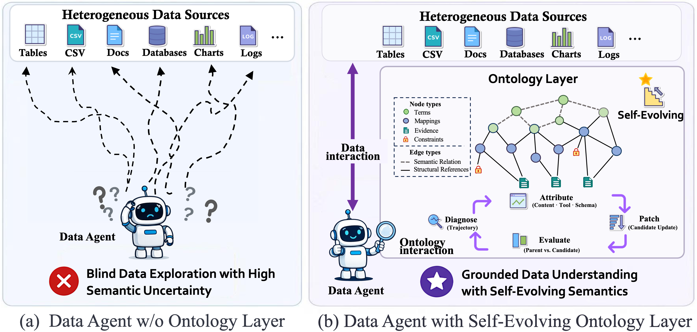
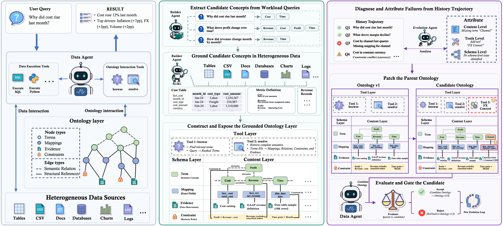
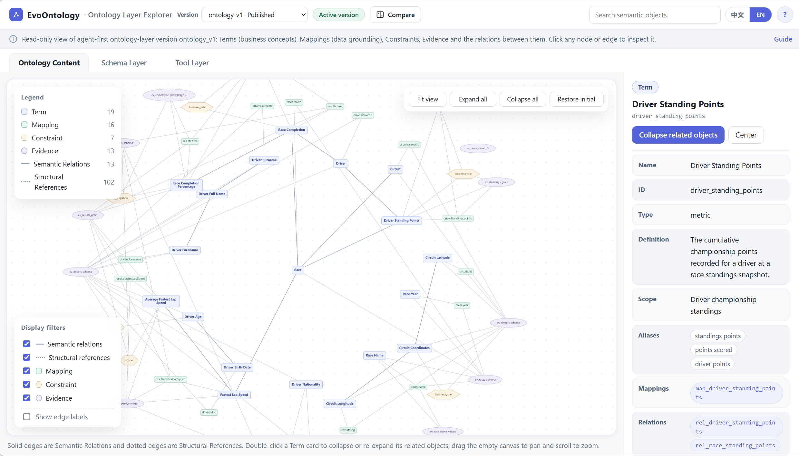
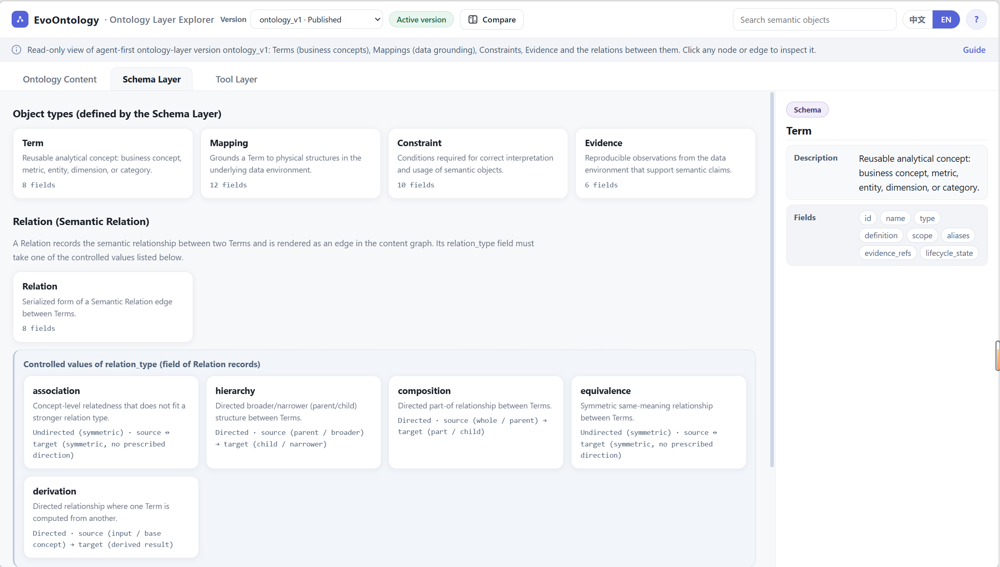
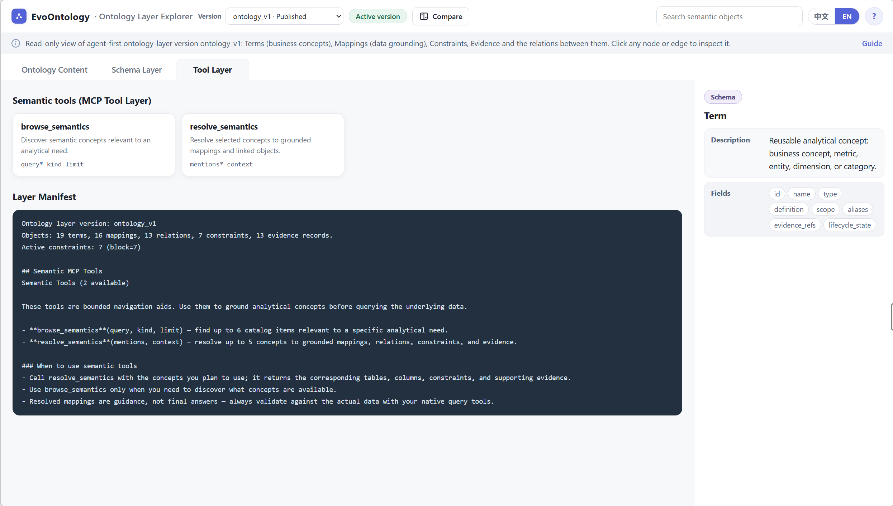

<p align="center">
  
</p>

<h1 align="center">EvoOntology: A Self-Evolving Ontology Layer for Data Agents</h1>

<p align="center">
  <a href="https://arxiv.org/abs/2609.15779"></a>
  <a href="https://github.com/ruc-datalab/EvoOntology"></a>
  <a href="https://github.com/ruc-datalab/EvoOntology/tree/master/plugins/evoontology-codex"></a>
  <a href="https://github.com/ruc-datalab/EvoOntology/tree/master/plugins/claude-code"></a>
  <a href="https://github.com/ruc-datalab/EvoOntology/stargazers"></a>
  <a href="https://github.com/ruc-datalab/EvoOntology/forks"></a>
  <a href="https://hitscounter.dev/history?url=https%3A%2F%2Fgithub.com%2Fruc-datalab%2FEvoOntology"></a>
  <a href="assets/wecom.jpg"></a>
</p>


<p align="center">
  <a href="README.md"><strong>English</strong></a> | <a href="README.zh-CN.md">简体中文</a>
</p>


> **Authors:** [Meiduo Chong](https://github.com/MeiduoChong), [Shaolei Zhang](https://zhangshaolei1998.github.io/)<sup>*</sup>, [Ju Fan](https://iir.ruc.edu.cn/~fanj/), [Xiaoyong Du](https://info.ruc.edu.cn/jsky/szdw/ajxjgcx/jsjkxyjsx1/js2/7374b0a3f58045fc9543703ccea2eb9c.htm)<br>
> Renmin University of China<br>

EvoOntology is the first self-evolving ontology layer for data agents, aiming to bridge the **agent-data gap** over heterogeneous tables, files, and databases. It exposes a versioned **Ontology Layer through MCP tools**, grounds that layer in real workload evidence, and continuously adapts it from execution trajectories.
- 🔌 Universal Agent Plugin as MCP: Seamlessly integrates with Claude Code, Codex, and other AI agents.
- 🤖 Automatic Ontology Construction: Builds a tailored ontology layer directly from your data.
- ♻️ Continuous Self-Evolution: Continuously evolves and refines the ontology layer based on interaction history.


## 🎬 Demo

The Codex and Claude Code plugins build and evolve ontology layers over your data.

https://github.com/user-attachments/assets/e15f4acd-7161-4ae1-ba41-f2f3ea05488b

## 🧭 EvoOntology Makes Your Data Valuable!

- **Raw data leaves semantics implicit.** Table names, columns, file paths, and isolated observations rarely explain metric definitions, entity relationships, or business constraints. Agents must infer them repeatedly and are prone to semantic errors.
- **Static semantic layers do not scale with use.** Hand-authored layers require sustained expert maintenance, become stale as data and workloads change, and consume increasing context when injected in full.
- **Agents need semantics that can adapt.** EvoOntology provides a workload-grounded Ontology Layer that agents query on demand and that evolves from observed execution behavior under controlled evaluation.

<p align="center">
  
</p>

<p align="center"><strong>An agent-first, self-evolving ontology layer for Data Agents.</strong></p>


## ✨ Why EvoOntology?

### 🎯 Problems We Address

- **Semantic uncertainty.** Make domain concepts, data mappings, relationships, and constraints explicit instead of leaving agents to guess from raw sources.
- **Repeated data exploration.** Reuse grounded knowledge across tasks so agents can focus on relevant data rather than rediscovering the environment for every request.
- **Costly semantic maintenance.** Adapt the Ontology Layer to changing workloads and agent behavior while keeping updates inspectable, comparable, and reversible.

### 🧩 Design Highlights

| Principle | Core idea |
| --- | --- |
| **Active access** | Retrieve only the semantics needed for the current step through MCP tools instead of injecting the full ontology. |
| **Grounded construction** | Build around the workload and commit semantic objects only after verification against the underlying data. |
| **Targeted evolution** | Diagnose interaction trajectories and apply localized updates to the interconnected Content, Schema, and Tool Layers. |
| **Gated versioning** | Publish a Candidate only when paired evaluation shows a reproducible improvement over its Parent. |
| **Agent integration** | Connect the ontology workspace and MCP runtime directly to supported agents through plugins. |

## ⚙️ How It Works?

EvoOntology treats the Ontology Layer as trainable agent state—not model weights. A builder initializes grounded semantic objects from the workload and underlying data; an evolution agent then uses historical interactions to propose bounded updates and validates every Candidate against its Parent.

<p align="center">
  
</p>

### 🧠 The Ontology Layer

Three interconnected layers define the ontology's knowledge, representation rules, and runtime access:

| Layer | Role |
| --- | --- |
| **Content Layer** | A typed semantic graph with four node families: Terms, Mappings, Constraints, and Evidence. Semantic Relations connect Terms, while Structural References link Terms to Mappings and attach Constraints or Evidence to the objects they govern or support. |
| **Schema Layer** | Defines the fields of the four node families, the allowed Semantic Relation types, and the permitted Structural Reference patterns, thereby setting the ontology's representational boundaries. |
| **Tool Layer** | Exposes the ontology through `browse_semantics`, `resolve_semantics`, and a compact session manifest. The manifest initializes the session; detailed records and linked objects are retrieved on demand. |

<p align="center">
  <a href="assets/ontology-layers/content-layer.png"></a><br>
  <sub><strong>Content Layer:</strong> inspect grounded concepts, mappings, constraints, evidence, and their relationships.</sub>
</p>

<table>
  <tr>
    <td width="50%" align="center">
      <a href="assets/ontology-layers/schema-layer.png"></a><br>
      <sub><strong>Schema Layer:</strong> inspect object types, fields, and controlled relationship rules.</sub>
    </td>
    <td width="50%" align="center">
      <a href="assets/ontology-layers/tool-layer.png"></a><br>
      <sub><strong>Tool Layer:</strong> inspect MCP tools and the compact runtime manifest.</sub>
    </td>
  </tr>
</table>

<p align="center"><sub>Click any screenshot to open the full-resolution view.</sub></p>

### 🔄 Lifecycle

1. **Build** —derive candidate concepts from the workload, verify them against raw sources, and publish `ontology_v0`.
2. **Use** —let the Data Agent query the Ontology Layer on demand while its tool interactions and outcomes are recorded.
3. **Evolve** —diagnose recurring behavior, attribute it to Content, Tool, or Schema, and produce a localized Candidate patch.
4. **Evaluate** —compare Parent and Candidate with the same data, agent, decoding settings, and interaction budget.
5. **Publish or reject** —publish the passing Candidate as `ontology_vN+1`; otherwise retain the Parent and use the result in the next round.

## 🚀 Quick Start

Install the plugin from the GitHub marketplace—no repository clone, virtual environment, or separate `pip install` is required.

### 🤖 Claude Code

```bash
claude plugin marketplace add ruc-datalab/EvoOntology
claude plugin install evoontology@evoontology
claude plugin list
```

Start a new session, then run:

```text
/evoontology:build-ontology
/evoontology:evolve-ontology
/evoontology:explore-ontology
```

### 🤖 Codex

```bash
codex plugin marketplace add ruc-datalab/EvoOntology
codex plugin add evoontology-codex@evoontology
codex plugin list
```

Start a new thread, then ask Codex to use:

```text
$build-ontology
$evolve-ontology
$explore-ontology
```

Both plugins use the same Build / Evolve / Explore workflow names; only the
platform-native invocation syntax differs.

Codex prepares questions from user needs, relevant project history and grounded exploration; question/trajectory files are optional. Build and Evolve automatically open the outcome explorer. SQLite has built-in read-only task replay; other data sources use host tools with explicit observation recording. See [Codex plugin](plugins/evoontology-codex/README.md).


Once built, the Data Agent can call `browse_semantics` and `resolve_semantics` without additional ontology configuration. See the [usage guide](USAGE.md) for the full workflow and data boundaries.


## 📊 Performance

Across the four-backbone analysis subset, the builder-constructed **Initial Ontology Layer** improves over **ReAct without an Ontology Layer**, and self-evolution produces a further gain with **EvoOntology** on all three benchmarks.

| Benchmark | Primary metric | ReAct without Ontology Layer | Initial Ontology Layer | EvoOntology | Gain over ReAct |
| --- | --- | ---: | ---: | ---: | ---: |
| DDR-Bench (10-K) | Trajectory-Wise | 69.5 | 81.8 | **89.5** | **+20.0** |
| InsightBench | Insight | 53.2 | 54.0 | **54.2** | **+1.0** |
| BIRD | Execution Accuracy (EX) | 63.6 | 68.7 | **72.4** | **+8.8** |

<p align="center"><sub>Results use the four-backbone analysis subset in the <a href="https://arxiv.org/abs/2609.15779">paper</a>: GPT-5.5, GPT-5.6-sol, Claude-Sonnet-5, and Claude-Opus-4.8. DDR-Bench values are reported directly in Tables 2 and 8; InsightBench and BIRD values are one-decimal means of the Figure 3 scores and match the stage gains stated in the accompanying analysis. See Tables 1, 3, and 4 for the full six-backbone results and evaluation protocols.</sub></p>

### 🧪 Evaluation Environments

EvoOntology includes self-contained adapters for three complementary Data Agent settings:

| Benchmark | Task | Directory |
| --- | --- | --- |
| BIRD | Text-to-SQL over real-world databases | [`benchmarks/bird/`](benchmarks/bird/) |
| DDR-10K | Open-ended research over heterogeneous financial data | [`benchmarks/ddr_10k/`](benchmarks/ddr_10k/) |
| InsightBench | Iterative business analysis and insight generation | [`benchmarks/insightbench/`](benchmarks/insightbench/) |

Each environment implements an `EvolutionAdapter` and preserves its native rollout and evaluation protocol. List registered environments with `python -m benchmarks list`; see [Adding a benchmark](docs/guide/new-benchmark.md) for the integration contract.

## 🗂️ Repository Layout

| Path | Purpose |
| --- | --- |
| [`assets/`](assets/) | README media, framework figures, and ontology-layer interface screenshots. |
| [`evoontology/`](evoontology/) | Deterministic core: ontology store, runtime/MCP, trajectories, triggers, evaluation, evolution state, validation, and visualization. |
| [`plugins/`](plugins/) | Self-contained Claude Code and Codex plugins with Build, Evolve, and Visualize skills. |
| [`benchmarks/`](benchmarks/) | BIRD, DDR-10K, and InsightBench evaluation environments. |
| [`docs/`](docs/) | Architecture and benchmark-integration documentation. |
| [`scripts/`](scripts/) | Core-to-plugin synchronization utilities. |

## 📚 Documentation

- [Usage guide](USAGE.md) —installation, workspace, lifecycle, configuration, and end-to-end operation.
- [Architecture](docs/architecture.md) —module boundaries, evolution state machine, and evaluation modes.
- [Add a benchmark](docs/guide/new-benchmark.md) —adapter, data loader, rollout, configuration, and seed-skill contract.
- [Claude Code plugin](plugins/claude-code/README.md) and [Codex plugin](plugins/evoontology-codex/README.md) —client-specific installation and usage.


## 🖋 Citation

If this repository is useful for you, please cite as:

```bibtex
@misc{chong2026evoontologyselfevolvingontologylayer,
      title={EvoOntology: A Self-Evolving Ontology Layer for Data Agents},
      author={Meiduo Chong and Shaolei Zhang and Ju Fan and Xiaoyong Du},
      year={2026},
      eprint={2609.15779},
      archivePrefix={arXiv},
      primaryClass={cs.AI},
      url={https://arxiv.org/abs/2609.15779},
}
```

If you have any questions, please feel free to submit an issue or contact `zhangshaolei98@ruc.edu.cn`.

## Misc

Welcome to join the [Data+AI Enterprise WeChat group](./assets/wecom.jpg), chat and share ideas with other users.

<p align="center" width="100%">

</p>

If you like EvoOntology, give it a GitHub Star ⭐

[](https://star-history.com/#ruc-datalab/EvoOntology&type=date&legend=top-left)
